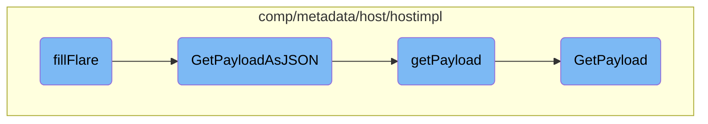

This document explains the process of adding host metadata to a flare archive. The process involves converting the metadata into a JSON format and then including it in the archive.

The flow starts with the <SwmToken path="comp/metadata/host/hostimpl/host.go" pos="135:9:9" line-data="func (h *host) fillFlare(fb flaretypes.FlareBuilder) error {">`fillFlare`</SwmToken> function, which is responsible for adding host metadata to a flare archive. It calls the <SwmToken path="comp/metadata/host/hostimpl/host.go" pos="131:9:9" line-data="func (h *host) GetPayloadAsJSON(ctx context.Context) ([]byte, error) {">`GetPayloadAsJSON`</SwmToken> function to convert the metadata into a JSON format. The <SwmToken path="comp/metadata/host/hostimpl/host.go" pos="131:9:9" line-data="func (h *host) GetPayloadAsJSON(ctx context.Context) ([]byte, error) {">`GetPayloadAsJSON`</SwmToken> function, in turn, calls the <SwmToken path="comp/metadata/host/hostimpl/host.go" pos="132:9:9" line-data="	return json.MarshalIndent(h.getPayload(ctx), &quot;&quot;, &quot;    &quot;)">`getPayload`</SwmToken> function to gather all the necessary metadata. The <SwmToken path="comp/metadata/host/hostimpl/host.go" pos="132:9:9" line-data="	return json.MarshalIndent(h.getPayload(ctx), &quot;&quot;, &quot;    &quot;)">`getPayload`</SwmToken> function collects various pieces of information, such as common payload data, resource payload, and optional gohai payload, and returns a complete metadata payload. This payload is then converted into a JSON-formatted byte array by <SwmToken path="comp/metadata/host/hostimpl/host.go" pos="131:9:9" line-data="func (h *host) GetPayloadAsJSON(ctx context.Context) ([]byte, error) {">`GetPayloadAsJSON`</SwmToken> and added to the flare archive by <SwmToken path="comp/metadata/host/hostimpl/host.go" pos="135:9:9" line-data="func (h *host) fillFlare(fb flaretypes.FlareBuilder) error {">`fillFlare`</SwmToken>.

# Flow drill down



<SwmSnippet path="/comp/metadata/host/hostimpl/host.go" line="135">

---

## <SwmToken path="comp/metadata/host/hostimpl/host.go" pos="135:9:9" line-data="func (h *host) fillFlare(fb flaretypes.FlareBuilder) error {">`fillFlare`</SwmToken>

The <SwmToken path="comp/metadata/host/hostimpl/host.go" pos="135:9:9" line-data="func (h *host) fillFlare(fb flaretypes.FlareBuilder) error {">`fillFlare`</SwmToken> function is responsible for adding a file to the flare archive. It uses the <SwmToken path="comp/metadata/host/hostimpl/host.go" pos="136:5:5" line-data="	return fb.AddFileFromFunc(filepath.Join(&quot;metadata&quot;, &quot;host.json&quot;), func() ([]byte, error) { return h.GetPayloadAsJSON(context.Background()) })">`AddFileFromFunc`</SwmToken> method to include the host metadata in JSON format by calling <SwmToken path="comp/metadata/host/hostimpl/host.go" pos="136:43:43" line-data="	return fb.AddFileFromFunc(filepath.Join(&quot;metadata&quot;, &quot;host.json&quot;), func() ([]byte, error) { return h.GetPayloadAsJSON(context.Background()) })">`GetPayloadAsJSON`</SwmToken>.

```go
func (h *host) fillFlare(fb flaretypes.FlareBuilder) error {
	return fb.AddFileFromFunc(filepath.Join("metadata", "host.json"), func() ([]byte, error) { return h.GetPayloadAsJSON(context.Background()) })
}
```

---

</SwmSnippet>

<SwmSnippet path="/comp/metadata/host/hostimpl/host.go" line="131">

---

## <SwmToken path="comp/metadata/host/hostimpl/host.go" pos="131:9:9" line-data="func (h *host) GetPayloadAsJSON(ctx context.Context) ([]byte, error) {">`GetPayloadAsJSON`</SwmToken>

The <SwmToken path="comp/metadata/host/hostimpl/host.go" pos="131:9:9" line-data="func (h *host) GetPayloadAsJSON(ctx context.Context) ([]byte, error) {">`GetPayloadAsJSON`</SwmToken> function converts the host metadata payload into a JSON-formatted byte array. It calls the <SwmToken path="comp/metadata/host/hostimpl/host.go" pos="132:9:9" line-data="	return json.MarshalIndent(h.getPayload(ctx), &quot;&quot;, &quot;    &quot;)">`getPayload`</SwmToken> function to retrieve the metadata and then marshals it into JSON.

```go
func (h *host) GetPayloadAsJSON(ctx context.Context) ([]byte, error) {
	return json.MarshalIndent(h.getPayload(ctx), "", "    ")
}
```

---

</SwmSnippet>

<SwmSnippet path="/comp/metadata/host/hostimpl/payload.go" line="44">

---

## <SwmToken path="comp/metadata/host/hostimpl/payload.go" pos="44:2:2" line-data="// getPayload returns the complete metadata payload as seen in Agent v5">`getPayload`</SwmToken>

The <SwmToken path="comp/metadata/host/hostimpl/payload.go" pos="44:2:2" line-data="// getPayload returns the complete metadata payload as seen in Agent v5">`getPayload`</SwmToken> function constructs the complete metadata payload. It gathers various pieces of information such as common payload data, resource payload, and optional gohai payload, and returns a <SwmToken path="comp/metadata/host/hostimpl/payload.go" pos="44:12:12" line-data="// getPayload returns the complete metadata payload as seen in Agent v5">`payload`</SwmToken> object.

```go
// getPayload returns the complete metadata payload as seen in Agent v5
func (h *host) getPayload(ctx context.Context) *Payload {
	p := &Payload{
		CommonPayload: *utils.GetCommonPayload(h.hostname, h.config),
		Payload:       *utils.GetPayload(ctx, h.config),
	}

	if r := h.resources.Get(); r != nil {
		p.ResourcesPayload = r["resources"]
	}

	if h.config.GetBool("enable_gohai") {
		gohaiPayload, err := gohai.GetPayloadAsString(pkgconfig.IsContainerized())
		if err != nil {
			h.log.Errorf("Could not serialize gohai payload: %s", err)
		} else {
			p.GohaiPayload = gohaiPayload
		}
	}
	return p
}
```

---

</SwmSnippet>

<SwmSnippet path="/comp/metadata/host/hostimpl/utils/host.go" line="169">

---

### <SwmToken path="comp/metadata/host/hostimpl/utils/host.go" pos="169:2:2" line-data="// GetPayload builds a metadata payload every time is called.">`GetPayload`</SwmToken>

The <SwmToken path="comp/metadata/host/hostimpl/utils/host.go" pos="169:2:2" line-data="// GetPayload builds a metadata payload every time is called.">`GetPayload`</SwmToken> function builds the metadata payload by collecting data from different sources. It includes hostname data, system stats, host tags, and other metadata, and caches the result for future use.

```go
// GetPayload builds a metadata payload every time is called.
// Some data is collected only once, some is cached, some is collected at every call.
func GetPayload(ctx context.Context, conf config.Reader) *Payload {
	hostnameData, err := hostname.GetWithProvider(ctx)
	if err != nil {
		log.Errorf("Error grabbing hostname for status: %v", err)
		hostnameData = hostname.Data{Hostname: "unknown", Provider: "unknown"}
	}

	meta := GetMeta(ctx, conf)
	meta.Hostname = hostnameData.Hostname

	p := &Payload{
		Os:            osName,
		AgentFlavor:   flavor.GetFlavor(),
		PythonVersion: python.GetPythonInfo(),
		SystemStats:   getSystemStats(),
		Meta:          meta,
		HostTags:      hosttags.Get(ctx, false, conf),
		ContainerMeta: containerMetadata.Get(1 * time.Second),
		NetworkMeta:   getNetworkMeta(ctx),
```

---

</SwmSnippet>

&nbsp;

*This is an auto-generated document by Swimm AI 🌊 and has not yet been verified by a human*

<SwmMeta version="3.0.0" repo-id="Z2l0aHViJTNBJTNBZGF0YWRvZy1hZ2VudCUzQSUzQVN3aW1tLURlbW8=" repo-name="datadog-agent"><sup>Powered by [Swimm](/)</sup></SwmMeta>
