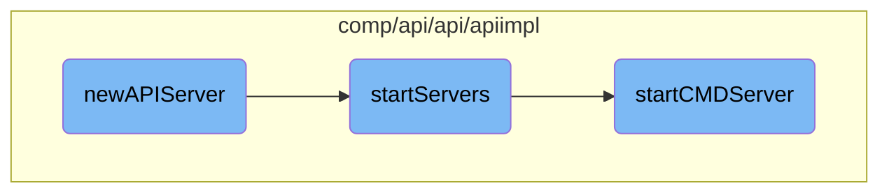

This document explains the initialization and startup process of the API server. It covers the creation of the API server instance, the setup of necessary dependencies, and the steps to start the server, including the creation of certificates and the configuration of the <SwmToken path="comp/api/api/apiimpl/server_cmd.go" pos="49:3:3" line-data="	// gRPC server">`gRPC`</SwmToken> and HTTP servers.

The process starts with initializing the API server by setting up various dependencies like <SwmToken path="comp/api/api/apiimpl/api.go" pos="86:1:1" line-data="		dogstatsdServer:   deps.DogstatsdServer,">`dogstatsdServer`</SwmToken>, Capture, and others. Once the server is initialized, it proceeds to start the servers by creating necessary certificates and setting up TLS configurations. Finally, it configures and starts the CMD server, which involves setting up <SwmToken path="comp/api/api/apiimpl/server_cmd.go" pos="49:3:3" line-data="	// gRPC server">`gRPC`</SwmToken> and HTTP handlers for different endpoints.

# Flow drill down



<SwmSnippet path="/comp/api/api/apiimpl/api.go" line="83">

---

## <SwmToken path="comp/api/api/apiimpl/api.go" pos="83:2:2" line-data="func newAPIServer(deps dependencies) api.Component {">`newAPIServer`</SwmToken> Initialization

The <SwmToken path="comp/api/api/apiimpl/api.go" pos="83:2:2" line-data="func newAPIServer(deps dependencies) api.Component {">`newAPIServer`</SwmToken> function initializes the <SwmToken path="comp/api/api/apiimpl/api.go" pos="85:5:5" line-data="	server := apiServer{">`apiServer`</SwmToken> struct with various dependencies such as <SwmToken path="comp/api/api/apiimpl/api.go" pos="86:1:1" line-data="		dogstatsdServer:   deps.DogstatsdServer,">`dogstatsdServer`</SwmToken>, <SwmToken path="comp/api/api/apiimpl/api.go" pos="87:1:1" line-data="		capture:           deps.Capture,">`capture`</SwmToken>, <SwmToken path="comp/api/api/apiimpl/api.go" pos="88:1:1" line-data="		pidMap:            deps.PidMap,">`pidMap`</SwmToken>, and others. It also appends lifecycle hooks to start and stop the server.

```go
func newAPIServer(deps dependencies) api.Component {

	server := apiServer{
		dogstatsdServer:   deps.DogstatsdServer,
		capture:           deps.Capture,
		pidMap:            deps.PidMap,
		secretResolver:    deps.SecretResolver,
		rcService:         deps.RcService,
		rcServiceMRF:      deps.RcServiceMRF,
		authToken:         deps.AuthToken,
		taggerComp:        deps.Tagger,
		autoConfig:        deps.AutoConfig,
		logsAgentComp:     deps.LogsAgentComp,
		wmeta:             deps.WorkloadMeta,
		collector:         deps.Collector,
		senderManager:     deps.DiagnoseSenderManager,
		telemetry:         deps.Telemetry,
		endpointProviders: fxutil.GetAndFilterGroup(deps.EndpointProviders),
	}

	deps.Lc.Append(fx.Hook{
```

---

</SwmSnippet>

<SwmSnippet path="/comp/api/api/apiimpl/server.go" line="46">

---

## Starting Servers

The <SwmToken path="comp/api/api/apiimpl/server.go" pos="46:2:2" line-data="// StartServers creates certificates and starts API + IPC servers">`StartServers`</SwmToken> method is responsible for creating certificates and starting both the API and IPC servers. It initializes TLS configurations and telemetry middleware, then calls <SwmToken path="comp/api/api/apiimpl/server_cmd.go" pos="35:9:9" line-data="func (server *apiServer) startCMDServer(">`startCMDServer`</SwmToken> to start the CMD server.

```go
// StartServers creates certificates and starts API + IPC servers
func (server *apiServer) startServers() error {
	apiAddr, err := getIPCAddressPort()
	if err != nil {
		return fmt.Errorf("unable to get IPC address and port: %v", err)
	}

	additionalHostIdentities := []string{apiAddr}

	ipcServerHost, ipcServerHostPort, ipcServerEnabled := getIPCServerAddressPort()
	if ipcServerEnabled {
		additionalHostIdentities = append(additionalHostIdentities, ipcServerHost)
	}

	tlsKeyPair, tlsCertPool, err := initializeTLS(additionalHostIdentities...)
	if err != nil {
		return fmt.Errorf("unable to initialize TLS: %v", err)
	}

	// tls.Config is written to when serving, so it has to be cloned for each server
	tlsConfig := func() *tls.Config {
```

---

</SwmSnippet>

<SwmSnippet path="/comp/api/api/apiimpl/server_cmd.go" line="35">

---

### Starting CMD Server

The <SwmToken path="comp/api/api/apiimpl/server_cmd.go" pos="35:9:9" line-data="func (server *apiServer) startCMDServer(">`startCMDServer`</SwmToken> method sets up the <SwmToken path="comp/api/api/apiimpl/server_cmd.go" pos="49:3:3" line-data="	// gRPC server">`gRPC`</SwmToken> server and HTTP handlers for the CMD server. It configures authentication interceptors, registers <SwmToken path="comp/api/api/apiimpl/server_cmd.go" pos="49:3:3" line-data="	// gRPC server">`gRPC`</SwmToken> services, and sets up HTTP routes for various endpoints.

```go
func (server *apiServer) startCMDServer(
	cmdAddr string,
	tlsConfig *tls.Config,
	tlsCertPool *x509.CertPool,
	tmf observability.TelemetryMiddlewareFactory,
) (err error) {
	// get the transport we're going to use under HTTP
	server.cmdListener, err = getListener(cmdAddr)
	if err != nil {
		// we use the listener to handle commands for the Agent, there's
		// no way we can recover from this error
		return fmt.Errorf("unable to listen to the given address: %v", err)
	}

	// gRPC server
	authInterceptor := grpcutil.AuthInterceptor(parseToken)
	opts := []grpc.ServerOption{
		grpc.Creds(credentials.NewClientTLSFromCert(tlsCertPool, cmdAddr)),
		grpc.StreamInterceptor(grpc_auth.StreamServerInterceptor(authInterceptor)),
		grpc.UnaryInterceptor(grpc_auth.UnaryServerInterceptor(authInterceptor)),
	}
```

---

</SwmSnippet>

&nbsp;

*This is an auto-generated document by Swimm AI 🌊 and has not yet been verified by a human*

<SwmMeta version="3.0.0" repo-id="Z2l0aHViJTNBJTNBZGF0YWRvZy1hZ2VudCUzQSUzQVN3aW1tLURlbW8=" repo-name="datadog-agent"><sup>Powered by [Swimm](/)</sup></SwmMeta>
