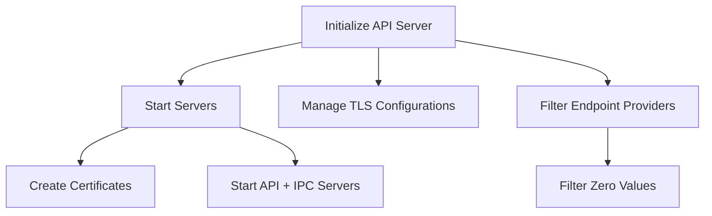

# Overview

The API in the Datadog Agent components is responsible for exposing various internal endpoints such as configuration, flare, and status. It is implemented as a bundle within the <SwmPath>[comp/api/](comp/api/)</SwmPath> directory and includes several subcomponents and utilities.

# API Initialization

The `newAPIServer` function initializes the API server with dependencies like <SwmToken path="comp/api/api/apiimpl/server_cmd.go" pos="66:1:1" line-data="		dogstatsdServer:    server.dogstatsdServer,">`dogstatsdServer`</SwmToken>, <SwmToken path="comp/api/api/apiimpl/server_cmd.go" pos="67:1:1" line-data="		capture:            server.capture,">`capture`</SwmToken>, <SwmToken path="comp/api/api/apiimpl/server_cmd.go" pos="68:1:1" line-data="		pidMap:             server.pidMap,">`pidMap`</SwmToken>, <SwmToken path="comp/api/api/apiimpl/internal/agent/agent.go" pos="45:1:1" line-data="	secretResolver secrets.Component,">`secretResolver`</SwmToken>, and others. It also sets up lifecycle hooks for starting and stopping the server.

# Starting and Stopping Servers

The <SwmToken path="comp/api/api/apiimpl/server.go" pos="46:2:2" line-data="// StartServers creates certificates and starts API + IPC servers">`StartServers`</SwmToken> and <SwmToken path="comp/api/api/apiimpl/server.go" pos="98:2:2" line-data="// StopServers closes the connections and the servers">`StopServers`</SwmToken> functions handle the starting and stopping of the API servers, including setting up TLS configurations and managing listeners.

<SwmSnippet path="/comp/api/api/apiimpl/server.go" line="46">

---

The <SwmToken path="comp/api/api/apiimpl/server.go" pos="46:2:2" line-data="// StartServers creates certificates and starts API + IPC servers">`StartServers`</SwmToken> function creates certificates and starts the API and IPC servers. It handles the initialization of TLS configurations and sets up the necessary listeners.

```go
// StartServers creates certificates and starts API + IPC servers
func (server *apiServer) startServers() error {
	apiAddr, err := getIPCAddressPort()
	if err != nil {
		return fmt.Errorf("unable to get IPC address and port: %v", err)
	}

	additionalHostIdentities := []string{apiAddr}

	ipcServerHost, ipcServerHostPort, ipcServerEnabled := getIPCServerAddressPort()
	if ipcServerEnabled {
		additionalHostIdentities = append(additionalHostIdentities, ipcServerHost)
	}

	tlsKeyPair, tlsCertPool, err := initializeTLS(additionalHostIdentities...)
	if err != nil {
		return fmt.Errorf("unable to initialize TLS: %v", err)
	}

	// tls.Config is written to when serving, so it has to be cloned for each server
	tlsConfig := func() *tls.Config {
```

---

</SwmSnippet>

<SwmSnippet path="/comp/api/api/apiimpl/server.go" line="98">

---

The <SwmToken path="comp/api/api/apiimpl/server.go" pos="98:2:2" line-data="// StopServers closes the connections and the servers">`StopServers`</SwmToken> function closes the connections and stops the servers. It ensures that all listeners are properly shut down.

```go
// StopServers closes the connections and the servers
func (server *apiServer) stopServers() {
	stopServer(server.cmdListener, cmdServerName)
	stopServer(server.ipcListener, ipcServerName)
}
```

---

</SwmSnippet>

# Endpoint Providers

The <SwmToken path="pkg/util/fxutil/group.go" pos="13:2:2" line-data="// GetAndFilterGroup filters &#39;zero&#39; values from an FX group.">`GetAndFilterGroup`</SwmToken> function filters 'zero' values from an FX group, ensuring that only valid endpoint providers are used.

<SwmSnippet path="/pkg/util/fxutil/group.go" line="13">

---

The <SwmToken path="pkg/util/fxutil/group.go" pos="13:2:2" line-data="// GetAndFilterGroup filters &#39;zero&#39; values from an FX group.">`GetAndFilterGroup`</SwmToken> function filters 'zero' values from an FX group, ensuring that only valid endpoint providers are used.

```go
// GetAndFilterGroup filters 'zero' values from an FX group.
//
// A 'zero' value, nil in most cases, can be injected into a group whem a component declares returning a element for
// that group but don't actually creates the element. This is common pattern with component that can be disabled or
// partially enabled.
//
// This should be called in every component's constructor that requires an FX group as a dependency.
func GetAndFilterGroup[S ~[]E, E any](group S) S {
	return slices.DeleteFunc(group, func(item E) bool {
		// if item is an untyped nil, aka interface{}(nil), we filter them directly
		t := reflect.TypeOf(item)
		if t == nil {
			return true
		}

		switch t.Kind() {
		case reflect.Pointer, reflect.Map, reflect.Array, reflect.Chan, reflect.Slice, reflect.Func, reflect.Interface:
			return reflect.ValueOf(item).IsNil()
		}
		return false
	})
```

---

</SwmSnippet>

# Example Endpoint

The <SwmToken path="comp/api/api/apiimpl/internal/agent/agent.go" pos="116:2:2" line-data="func getDiagnose(w http.ResponseWriter, r *http.Request, diagnoseDeps diagnose.SuitesDeps) {">`getDiagnose`</SwmToken> function is an example of an endpoint that reads parameters from a request, runs a diagnosis, and returns the results.

<SwmSnippet path="/comp/api/api/apiimpl/internal/agent/agent.go" line="116">

---

The <SwmToken path="comp/api/api/apiimpl/internal/agent/agent.go" pos="116:2:2" line-data="func getDiagnose(w http.ResponseWriter, r *http.Request, diagnoseDeps diagnose.SuitesDeps) {">`getDiagnose`</SwmToken> function reads parameters from a request, runs a diagnosis, and returns the results.

```go
func getDiagnose(w http.ResponseWriter, r *http.Request, diagnoseDeps diagnose.SuitesDeps) {
	var diagCfg diagnosis.Config

	// Read parameters
	if r.Body != http.NoBody {
		body, err := io.ReadAll(r.Body)
		if err != nil {
			http.Error(w, log.Errorf("Error while reading HTTP request body: %s", err).Error(), 500)
			return
		}

		if err := json.Unmarshal(body, &diagCfg); err != nil {
			http.Error(w, log.Errorf("Error while unmarshaling JSON from request body: %s", err).Error(), 500)
			return
		}
	}

	// Reset the `server_timeout` deadline for this connection as running diagnose code in Agent process can take some time
	conn := utils.GetConnection(r)
	_ = conn.SetDeadline(time.Time{})
```

---

</SwmSnippet>

# Main Functions

There are several main functions in this folder. Some of them are <SwmToken path="tasks/custom_task/custom_task.py" pos="58:13:13" line-data="    log_path: str, name: str, module: str, task_datetime: str, duration: float, task_result: str">`module`</SwmToken>, `newAPIServer`, <SwmToken path="comp/api/api/apiimpl/server.go" pos="46:2:2" line-data="// StartServers creates certificates and starts API + IPC servers">`StartServers`</SwmToken>, <SwmToken path="comp/api/api/apiimpl/server.go" pos="98:2:2" line-data="// StopServers closes the connections and the servers">`StopServers`</SwmToken>, and <SwmToken path="comp/api/api/apiimpl/server_cmd.go" pos="35:9:9" line-data="func (server *apiServer) startCMDServer(">`startCMDServer`</SwmToken>. We will dive a little into `newAPIServer` and <SwmToken path="comp/api/api/apiimpl/server.go" pos="46:2:2" line-data="// StartServers creates certificates and starts API + IPC servers">`StartServers`</SwmToken>.

# <SwmToken path="comp/api/api/apiimpl/server_cmd.go" pos="35:9:9" line-data="func (server *apiServer) startCMDServer(">`startCMDServer`</SwmToken>

The <SwmToken path="comp/api/api/apiimpl/server_cmd.go" pos="35:9:9" line-data="func (server *apiServer) startCMDServer(">`startCMDServer`</SwmToken> function starts the CMD server, which handles commands for the Agent. It sets up the <SwmToken path="comp/api/api/apiimpl/server_cmd.go" pos="49:3:3" line-data="	// gRPC server">`gRPC`</SwmToken> server, registers handlers, and initializes the multiplexer for REST HTTP routing.

<SwmSnippet path="/comp/api/api/apiimpl/server_cmd.go" line="35">

---

The <SwmToken path="comp/api/api/apiimpl/server_cmd.go" pos="35:9:9" line-data="func (server *apiServer) startCMDServer(">`startCMDServer`</SwmToken> function starts the CMD server, sets up the <SwmToken path="comp/api/api/apiimpl/server_cmd.go" pos="49:3:3" line-data="	// gRPC server">`gRPC`</SwmToken> server, registers handlers, and initializes the multiplexer for REST HTTP routing.

```go
func (server *apiServer) startCMDServer(
	cmdAddr string,
	tlsConfig *tls.Config,
	tlsCertPool *x509.CertPool,
	tmf observability.TelemetryMiddlewareFactory,
) (err error) {
	// get the transport we're going to use under HTTP
	server.cmdListener, err = getListener(cmdAddr)
	if err != nil {
		// we use the listener to handle commands for the Agent, there's
		// no way we can recover from this error
		return fmt.Errorf("unable to listen to the given address: %v", err)
	}

	// gRPC server
	authInterceptor := grpcutil.AuthInterceptor(parseToken)
	opts := []grpc.ServerOption{
		grpc.Creds(credentials.NewClientTLSFromCert(tlsCertPool, cmdAddr)),
		grpc.StreamInterceptor(grpc_auth.StreamServerInterceptor(authInterceptor)),
		grpc.UnaryInterceptor(grpc_auth.UnaryServerInterceptor(authInterceptor)),
	}
```

---

</SwmSnippet>

# Agent Endpoints

Agent Endpoints

# <SwmToken path="comp/api/api/apiimpl/internal/agent/agent_jmx.go" pos="30:2:2" line-data="func getJMXConfigs(w http.ResponseWriter, r *http.Request) {">`getJMXConfigs`</SwmToken>

The <SwmToken path="comp/api/api/apiimpl/internal/agent/agent_jmx.go" pos="30:2:2" line-data="func getJMXConfigs(w http.ResponseWriter, r *http.Request) {">`getJMXConfigs`</SwmToken> function handles the `/agent/jmx/configs` endpoint. It retrieves the latest JMX configurations and returns them as a JSON response. If the timestamp provided in the request is greater than the last modification timestamp of the scheduled configs, it returns a `204 `<SwmToken path="comp/api/api/apiimpl/server_cmd.go" pos="45:3:3" line-data="		// no way we can recover from this error">`no`</SwmToken>` `<SwmToken path="comp/api/api/apiimpl/internal/agent/agent_jmx.go" pos="42:10:10" line-data="	w.Header().Set(&quot;Content-Type&quot;, &quot;application/json&quot;)">`Content`</SwmToken> status.

<SwmSnippet path="/comp/api/api/apiimpl/internal/agent/agent_jmx.go" line="30">

---

The <SwmToken path="comp/api/api/apiimpl/internal/agent/agent_jmx.go" pos="30:2:2" line-data="func getJMXConfigs(w http.ResponseWriter, r *http.Request) {">`getJMXConfigs`</SwmToken> function retrieves the latest JMX configurations and returns them as a JSON response.

```go
func getJMXConfigs(w http.ResponseWriter, r *http.Request) {
	var ts int
	queries := r.URL.Query()
	if timestamps, ok := queries["timestamp"]; ok {
		ts, _ = strconv.Atoi(timestamps[0])
	}

	if int64(ts) > jmxfetch.GetScheduledConfigsModificationTimestamp() {
		w.WriteHeader(http.StatusNoContent)
		return
	}

	w.Header().Set("Content-Type", "application/json")
	log.Debugf("Getting latest JMX Configs as of: %#v", ts)

	j := map[string]interface{}{}
	configs := map[string]integration.JSONMap{}

	for name, config := range jmxfetch.GetScheduledConfigs() {
		var rawInitConfig integration.RawMap
		err := yaml.Unmarshal(config.InitConfig, &rawInitConfig)
```

---

</SwmSnippet>

# <SwmToken path="comp/api/api/apiimpl/internal/agent/agent_jmx.go" pos="87:2:2" line-data="func setJMXStatus(w http.ResponseWriter, r *http.Request) {">`setJMXStatus`</SwmToken>

The <SwmToken path="comp/api/api/apiimpl/internal/agent/agent_jmx.go" pos="87:2:2" line-data="func setJMXStatus(w http.ResponseWriter, r *http.Request) {">`setJMXStatus`</SwmToken> function handles the <SwmPath>[cmd/agent/subcommands/status/](cmd/agent/subcommands/status/)</SwmPath> endpoint. It accepts a JSON payload representing the JMX status and updates the internal status accordingly. If the payload is invalid, it returns a <SwmToken path="comp/api/api/apiimpl/internal/agent/agent.go" pos="123:39:39" line-data="			http.Error(w, log.Errorf(&quot;Error while reading HTTP request body: %s&quot;, err).Error(), 500)">`500`</SwmToken>` `<SwmToken path="comp/api/api/apiimpl/server_cmd.go" pos="22:20:20" line-data="	&quot;github.com/DataDog/datadog-agent/comp/api/api/apiimpl/internal/agent&quot;">`internal`</SwmToken>` `<SwmToken path="comp/api/api/apiimpl/server.go" pos="47:3:3" line-data="func (server *apiServer) startServers() error {">`server`</SwmToken>` `<SwmToken path="comp/api/api/apiimpl/server.go" pos="47:13:13" line-data="func (server *apiServer) startServers() error {">`error`</SwmToken> status.

<SwmSnippet path="/comp/api/api/apiimpl/internal/agent/agent_jmx.go" line="87">

---

The <SwmToken path="comp/api/api/apiimpl/internal/agent/agent_jmx.go" pos="87:2:2" line-data="func setJMXStatus(w http.ResponseWriter, r *http.Request) {">`setJMXStatus`</SwmToken> function accepts a JSON payload representing the JMX status and updates the internal status accordingly.

```go
func setJMXStatus(w http.ResponseWriter, r *http.Request) {
	decoder := json.NewDecoder(r.Body)

	var status jmxStatus.Status
	err := decoder.Decode(&status)
	if err != nil {
		log.Errorf("unable to parse jmx status: %s", err)
		http.Error(w, err.Error(), 500)
	} else {
		w.WriteHeader(http.StatusOK)
	}

	jmxStatus.SetStatus(status)
}
```

---

</SwmSnippet>

&nbsp;

*This is an auto-generated document by Swimm AI 🌊 and has not yet been verified by a human*

<SwmMeta version="3.0.0" repo-id="Z2l0aHViJTNBJTNBZGF0YWRvZy1hZ2VudCUzQSUzQVN3aW1tLURlbW8=" repo-name="datadog-agent"><sup>Powered by [Swimm](/)</sup></SwmMeta>
