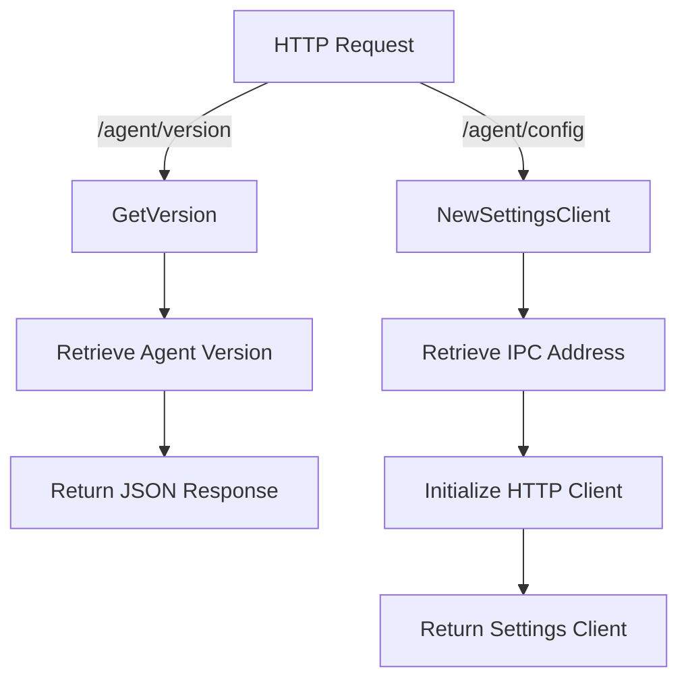

# Overview

The <SwmToken path="cmd/agent/common/common.go" pos="6:4:4" line-data="// Package common provides a set of common symbols needed by different packages,">`common`</SwmToken> package in the Datadog Agent repository provides a set of shared functionalities and utilities used across different parts of the agent. It includes functions for handling configurations, managing paths, setting up internal profiling, and more. This package helps avoid circular dependencies by providing common symbols needed by different packages.

<SwmSnippet path="/cmd/agent/common/common.go" line="6">

---

# Common Package Overview

The <SwmToken path="cmd/agent/common/common.go" pos="6:4:4" line-data="// Package common provides a set of common symbols needed by different packages,">`common`</SwmToken> package provides a set of common symbols needed by different packages to avoid circular dependencies. It includes functions for handling configurations, managing paths, and setting up internal profiling.

```go
// Package common provides a set of common symbols needed by different packages,
// to avoid circular dependencies.
package common

import (
```

---

</SwmSnippet>

# Example Functions in Common

The <SwmToken path="cmd/agent/common/common.go" pos="6:4:4" line-data="// Package common provides a set of common symbols needed by different packages,">`common`</SwmToken> package includes several important functions such as <SwmToken path="cmd/agent/common/common.go" pos="24:2:2" line-data="// GetPythonPaths returns the paths (in order of precedence) from where the agent">`GetPythonPaths`</SwmToken>, <SwmToken path="cmd/agent/common/common.go" pos="36:2:2" line-data="// GetVersion returns the version of the agent in a http response json">`GetVersion`</SwmToken>, and `LoadComponents`.

## <SwmToken path="cmd/agent/common/common.go" pos="24:2:2" line-data="// GetPythonPaths returns the paths (in order of precedence) from where the agent">`GetPythonPaths`</SwmToken>

The <SwmToken path="cmd/agent/common/common.go" pos="24:2:2" line-data="// GetPythonPaths returns the paths (in order of precedence) from where the agent">`GetPythonPaths`</SwmToken> function returns the paths from where the agent should load Python modules and checks. This is essential for ensuring that the agent can correctly locate and utilize Python scripts and modules.

<SwmSnippet path="/pkg/util/common/common.go" line="1">

---

The <SwmToken path="cmd/agent/common/common.go" pos="24:2:2" line-data="// GetPythonPaths returns the paths (in order of precedence) from where the agent">`GetPythonPaths`</SwmToken> function is defined in the <SwmToken path="pkg/util/common/common.go" pos="6:4:4" line-data="// Package common provides various helper functions">`common`</SwmToken> package and is crucial for loading Python modules and checks.

```go
// Unless explicitly stated otherwise all files in this repository are licensed
// under the Apache License Version 2.0.
// This product includes software developed at Datadog (https://www.datadoghq.com/).
// Copyright 2016-present Datadog, Inc.

// Package common provides various helper functions
package common

import (
	"reflect"
```

---

</SwmSnippet>

## <SwmToken path="cmd/agent/common/common.go" pos="36:2:2" line-data="// GetVersion returns the version of the agent in a http response json">`GetVersion`</SwmToken>

The <SwmToken path="cmd/agent/common/common.go" pos="36:2:2" line-data="// GetVersion returns the version of the agent in a http response json">`GetVersion`</SwmToken> function returns the version of the agent in an HTTP response. This is important for version tracking and ensuring compatibility with different components of the Datadog platform.

<SwmSnippet path="/pkg/util/common/common.go" line="11">

---

The <SwmToken path="cmd/agent/common/common.go" pos="36:2:2" line-data="// GetVersion returns the version of the agent in a http response json">`GetVersion`</SwmToken> function is defined in the <SwmToken path="cmd/agent/common/common.go" pos="6:4:4" line-data="// Package common provides a set of common symbols needed by different packages,">`common`</SwmToken> package and returns the agent's version in an HTTP response.

```go
	"strings"
)

// StringSet represents a list of uniq strings
type StringSet map[string]struct{}

// NewStringSet returns as new StringSet initialized with initItems
func NewStringSet(initItems ...string) StringSet {
	newSet := StringSet{}
	for _, item := range initItems {
		newSet.Add(item)
	}
```

---

</SwmSnippet>

## LoadComponents

The `LoadComponents` function configures several common Agent components such as tagger, collector, scheduler, and autodiscovery. This function is essential for initializing and managing the core functionalities of the Datadog Agent.

<SwmSnippet path="/pkg/util/common/common.go" line="23">

---

The `LoadComponents` function is defined in the <SwmToken path="cmd/agent/common/common.go" pos="6:4:4" line-data="// Package common provides a set of common symbols needed by different packages,">`common`</SwmToken> package and is essential for configuring core Agent components.

```go
	return newSet
}

// Add adds an item to the set
func (s StringSet) Add(item string) {
	s[item] = struct{}{}
}
```

---

</SwmSnippet>

# Common Endpoints

The <SwmToken path="cmd/agent/common/common.go" pos="6:4:4" line-data="// Package common provides a set of common symbols needed by different packages,">`common`</SwmToken> package also includes several HTTP endpoints such as <SwmToken path="cmd/agent/common/common.go" pos="36:2:2" line-data="// GetVersion returns the version of the agent in a http response json">`GetVersion`</SwmToken> and <SwmToken path="cmd/agent/common/common.go" pos="44:2:2" line-data="// NewSettingsClient returns a configured runtime settings client.">`NewSettingsClient`</SwmToken>.

## <SwmToken path="cmd/agent/common/common.go" pos="36:2:2" line-data="// GetVersion returns the version of the agent in a http response json">`GetVersion`</SwmToken> Endpoint

The <SwmToken path="cmd/agent/common/common.go" pos="36:2:2" line-data="// GetVersion returns the version of the agent in a http response json">`GetVersion`</SwmToken> function is an HTTP endpoint that returns the version of the agent in a JSON response. It sets the content type to <SwmPath>[pkg/util/json/](pkg/util/json/)</SwmPath>, retrieves the agent version using <SwmToken path="cmd/agent/common/common.go" pos="39:8:12" line-data="	av, _ := version.Agent()">`version.Agent()`</SwmToken>, and writes the JSON-encoded version to the response writer.

<SwmSnippet path="/cmd/agent/common/common.go" line="36">

---

The <SwmToken path="cmd/agent/common/common.go" pos="36:2:2" line-data="// GetVersion returns the version of the agent in a http response json">`GetVersion`</SwmToken> endpoint is defined in the <SwmToken path="cmd/agent/common/common.go" pos="6:4:4" line-data="// Package common provides a set of common symbols needed by different packages,">`common`</SwmToken> package and returns the agent's version in a JSON response.

```go
// GetVersion returns the version of the agent in a http response json
func GetVersion(w http.ResponseWriter, _ *http.Request) {
	w.Header().Set("Content-Type", "application/json")
	av, _ := version.Agent()
	j, _ := json.Marshal(av)
	w.Write(j)
}
```

---

</SwmSnippet>

## <SwmToken path="cmd/agent/common/common.go" pos="44:2:2" line-data="// NewSettingsClient returns a configured runtime settings client.">`NewSettingsClient`</SwmToken> Endpoint

The <SwmToken path="cmd/agent/common/common.go" pos="44:2:2" line-data="// NewSettingsClient returns a configured runtime settings client.">`NewSettingsClient`</SwmToken> function creates and returns a configured runtime settings client. It retrieves the IPC address using <SwmToken path="cmd/agent/common/common.go" pos="46:8:12" line-data="	ipcAddress, err := config.GetIPCAddress()">`config.GetIPCAddress()`</SwmToken>, initializes an HTTP client with <SwmToken path="cmd/agent/common/common.go" pos="50:5:10" line-data="	hc := util.GetClient(false)">`util.GetClient(false)`</SwmToken>, and returns a new settings client configured with the IPC address and command port.

<SwmSnippet path="/cmd/agent/common/common.go" line="44">

---

The <SwmToken path="cmd/agent/common/common.go" pos="44:2:2" line-data="// NewSettingsClient returns a configured runtime settings client.">`NewSettingsClient`</SwmToken> endpoint is defined in the <SwmToken path="cmd/agent/common/common.go" pos="6:4:4" line-data="// Package common provides a set of common symbols needed by different packages,">`common`</SwmToken> package and returns a configured runtime settings client.

```go
// NewSettingsClient returns a configured runtime settings client.
func NewSettingsClient() (settings.Client, error) {
	ipcAddress, err := config.GetIPCAddress()
	if err != nil {
		return nil, err
	}
	hc := util.GetClient(false)
	return settingshttp.NewClient(hc, fmt.Sprintf("https://%v:%v/agent/config", ipcAddress, config.Datadog().GetInt("cmd_port")), "agent", settingshttp.NewHTTPClientOptions(util.LeaveConnectionOpen)), nil
}
```

---

</SwmSnippet>

&nbsp;

*This is an auto-generated document by Swimm AI 🌊 and has not yet been verified by a human*

<SwmMeta version="3.0.0" repo-id="Z2l0aHViJTNBJTNBZGF0YWRvZy1hZ2VudCUzQSUzQVN3aW1tLURlbW8=" repo-name="datadog-agent"><sup>Powered by [Swimm](/)</sup></SwmMeta>
