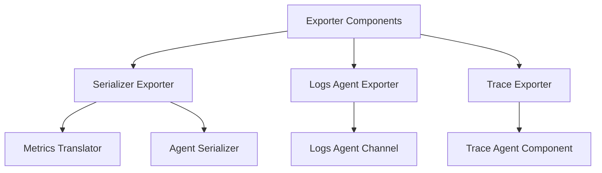

# Overview

Exporter components are responsible for translating and sending data to the Datadog platform. These components handle different types of data, such as metrics, logs, and traces.

# Serializer Exporter

The serializer exporter translates OTLP metrics into the Datadog format and sends them to the agent serializer. It uses a metrics translator and a serializer to handle the data conversion and transmission.

<SwmSnippet path="/comp/otelcol/otlp/components/exporter/serializerexporter/exporter.go" line="73">

---

The <SwmToken path="comp/otelcol/otlp/components/exporter/serializerexporter/exporter.go" pos="73:2:2" line-data="// Exporter translate OTLP metrics into the Datadog format and sends">`Exporter`</SwmToken> struct in the serializer exporter defines the fields necessary for translating and sending metrics data.

```go
// Exporter translate OTLP metrics into the Datadog format and sends
// them to the agent serializer.
type Exporter struct {
	tr              *metrics.Translator
	s               serializer.MetricSerializer
	hostGetter      SourceProviderFunc
	extraTags       []string
	enricher        tagenricher
	apmReceiverAddr string
}
```

---

</SwmSnippet>

# Logs Agent Exporter

The logs agent exporter initializes with parameters such as telemetry settings, configuration, log source, and logs agent channel. It translates logs data and sends it to the logs agent channel for further processing.

# Trace Exporter

The trace exporter processes incoming traces and sends them to the trace agent component. It operates within a context that triggers shutdown upon cancellation and uses configuration settings to manage the trace data.

<SwmSnippet path="/comp/otelcol/otlp/components/exporter/datadogexporter/traces_exporter.go" line="16">

---

The <SwmToken path="comp/otelcol/otlp/components/exporter/datadogexporter/traces_exporter.go" pos="16:2:2" line-data="type traceExporter struct {">`traceExporter`</SwmToken> struct defines the fields necessary for processing and sending trace data.

```go
type traceExporter struct {
	params        exporter.Settings
	cfg           *Config
	ctx           context.Context      // ctx triggers shutdown upon cancellation
	traceagentcmp traceagent.Component // agent processes incoming traces
}
```

---

</SwmSnippet>

# Main Functions

Several main functions are used in exporter components. Some of them are <SwmToken path="comp/otelcol/otlp/components/exporter/serializerexporter/exporter.go" pos="144:2:2" line-data="// NewExporter creates a new exporter that translates OTLP metrics into the Datadog format and sends">`NewExporter`</SwmToken>, <SwmToken path="comp/otelcol/otlp/components/exporter/serializerexporter/exporter.go" pos="159:8:8" line-data="	tr, err := translatorFromConfig(set, attributesTranslator, cfg, hostGetter, statsIn)">`translatorFromConfig`</SwmToken>, and <SwmToken path="comp/otelcol/otlp/components/exporter/datadogexporter/traces_exporter.go" pos="43:2:2" line-data="// consumeTraces implements the consumer.ConsumeTracesFunc interface">`consumeTraces`</SwmToken>.

## <SwmToken path="comp/otelcol/otlp/components/exporter/serializerexporter/exporter.go" pos="144:2:2" line-data="// NewExporter creates a new exporter that translates OTLP metrics into the Datadog format and sends">`NewExporter`</SwmToken>

The <SwmToken path="comp/otelcol/otlp/components/exporter/serializerexporter/exporter.go" pos="144:2:2" line-data="// NewExporter creates a new exporter that translates OTLP metrics into the Datadog format and sends">`NewExporter`</SwmToken> function creates a new exporter that translates OTLP metrics into the Datadog format and sends them to the agent serializer. It initializes the metrics translator and sets up the necessary configurations for the exporter.

<SwmSnippet path="/comp/otelcol/otlp/components/exporter/serializerexporter/exporter.go" line="144">

---

The <SwmToken path="comp/otelcol/otlp/components/exporter/serializerexporter/exporter.go" pos="144:2:2" line-data="// NewExporter creates a new exporter that translates OTLP metrics into the Datadog format and sends">`NewExporter`</SwmToken> function initializes the metrics translator and sets up the necessary configurations for the exporter.

```go
// NewExporter creates a new exporter that translates OTLP metrics into the Datadog format and sends
func NewExporter(
	set component.TelemetrySettings,
	attributesTranslator *attributes.Translator,
	s serializer.MetricSerializer,
	cfg *ExporterConfig,
	enricher tagenricher,
	hostGetter SourceProviderFunc,
	statsIn chan []byte,
) (*Exporter, error) {
	// Log any warnings from unmarshaling.
	for _, warning := range cfg.warnings {
		set.Logger.Warn(warning)
	}

	tr, err := translatorFromConfig(set, attributesTranslator, cfg, hostGetter, statsIn)
	if err != nil {
		return nil, fmt.Errorf("incorrect OTLP metrics configuration: %w", err)
	}

	err = enricher.SetCardinality(cfg.Metrics.TagCardinality)
```

---

</SwmSnippet>

## <SwmToken path="comp/otelcol/otlp/components/exporter/serializerexporter/exporter.go" pos="159:8:8" line-data="	tr, err := translatorFromConfig(set, attributesTranslator, cfg, hostGetter, statsIn)">`translatorFromConfig`</SwmToken>

The <SwmToken path="comp/otelcol/otlp/components/exporter/serializerexporter/exporter.go" pos="159:8:8" line-data="	tr, err := translatorFromConfig(set, attributesTranslator, cfg, hostGetter, statsIn)">`translatorFromConfig`</SwmToken> function configures the metrics translator based on the provided settings and configuration. It handles different histogram modes and sets various options for the translator.

<SwmSnippet path="/comp/otelcol/otlp/components/exporter/datadogexporter/traces_exporter.go" line="43">

---

The <SwmToken path="comp/otelcol/otlp/components/exporter/datadogexporter/traces_exporter.go" pos="43:2:2" line-data="// consumeTraces implements the consumer.ConsumeTracesFunc interface">`consumeTraces`</SwmToken> method processes incoming traces and sends them to the trace agent component.

```go
// consumeTraces implements the consumer.ConsumeTracesFunc interface
func (exp *traceExporter) consumeTraces(
	ctx context.Context,
	td ptrace.Traces,
) (err error) {
	rspans := td.ResourceSpans()
	header := make(http.Header)
	header[headerComputedStats] = []string{"true"}
	for i := 0; i < rspans.Len(); i++ {
		rspan := rspans.At(i)
		exp.traceagentcmp.ReceiveOTLPSpans(ctx, rspan, header)
	}

	return nil
}
```

---

</SwmSnippet>

# Exporter Endpoints

Exporter endpoints are responsible for creating and initializing the various exporter components.

## <SwmToken path="comp/otelcol/otlp/components/exporter/datadogexporter/factory.go" pos="195:2:2" line-data="// createTracesExporter creates a trace exporter based on this config.">`createTracesExporter`</SwmToken>

The <SwmToken path="comp/otelcol/otlp/components/exporter/datadogexporter/factory.go" pos="195:2:2" line-data="// createTracesExporter creates a trace exporter based on this config.">`createTracesExporter`</SwmToken> function creates a trace exporter based on the provided configuration. It sets up the trace agent component and initializes the trace exporter with the necessary settings.

<SwmSnippet path="/comp/otelcol/otlp/components/exporter/datadogexporter/factory.go" line="195">

---

The <SwmToken path="comp/otelcol/otlp/components/exporter/datadogexporter/factory.go" pos="195:2:2" line-data="// createTracesExporter creates a trace exporter based on this config.">`createTracesExporter`</SwmToken> function sets up the trace agent component and initializes the trace exporter with the necessary settings.

```go
// createTracesExporter creates a trace exporter based on this config.
func (f *factory) createTracesExporter(
	ctx context.Context,
	set exporter.Settings,
	c component.Config,
) (exporter.Traces, error) {
	cfg := checkAndCastConfig(c, set.TelemetrySettings.Logger)

	err := f.setupTraceAgentCmp(set.TelemetrySettings)
	if err != nil {
		return nil, fmt.Errorf("failed to set up trace agent component: %w", err)
	}

	if cfg.OnlyMetadata {
		return nil, fmt.Errorf("datadog::only_metadata should not be set in OTel Agent")
	}

	tracex := newTracesExporter(ctx, set, cfg, f.traceagentcmp)

	return exporterhelper.NewTracesExporter(
```

---

</SwmSnippet>

## <SwmToken path="comp/otelcol/otlp/components/exporter/datadogexporter/factory.go" pos="227:2:2" line-data="// createMetricsExporter creates a metrics exporter based on this config.">`createMetricsExporter`</SwmToken>

The <SwmToken path="comp/otelcol/otlp/components/exporter/datadogexporter/factory.go" pos="227:2:2" line-data="// createMetricsExporter creates a metrics exporter based on this config.">`createMetricsExporter`</SwmToken> function creates a metrics exporter based on the provided configuration. It sets up the trace agent component, initializes the metrics exporter, and handles the data conversion and transmission using the serializer exporter.

<SwmSnippet path="/comp/otelcol/otlp/components/exporter/datadogexporter/factory.go" line="227">

---

The <SwmToken path="comp/otelcol/otlp/components/exporter/datadogexporter/factory.go" pos="227:2:2" line-data="// createMetricsExporter creates a metrics exporter based on this config.">`createMetricsExporter`</SwmToken> function sets up the trace agent component, initializes the metrics exporter, and handles the data conversion and transmission using the serializer exporter.

```go
// createMetricsExporter creates a metrics exporter based on this config.
func (f *factory) createMetricsExporter(
	ctx context.Context,
	set exporter.Settings,
	c component.Config,
) (exporter.Metrics, error) {
	cfg := checkAndCastConfig(c, set.Logger)
	if err := f.setupTraceAgentCmp(set.TelemetrySettings); err != nil {
		return nil, fmt.Errorf("failed to set up trace agent component: %w", err)
	}
	var wg sync.WaitGroup // waits for consumeStatsPayload to exit
	statsIn := make(chan []byte, 1000)
	statsv := set.BuildInfo.Command + set.BuildInfo.Version
	f.consumeStatsPayload(ctx, &wg, statsIn, statsv, fmt.Sprintf("datadogexporter-%s-%s", set.BuildInfo.Command, set.BuildInfo.Version), set.Logger)
	sf := serializerexporter.NewFactory(f.s, &tagEnricher{}, f.h, statsIn, &wg)
	ex := &serializerexporter.ExporterConfig{
		Metrics: cfg.Metrics,
		TimeoutSettings: exporterhelper.TimeoutSettings{
			Timeout: cfg.Timeout,
		},
		QueueSettings: cfg.QueueSettings,
```

---

</SwmSnippet>

&nbsp;

*This is an auto-generated document by Swimm AI 🌊 and has not yet been verified by a human*

<SwmMeta version="3.0.0" repo-id="Z2l0aHViJTNBJTNBZGF0YWRvZy1hZ2VudCUzQSUzQVN3aW1tLURlbW8=" repo-name="datadog-agent"><sup>Powered by [Swimm](/)</sup></SwmMeta>
