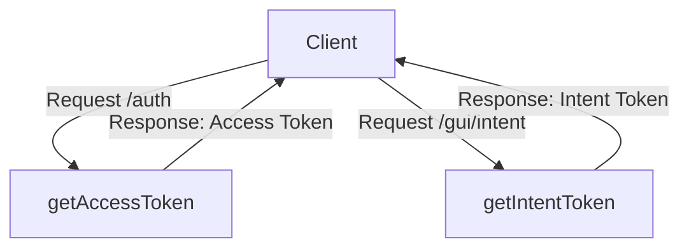

# Overview

Gui refers to the graphical user interface components used in the Datadog Agent. It includes various elements such as the system tray icon and menu on <SwmToken path="tasks/kernel_matrix_testing/kmt_os.py" pos="108:2:2" line-data="class MacOS:">`MacOS`</SwmToken>. The Gui is implemented in Swift 5 for <SwmToken path="tasks/kernel_matrix_testing/kmt_os.py" pos="108:2:2" line-data="class MacOS:">`MacOS`</SwmToken> and provides a system tray icon and menu for interacting with the Datadog Agent.

# Building the Gui Component

The Gui component is built using the command `swift `<SwmToken path="tasks/libs/build/ninja.py" pos="91:3:3" line-data="    def build(">`build`</SwmToken>, resulting in a binary located at `.build/debug/dd-agent-gui`.

# Core Properties and Functionalities

The <SwmToken path="comp/core/gui/guiimpl/gui.go" pos="93:2:2" line-data="// GUI component implementation constructor">`GUI`</SwmToken> struct in <SwmPath>[comp/core/gui/guiimpl/gui.go](comp/core/gui/guiimpl/gui.go)</SwmPath> defines the core properties and functionalities of the Gui, including logging, network listening, routing, authentication, and uptime computation.

# <SwmToken path="tasks/kernel_matrix_testing/kmt_os.py" pos="108:2:2" line-data="class MacOS:">`MacOS`</SwmToken> Systray GUI

The Gui component for <SwmToken path="tasks/kernel_matrix_testing/kmt_os.py" pos="108:2:2" line-data="class MacOS:">`MacOS`</SwmToken> is implemented in Swift 5 and provides a system tray icon and menu for interacting with the Datadog Agent. This allows users to easily access and manage the agent from the system tray.

<SwmSnippet path="/comp/core/gui/guiimpl/systray/Sources/main.swift" line="4">

---

The <SwmToken path="comp/core/gui/guiimpl/systray/Sources/main.swift" pos="6:2:2" line-data="let agentGUI = AgentGUI()">`agentGUI`</SwmToken> variable in <SwmPath>[comp/core/gui/guiimpl/systray/Sources/main.swift](comp/core/gui/guiimpl/systray/Sources/main.swift)</SwmPath> initializes and runs the Gui component, setting up the system tray icon and menu.

```swift
let app = NSApplication.shared

let agentGUI = AgentGUI()
agentGUI.run()
```

---

</SwmSnippet>

# Main Functions

There are several main functions in this folder. Some of them are Module, <SwmToken path="comp/core/gui/guiimpl/gui.go" pos="96:2:2" line-data="func newGui(deps dependencies) provides {">`newGui`</SwmToken>, start, stop, and openGUI. We will dive a little into <SwmToken path="comp/core/gui/guiimpl/gui.go" pos="96:2:2" line-data="func newGui(deps dependencies) provides {">`newGui`</SwmToken> and start.

## <SwmToken path="comp/core/gui/guiimpl/gui.go" pos="96:2:2" line-data="func newGui(deps dependencies) provides {">`newGui`</SwmToken>

The <SwmToken path="comp/core/gui/guiimpl/gui.go" pos="96:2:2" line-data="func newGui(deps dependencies) provides {">`newGui`</SwmToken> function is the constructor for the GUI component. It initializes the GUI server, sets up routing, and handles authentication. It also registers the necessary routes and middleware for the GUI.

<SwmSnippet path="/comp/core/gui/guiimpl/gui.go" line="93">

---

The <SwmToken path="comp/core/gui/guiimpl/gui.go" pos="96:2:2" line-data="func newGui(deps dependencies) provides {">`newGui`</SwmToken> function initializes the GUI server, sets up routing, and handles authentication.

```go
// GUI component implementation constructor
// @param deps dependencies needed to construct the gui, bundled in a struct
// @return an optional, depending of "GUI_port" configuration value
func newGui(deps dependencies) provides {

	p := provides{
		Comp: optional.NewNoneOption[guicomp.Component](),
	}
	guiPort := deps.Config.GetString("GUI_port")

	if guiPort == "-1" {
		deps.Log.Infof("GUI server port -1 specified: not starting the GUI.")
		return p
	}

	g := gui{
		port:         guiPort,
		logger:       deps.Log,
		intentTokens: make(map[string]bool),
	}
```

---

</SwmSnippet>

## start

The <SwmToken path="comp/core/gui/guiimpl/gui.go" pos="156:2:2" line-data="// start function is provided to fx as OnStart lifecycle hook, it run the GUI server">`start`</SwmToken> function is provided to fx as an <SwmToken path="comp/core/gui/guiimpl/gui.go" pos="156:16:16" line-data="// start function is provided to fx as OnStart lifecycle hook, it run the GUI server">`OnStart`</SwmToken> lifecycle hook. It starts the GUI server by setting the start time, listening on the specified port, and serving HTTP requests.

<SwmSnippet path="/comp/core/gui/guiimpl/gui.go" line="156">

---

The <SwmToken path="comp/core/gui/guiimpl/gui.go" pos="156:2:2" line-data="// start function is provided to fx as OnStart lifecycle hook, it run the GUI server">`start`</SwmToken> function starts the GUI server by setting the start time, listening on the specified port, and serving HTTP requests.

```go
// start function is provided to fx as OnStart lifecycle hook, it run the GUI server
func (g *gui) start(_ context.Context) error {
	var e error

	// Set start time...
	g.startTimestamp = time.Now().Unix()

	g.listener, e = net.Listen("tcp", "127.0.0.1:"+g.port)
	if e != nil {
		g.logger.Errorf("GUI server didn't achieved to start: ", e)
		return nil
	}
	go http.Serve(g.listener, g.router) //nolint:errcheck
	g.logger.Infof("GUI server is listening at 127.0.0.1:" + g.port)
	return nil
}
```

---

</SwmSnippet>

# Gui Endpoints

The Gui component includes several endpoints for handling various functionalities.

## <SwmToken path="comp/core/gui/guiimpl/gui.go" pos="244:9:9" line-data="func (g *gui) getAccessToken(w http.ResponseWriter, r *http.Request) {">`getAccessToken`</SwmToken>

The <SwmToken path="comp/core/gui/guiimpl/gui.go" pos="244:9:9" line-data="func (g *gui) getAccessToken(w http.ResponseWriter, r *http.Request) {">`getAccessToken`</SwmToken> endpoint handles the generation of an access token. This token is used for authenticating subsequent requests to the GUI server. The function reads the request, processes it, and returns the token to the client.

<SwmSnippet path="/comp/core/gui/guiimpl/gui.go" line="244">

---

The <SwmToken path="comp/core/gui/guiimpl/gui.go" pos="244:9:9" line-data="func (g *gui) getAccessToken(w http.ResponseWriter, r *http.Request) {">`getAccessToken`</SwmToken> endpoint handles the generation of an access token for authenticating subsequent requests to the GUI server.

```go
func (g *gui) getAccessToken(w http.ResponseWriter, r *http.Request) {

	// intentToken is present in the query when the GUI is opened from the CLI
	intentToken := r.URL.Query().Get("intent")
	if intentToken == "" {
		w.WriteHeader(http.StatusUnauthorized)
		http.Error(w, "missing intentToken", 401)
		return
	}
	if _, ok := g.intentTokens[intentToken]; !ok {
		w.WriteHeader(http.StatusUnauthorized)
		http.Error(w, "invalid intentToken", 401)
		return
	}

	// Remove single use token from map
	delete(g.intentTokens, intentToken)

	// generate accessToken
	accessToken := g.auth.GenerateAccessToken()
```

---

</SwmSnippet>

## <SwmToken path="comp/core/gui/guiimpl/gui.go" pos="181:9:9" line-data="func (g *gui) getIntentToken(w http.ResponseWriter, _ *http.Request) {">`getIntentToken`</SwmToken>

The <SwmToken path="comp/core/gui/guiimpl/gui.go" pos="181:9:9" line-data="func (g *gui) getIntentToken(w http.ResponseWriter, _ *http.Request) {">`getIntentToken`</SwmToken> endpoint generates a single-use intent token. This token is a 32-character random string encoded in <SwmToken path="comp/core/gui/guiimpl/gui.go" pos="180:19:19" line-data="// Generate a single use IntentToken (32 random chars base64 encoded)">`base64`</SwmToken>, which is used for specific authenticated actions within the GUI.

<SwmSnippet path="/comp/core/gui/guiimpl/gui.go" line="181">

---

The <SwmToken path="comp/core/gui/guiimpl/gui.go" pos="181:9:9" line-data="func (g *gui) getIntentToken(w http.ResponseWriter, _ *http.Request) {">`getIntentToken`</SwmToken> endpoint generates a single-use intent token for specific authenticated actions within the GUI.

```go
func (g *gui) getIntentToken(w http.ResponseWriter, _ *http.Request) {
	key := make([]byte, 32)
	_, e := rand.Read(key)
	if e != nil {
		http.Error(w, e.Error(), 500)
	}

	token := base64url.Encode(key)
	g.intentTokens[token] = true
	w.Write([]byte(token))
}
```

---

</SwmSnippet>

&nbsp;

*This is an auto-generated document by Swimm AI 🌊 and has not yet been verified by a human*

<SwmMeta version="3.0.0" repo-id="Z2l0aHViJTNBJTNBZGF0YWRvZy1hZ2VudCUzQSUzQVN3aW1tLURlbW8=" repo-name="datadog-agent"><sup>Powered by [Swimm](/)</sup></SwmMeta>
