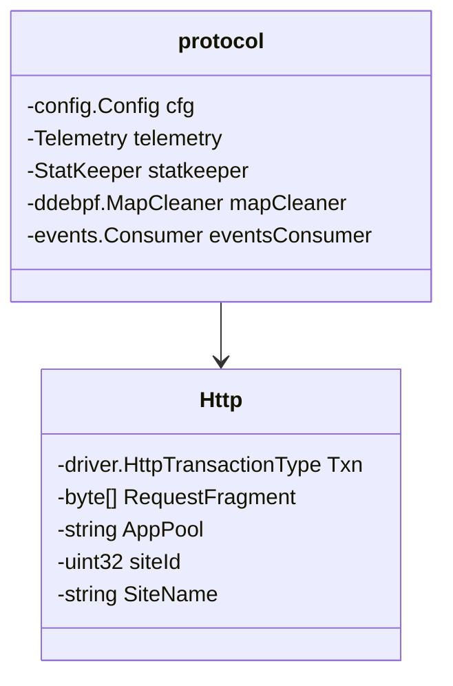

# Introduction

The HTTP protocol is a foundational element of the web, enabling communication between clients and servers. This document covers the basic concepts of the HTTP protocol, including its implementation, configuration, and handling within the system.

# HTTP Protocol Implementation

HTTP refers to the implementation and handling of the HTTP protocol within the system. It is responsible for managing HTTP transactions and ensuring proper communication over the network.

<SwmSnippet path="/pkg/network/protocols/http/protocol.go" line="1">

---

The <SwmToken path="pkg/network/protocols/http/protocol.go" pos="32:2:2" line-data="type protocol struct {">`protocol`</SwmToken> type encapsulates the configuration, telemetry, statistics, and event consumption related to HTTP. This type is central to managing HTTP-specific data and operations.

```go
// Unless explicitly stated otherwise all files in this repository are licensed
// under the Apache License Version 2.0.
// This product includes software developed at Datadog (https://www.datadoghq.com/).
// Copyright 2016-present Datadog, Inc.

```

---

</SwmSnippet>

<SwmSnippet path="/pkg/network/protocols/http/etw_http_service.go" line="10">

---

The <SwmToken path="pkg/network/protocols/http/etw_http_service.go" pos="1420:2:2" line-data="func SetEnabledProtocols(http, https bool) {">`SetEnabledProtocols`</SwmToken> function allows enabling or disabling the capture of HTTP and HTTPS protocols. This function is crucial for controlling which protocols are monitored.

```go
//    1. Capture under different HTTP load and profile scenario and save it to a file (http.etl)
//	   a.xperf -on PROC_THREAD+LOADER+Base -start httptrace -on Microsoft-Windows-HttpService
//       b.  ... initiate http connections using various profiles
//       c. xperf -stop -stop httptrace -d http.etl
//
//	2. Load into Windows Performance Analyzer by double click on http.etl file
```

---

</SwmSnippet>

<SwmSnippet path="/pkg/network/protocols/http/protocol.go" line="20">

---

The <SwmToken path="pkg/network/protocols/http/protocol.go" pos="48:2:2" line-data="// Spec is the protocol spec for the HTTP protocol.">`Spec`</SwmToken> variable defines the protocol specification for HTTP, including the factory method and associated maps. This specification is used to initialize and manage the HTTP protocol within the system.

```go
	ddebpf "github.com/DataDog/datadog-agent/pkg/ebpf"
	"github.com/DataDog/datadog-agent/pkg/network/config"
	netebpf "github.com/DataDog/datadog-agent/pkg/network/ebpf"
	"github.com/DataDog/datadog-agent/pkg/network/protocols"
	"github.com/DataDog/datadog-agent/pkg/network/protocols/events"
	"github.com/DataDog/datadog-agent/pkg/network/usm/buildmode"
```

---

</SwmSnippet>

<SwmSnippet path="/pkg/network/protocols/http/etw_http_service.go" line="30">

---

The <SwmToken path="pkg/network/protocols/http/etw_http_service.go" pos="34:2:2" line-data="//    HTTP and App Pool info detection performance overhead">`HTTP`</SwmToken> type represents HTTP transaction data, including request fragments and additional attributes like application pool and site information. This type is used to track and manage detailed HTTP transaction data.

```go
//	  f. Uncheck "Event Name"
//	  g. Uncheck "cpu"
//
//	/////////////////////////////////////////////////////////////////////////////////////////
//    HTTP and App Pool info detection performance overhead
//
```

---

</SwmSnippet>

# HTTP Configuration

You can control the Java client framework to use, target URL, number of requests to send, and the interval between each iteration.

<SwmSnippet path="/pkg/network/protocols/http/driver_interface.go" line="81">

---

The function <SwmToken path="pkg/network/protocols/http/driver_interface.go" pos="81:9:9" line-data="func (di *HttpDriverInterface) setupHTTPHandle(dh driver.Handle) error {">`setupHTTPHandle`</SwmToken> configures the HTTP driver interface by enabling HTTP on the driver handle and setting various HTTP configuration settings.

```go
func (di *HttpDriverInterface) setupHTTPHandle(dh driver.Handle) error {

	di.driverHTTPHandle = dh
	// enable HTTP on this handle
	settings := driver.HttpConfigurationSettings{
		MaxTransactions:        di.maxTransactions,
		NotificationThreshold:  di.notificationThreshold,
		MaxRequestFragment:     uint16(di.maxRequestFragment),
		EnableAutoETWExclusion: uint16(1),
	}

	err := dh.DeviceIoControl(
		driver.EnableHttpIOCTL,
		(*byte)(unsafe.Pointer(&settings)),
		uint32(driver.HttpSettingsTypeSize),
		nil,
		uint32(0), nil, nil)
	if err != nil {
		log.Warnf("Failed to enable http in driver %v", err)
		return err
	}
```

---

</SwmSnippet>

<SwmSnippet path="/pkg/network/protocols/http/etw_http_service.go" line="333">

---

The function <SwmToken path="pkg/network/protocols/http/etw_http_service.go" pos="333:2:2" line-data="func completeReqRespTracking(eventInfo *etw.DDEventRecord, httpConnLink *HttpConnLink) {">`completeReqRespTracking`</SwmToken> tracks the completion of HTTP requests and responses, updating relevant data structures and logging details.

```go
func completeReqRespTracking(eventInfo *etw.DDEventRecord, httpConnLink *HttpConnLink) {

	// Get connection
	connOpen, connFound := connOpened[httpConnLink.connActivityId]
	if !connFound {
		missedConnectionCount++

		// No connection, no potint to keep it longer inthe pending HttpReqRespMap
		delete(http2openConn, eventInfo.EventHeader.ActivityID)

		if HttpServiceLogVerbosity == HttpServiceLogVeryVerbose {
			log.Warnf("* Warning!!!: ActivityId:%v. Connection ActivityId:%v. HTTPRequestTraceTaskFastResp failed to find connection object\n\n",
				FormatGUID(eventInfo.EventHeader.ActivityID), FormatGUID(httpConnLink.connActivityId))
		}
		return
	}

	// Time
	httpConnLink.http.Txn.ResponseLastSeen = winutil.FileTimeToUnixNano(uint64(eventInfo.EventHeader.TimeStamp))
	if httpConnLink.http.Txn.ResponseLastSeen == httpConnLink.http.Txn.RequestStarted {
		httpConnLink.http.Txn.ResponseLastSeen++
```

---

</SwmSnippet>

<SwmSnippet path="/pkg/network/protocols/http/etw_http_service.go" line="690">

---

The function <SwmToken path="pkg/network/protocols/http/etw_http_service.go" pos="692:2:2" line-data="func httpCallbackOnHTTPRequestTraceTaskParse(eventInfo *etw.DDEventRecord) {">`httpCallbackOnHTTPRequestTraceTaskParse`</SwmToken> parses HTTP request trace events, extracting details such as the request method and URL.

```go
// -----------------------------------------------------------
// HttpService ETW Event #2 (HTTPRequestTraceTaskParse)
func httpCallbackOnHTTPRequestTraceTaskParse(eventInfo *etw.DDEventRecord) {
	if HttpServiceLogVerbosity == HttpServiceLogVeryVerbose {
		reportHttpCallbackEvents(eventInfo, true)
	}

	// typedef struct _EVENT_PARAM_HttpService_HTTPRequestTraceTaskParse
	// {
	// 	    0:  uint64_t requestObj;
	// 	    8:  uint32_t httpVerb;
	// 	    12: unint8_t url;           // Unicode wide char zero terminating string
	// } EVENT_PARAM_HttpService_HTTPRequestTraceTaskParse;
	userData := etwimpl.GetUserData(eventInfo)

	// Check for size
	if eventInfo.UserDataLength < 14 {
		parsingErrorCount++
		log.Errorf("*** Error: ActivityId:%v. User data length for HTTPRequestTraceTaskParse is too small %v\n\n",
			FormatGUID(eventInfo.EventHeader.ActivityID), uintptr(eventInfo.UserDataLength))
		return
```

---

</SwmSnippet>

# HTTP Endpoints

HTTP endpoints are critical for handling various HTTP events. Below are some key functions that manage these events.

<SwmSnippet path="/pkg/network/protocols/http/etw_http_service.go" line="692">

---

The <SwmToken path="pkg/network/protocols/http/etw_http_service.go" pos="692:2:2" line-data="func httpCallbackOnHTTPRequestTraceTaskParse(eventInfo *etw.DDEventRecord) {">`httpCallbackOnHTTPRequestTraceTaskParse`</SwmToken> function handles the HTTP request parsing event. It processes the event information and logs the details if the verbosity level is set to very verbose.

```go
func httpCallbackOnHTTPRequestTraceTaskParse(eventInfo *etw.DDEventRecord) {
	if HttpServiceLogVerbosity == HttpServiceLogVeryVerbose {
		reportHttpCallbackEvents(eventInfo, true)
	}

	// typedef struct _EVENT_PARAM_HttpService_HTTPRequestTraceTaskParse
	// {
	// 	    0:  uint64_t requestObj;
	// 	    8:  uint32_t httpVerb;
	// 	    12: unint8_t url;           // Unicode wide char zero terminating string
	// } EVENT_PARAM_HttpService_HTTPRequestTraceTaskParse;
	userData := etwimpl.GetUserData(eventInfo)

	// Check for size
	if eventInfo.UserDataLength < 14 {
		parsingErrorCount++
		log.Errorf("*** Error: ActivityId:%v. User data length for HTTPRequestTraceTaskParse is too small %v\n\n",
			FormatGUID(eventInfo.EventHeader.ActivityID), uintptr(eventInfo.UserDataLength))
		return
	}
```

---

</SwmSnippet>

&nbsp;

*This is an auto-generated document by Swimm AI 🌊 and has not yet been verified by a human*

<SwmMeta version="3.0.0" repo-id="Z2l0aHViJTNBJTNBZGF0YWRvZy1hZ2VudCUzQSUzQVN3aW1tLURlbW8=" repo-name="datadog-agent"><sup>Powered by [Swimm](/)</sup></SwmMeta>
