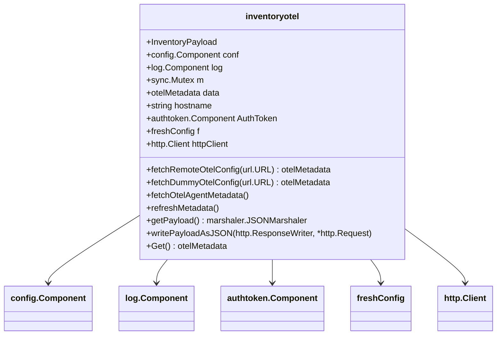

# Overview

The <SwmToken path="comp/metadata/inventoryotel/inventoryotelimpl/inventoryotel.go" pos="108:6:6" line-data="	i := &amp;inventoryotel{">`inventoryotel`</SwmToken> component is responsible for generating the <SwmToken path="tasks/libs/pipeline/stats.py" pos="155:1:1" line-data="    datadog_agent = get_gitlab_repo(repo=project_name)">`datadog_agent`</SwmToken> metadata payload for inventory. It fetches and processes OpenTelemetry (OTel) metadata, which is then included in the inventory payload. The component interacts with various dependencies such as configuration, logging, and authentication tokens to gather the necessary data.

<SwmSnippet path="/comp/metadata/inventoryotel/inventoryotelimpl/inventoryotel.go" line="82">

---

# Dependencies

The <SwmToken path="comp/metadata/inventoryotel/inventoryotelimpl/inventoryotel.go" pos="108:6:6" line-data="	i := &amp;inventoryotel{">`inventoryotel`</SwmToken> component relies on several dependencies including configuration, logging, and authentication tokens to gather the necessary data.

```go
type dependencies struct {
	fx.In

	Log        log.Component
	Config     config.Component
	Serializer serializer.MetricSerializer
	AuthToken  authtoken.Component
}
```

---

</SwmSnippet>

<SwmSnippet path="/comp/metadata/inventoryotel/inventoryotelimpl/inventoryotel.go" line="210">

---

The <SwmToken path="comp/metadata/inventoryotel/inventoryotelimpl/inventoryotel.go" pos="210:9:9" line-data="func (i *inventoryotel) fetchOtelAgentMetadata() {">`fetchOtelAgentMetadata`</SwmToken> function checks if the <SwmToken path="comp/metadata/inventoryotel/inventoryotelimpl/inventoryotel.go" pos="214:8:8" line-data="		i.log.Infof(&quot;OTel Metadata unavailable as OTel collector is disabled&quot;)">`OTel`</SwmToken> collector is enabled and fetches fresh inventory metadata using the configured method. It updates the internal metadata state with the fetched data.

```go
func (i *inventoryotel) fetchOtelAgentMetadata() {
	isEnabled := i.conf.GetBool("otelcollector.enabled")

	if !isEnabled {
		i.log.Infof("OTel Metadata unavailable as OTel collector is disabled")
		i.data = nil

		return
	}
	data, err := i.f.getConfig()
	if err != nil {
		i.log.Errorf("Unable to fetch fresh inventory metadata: ", err)
		return
	}

	i.data = data
	if i.data == nil {
		i.log.Infof("OTel config returned empty")
		return
	}
```

---

</SwmSnippet>

# Formatting Metadata

The <SwmToken path="comp/metadata/inventoryotel/inventoryotelimpl/inventoryotel.go" pos="239:9:9" line-data="func (i *inventoryotel) getPayload() marshaler.JSONMarshaler {">`getPayload`</SwmToken> method formats the collected metadata into a payload that includes the hostname, timestamp, metadata, and UUID.

<SwmSnippet path="/comp/metadata/inventoryotel/inventoryotelimpl/inventoryotel.go" line="239">

---

The <SwmToken path="comp/metadata/inventoryotel/inventoryotelimpl/inventoryotel.go" pos="239:9:9" line-data="func (i *inventoryotel) getPayload() marshaler.JSONMarshaler {">`getPayload`</SwmToken> function generates the JSON payload for the inventory metadata. It refreshes the metadata, scrubs sensitive information, and constructs a payload object with the current metadata, hostname, timestamp, and UUID.

```go
func (i *inventoryotel) getPayload() marshaler.JSONMarshaler {
	i.m.Lock()
	defer i.m.Unlock()

	i.refreshMetadata()

	// Create a static scrubbed copy of agentMetadata for the payload
	data := copyAndScrub(i.data)

	return &Payload{
		Hostname:  i.hostname,
		Timestamp: time.Now().UnixNano(),
		Metadata:  data,
		UUID:      uuid.GetUUID(),
	}
}
```

---

</SwmSnippet>

# Providing Metadata

The <SwmToken path="comp/metadata/inventoryotel/inventoryotelimpl/inventoryotel.go" pos="101:2:2" line-data="func newInventoryOtelProvider(deps dependencies) (provides, error) {">`newInventoryOtelProvider`</SwmToken> function initializes the <SwmToken path="comp/metadata/inventoryotel/inventoryotelimpl/inventoryotel.go" pos="108:6:6" line-data="	i := &amp;inventoryotel{">`inventoryotel`</SwmToken> component and sets up the necessary providers for other parts of the system to access the metadata.

<SwmSnippet path="/comp/metadata/inventoryotel/inventoryotelimpl/inventoryotel.go" line="101">

---

The <SwmToken path="comp/metadata/inventoryotel/inventoryotelimpl/inventoryotel.go" pos="101:2:2" line-data="func newInventoryOtelProvider(deps dependencies) (provides, error) {">`newInventoryOtelProvider`</SwmToken> function initializes the Inventoryotel component with necessary dependencies such as configuration, logging, and authentication tokens. It sets up the HTTP client and determines the method for fetching <SwmToken path="comp/metadata/inventoryotel/inventoryotelimpl/inventoryotel.go" pos="103:13:13" line-data="	// HTTP client need not verify otel-agent cert since it&#39;s self-signed">`otel`</SwmToken> configuration, either from a remote source or using dummy data.

```go
func newInventoryOtelProvider(deps dependencies) (provides, error) {
	hname, _ := hostname.Get(context.Background())
	// HTTP client need not verify otel-agent cert since it's self-signed
	// at start-up. TLS used for encryption not authentication.
	tr := &http.Transport{
		TLSClientConfig: &tls.Config{InsecureSkipVerify: true},
	}
	i := &inventoryotel{
		conf:      deps.Config,
		log:       deps.Log,
		hostname:  hname,
		data:      make(otelMetadata),
		authToken: deps.AuthToken,
		httpClient: &http.Client{
			Transport: tr,
			Timeout:   httpTO,
		},
	}

	getter := i.fetchRemoteOtelConfig
	if i.conf.GetBool("otelcollector.submit_dummy_metadata") {
```

---

</SwmSnippet>

# Fetching Remote <SwmToken path="comp/metadata/inventoryotel/inventoryotelimpl/inventoryotel.go" pos="103:13:13" line-data="	// HTTP client need not verify otel-agent cert since it&#39;s self-signed">`otel`</SwmToken> Config

The <SwmToken path="comp/metadata/inventoryotel/inventoryotelimpl/inventoryotel.go" pos="120:7:7" line-data="	getter := i.fetchRemoteOtelConfig">`fetchRemoteOtelConfig`</SwmToken> function fetches <SwmToken path="comp/metadata/inventoryotel/inventoryotelimpl/inventoryotel.go" pos="103:13:13" line-data="	// HTTP client need not verify otel-agent cert since it&#39;s self-signed">`otel`</SwmToken> metadata from a remote URL. It constructs an HTTP GET request with a Bearer token for authorization, sends the request, and processes the response to extract the metadata.

<SwmSnippet path="/comp/metadata/inventoryotel/inventoryotelimpl/inventoryotel.go" line="170">

---

The <SwmToken path="comp/metadata/inventoryotel/inventoryotelimpl/inventoryotel.go" pos="170:9:9" line-data="func (i *inventoryotel) fetchRemoteOtelConfig(u *url.URL) (otelMetadata, error) {">`fetchRemoteOtelConfig`</SwmToken> function fetches <SwmToken path="comp/metadata/inventoryotel/inventoryotelimpl/inventoryotel.go" pos="103:13:13" line-data="	// HTTP client need not verify otel-agent cert since it&#39;s self-signed">`otel`</SwmToken> metadata from a remote URL. It constructs an HTTP GET request with a Bearer token for authorization, sends the request, and processes the response to extract the metadata.

```go
func (i *inventoryotel) fetchRemoteOtelConfig(u *url.URL) (otelMetadata, error) {
	// Create a Bearer string by appending string access token
	bearer := "Bearer " + i.authToken.Get()

	// Create a new request using http
	req, err := http.NewRequest("GET", u.String(), nil)
	if err != nil {
		i.log.Errorf("Error building request: ", err)
		return nil, err
	}

	// add authorization header to the req
	req.Header.Add("Authorization", bearer)

	resp, err := i.httpClient.Do(req)
	if err != nil {
		i.log.Errorf("Error on response: ", err)
		return nil, err
	}
	defer resp.Body.Close()
```

---

</SwmSnippet>

<SwmSnippet path="/comp/metadata/inventoryotel/inventoryotelimpl/inventoryotel.go" line="200">

---

The <SwmToken path="comp/metadata/inventoryotel/inventoryotelimpl/inventoryotel.go" pos="200:9:9" line-data="func (i *inventoryotel) fetchDummyOtelConfig(_ *url.URL) (otelMetadata, error) {">`fetchDummyOtelConfig`</SwmToken> function reads dummy <SwmToken path="comp/metadata/inventoryotel/inventoryotelimpl/inventoryotel.go" pos="103:13:13" line-data="	// HTTP client need not verify otel-agent cert since it&#39;s self-signed">`otel`</SwmToken> metadata from a local file for testing purposes. It processes the file content to extract the metadata.

```go
func (i *inventoryotel) fetchDummyOtelConfig(_ *url.URL) (otelMetadata, error) {
	dummy, err := dummyFS.ReadFile(path.Join("dummy_data", "response.json"))
	if err != nil {
		i.log.Errorf("Unable to read embedded dummy data:", err)
		return nil, err
	}

	return i.parseResponseFromJSON(dummy)
}
```

---

</SwmSnippet>

&nbsp;

*This is an auto-generated document by Swimm AI 🌊 and has not yet been verified by a human*

<SwmMeta version="3.0.0" repo-id="Z2l0aHViJTNBJTNBZGF0YWRvZy1hZ2VudCUzQSUzQVN3aW1tLURlbW8=" repo-name="datadog-agent"><sup>Powered by [Swimm](/)</sup></SwmMeta>
