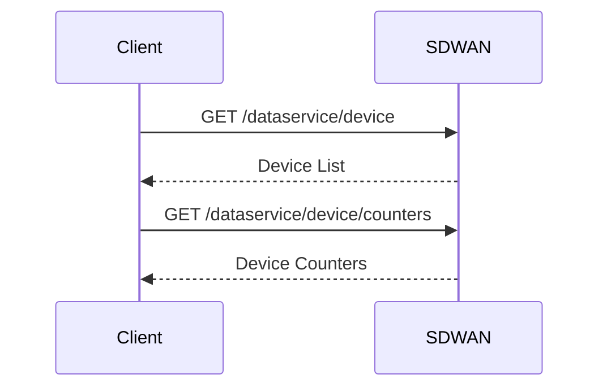

# Overview

Network devices refer to the various hardware components within an <SwmToken path="pkg/collector/corechecks/network-devices/cisco-sdwan/client/client.go" pos="171:14:16" line-data="// GetDevices get all devices from this SD-WAN network">`SD-WAN`</SwmToken> network that are monitored and managed by the Datadog Agent. This document explains the basic concepts of network devices in the collector, including retrieving devices, fetching device counters, building device metadata, generating device tags, calculating device uptime, and determining device status.

<SwmSnippet path="/pkg/collector/corechecks/network-devices/cisco-sdwan/client/client.go" line="171">

---

# Retrieving Devices

The <SwmToken path="pkg/collector/corechecks/network-devices/cisco-sdwan/client/client.go" pos="171:2:2" line-data="// GetDevices get all devices from this SD-WAN network">`GetDevices`</SwmToken> method retrieves all devices from the <SwmToken path="pkg/collector/corechecks/network-devices/cisco-sdwan/client/client.go" pos="171:14:16" line-data="// GetDevices get all devices from this SD-WAN network">`SD-WAN`</SwmToken> network by calling the <SwmToken path="pkg/collector/corechecks/network-devices/cisco-sdwan/client/client.go" pos="173:8:8" line-data="	devices, err := getAllEntries[Device](client, &quot;/dataservice/device&quot;, nil)">`getAllEntries`</SwmToken> function, which handles paginated API responses.

```go
// GetDevices get all devices from this SD-WAN network
func (client *Client) GetDevices() ([]Device, error) {
	devices, err := getAllEntries[Device](client, "/dataservice/device", nil)
	if err != nil {
		return nil, err
	}
	return devices.Data, nil
}
```

---

</SwmSnippet>

<SwmSnippet path="/pkg/collector/corechecks/network-devices/cisco-sdwan/client/client.go" line="180">

---

# Fetching Device Counters

The <SwmToken path="pkg/collector/corechecks/network-devices/cisco-sdwan/client/client.go" pos="180:2:2" line-data="// GetDevicesCounters get all devices from this SD-WAN network">`GetDevicesCounters`</SwmToken> method fetches device counters from the <SwmToken path="pkg/collector/corechecks/network-devices/cisco-sdwan/client/client.go" pos="180:14:16" line-data="// GetDevicesCounters get all devices from this SD-WAN network">`SD-WAN`</SwmToken> network, also utilizing the <SwmToken path="pkg/collector/corechecks/network-devices/cisco-sdwan/client/client.go" pos="182:8:8" line-data="	counters, err := getAllEntries[DeviceCounters](client, &quot;/dataservice/device/counters&quot;, nil)">`getAllEntries`</SwmToken> function to manage paginated data.

```go
// GetDevicesCounters get all devices from this SD-WAN network
func (client *Client) GetDevicesCounters() ([]DeviceCounters, error) {
	counters, err := getAllEntries[DeviceCounters](client, "/dataservice/device/counters", nil)
	if err != nil {
		return nil, err
	}
	return counters.Data, nil
}
```

---

</SwmSnippet>

<SwmSnippet path="/pkg/collector/corechecks/network-devices/cisco-sdwan/payload/devices.go" line="21">

---

# Building Device Metadata

The <SwmToken path="pkg/collector/corechecks/network-devices/cisco-sdwan/payload/devices.go" pos="21:2:2" line-data="// GetDevicesMetadata process devices API payloads to build metadata">`GetDevicesMetadata`</SwmToken> function processes the devices' API payloads to build metadata, which includes details like device ID, IP address, vendor, and status.

```go
// GetDevicesMetadata process devices API payloads to build metadata
func GetDevicesMetadata(namespace string, devices []client.Device) []devicemetadata.DeviceMetadata {
	var devicesMetadata []devicemetadata.DeviceMetadata
	for _, device := range devices {
		devicesMetadata = append(devicesMetadata, buildDeviceMetadata(namespace, device))
	}
	return devicesMetadata
}
```

---

</SwmSnippet>

<SwmSnippet path="/pkg/collector/corechecks/network-devices/cisco-sdwan/payload/devices.go" line="30">

---

# Generating Device Tags

The <SwmToken path="pkg/collector/corechecks/network-devices/cisco-sdwan/payload/devices.go" pos="30:2:2" line-data="// GetDevicesTags process devices API payloads to build device tags">`GetDevicesTags`</SwmToken> function generates tags for each device based on the API payloads, which are used for categorization and filtering.

```go
// GetDevicesTags process devices API payloads to build device tags
func GetDevicesTags(namespace string, devices []client.Device) map[string][]string {
	deviceTags := make(map[string][]string)
	for _, device := range devices {
		deviceTags[device.SystemIP] = buildDeviceTags(namespace, device)
	}
	return deviceTags
}
```

---

</SwmSnippet>

<SwmSnippet path="/pkg/collector/corechecks/network-devices/cisco-sdwan/payload/devices.go" line="39">

---

# Calculating Device Uptime

The <SwmToken path="pkg/collector/corechecks/network-devices/cisco-sdwan/payload/devices.go" pos="39:2:2" line-data="// GetDevicesUptime process devices API payloads to compute uptimes">`GetDevicesUptime`</SwmToken> function calculates the uptime for each device using the API payloads, providing insights into device availability.

```go
// GetDevicesUptime process devices API payloads to compute uptimes
func GetDevicesUptime(devices []client.Device) map[string]float64 {
	uptimes := make(map[string]float64)
	for _, device := range devices {
		if device.UptimeDate != 0 {
			uptimes[device.SystemIP] = computeUptime(device)
		}
	}
	return uptimes
}
```

---

</SwmSnippet>

<SwmSnippet path="/pkg/collector/corechecks/network-devices/cisco-sdwan/payload/devices.go" line="50">

---

# Determining Device Status

The <SwmToken path="pkg/collector/corechecks/network-devices/cisco-sdwan/payload/devices.go" pos="50:2:2" line-data="// GetDevicesStatus process devices API payloads to get status">`GetDevicesStatus`</SwmToken> function determines the status of each device (e.g., reachable or unreachable) based on the API payloads.

```go
// GetDevicesStatus process devices API payloads to get status
func GetDevicesStatus(devices []client.Device) map[string]float64 {
	states := make(map[string]float64)
	for _, device := range devices {
		status := 0.0
		if device.Reachability == "reachable" {
			status = 1.0
		}
		states[device.SystemIP] = status
	}
	return states
}
```

---

</SwmSnippet>

&nbsp;

*This is an auto-generated document by Swimm AI 🌊 and has not yet been verified by a human*

<SwmMeta version="3.0.0" repo-id="Z2l0aHViJTNBJTNBZGF0YWRvZy1hZ2VudCUzQSUzQVN3aW1tLURlbW8=" repo-name="datadog-agent"><sup>Powered by [Swimm](/)</sup></SwmMeta>
