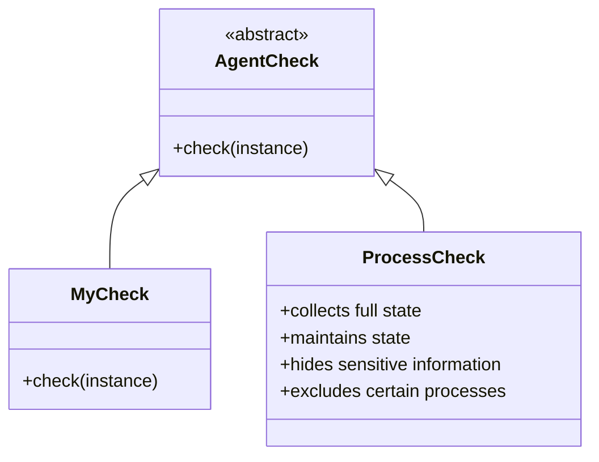

# Basic Concepts of Process Checks

Process Checks are integral components responsible for collecting various types of data from the system. They are implemented as classes that inherit from <SwmToken path="rtloader/test/python/datadog_checks/base/checks/__init__.py" pos="2:2:2" line-data="class AgentCheck(object):  # noqa: UP004">`AgentCheck`</SwmToken> and must define a <SwmToken path="pkg/process/checks/checks.go" pos="39:2:2" line-data="// Check is an interface for Agent checks that collect data. Each check returns">`Check`</SwmToken> method. Each check can be configured independently and can run at different intervals. Checks can collect metrics, emit events, and submit service checks.

## ProcessCheck Overview

The `ProcessCheck` is a specific type of check that collects detailed information about running processes, including command line arguments and related metadata. It maintains state between checks to perform calculations such as CPU usage rates. The `ProcessCheck` also includes mechanisms to hide sensitive information and exclude certain processes from being collected.

<SwmSnippet path="/pkg/process/checks/checks.go" line="39">

---

## Check Interface

The <SwmToken path="pkg/process/checks/checks.go" pos="39:2:2" line-data="// Check is an interface for Agent checks that collect data. Each check returns">`Check`</SwmToken> interface defines the structure for Agent checks that collect data. Each check returns a specific <SwmToken path="pkg/process/checks/checks.go" pos="40:6:6" line-data="// a specific MessageBody type that will be published to the intake endpoint or">`MessageBody`</SwmToken> type that will be published to the intake endpoint or processed in another way. The interface includes methods for initialization, running the check, and cleaning up resources.

```go
// Check is an interface for Agent checks that collect data. Each check returns
// a specific MessageBody type that will be published to the intake endpoint or
// processed in another way (e.g. printed for debugging).
// Before checks are used you must called Init.
type Check interface {
	// Name returns the name of the check
	Name() string
	// IsEnabled returns true if the check is enabled by configuration
	IsEnabled() bool
	// Realtime indicates if this check only runs in real-time mode
	Realtime() bool
	// Init initializes the check
	Init(syscfg *SysProbeConfig, info *HostInfo, oneShot bool) error
	// SupportsRunOptions returns true if the check supports RunOptions
	SupportsRunOptions() bool
	// Run runs the check
	Run(nextGroupID func() int32, options *RunOptions) (RunResult, error)
	// Cleanup performs resource cleanup after check is no longer running
	Cleanup()
	// ShouldSaveLastRun saves results of the last run
	ShouldSaveLastRun() bool
```

---

</SwmSnippet>

<SwmSnippet path="/pkg/process/checks/process_discovery_check_test.go" line="27">

---

## Example: ProcessDiscoveryCheck

The <SwmToken path="pkg/process/checks/process_discovery_check_test.go" pos="27:2:2" line-data="func TestProcessDiscoveryCheck(t *testing.T) {">`TestProcessDiscoveryCheck`</SwmToken> function demonstrates how to initialize and run a `ProcessDiscoveryCheck`, ensuring it runs without error and produces the expected results.

```go
func TestProcessDiscoveryCheck(t *testing.T) {
	prev := getMaxBatchSize
	defer func() {
		getMaxBatchSize = prev
	}()

	maxBatchSize := 10
	getMaxBatchSize = func(config.Reader) int { return maxBatchSize }

	check := NewProcessDiscoveryCheck(configmock.New(t))
	check.Init(
		&SysProbeConfig{},
		&HostInfo{
			SystemInfo: &model.SystemInfo{
				Cpus:        []*model.CPUInfo{{Number: 0}},
				TotalMemory: 0,
			},
		},
		true,
	)
```

---

</SwmSnippet>

## Endpoints of Checks

Endpoints of Checks are specific implementations that collect different types of data. For example, the <SwmToken path="pkg/process/checks/net.go" pos="49:14:14" line-data="// NewConnectionsCheck returns an instance of the ConnectionsCheck.">`ConnectionsCheck`</SwmToken> endpoint collects statistics about live TCP and UDP connections, while the `ProcessCheck` endpoint collects detailed information about running processes.

<SwmSnippet path="/pkg/process/checks/net.go" line="49">

---

### <SwmToken path="pkg/process/checks/net.go" pos="49:14:14" line-data="// NewConnectionsCheck returns an instance of the ConnectionsCheck.">`ConnectionsCheck`</SwmToken>

The <SwmToken path="pkg/process/checks/net.go" pos="49:14:14" line-data="// NewConnectionsCheck returns an instance of the ConnectionsCheck.">`ConnectionsCheck`</SwmToken> endpoint initializes with system probe configurations and gathers data on active and closed network connections, bundling them into a <SwmToken path="pkg/process/checks/net.go" pos="164:17:17" line-data="// that will be bundled up into a `CollectorConnections`.">`CollectorConnections`</SwmToken> message.

```go
// NewConnectionsCheck returns an instance of the ConnectionsCheck.
func NewConnectionsCheck(config, sysprobeYamlConfig config.Reader, syscfg *sysconfigtypes.Config, wmeta workloadmeta.Component, npCollector npcollector.Component) *ConnectionsCheck {
	return &ConnectionsCheck{
		config:             config,
		syscfg:             syscfg,
		sysprobeYamlConfig: sysprobeYamlConfig,
		wmeta:              wmeta,
		npCollector:        npCollector,
	}
}
```

---

</SwmSnippet>

&nbsp;

*This is an auto-generated document by Swimm AI 🌊 and has not yet been verified by a human*

<SwmMeta version="3.0.0" repo-id="Z2l0aHViJTNBJTNBZGF0YWRvZy1hZ2VudCUzQSUzQVN3aW1tLURlbW8=" repo-name="datadog-agent"><sup>Powered by [Swimm](/)</sup></SwmMeta>
