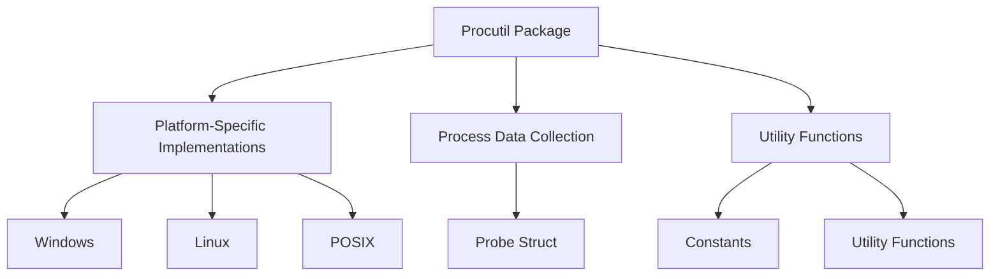

# Overview

Procutil is a package that provides utilities for process management across different operating systems. It includes platform-specific implementations for Windows, Linux, and other POSIX-compliant systems. The package contains various files such as <SwmPath>[pkg/process/procutil/process_windows.go](pkg/process/procutil/process_windows.go)</SwmPath>, <SwmPath>[pkg/process/procutil/process_linux.go](pkg/process/procutil/process_linux.go)</SwmPath>, and <SwmPath>[pkg/process/procutil/process_posix.go](pkg/process/procutil/process_posix.go)</SwmPath>, each tailored to handle process-related tasks on their respective platforms.

# Platform-Specific Implementations

The <SwmToken path="pkg/process/procutil/process_windows.go" pos="8:2:2" line-data="package procutil">`procutil`</SwmToken> package includes platform-specific files like <SwmPath>[pkg/process/procutil/process_windows.go](pkg/process/procutil/process_windows.go)</SwmPath> for Windows, ensuring that process management tasks are handled appropriately for each operating system.

<SwmSnippet path="/pkg/process/procutil/process_windows.go" line="6">

---

The <SwmPath>[pkg/process/procutil/process_windows.go](pkg/process/procutil/process_windows.go)</SwmPath> file is specifically designed for Windows OS, as indicated by the build tag <SwmToken path="pkg/process/procutil/process_windows.go" pos="6:0:5" line-data="//go:build windows">`//go:build windows`</SwmToken>.

```go
//go:build windows

package procutil

import (
```

---

</SwmSnippet>

# Process Data Collection

The <SwmToken path="pkg/process/procutil/process_windows.go" pos="59:6:6" line-data="func (p *probe) init() {">`probe`</SwmToken> struct in <SwmPath>[pkg/process/procutil/process_windows.go](pkg/process/procutil/process_windows.go)</SwmPath> initializes and manages process data collection, handling errors and resource cleanup. This is crucial for maintaining the stability and performance of the application.

<SwmSnippet path="/pkg/process/procutil/process_windows.go" line="53">

---

The <SwmToken path="pkg/process/procutil/process_windows.go" pos="59:6:6" line-data="func (p *probe) init() {">`probe`</SwmToken> struct initializes process data collection and handles errors and resource cleanup. The <SwmToken path="pkg/process/procutil/process_windows.go" pos="59:9:9" line-data="func (p *probe) init() {">`init`</SwmToken> function sets up the process data collection and ensures that any errors are properly managed.

```go
	initError error

	instanceToPID map[string]int32
	procs         map[int32]*Process
}

func (p *probe) init() {
	var err error

	defer func() {
		p.initError = err
		if err != nil {
			p.Close()
		}
	}()

	status := pdhutil.PdhOpenQuery(0, 0, &p.hQuery)
	if status != 0 {
		err = fmt.Errorf("PdhOpenQuery failed with 0x%x", status)
		return
	}
```

---

</SwmSnippet>

# Utility Functions

The package also defines utility functions and constants to support its operations, such as those found in <SwmPath>[pkg/process/procutil/process_posix.go](pkg/process/procutil/process_posix.go)</SwmPath> for POSIX-compliant systems.

<SwmSnippet path="/pkg/process/procutil/process_posix.go" line="6">

---

The <SwmPath>[pkg/process/procutil/process_posix.go](pkg/process/procutil/process_posix.go)</SwmPath> file includes utility functions and constants for POSIX-compliant systems, as indicated by the build tag <SwmToken path="pkg/process/procutil/process_posix.go" pos="6:0:17" line-data="//go:build linux || freebsd || openbsd || darwin">`//go:build linux || freebsd || openbsd || darwin`</SwmToken>.

```go
//go:build linux || freebsd || openbsd || darwin

package procutil

import "syscall"
```

---

</SwmSnippet>

&nbsp;

*This is an auto-generated document by Swimm AI 🌊 and has not yet been verified by a human*

<SwmMeta version="3.0.0" repo-id="Z2l0aHViJTNBJTNBZGF0YWRvZy1hZ2VudCUzQSUzQVN3aW1tLURlbW8=" repo-name="datadog-agent"><sup>Powered by [Swimm](/)</sup></SwmMeta>
