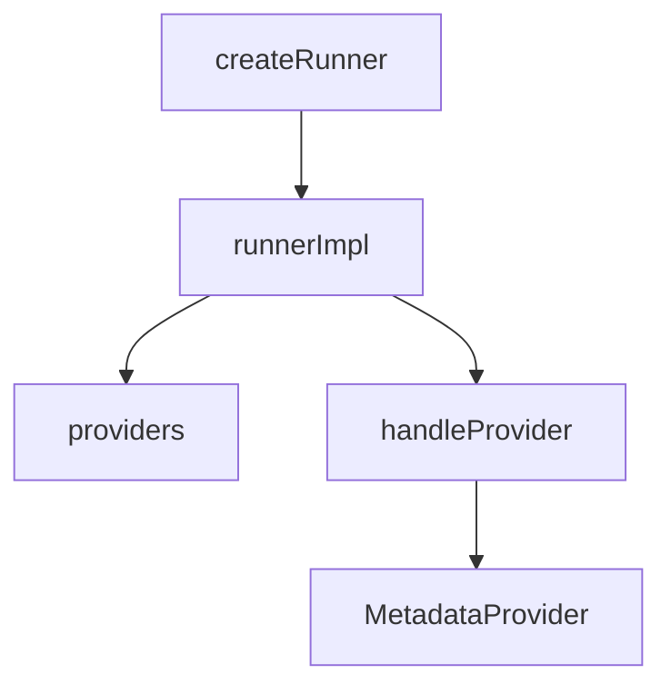

# Overview

The Runner is a component responsible for managing the execution of metadata providers at regular intervals. It uses a list of <SwmToken path="comp/metadata/runner/runnerimpl/runner.go" pos="32:5:5" line-data="	providers []MetadataProvider">`MetadataProvider`</SwmToken> instances, which are registered through the <SwmToken path="comp/metadata/runner/runnerimpl/runner.go" pos="54:2:2" line-data="// NewProvider registers a new metadata provider by adding a callback to the runner.">`NewProvider`</SwmToken> function. The <SwmToken path="comp/metadata/runner/runnerimpl/runner.go" pos="28:2:2" line-data="type runnerImpl struct {">`runnerImpl`</SwmToken> struct contains a <SwmToken path="comp/metadata/runner/runnerimpl/runner.go" pos="32:1:1" line-data="	providers []MetadataProvider">`providers`</SwmToken> field that holds these <SwmToken path="comp/metadata/runner/runnerimpl/runner.go" pos="32:5:5" line-data="	providers []MetadataProvider">`MetadataProvider`</SwmToken> instances. The <SwmToken path="comp/metadata/runner/runnerimpl/runner.go" pos="90:2:2" line-data="// handleProvider runs a provider at regular interval until the runner is stopped">`handleProvider`</SwmToken> method in <SwmToken path="comp/metadata/runner/runnerimpl/runner.go" pos="28:2:2" line-data="type runnerImpl struct {">`runnerImpl`</SwmToken> runs each provider at regular intervals until the runner is stopped.

# Registering Metadata Providers

The <SwmToken path="comp/metadata/runner/runnerimpl/runner.go" pos="54:2:2" line-data="// NewProvider registers a new metadata provider by adding a callback to the runner.">`NewProvider`</SwmToken> function is used to register a new metadata provider by adding a callback to the runner.

<SwmSnippet path="/comp/metadata/runner/runnerimpl/runner.go" line="54">

---

The <SwmToken path="comp/metadata/runner/runnerimpl/runner.go" pos="54:2:2" line-data="// NewProvider registers a new metadata provider by adding a callback to the runner.">`NewProvider`</SwmToken> function registers a new metadata provider by adding a callback to the runner.

```go
// NewProvider registers a new metadata provider by adding a callback to the runner.
func NewProvider(callback MetadataProvider) Provider {
	return Provider{
		Callback: callback,
	}
}
```

---

</SwmSnippet>

# Creating the Runner

The <SwmToken path="comp/metadata/runner/runnerimpl/runner.go" pos="72:5:5" line-data="	r := createRunner(deps)">`createRunner`</SwmToken> function instantiates a <SwmToken path="comp/metadata/runner/runnerimpl/runner.go" pos="28:2:2" line-data="type runnerImpl struct {">`runnerImpl`</SwmToken> object, initializing its dependencies, including the <SwmToken path="comp/metadata/runner/runnerimpl/runner.go" pos="32:1:1" line-data="	providers []MetadataProvider">`providers`</SwmToken>.

# Managing Execution

The <SwmToken path="comp/metadata/runner/runnerimpl/runner.go" pos="28:2:2" line-data="type runnerImpl struct {">`runnerImpl`</SwmToken> struct contains a <SwmToken path="comp/metadata/runner/runnerimpl/runner.go" pos="32:1:1" line-data="	providers []MetadataProvider">`providers`</SwmToken> field that holds the <SwmToken path="comp/metadata/runner/runnerimpl/runner.go" pos="32:5:5" line-data="	providers []MetadataProvider">`MetadataProvider`</SwmToken> instances. The <SwmToken path="comp/metadata/runner/runnerimpl/runner.go" pos="90:2:2" line-data="// handleProvider runs a provider at regular interval until the runner is stopped">`handleProvider`</SwmToken> method in <SwmToken path="comp/metadata/runner/runnerimpl/runner.go" pos="28:2:2" line-data="type runnerImpl struct {">`runnerImpl`</SwmToken> runs each provider at regular intervals until the runner is stopped.

<SwmSnippet path="/comp/metadata/runner/runnerimpl/runner.go" line="28">

---

The <SwmToken path="comp/metadata/runner/runnerimpl/runner.go" pos="28:2:2" line-data="type runnerImpl struct {">`runnerImpl`</SwmToken> struct contains a <SwmToken path="comp/metadata/runner/runnerimpl/runner.go" pos="32:1:1" line-data="	providers []MetadataProvider">`providers`</SwmToken> field that holds the <SwmToken path="comp/metadata/runner/runnerimpl/runner.go" pos="32:5:5" line-data="	providers []MetadataProvider">`MetadataProvider`</SwmToken> instances.

```go
type runnerImpl struct {
	log    log.Component
	config config.Component

	providers []MetadataProvider

	wg       sync.WaitGroup
	stopChan chan struct{}
}
```

---

</SwmSnippet>

# Main Functions

There are several main functions in this folder. Some of them are <SwmToken path="comp/metadata/runner/runnerimpl/runner.go" pos="72:5:5" line-data="	r := createRunner(deps)">`createRunner`</SwmToken>, <SwmToken path="comp/metadata/runner/runnerimpl/runner.go" pos="71:2:2" line-data="func newRunner(lc fx.Lifecycle, deps dependencies) runner.Component {">`newRunner`</SwmToken>, <SwmToken path="comp/metadata/runner/runnerimpl/runner.go" pos="75:13:13" line-data="		// We rely on FX to start and stop the metadata runner">`start`</SwmToken>, <SwmToken path="comp/metadata/runner/runnerimpl/runner.go" pos="90:2:2" line-data="// handleProvider runs a provider at regular interval until the runner is stopped">`handleProvider`</SwmToken>, and <SwmToken path="comp/metadata/runner/runnerimpl/runner.go" pos="75:17:17" line-data="		// We rely on FX to start and stop the metadata runner">`stop`</SwmToken>. We will dive a little into <SwmToken path="comp/metadata/runner/runnerimpl/runner.go" pos="72:5:5" line-data="	r := createRunner(deps)">`createRunner`</SwmToken> and <SwmToken path="comp/metadata/runner/runnerimpl/runner.go" pos="71:2:2" line-data="func newRunner(lc fx.Lifecycle, deps dependencies) runner.Component {">`newRunner`</SwmToken>.

## <SwmToken path="comp/metadata/runner/runnerimpl/runner.go" pos="71:2:2" line-data="func newRunner(lc fx.Lifecycle, deps dependencies) runner.Component {">`newRunner`</SwmToken>

The <SwmToken path="comp/metadata/runner/runnerimpl/runner.go" pos="71:2:2" line-data="func newRunner(lc fx.Lifecycle, deps dependencies) runner.Component {">`newRunner`</SwmToken> function creates a new runner component and sets up lifecycle hooks to start and stop the runner based on the application's lifecycle.

<SwmSnippet path="/comp/metadata/runner/runnerimpl/runner.go" line="71">

---

The <SwmToken path="comp/metadata/runner/runnerimpl/runner.go" pos="71:2:2" line-data="func newRunner(lc fx.Lifecycle, deps dependencies) runner.Component {">`newRunner`</SwmToken> function creates a new runner component and sets up lifecycle hooks to start and stop the runner based on the application's lifecycle.

```go
func newRunner(lc fx.Lifecycle, deps dependencies) runner.Component {
	r := createRunner(deps)

	if deps.Config.GetBool("enable_metadata_collection") {
		// We rely on FX to start and stop the metadata runner
		lc.Append(fx.Hook{
			OnStart: func(ctx context.Context) error {
				return r.start()
			},
			OnStop: func(ctx context.Context) error {
				return r.stop()
			},
		})
	} else {
		deps.Log.Info("Metadata collection is disabled, only do this if another agent/dogstatsd is running on this host")
	}
	return r
```

---

</SwmSnippet>

## start

The <SwmToken path="comp/metadata/runner/runnerimpl/runner.go" pos="75:13:13" line-data="		// We rely on FX to start and stop the metadata runner">`start`</SwmToken> method is called when the application starts. It initiates the execution of all registered metadata providers.

<SwmSnippet path="/comp/metadata/runner/runnerimpl/runner.go" line="125">

---

The <SwmToken path="comp/metadata/runner/runnerimpl/runner.go" pos="125:2:2" line-data="// start is called by FX when the application starts. Lifecycle hooks are blocking and called sequencially. We should">`start`</SwmToken> method is called when the application starts. It initiates the execution of all registered metadata providers.

```go
// start is called by FX when the application starts. Lifecycle hooks are blocking and called sequencially. We should
// not block here.
func (r *runnerImpl) start() error {
	r.log.Debugf("Starting metadata runner with %d providers", len(r.providers))

	for _, provider := range r.providers {
		go r.handleProvider(provider)
	}

	return nil
}
```

---

</SwmSnippet>

## <SwmToken path="comp/metadata/runner/runnerimpl/runner.go" pos="90:2:2" line-data="// handleProvider runs a provider at regular interval until the runner is stopped">`handleProvider`</SwmToken>

The <SwmToken path="comp/metadata/runner/runnerimpl/runner.go" pos="90:2:2" line-data="// handleProvider runs a provider at regular interval until the runner is stopped">`handleProvider`</SwmToken> method runs a metadata provider at regular intervals until the runner is stopped.

<SwmSnippet path="/comp/metadata/runner/runnerimpl/runner.go" line="90">

---

The <SwmToken path="comp/metadata/runner/runnerimpl/runner.go" pos="90:2:2" line-data="// handleProvider runs a provider at regular interval until the runner is stopped">`handleProvider`</SwmToken> method runs a metadata provider at regular intervals until the runner is stopped.

```go
// handleProvider runs a provider at regular interval until the runner is stopped
func (r *runnerImpl) handleProvider(p MetadataProvider) {
	r.log.Debugf("Starting runner for MetadataProvider %#v", p)
	r.wg.Add(1)

	intervalChan := make(chan time.Duration)
	var interval time.Duration

	ctx, cancel := context.WithCancel(context.Background())
	defer func() {
		cancel()
		r.log.Debugf("stopping runner for MetadataProvider %#v", p)
		r.wg.Done()
	}()

	for {
		go func(intervalChan chan time.Duration) {
			intervalChan <- p(ctx)
		}(intervalChan)

		select {
```

---

</SwmSnippet>

## stop

The <SwmToken path="comp/metadata/runner/runnerimpl/runner.go" pos="75:17:17" line-data="		// We rely on FX to start and stop the metadata runner">`stop`</SwmToken> method is called when the application stops. It stops all running metadata providers and waits for them to finish.

<SwmSnippet path="/comp/metadata/runner/runnerimpl/runner.go" line="137">

---

The <SwmToken path="comp/metadata/runner/runnerimpl/runner.go" pos="137:2:2" line-data="// stop is called by FX when the application stops. Lifecycle hooks are blocking and called sequencially. We should">`stop`</SwmToken> method is called when the application stops. It stops all running metadata providers and waits for them to finish.

```go
// stop is called by FX when the application stops. Lifecycle hooks are blocking and called sequencially. We should
// not block here.
func (r *runnerImpl) stop() error {
	r.log.Debugf("Stopping metadata runner")
	close(r.stopChan)
	r.wg.Wait()
	return nil
}
```

---

</SwmSnippet>

&nbsp;

*This is an auto-generated document by Swimm AI 🌊 and has not yet been verified by a human*

<SwmMeta version="3.0.0" repo-id="Z2l0aHViJTNBJTNBZGF0YWRvZy1hZ2VudCUzQSUzQVN3aW1tLURlbW8=" repo-name="datadog-agent"><sup>Powered by [Swimm](/)</sup></SwmMeta>
