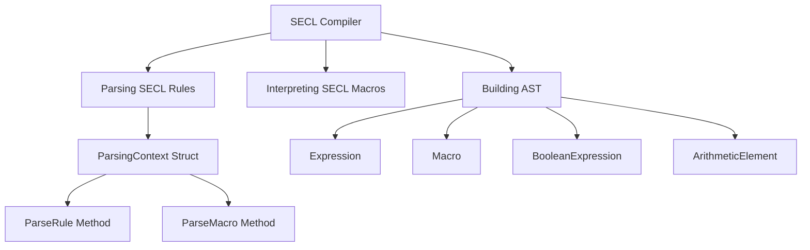

# Overview

The SECL (Security Event Correlation Language) Compiler is responsible for parsing and interpreting SECL rules and macros. It uses the `participle` library to define the grammar and lexing rules for SECL, converting SECL expressions into abstract syntax trees (ASTs). These ASTs are then evaluated to enforce security policies or detect security events.

# <SwmToken path="pkg/security/secl/compiler/eval/macro.go" pos="37:17:17" line-data="func NewMacro(id, expression string, model Model, parsingContext *ast.ParsingContext, opts *Opts) (*Macro, error) {">`parsingContext`</SwmToken> Struct

The <SwmToken path="pkg/security/secl/compiler/eval/macro.go" pos="37:17:17" line-data="func NewMacro(id, expression string, model Model, parsingContext *ast.ParsingContext, opts *Opts) (*Macro, error) {">`parsingContext`</SwmToken> struct is central to the SECL Compiler. It provides methods like <SwmToken path="pkg/security/secl/compiler/eval/eval_test.go" pos="41:2:2" line-data="func parseRule(expr string, model Model, opts *Opts) (*Rule, error) {">`parseRule`</SwmToken> and <SwmToken path="pkg/security/secl/compiler/eval/macro.go" pos="89:10:10" line-data="	astMacro, err := parsingContext.ParseMacro(expression)">`ParseMacro`</SwmToken> to parse SECL rules and macros respectively. This struct is essential for converting SECL syntax into a structured format that can be processed further.

# Components of SECL Syntax

The SECL Compiler includes various types such as <SwmToken path="docs/cloud-workload-security/scripts/secl-doc-gen.py" pos="28:1:1" line-data="    expression: str">`expression`</SwmToken>, <SwmToken path="pkg/security/secl/compiler/eval/eval_test.go" pos="614:1:1" line-data="	macro, err := NewMacro(">`macro`</SwmToken>, `BooleanExpression`, and `ArithmeticElement` to represent different components of SECL syntax. These components are used to build the AST.

<SwmSnippet path="/pkg/security/secl/compiler/eval/evaluators.go" line="212">

---

# Compile Method in <SwmToken path="pkg/security/secl/compiler/eval/evaluators.go" pos="213:6:6" line-data="func (s *StringValuesEvaluator) Compile(opts StringCmpOpts) error {">`StringValuesEvaluator`</SwmToken>

The <SwmToken path="pkg/security/secl/compiler/eval/evaluators.go" pos="212:2:2" line-data="// Compile the underlying StringValues">`Compile`</SwmToken> method in <SwmToken path="pkg/security/secl/compiler/eval/evaluators.go" pos="213:6:6" line-data="func (s *StringValuesEvaluator) Compile(opts StringCmpOpts) error {">`StringValuesEvaluator`</SwmToken> calls the <SwmToken path="pkg/security/secl/compiler/eval/evaluators.go" pos="212:2:2" line-data="// Compile the underlying StringValues">`Compile`</SwmToken> method of <SwmToken path="pkg/security/secl/compiler/eval/evaluators.go" pos="212:8:8" line-data="// Compile the underlying StringValues">`StringValues`</SwmToken> to compile the underlying string values.

```go
// Compile the underlying StringValues
func (s *StringValuesEvaluator) Compile(opts StringCmpOpts) error {
	return s.Values.Compile(opts)
}
```

---

</SwmSnippet>

<SwmSnippet path="/pkg/security/secl/compiler/eval/strings.go" line="48">

---

# Compile Method in <SwmToken path="pkg/security/secl/compiler/eval/strings.go" pos="49:6:6" line-data="func (s *StringValues) Compile(opts StringCmpOpts) error {">`StringValues`</SwmToken>

The <SwmToken path="pkg/security/secl/compiler/eval/strings.go" pos="48:2:2" line-data="// Compile all the values">`Compile`</SwmToken> method in <SwmToken path="pkg/security/secl/compiler/eval/strings.go" pos="49:6:6" line-data="func (s *StringValues) Compile(opts StringCmpOpts) error {">`StringValues`</SwmToken> iterates over the field values and compiles them based on their type. It uses <SwmToken path="pkg/security/secl/compiler/eval/strings.go" pos="61:8:8" line-data="			matcher, err := NewStringMatcher(value.Type, str, opts)">`NewStringMatcher`</SwmToken> to create matchers for different types of string values.

```go
// Compile all the values
func (s *StringValues) Compile(opts StringCmpOpts) error {
	for _, value := range s.fieldValues {
		// fast path for scalar value without specific comparison behavior
		if opts == DefaultStringCmpOpts && value.Type == ScalarValueType {
			str := value.Value.(string)
			s.scalars = append(s.scalars, str)
		} else {
			str, ok := value.Value.(string)
			if !ok {
				return fmt.Errorf("invalid field value `%v`", value.Value)
			}

			matcher, err := NewStringMatcher(value.Type, str, opts)
			if err != nil {
				return err
			}
			s.stringMatchers = append(s.stringMatchers, matcher)
		}
	}
```

---

</SwmSnippet>

<SwmSnippet path="/pkg/security/secl/compiler/eval/eval_test.go" line="1257">

---

# Usage in Tests

The <SwmToken path="pkg/security/secl/compiler/eval/eval_test.go" pos="1257:9:9" line-data="		if err := values.Compile(DefaultStringCmpOpts); err != nil {">`Compile`</SwmToken> method is used in various test cases like <SwmToken path="pkg/security/secl/compiler/eval/eval_test.go" pos="1245:2:2" line-data="func TestOpOverrides(t *testing.T) {">`TestOpOverrides`</SwmToken> and <SwmToken path="pkg/security/secl/compiler/eval/eval_test.go" pos="1304:2:2" line-data="func TestOpOverridePartials(t *testing.T) {">`TestOpOverridePartials`</SwmToken> to ensure that the string values are compiled correctly.

```go
		if err := values.Compile(DefaultStringCmpOpts); err != nil {
			return nil
		}

		return &values
	}

	event.process.orArray = []*testItem{
		{key: 1000, value: "abc", flag: true},
	}

	// values that will be returned by the operator override
	event.process.orArrayValues = func() *StringValues {
		var values StringValues
		values.AppendScalarValue("abc")

		if err := values.Compile(DefaultStringCmpOpts); err != nil {
			return nil
```

---

</SwmSnippet>

<SwmSnippet path="/pkg/security/secl/compiler/eval/strings_test.go" line="265">

---

# Usage in Benchmark

The <SwmToken path="pkg/security/secl/compiler/eval/strings_test.go" pos="266:9:9" line-data="	if err := matcher.Compile(pattern, false); err != nil {">`Compile`</SwmToken> method is used in the <SwmToken path="pkg/security/secl/compiler/eval/strings_test.go" pos="262:2:2" line-data="func BenchmarkRegexpEvaluator(b *testing.B) {">`BenchmarkRegexpEvaluator`</SwmToken> to compile regular expression patterns for benchmarking.

```go
	var matcher RegexpStringMatcher
	if err := matcher.Compile(pattern, false); err != nil {
		b.Fatal(err)
```

---

</SwmSnippet>

<SwmSnippet path="/pkg/security/secl/compiler/eval/operators.go" line="554">

---

# Usage in Operators

The <SwmToken path="pkg/security/secl/compiler/eval/operators.go" pos="554:9:9" line-data="	if err := b.Compile(a.StringCmpOpts); err != nil {">`Compile`</SwmToken> method is used in operator functions like <SwmToken path="pkg/security/secl/compiler/eval/operators.go" pos="17:1:1" line-data="	StringValuesContains func(a *StringEvaluator, b *StringValuesEvaluator, state *State) (*BoolEvaluator, error)">`StringValuesContains`</SwmToken> and <SwmToken path="pkg/security/secl/compiler/eval/operators.go" pos="19:1:1" line-data="	StringArrayMatches   func(a *StringArrayEvaluator, b *StringValuesEvaluator, state *State) (*BoolEvaluator, error)">`StringArrayMatches`</SwmToken> to compile string values before performing operations.

```go
	if err := b.Compile(a.StringCmpOpts); err != nil {
		return nil, err
	}

	if a.EvalFnc != nil && b.EvalFnc != nil {
		ea, eb := a.EvalFnc, b.EvalFnc

		evalFnc := func(ctx *Context) bool {
			values := eb(ctx)
			return values.Matches(ea(ctx))
		}

		return &BoolEvaluator{
			EvalFnc:         evalFnc,
			Weight:          a.Weight + b.Weight,
			isDeterministic: isDc,
		}, nil
	}

	if a.EvalFnc == nil && b.EvalFnc == nil {
		ea, eb := a.Value, b.Values
```

---

</SwmSnippet>

<SwmSnippet path="/pkg/security/secl/compiler/eval/macro.go" line="66">

---

# Usage in Macro

The <SwmToken path="pkg/security/secl/compiler/eval/macro.go" pos="66:9:9" line-data="	if err := evaluator.Compile(DefaultStringCmpOpts); err != nil {">`Compile`</SwmToken> method is used in <SwmToken path="pkg/security/secl/compiler/eval/macro.go" pos="54:2:2" line-data="// NewStringValuesMacro returns a new macro from an array of strings">`NewStringValuesMacro`</SwmToken> to compile string values when creating a new macro.

```go
	if err := evaluator.Compile(DefaultStringCmpOpts); err != nil {
		return nil, err
```

---

</SwmSnippet>

<SwmSnippet path="/pkg/security/ebpf/compile.go" line="49">

---

# Usage in Runtime Compilation

The <SwmToken path="pkg/security/ebpf/compile.go" pos="49:7:7" line-data="	return runtime.RuntimeSecurity.Compile(&amp;config.Config, cflags, client)">`Compile`</SwmToken> method is used in <SwmToken path="pkg/security/ebpf/compile.go" pos="24:2:2" line-data="func getRuntimeCompiledPrograms(config *config.Config, useSyscallWrapper, useFentry, useRingBuffer bool, client statsd.ClientInterface) (bytecode.AssetReader, error) {">`getRuntimeCompiledPrograms`</SwmToken> to compile runtime security programs.

```go
	return runtime.RuntimeSecurity.Compile(&config.Config, cflags, client)
}
```

---

</SwmSnippet>

<SwmSnippet path="/pkg/security/probe/probe_windows.go" line="135">

---

# Usage in Windows Probe

The <SwmToken path="pkg/security/probe/probe_windows.go" pos="136:9:9" line-data="	if err := matcher.Compile(pattern, true); err != nil {">`Compile`</SwmToken> method is used in <SwmToken path="pkg/security/probe/probe_windows.go" pos="134:2:2" line-data="func newPatternApprover(pattern string) (*patternApprover, error) {">`newPatternApprover`</SwmToken> to compile pattern matchers for Windows probes.

```go
	var matcher eval.PatternStringMatcher
	if err := matcher.Compile(pattern, true); err != nil {
		return nil, err
```

---

</SwmSnippet>

<SwmSnippet path="/pkg/security/probe/constantfetch/runtime_compiled.go" line="119">

---

# Usage in Constant Fetcher

The <SwmToken path="pkg/security/probe/constantfetch/runtime_compiled.go" pos="119:12:12" line-data="	elfFile, err := runtime.ConstantFetcher.Compile(cf.config, cCode, nil, cf.statsdClient)">`Compile`</SwmToken> method is used in <SwmToken path="pkg/security/probe/constantfetch/runtime_compiled.go" pos="112:2:2" line-data="// FinishAndGetResults returns the results">`FinishAndGetResults`</SwmToken> to compile constant fetcher results.

```go
	elfFile, err := runtime.ConstantFetcher.Compile(cf.config, cCode, nil, cf.statsdClient)
	if err != nil {
```

---

</SwmSnippet>

<SwmSnippet path="/pkg/security/secl/compiler/eval/strings.go" line="240">

---

# <SwmToken path="pkg/security/secl/compiler/eval/strings.go" pos="240:2:2" line-data="// NewStringMatcher returns a new string matcher">`NewStringMatcher`</SwmToken> Function

The <SwmToken path="pkg/security/secl/compiler/eval/strings.go" pos="240:2:2" line-data="// NewStringMatcher returns a new string matcher">`NewStringMatcher`</SwmToken> function is called within the <SwmToken path="pkg/security/secl/compiler/eval/strings.go" pos="245:9:9" line-data="		if err := matcher.Compile(pattern, opts.CaseInsensitive); err != nil {">`Compile`</SwmToken> method to create matchers for different types of string values like patterns, globs, and regular expressions.

```go
// NewStringMatcher returns a new string matcher
func NewStringMatcher(kind FieldValueType, pattern string, opts StringCmpOpts) (StringMatcher, error) {
	switch kind {
	case PatternValueType:
		var matcher PatternStringMatcher
		if err := matcher.Compile(pattern, opts.CaseInsensitive); err != nil {
			return nil, fmt.Errorf("invalid pattern `%s`: %s", pattern, err)
		}
		return &matcher, nil
	case GlobValueType:
		var matcher GlobStringMatcher
		if err := matcher.Compile(pattern, opts.CaseInsensitive, opts.PathSeparatorNormalize); err != nil {
			return nil, fmt.Errorf("invalid glob `%s`: %s", pattern, err)
		}
		return &matcher, nil
	case RegexpValueType:
		var matcher RegexpStringMatcher
		if err := matcher.Compile(pattern, opts.CaseInsensitive); err != nil {
			return nil, fmt.Errorf("invalid regexp `%s`: %s", pattern, err)
		}
		return &matcher, nil
```

---

</SwmSnippet>

&nbsp;

*This is an auto-generated document by Swimm AI 🌊 and has not yet been verified by a human*

<SwmMeta version="3.0.0" repo-id="Z2l0aHViJTNBJTNBZGF0YWRvZy1hZ2VudCUzQSUzQVN3aW1tLURlbW8=" repo-name="datadog-agent"><sup>Powered by [Swimm](/)</sup></SwmMeta>
