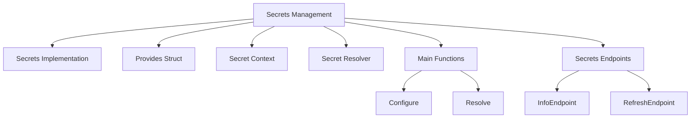

# Secrets Management Overview

Secrets refer to sensitive information such as passwords, tokens, and keys that need to be securely managed and accessed by the Datadog Agent. The <SwmToken path="comp/core/secrets/secretsimpl/secrets.go" pos="6:4:4" line-data="// Package secretsimpl is the implementation for the secrets component">`secretsimpl`</SwmToken> package provides the implementation for handling secrets within the Datadog Agent. It includes functionalities for fetching, managing, and refreshing secrets.

<SwmSnippet path="/comp/core/secrets/secretsimpl/secrets.go" line="42">

---

# Provides Struct

The <SwmToken path="comp/core/secrets/secretsimpl/secrets.go" pos="42:2:2" line-data="type provides struct {">`provides`</SwmToken> struct defines the components and endpoints related to secrets, such as <SwmToken path="comp/core/secrets/secretsimpl/secrets.go" pos="45:3:5" line-data="	Comp            secrets.Component">`secrets.Component`</SwmToken>, <SwmToken path="comp/core/secrets/secretsimpl/secrets.go" pos="46:3:5" line-data="	FlareProvider   flaretypes.Provider">`flaretypes.Provider`</SwmToken>, and <SwmToken path="comp/core/secrets/secretsimpl/secrets.go" pos="47:3:5" line-data="	InfoEndpoint    api.AgentEndpointProvider">`api.AgentEndpointProvider`</SwmToken>.

```go
type provides struct {
	fx.Out

	Comp            secrets.Component
	FlareProvider   flaretypes.Provider
	InfoEndpoint    api.AgentEndpointProvider
	RefreshEndpoint api.AgentEndpointProvider
}
```

---

</SwmSnippet>

<SwmSnippet path="/comp/core/secrets/secretsimpl/secrets.go" line="64">

---

# Secret Context

The <SwmToken path="comp/core/secrets/secretsimpl/secrets.go" pos="64:2:2" line-data="type secretContext struct {">`secretContext`</SwmToken> type is used to store the origin and path of a secret within the configuration, helping to track where each secret is used.

```go
type secretContext struct {
	// origin is the configuration name where a handle was found
	origin string
	// path is the key associated with the secret in the YAML configuration,
	// represented as a list of field names
	// Example: in this yaml: '{"service": {"token": "ENC[my_token]"}}', ['service', 'token'] is the path and 'my_token' is the handle.
	path []string
}
```

---

</SwmSnippet>

<SwmSnippet path="/comp/core/secrets/secretsimpl/secrets.go" line="81">

---

# Secret Resolver

The <SwmToken path="comp/core/secrets/secretsimpl/secrets.go" pos="204:6:6" line-data="func (r *secretResolver) Configure(params secrets.ConfigParams) {">`secretResolver`</SwmToken> struct includes various fields and methods for resolving secrets, such as <SwmToken path="comp/core/secrets/secretsimpl/secrets.go" pos="83:1:1" line-data="	backendCommand          string">`backendCommand`</SwmToken>, <SwmToken path="comp/core/secrets/secretsimpl/secrets.go" pos="84:1:1" line-data="	backendArguments        []string">`backendArguments`</SwmToken>, and <SwmToken path="comp/core/secrets/secretsimpl/secrets.go" pos="102:1:1" line-data="	fetchHookFunc   func([]string) (map[string]string, error)">`fetchHookFunc`</SwmToken>.

```go
	origin handleToContext

	backendCommand          string
	backendArguments        []string
	backendTimeout          int
	commandAllowGroupExec   bool
	removeTrailingLinebreak bool
	// responseMaxSize defines max size of the JSON output from a secrets reader backend
	responseMaxSize int
	// refresh secrets at a regular interval
	refreshInterval time.Duration
	ticker          *time.Ticker
	// filename to write audit records to
	auditFilename    string
	auditFileMaxSize int
	auditRotRecs     *rotatingNDRecords
	// subscriptions want to be notified about changes to the secrets
	subscriptions []secrets.SecretChangeCallback

	// can be overridden for testing purposes
	commandHookFunc func(string) ([]byte, error)
```

---

</SwmSnippet>

# Main Functions

The main functions in the <SwmToken path="comp/core/secrets/secretsimpl/secrets.go" pos="6:4:4" line-data="// Package secretsimpl is the implementation for the secrets component">`secretsimpl`</SwmToken> package are <SwmToken path="comp/core/secrets/secretsimpl/secrets.go" pos="203:2:2" line-data="// Configure initializes the executable command and other options of the secrets component">`Configure`</SwmToken> and <SwmToken path="comp/core/secrets/secretsimpl/secrets.go" pos="264:2:2" line-data="// Resolve replaces all encoded secrets in data by executing &quot;secret_backend_command&quot; once if all secrets aren&#39;t">`Resolve`</SwmToken>. These functions are essential for initializing and resolving secrets.

<SwmSnippet path="/comp/core/secrets/secretsimpl/secrets.go" line="203">

---

## Configure

The <SwmToken path="comp/core/secrets/secretsimpl/secrets.go" pos="203:2:2" line-data="// Configure initializes the executable command and other options of the secrets component">`Configure`</SwmToken> function initializes the executable command and other options of the secrets component. It sets parameters such as the backend command, arguments, timeout, response max size, refresh interval, and audit file settings.

```go
// Configure initializes the executable command and other options of the secrets component
func (r *secretResolver) Configure(params secrets.ConfigParams) {
	if !r.enabled {
		return
	}
	r.backendCommand = params.Command
	r.backendArguments = params.Arguments
	r.backendTimeout = params.Timeout
	if r.backendTimeout == 0 {
		r.backendTimeout = SecretBackendTimeoutDefault
	}
	r.responseMaxSize = params.MaxSize
	if r.responseMaxSize == 0 {
		r.responseMaxSize = SecretBackendOutputMaxSizeDefault
	}
	r.refreshInterval = time.Duration(params.RefreshInterval) * time.Second
	r.commandAllowGroupExec = params.GroupExecPerm
	r.removeTrailingLinebreak = params.RemoveLinebreak
	if r.commandAllowGroupExec {
		log.Warnf("Agent configuration relax permissions constraint on the secret backend cmd, Group can read and exec")
	}
```

---

</SwmSnippet>

<SwmSnippet path="/comp/core/secrets/secretsimpl/secrets.go" line="264">

---

## Resolve

The <SwmToken path="comp/core/secrets/secretsimpl/secrets.go" pos="264:2:2" line-data="// Resolve replaces all encoded secrets in data by executing &quot;secret_backend_command&quot; once if all secrets aren&#39;t">`Resolve`</SwmToken> function replaces all encoded secrets in the provided data by executing the backend command if the secrets are not already present in the cache. It processes the configuration data, collects new secret handles, and updates the cache and subscriptions with the resolved secrets.

```go
// Resolve replaces all encoded secrets in data by executing "secret_backend_command" once if all secrets aren't
// present in the cache.
func (r *secretResolver) Resolve(data []byte, origin string) ([]byte, error) {
	r.lock.Lock()
	defer r.lock.Unlock()

	if !r.enabled {
		log.Infof("Agent secrets is disabled by caller")
		return nil, nil
	}
	if data == nil || r.backendCommand == "" {
		return data, nil
	}

	var config interface{}
	err := yaml.Unmarshal(data, &config)
	if err != nil {
		return nil, fmt.Errorf("could not Unmarshal config: %s", err)
	}

	// First we collect all new handles in the config
```

---

</SwmSnippet>

# Secrets Endpoints

The <SwmToken path="comp/core/secrets/secretsimpl/secrets.go" pos="6:4:4" line-data="// Package secretsimpl is the implementation for the secrets component">`secretsimpl`</SwmToken> package provides two main endpoints for managing secrets: <SwmToken path="comp/core/secrets/secretsimpl/secrets.go" pos="47:1:1" line-data="	InfoEndpoint    api.AgentEndpointProvider">`InfoEndpoint`</SwmToken> and <SwmToken path="comp/core/secrets/secretsimpl/secrets.go" pos="48:1:1" line-data="	RefreshEndpoint api.AgentEndpointProvider">`RefreshEndpoint`</SwmToken>.

<SwmSnippet path="/comp/core/secrets/secretsimpl/secrets.go" line="47">

---

## <SwmToken path="comp/core/secrets/secretsimpl/secrets.go" pos="47:1:1" line-data="	InfoEndpoint    api.AgentEndpointProvider">`InfoEndpoint`</SwmToken>

The <SwmToken path="comp/core/secrets/secretsimpl/secrets.go" pos="47:1:1" line-data="	InfoEndpoint    api.AgentEndpointProvider">`InfoEndpoint`</SwmToken> is an endpoint provided by the <SwmToken path="comp/core/secrets/secretsimpl/secrets.go" pos="47:3:5" line-data="	InfoEndpoint    api.AgentEndpointProvider">`api.AgentEndpointProvider`</SwmToken> that exposes debug information about secrets. This endpoint is used to gather and display information about the secrets managed by the Datadog Agent.

```go
	InfoEndpoint    api.AgentEndpointProvider
	RefreshEndpoint api.AgentEndpointProvider
```

---

</SwmSnippet>

<SwmSnippet path="/comp/core/secrets/secretsimpl/secrets.go" line="48">

---

## <SwmToken path="comp/core/secrets/secretsimpl/secrets.go" pos="48:1:1" line-data="	RefreshEndpoint api.AgentEndpointProvider">`RefreshEndpoint`</SwmToken>

The <SwmToken path="comp/core/secrets/secretsimpl/secrets.go" pos="48:1:1" line-data="	RefreshEndpoint api.AgentEndpointProvider">`RefreshEndpoint`</SwmToken> is another endpoint provided by the <SwmToken path="comp/core/secrets/secretsimpl/secrets.go" pos="48:3:5" line-data="	RefreshEndpoint api.AgentEndpointProvider">`api.AgentEndpointProvider`</SwmToken>. This endpoint is responsible for refreshing the secrets by fetching them from the backend again. It ensures that the secrets are up-to-date and securely managed.

```go
	RefreshEndpoint api.AgentEndpointProvider
}
```

---

</SwmSnippet>

&nbsp;

*This is an auto-generated document by Swimm AI 🌊 and has not yet been verified by a human*

<SwmMeta version="3.0.0" repo-id="Z2l0aHViJTNBJTNBZGF0YWRvZy1hZ2VudCUzQSUzQVN3aW1tLURlbW8=" repo-name="datadog-agent"><sup>Powered by [Swimm](/)</sup></SwmMeta>
