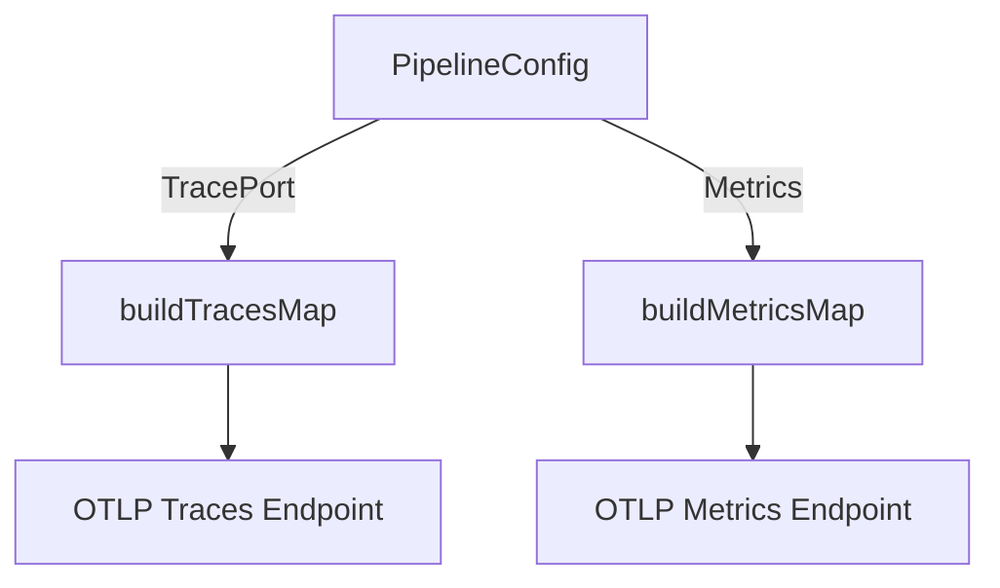

# Overview

The <SwmToken path="comp/otelcol/otlp/otlp.go" pos="6:4:4" line-data="// Package otlp contains structures which aid in constructing an OpenTelemetry Collector">`otlp`</SwmToken> package is responsible for handling telemetry signals from external software in the OTLP format on any supported protocol, such as <SwmPath>[pkg/proto/protodep/google/protobuf/](pkg/proto/protodep/google/protobuf/)</SwmPath>, HTTP/JSON, and <SwmPath>[pkg/proto/protodep/google/protobuf/](pkg/proto/protodep/google/protobuf/)</SwmPath>. It contains structures that aid in constructing an <SwmToken path="comp/otelcol/otlp/otlp.go" pos="6:20:20" line-data="// Package otlp contains structures which aid in constructing an OpenTelemetry Collector">`OpenTelemetry`</SwmToken> Collector to be embedded into the Datadog Agent.

<SwmSnippet path="/comp/otelcol/otlp/otlp.go" line="6">

---

# Package Structure

The <SwmToken path="comp/otelcol/otlp/otlp.go" pos="6:4:4" line-data="// Package otlp contains structures which aid in constructing an OpenTelemetry Collector">`otlp`</SwmToken> package contains structures which aid in constructing an <SwmToken path="comp/otelcol/otlp/otlp.go" pos="6:20:20" line-data="// Package otlp contains structures which aid in constructing an OpenTelemetry Collector">`OpenTelemetry`</SwmToken> Collector to be embedded into the Datadog Agent.

```go
// Package otlp contains structures which aid in constructing an OpenTelemetry Collector
// to be embedded into the Datadog Agent.
package otlp
```

---

</SwmSnippet>

<SwmSnippet path="/comp/otelcol/otlp/collector.go" line="254">

---

# Running the OTLP Pipeline

The <SwmToken path="comp/otelcol/otlp/collector.go" pos="254:2:2" line-data="// Run the OTLP pipeline.">`Run`</SwmToken> method in the <SwmToken path="comp/otelcol/otlp/collector.go" pos="254:6:6" line-data="// Run the OTLP pipeline.">`OTLP`</SwmToken> package runs the OTLP pipeline. It uses the <SwmToken path="comp/otelcol/otlp/collector.go" pos="256:3:3" line-data="	defer recoverAndStoreError()">`recoverAndStoreError`</SwmToken> function to handle any errors that occur during execution.

```go
// Run the OTLP pipeline.
func (p *Pipeline) Run(ctx context.Context) error {
	defer recoverAndStoreError()
	return p.col.Run(ctx)
}
```

---

</SwmSnippet>

<SwmSnippet path="/comp/otelcol/otlp/collector.go" line="246">

---

The <SwmToken path="comp/otelcol/otlp/collector.go" pos="246:2:2" line-data="func recoverAndStoreError() {">`recoverAndStoreError`</SwmToken> function handles errors that occur during the execution of the OTLP pipeline by recovering from panics and storing the error.

```go
func recoverAndStoreError() {
	if r := recover(); r != nil {
		err := fmt.Errorf("OTLP pipeline had a panic: %v", r)
		pipelineError.Store(err)
		log.Errorf(err.Error())
	}
}
```

---

</SwmSnippet>

# OTLP Endpoints

The <SwmToken path="comp/otelcol/otlp/otlp.go" pos="6:4:4" line-data="// Package otlp contains structures which aid in constructing an OpenTelemetry Collector">`otlp`</SwmToken> package defines endpoints for traces and metrics. These endpoints are configured using the <SwmToken path="comp/otelcol/otlp/map_provider.go" pos="25:6:6" line-data="func buildTracesMap(cfg PipelineConfig) (*confmap.Conf, error) {">`PipelineConfig`</SwmToken> and are essential for directing telemetry data to the appropriate destinations.

<SwmSnippet path="/comp/otelcol/otlp/map_provider.go" line="25">

---

## <SwmToken path="comp/otelcol/otlp/map_provider.go" pos="25:2:2" line-data="func buildTracesMap(cfg PipelineConfig) (*confmap.Conf, error) {">`buildTracesMap`</SwmToken>

The <SwmToken path="comp/otelcol/otlp/map_provider.go" pos="25:2:2" line-data="func buildTracesMap(cfg PipelineConfig) (*confmap.Conf, error) {">`buildTracesMap`</SwmToken> function constructs a configuration map for traces. It sets the OTLP endpoint for traces using the <SwmToken path="comp/otelcol/otlp/map_provider.go" pos="31:38:38" line-data="		buildKey(&quot;exporters&quot;, &quot;otlp&quot;, &quot;endpoint&quot;): fmt.Sprintf(&quot;%s:%d&quot;, &quot;localhost&quot;, cfg.TracePort),">`TracePort`</SwmToken> from the <SwmToken path="comp/otelcol/otlp/map_provider.go" pos="25:6:6" line-data="func buildTracesMap(cfg PipelineConfig) (*confmap.Conf, error) {">`PipelineConfig`</SwmToken>.

```go
func buildTracesMap(cfg PipelineConfig) (*confmap.Conf, error) {
	baseMap, err := configutils.NewMapFromYAMLString(defaultTracesConfig)
	if err != nil {
		return nil, err
	}
	smap := map[string]interface{}{
		buildKey("exporters", "otlp", "endpoint"): fmt.Sprintf("%s:%d", "localhost", cfg.TracePort),
	}
	{
		configMap := confmap.NewFromStringMap(smap)
		err = baseMap.Merge(configMap)
	}
	return baseMap, err
```

---

</SwmSnippet>

<SwmSnippet path="/comp/otelcol/otlp/map_provider.go" line="40">

---

## <SwmToken path="comp/otelcol/otlp/map_provider.go" pos="40:2:2" line-data="func buildMetricsMap(cfg PipelineConfig) (*confmap.Conf, error) {">`buildMetricsMap`</SwmToken>

The <SwmToken path="comp/otelcol/otlp/map_provider.go" pos="40:2:2" line-data="func buildMetricsMap(cfg PipelineConfig) (*confmap.Conf, error) {">`buildMetricsMap`</SwmToken> function creates a configuration map for metrics. It uses the <SwmToken path="comp/otelcol/otlp/map_provider.go" pos="46:14:14" line-data="		buildKey(&quot;exporters&quot;, &quot;serializer&quot;, &quot;metrics&quot;): cfg.Metrics,">`metrics`</SwmToken> field from the <SwmToken path="comp/otelcol/otlp/map_provider.go" pos="40:6:6" line-data="func buildMetricsMap(cfg PipelineConfig) (*confmap.Conf, error) {">`PipelineConfig`</SwmToken> to set the metrics endpoint.

```go
func buildMetricsMap(cfg PipelineConfig) (*confmap.Conf, error) {
	baseMap, err := configutils.NewMapFromYAMLString(defaultMetricsConfig)
	if err != nil {
		return nil, err
	}
	smap := map[string]interface{}{
		buildKey("exporters", "serializer", "metrics"): cfg.Metrics,
	}
	{
		configMap := confmap.NewFromStringMap(smap)
		err = baseMap.Merge(configMap)
	}
	return baseMap, err
```

---

</SwmSnippet>

&nbsp;

*This is an auto-generated document by Swimm AI 🌊 and has not yet been verified by a human*

<SwmMeta version="3.0.0" repo-id="Z2l0aHViJTNBJTNBZGF0YWRvZy1hZ2VudCUzQSUzQVN3aW1tLURlbW8=" repo-name="datadog-agent"><sup>Powered by [Swimm](/)</sup></SwmMeta>
