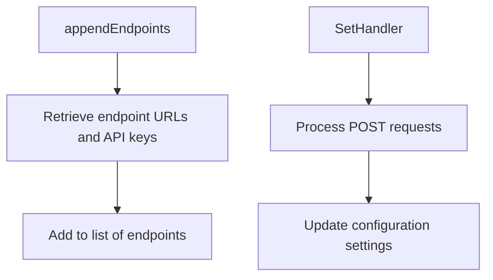

# Overview

Trace configuration in the Datadog Agent involves setting up various parameters and settings that control the behavior of the trace component. This includes logging, memory and CPU limits, and runtime configurations. The configuration is managed through a combination of core configuration components and specific trace configuration settings.

<SwmSnippet path="/comp/trace/config/config.go" line="35">

---

# Config Structure

The <SwmToken path="comp/trace/config/config.go" pos="35:2:2" line-data="// cfg implements the Component.">`cfg`</SwmToken> struct acts as a wrapper around the trace configuration, integrating it with the core configuration. This struct includes the <SwmToken path="comp/trace/config/config.go" pos="39:2:4" line-data="	*traceconfig.AgentConfig">`traceconfig.AgentConfig`</SwmToken>, which contains the trace-specific configuration settings.

```go
// cfg implements the Component.
type cfg struct {
	// this component is currently implementing a thin wrapper around pkg/trace/config,
	// and uses globals in that package.
	*traceconfig.AgentConfig

	// coreConfig relates to the main agent config component
	coreConfig coreconfig.Component

	// warnings are the warnings generated during setup
	warnings *pkgconfig.Warnings
}
```

---

</SwmSnippet>

<SwmSnippet path="/comp/trace/config/config.go" line="48">

---

# Core Configuration Integration

The <SwmToken path="comp/trace/config/config.go" pos="48:2:2" line-data="func newConfig(deps dependencies) (Component, error) {">`newConfig`</SwmToken> function initializes the configuration by setting up the trace configuration and integrating it with the core configuration. This function also handles errors related to missing API keys.

```go
func newConfig(deps dependencies) (Component, error) {
	tracecfg, err := setupConfig(deps, "")

	if err != nil {
		// Allow main Agent to start with missing API key
		if !(err == traceconfig.ErrMissingAPIKey && !deps.Params.FailIfAPIKeyMissing) {
			return nil, err
		}
	}

	c := cfg{
		AgentConfig: tracecfg,
		coreConfig:  deps.Config,
	}
```

---

</SwmSnippet>

# Dynamic Configuration Updates

Handlers are provided to get and set runtime configurations, allowing dynamic updates to the trace settings. This ensures that the trace configuration can be adjusted without restarting the agent.

# Main Functions

Several main functions are involved in trace configuration, including <SwmToken path="comp/trace/config/config.go" pos="48:2:2" line-data="func newConfig(deps dependencies) (Component, error) {">`newConfig`</SwmToken>, <SwmToken path="comp/trace/config/config.go" pos="62:3:3" line-data="	c.SetMaxMemCPU(pkgconfig.IsContainerized())">`SetMaxMemCPU`</SwmToken>, and <SwmToken path="comp/trace/config/config.go" pos="106:2:2" line-data="// GetConfigHandler returns handler to get the runtime configuration.">`GetConfigHandler`</SwmToken>. Below, we dive into the details of <SwmToken path="comp/trace/config/config.go" pos="48:2:2" line-data="func newConfig(deps dependencies) (Component, error) {">`newConfig`</SwmToken> and <SwmToken path="comp/trace/config/config.go" pos="62:3:3" line-data="	c.SetMaxMemCPU(pkgconfig.IsContainerized())">`SetMaxMemCPU`</SwmToken>.

<SwmSnippet path="/comp/trace/config/config.go" line="48">

---

## <SwmToken path="comp/trace/config/config.go" pos="48:2:2" line-data="func newConfig(deps dependencies) (Component, error) {">`newConfig`</SwmToken>

The <SwmToken path="comp/trace/config/config.go" pos="48:2:2" line-data="func newConfig(deps dependencies) (Component, error) {">`newConfig`</SwmToken> function initializes a new configuration instance by setting up the trace configuration and integrating it with the core configuration. It also sets memory and CPU limits based on whether the agent is containerized.

```go
func newConfig(deps dependencies) (Component, error) {
	tracecfg, err := setupConfig(deps, "")

	if err != nil {
		// Allow main Agent to start with missing API key
		if !(err == traceconfig.ErrMissingAPIKey && !deps.Params.FailIfAPIKeyMissing) {
			return nil, err
		}
	}

	c := cfg{
		AgentConfig: tracecfg,
		coreConfig:  deps.Config,
	}
	c.SetMaxMemCPU(pkgconfig.IsContainerized())

	return &c, nil
}
```

---

</SwmSnippet>

<SwmSnippet path="/comp/trace/config/config.go" line="143">

---

## <SwmToken path="comp/trace/config/config.go" pos="143:9:9" line-data="func (c *cfg) SetMaxMemCPU(isContainerized bool) {">`SetMaxMemCPU`</SwmToken>

The <SwmToken path="comp/trace/config/config.go" pos="143:9:9" line-data="func (c *cfg) SetMaxMemCPU(isContainerized bool) {">`SetMaxMemCPU`</SwmToken> function sets the maximum memory and CPU usage parameters for the trace agent. If the agent is running in a container, these limits are disabled by default, as resource management is handled by the container runtime.

```go
func (c *cfg) SetMaxMemCPU(isContainerized bool) {
	if c.coreConfig.Object().IsSet("apm_config.max_cpu_percent") {
		c.MaxCPU = c.coreConfig.Object().GetFloat64("apm_config.max_cpu_percent") / 100
	} else if isContainerized {
		log.Debug("Running in a container and apm_config.max_cpu_percent is not set, setting it to 0")
		c.MaxCPU = 0
	}

	if c.coreConfig.Object().IsSet("apm_config.max_memory") {
		c.MaxMemory = c.coreConfig.Object().GetFloat64("apm_config.max_memory")
	} else if isContainerized {
		log.Debug("Running in a container and apm_config.max_memory is not set, setting it to 0")
		c.MaxMemory = 0
	}
}
```

---

</SwmSnippet>

<SwmSnippet path="/comp/trace/config/config.go" line="106">

---

## <SwmToken path="comp/trace/config/config.go" pos="106:2:2" line-data="// GetConfigHandler returns handler to get the runtime configuration.">`GetConfigHandler`</SwmToken>

The <SwmToken path="comp/trace/config/config.go" pos="106:2:2" line-data="// GetConfigHandler returns handler to get the runtime configuration.">`GetConfigHandler`</SwmToken> function returns an HTTP handler that allows fetching the current runtime configuration. This handler validates the request method and marshals the configuration settings into a YAML response.

```go
// GetConfigHandler returns handler to get the runtime configuration.
func (c *cfg) GetConfigHandler() http.Handler {
	return http.HandlerFunc(func(w http.ResponseWriter, req *http.Request) {
		if req.Method != http.MethodGet {
			httpError(w,
				http.StatusMethodNotAllowed,
				fmt.Errorf("%s method not allowed, only %s", req.Method, http.MethodGet),
			)
			return
		}

		if apiutil.Validate(w, req) != nil {
			return
		}

		runtimeConfig, err := yaml.Marshal(c.coreConfig.AllSettings())
		if err != nil {
			log.Errorf("Unable to marshal runtime config response: %s", err)
			body, _ := json.Marshal(map[string]string{"error": err.Error()})
			http.Error(w, string(body), http.StatusInternalServerError)
			return
```

---

</SwmSnippet>

# Config Endpoints

Config endpoints are used to manage the trace configuration dynamically. Below are details of the <SwmToken path="comp/trace/config/setup.go" pos="126:2:2" line-data="// appendEndpoints appends any endpoint configuration found at the given cfgKey.">`appendEndpoints`</SwmToken> and <SwmToken path="comp/trace/config/config.go" pos="75:2:2" line-data="// SetHandler returns a handler to change the runtime configuration.">`SetHandler`</SwmToken> functions.

<SwmSnippet path="/comp/trace/config/setup.go" line="126">

---

## <SwmToken path="comp/trace/config/setup.go" pos="126:2:2" line-data="// appendEndpoints appends any endpoint configuration found at the given cfgKey.">`appendEndpoints`</SwmToken>

The <SwmToken path="comp/trace/config/setup.go" pos="126:2:2" line-data="// appendEndpoints appends any endpoint configuration found at the given cfgKey.">`appendEndpoints`</SwmToken> function appends any endpoint configuration found at the given <SwmToken path="comp/trace/config/setup.go" pos="126:20:20" line-data="// appendEndpoints appends any endpoint configuration found at the given cfgKey.">`cfgKey`</SwmToken>. It retrieves the endpoint URLs and their associated API keys from the configuration and adds them to the list of endpoints.

```go
// appendEndpoints appends any endpoint configuration found at the given cfgKey.
// The format for cfgKey should be a map which has the URL as a key and one or
// more API keys as an array value.
func appendEndpoints(endpoints []*config.Endpoint, cfgKey string) []*config.Endpoint {
	if !coreconfig.Datadog().IsSet(cfgKey) {
		return endpoints
	}
	for url, keys := range coreconfig.Datadog().GetStringMapStringSlice(cfgKey) {
		if len(keys) == 0 {
			log.Errorf("'%s' entries must have at least one API key present", cfgKey)
			continue
		}
		for _, key := range keys {
			endpoints = append(endpoints, &config.Endpoint{Host: url, APIKey: utils.SanitizeAPIKey(key)})
		}
	}
	return endpoints
}
```

---

</SwmSnippet>

<SwmSnippet path="/comp/trace/config/config.go" line="75">

---

## <SwmToken path="comp/trace/config/config.go" pos="75:2:2" line-data="// SetHandler returns a handler to change the runtime configuration.">`SetHandler`</SwmToken>

The <SwmToken path="comp/trace/config/config.go" pos="75:2:2" line-data="// SetHandler returns a handler to change the runtime configuration.">`SetHandler`</SwmToken> function returns an HTTP handler that allows changing the runtime configuration. It processes POST requests to update specific configuration settings, such as the log level.

```go
// SetHandler returns a handler to change the runtime configuration.
func (c *cfg) SetHandler() http.Handler {
	return http.HandlerFunc(func(w http.ResponseWriter, req *http.Request) {
		if req.Method != http.MethodPost {
			httpError(w, http.StatusMethodNotAllowed, fmt.Errorf("%s method not allowed, only %s", req.Method, http.MethodPost))
			return
		}
		for key, values := range req.URL.Query() {
			if len(values) == 0 {
				continue
			}
			value := html.UnescapeString(values[len(values)-1])
			switch key {
			case "log_level":
				lvl := strings.ToLower(value)
				if lvl == "warning" {
					lvl = "warn"
				}
				if err := pkgconfig.ChangeLogLevel(lvl); err != nil {
					httpError(w, http.StatusInternalServerError, err)
					return
```

---

</SwmSnippet>

&nbsp;

*This is an auto-generated document by Swimm AI 🌊 and has not yet been verified by a human*

<SwmMeta version="3.0.0" repo-id="Z2l0aHViJTNBJTNBZGF0YWRvZy1hZ2VudCUzQSUzQVN3aW1tLURlbW8=" repo-name="datadog-agent"><sup>Powered by [Swimm](/)</sup></SwmMeta>
