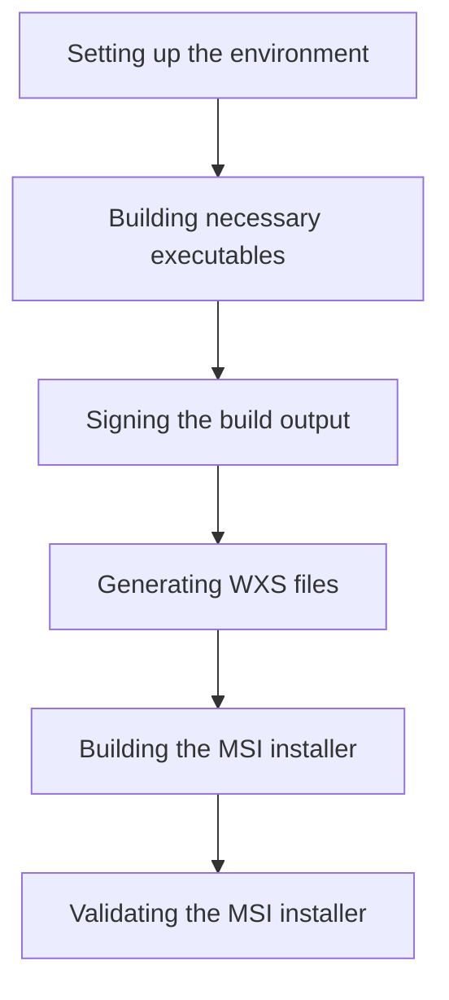

This document will cover the process of building the MSI installer for the Datadog Agent, which includes:

1. Setting up the environment
2. Building necessary executables
3. Signing the build output
4. Generating WXS files
5. Building and validating the MSI installer.

Technical document: <SwmLink doc-title="Building the MSI Installer">[Building the MSI Installer](/.swm/building-the-msi-installer.6kzro17u.sw.md)</SwmLink>

# [Setting up the environment](https://app.swimm.io/repos/Z2l0aHViJTNBJTNBZGF0YWRvZy1hZ2VudCUzQSUzQVN3aW1tLURlbW8=/docs/6kzro17u#setting-up-the-environment)

The first step in building the MSI installer is to set up the environment. This involves configuring the necessary settings and dependencies required for the build process. This step ensures that all the tools and libraries needed for building the MSI installer are available and correctly configured.

# [Building necessary executables](https://app.swimm.io/repos/Z2l0aHViJTNBJTNBZGF0YWRvZy1hZ2VudCUzQSUzQVN3aW1tLURlbW8=/docs/6kzro17u#building-necessary-executables)

Once the environment is set up, the next step is to build the necessary executables. These executables are essential components that will be included in the MSI installer. This step ensures that all the required binaries are compiled and ready for inclusion in the installer.

# [Signing the build output](https://app.swimm.io/repos/Z2l0aHViJTNBJTNBZGF0YWRvZy1hZ2VudCUzQSUzQVN3aW1tLURlbW8=/docs/6kzro17u#signing-the-build-output)

After building the executables, the next step is to sign the build output. Signing the build output is a security measure that ensures the integrity and authenticity of the files included in the MSI installer. This step involves applying a digital signature to the files, which helps to prevent tampering and ensures that the files are from a trusted source.

# [Generating WXS files](https://app.swimm.io/repos/Z2l0aHViJTNBJTNBZGF0YWRvZy1hZ2VudCUzQSUzQVN3aW1tLURlbW8=/docs/6kzro17u#generating-wxs-files)

The next step is to generate the WXS files. WXS files are XML files used by the Windows Installer XML (WiX) toolset to define the structure and content of the MSI installer. This step involves creating these files based on the configuration and components that need to be included in the installer.

# [Building the MSI installer](https://app.swimm.io/repos/Z2l0aHViJTNBJTNBZGF0YWRvZy1hZ2VudCUzQSUzQVN3aW1tLURlbW8=/docs/6kzro17u#building-the-msi-installer)

With the WXS files generated, the next step is to build the MSI installer. This involves running the build command that compiles the WXS files into a final MSI installer. This step ensures that all the components and configurations are correctly packaged into the installer.

# [Validating the MSI installer](https://app.swimm.io/repos/Z2l0aHViJTNBJTNBZGF0YWRvZy1hZ2VudCUzQSUzQVN3aW1tLURlbW8=/docs/6kzro17u#validating-the-msi-installer)

The final step in the process is to validate the MSI installer. This involves checking the installer to ensure that it meets certain criteria and does not contain any errors. This step is crucial for ensuring that the installer works correctly and does not cause any issues during installation.

&nbsp;

*This is an auto-generated document by Swimm AI 🌊 and has not yet been verified by a human*

<SwmMeta version="3.0.0" repo-id="Z2l0aHViJTNBJTNBZGF0YWRvZy1hZ2VudCUzQSUzQVN3aW1tLURlbW8=" repo-name="datadog-agent">Powered by [Swimm](/)</SwmMeta>
