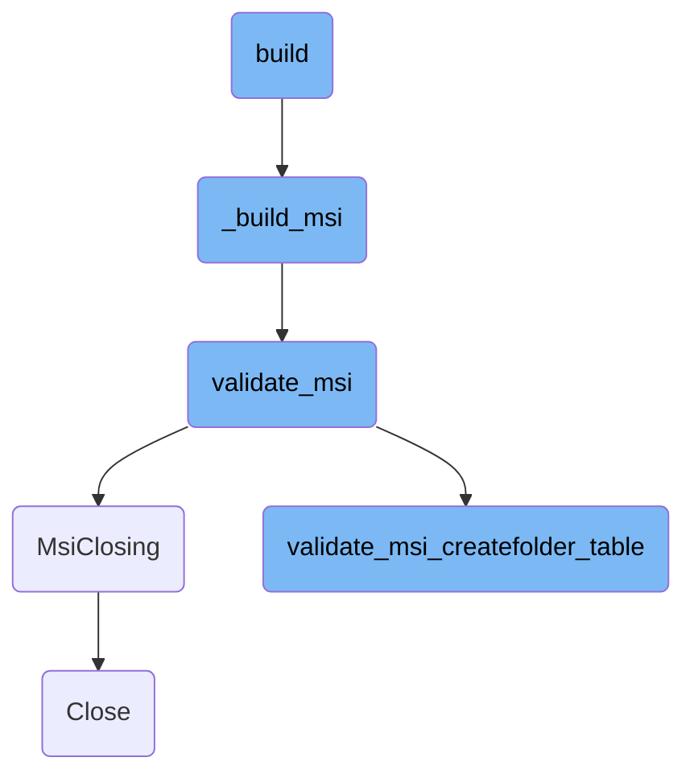

In this document, we will explain the process of building the MSI installer for the Datadog Agent. The process involves setting up the environment, building necessary executables, signing the build output, generating WXS files, and finally building and validating the MSI installer.

The build process starts by setting up the environment and configuration. Then, it builds the necessary executables and signs the build output. After that, it generates the WXS files and runs the build command to create the MSI installer. The MSI file is then validated to ensure it meets certain criteria, and finally, the MSI database object is properly closed to prevent file corruption.

# Flow drill down



<SwmSnippet path="/tasks/msi.py" line="264">

---

## Building the MSI installer

The <SwmToken path="tasks/msi.py" pos="264:2:2" line-data="def build(">`build`</SwmToken> function is responsible for building the MSI installer for the Datadog Agent. It sets up the environment, builds the necessary executables, signs the build output, generates the WXS files, and finally builds the MSI installer. This function orchestrates the entire build process and ensures that the MSI installer is correctly generated and placed in the final output path.

```python
def build(
    ctx, vstudio_root=None, arch="x64", major_version='7', python_runtimes='3', release_version='nightly', debug=False
):
    """
    Build the MSI installer for the agent
    """
    env = _get_env(ctx, major_version, python_runtimes, release_version)
    configuration = _msbuild_configuration(debug=debug)
    build_outdir = build_out_dir(arch, configuration)

    # Build the builder executable (WixSetup.exe)
    _build(
        ctx,
        env,
        configuration=configuration,
        vstudio_root=vstudio_root,
    )

    # sign build output that will be included in the installer MSI
    sign_file(ctx, os.path.join(build_outdir, 'CustomActions.dll'))

```

---

</SwmSnippet>

<SwmSnippet path="/tasks/msi.py" line="244">

---

## Running the MSI build command

The <SwmToken path="tasks/msi.py" pos="244:2:2" line-data="def _build_msi(ctx, env, outdir, name, allowlist):">`_build_msi`</SwmToken> function runs the generated build command to build the MSI. It validates the MSI and signs the output file. This function is crucial for converting the WXS files into a final MSI installer.

```python
def _build_msi(ctx, env, outdir, name, allowlist):
    # Run the generated build command to build the MSI
    build_cmd = os.path.join(outdir, f"Build_{name}.cmd")
    if not os.path.exists(build_cmd):
        raise Exit(f"MSI build script not found: {build_cmd}")

    succeeded = ctx.run(
        f'cd {BUILD_SOURCE_DIR}\\WixSetup && {build_cmd}',
        warn=True,
        env=env,
    )
    if not succeeded:
        raise Exit("Failed to build the MSI installer.", code=1)

    out_file = os.path.join(outdir, f"{name}.msi")
    validate_msi(ctx, allowlist, out_file)
    sign_file(ctx, out_file)
```

---

</SwmSnippet>

<SwmSnippet path="/tasks/msi.py" line="418">

---

## Validating the MSI

The <SwmToken path="tasks/msi.py" pos="419:2:2" line-data="def validate_msi(_, allowlist, msi=None):">`validate_msi`</SwmToken> function validates the MSI file by opening it in read-only mode and passing it to the <SwmToken path="tasks/msi.py" pos="421:1:1" line-data="        validate_msi_createfolder_table(db, allowlist)">`validate_msi_createfolder_table`</SwmToken> function. This ensures that the MSI file meets certain validation criteria before it is finalized.

```python
@task
def validate_msi(_, allowlist, msi=None):
    with MsiClosing(msilib.OpenDatabase(msi, msilib.MSIDBOPEN_READONLY)) as db:
        validate_msi_createfolder_table(db, allowlist)
```

---

</SwmSnippet>

<SwmSnippet path="/tasks/msi.py" line="425">

---

## Handling MSI closing

The <SwmToken path="tasks/msi.py" pos="425:2:2" line-data="def MsiClosing(obj):">`MsiClosing`</SwmToken> function is a context manager that ensures the MSI database object is properly closed after validation. This is important for resource management and preventing file corruption.

```python
def MsiClosing(obj):
    """
    The MSI objects use Close() instead of close() so we can't use the built-in closing()
    """
    try:
        yield obj
    finally:
        obj.Close()
```

---

</SwmSnippet>

<SwmSnippet path="/tasks/msi.py" line="384">

---

## Validating the <SwmToken path="tasks/msi.py" pos="386:7:7" line-data="    Checks that the CreateFolder MSI table only contains certain directories.">`CreateFolder`</SwmToken> table

The <SwmToken path="tasks/msi.py" pos="384:2:2" line-data="def validate_msi_createfolder_table(db, allowlist):">`validate_msi_createfolder_table`</SwmToken> function checks that the <SwmToken path="tasks/msi.py" pos="386:7:7" line-data="    Checks that the CreateFolder MSI table only contains certain directories.">`CreateFolder`</SwmToken> table in the MSI only contains certain directories. This prevents issues related to directory permissions and security during the installation and rollback processes.

```python
def validate_msi_createfolder_table(db, allowlist):
    """
    Checks that the CreateFolder MSI table only contains certain directories.

    We found that WiX# was causing directories like TARGETDIR (C:\\) and ProgramFiles64Folder
    (C:\\Program Files\\) to end up in the CrateFolder MSI table. Then because MSI.dll CreateFolder rollback
    uses the obsolete SetFileSecurityW function the AI DACL flag is removed from those directories
    on rollback.
    https://github.com/oleg-shilo/wixsharp/issues/1336

    If you think you need to add a new directory to this list, perform the following checks:
    * Ensure the directory and its parents are deleted or persisted on uninstall as expected
    * If the directory may be persisted after rollback, check if AI flag is removed and consider if that's okay or not

    TODO: We don't want the AI flag to be removed from the directories in the allow list either, but
          this behavior was also present in the original installer so leave them for now.
    """

    with MsiClosing(db.OpenView("Select Directory_ FROM CreateFolder")) as view:
        view.Execute(None)
        record = view.Fetch()
```

---

</SwmSnippet>

<SwmSnippet path="/pkg/eventmonitor/eventmonitor.go" line="160">

---

## Closing the Event Monitor

The <SwmToken path="pkg/eventmonitor/eventmonitor.go" pos="160:2:2" line-data="// Close the module">`Close`</SwmToken> function in the Event Monitor module stops event consumers, cleans up resources, and ensures that all go routines are stopped before safely closing the probe and removing <SwmToken path="pkg/eventmonitor/eventmonitor.go" pos="97:7:7" line-data="	// initialize the eBPF manager and load the programs and maps in the kernel. At this stage, the probes are not">`eBPF`</SwmToken> programs. This is essential for gracefully shutting down the Event Monitor.

```go
// Close the module
func (m *EventMonitor) Close() {
	// stop so that consumers won't receive events anymore
	m.Probe.Stop()

	// stop event consumers
	for _, em := range m.eventConsumers {
		em.Stop()
	}

	if m.GRPCServer != nil {
		m.GRPCServer.Stop()
	}

	if m.netListener != nil {
		m.netListener.Close()
	}

	m.cleanup()

	m.cancelFnc()
```

---

</SwmSnippet>

&nbsp;

*This is an auto-generated document by Swimm AI 🌊 and has not yet been verified by a human*

<SwmMeta version="3.0.0" repo-id="Z2l0aHViJTNBJTNBZGF0YWRvZy1hZ2VudCUzQSUzQVN3aW1tLURlbW8=" repo-name="datadog-agent"><sup>Powered by [Swimm](/)</sup></SwmMeta>
