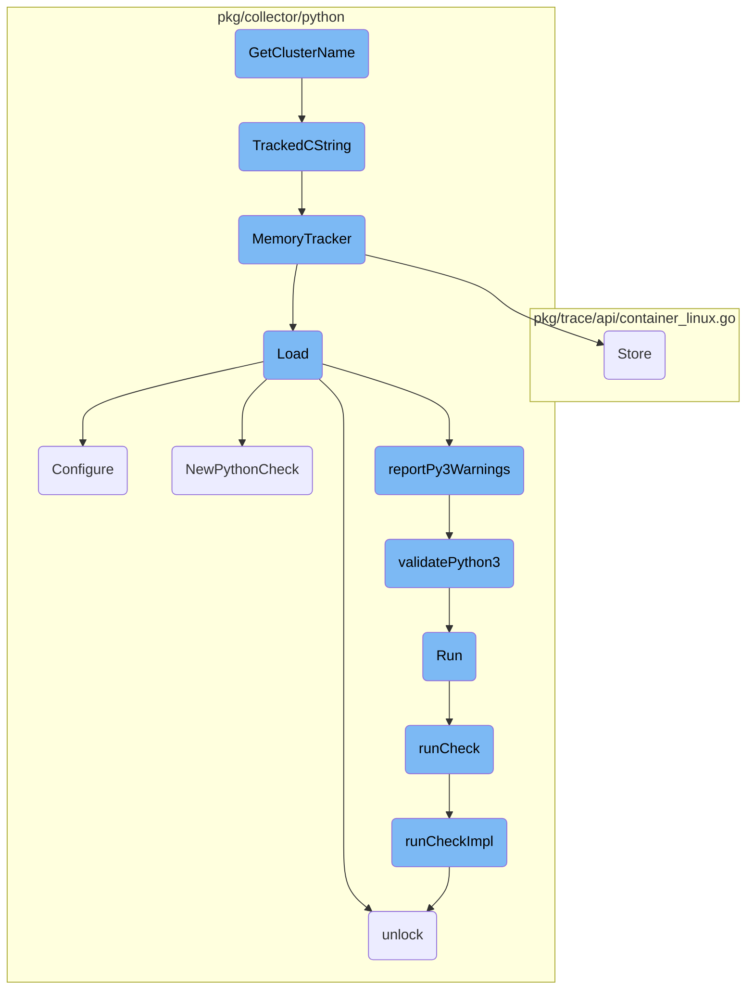
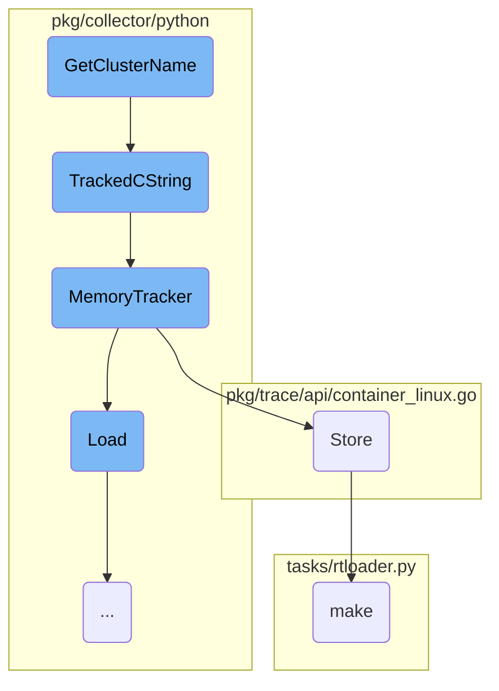
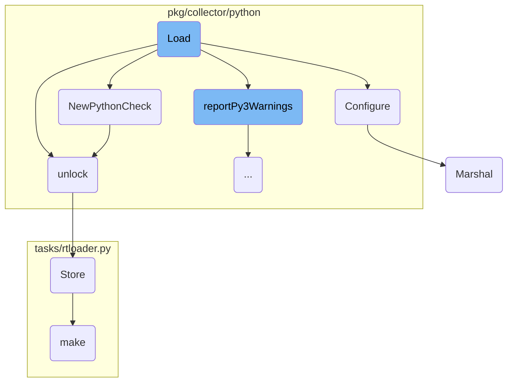
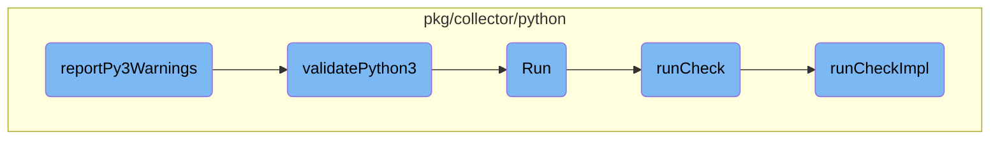

This document provides an overview of how the <SwmToken path="pkg/collector/python/datadog_agent.go" pos="61:2:2" line-data="// GetClusterName exposes the current clustername (if it exists) of the agent to Python checks.">`GetClusterName`</SwmToken> function retrieves and processes the cluster name within the system. It outlines the steps involved in obtaining the hostname, converting it to a compliant cluster name, and tracking the memory allocation.

The process starts by getting the hostname of the system. This hostname is then used to generate a cluster name that complies with specific standards. Once the cluster name is obtained, it is converted into a format that can be used by other parts of the system. Additionally, the memory used during this process is tracked to ensure efficient resource management.

Here is a high level diagram of the flow, showing only the most important functions:



# Flow drill down

First, we'll zoom into this section of the flow:



<SwmSnippet path="/pkg/collector/python/datadog_agent.go" line="61">

---

## <SwmToken path="pkg/collector/python/datadog_agent.go" pos="61:2:2" line-data="// GetClusterName exposes the current clustername (if it exists) of the agent to Python checks.">`GetClusterName`</SwmToken>

The <SwmToken path="pkg/collector/python/datadog_agent.go" pos="61:2:2" line-data="// GetClusterName exposes the current clustername (if it exists) of the agent to Python checks.">`GetClusterName`</SwmToken> function retrieves the current cluster name of the agent and exposes it to Python checks. It first obtains the hostname using <SwmToken path="pkg/collector/python/datadog_agent.go" pos="65:8:10" line-data="	goHostname, _ := hostnameUtil.Get(context.TODO())">`hostnameUtil.Get`</SwmToken>, then gets the RFC1123 compliant cluster name using <SwmToken path="pkg/collector/python/datadog_agent.go" pos="66:5:7" line-data="	goClusterName := clustername.GetRFC1123CompliantClusterName(context.TODO(), goHostname)">`clustername.GetRFC1123CompliantClusterName`</SwmToken>. Finally, it converts the cluster name to a C string using <SwmToken path="pkg/collector/python/datadog_agent.go" pos="68:6:6" line-data="	*clusterName = TrackedCString(goClusterName)">`TrackedCString`</SwmToken>.

```go
// GetClusterName exposes the current clustername (if it exists) of the agent to Python checks.
//
//export GetClusterName
func GetClusterName(clusterName **C.char) {
	goHostname, _ := hostnameUtil.Get(context.TODO())
	goClusterName := clustername.GetRFC1123CompliantClusterName(context.TODO(), goHostname)
	// clusterName will be free by rtloader when it's done with it
	*clusterName = TrackedCString(goClusterName)
}
```

---

</SwmSnippet>

<SwmSnippet path="/pkg/collector/python/memory.go" line="116">

---

## <SwmToken path="pkg/collector/python/memory.go" pos="117:2:2" line-data="func TrackedCString(str string) *C.char {">`TrackedCString`</SwmToken>

The <SwmToken path="pkg/collector/python/memory.go" pos="117:2:2" line-data="func TrackedCString(str string) *C.char {">`TrackedCString`</SwmToken> function converts a Go string to a C string and tracks its memory allocation if memory tracking is enabled. It uses <SwmToken path="pkg/collector/python/memory.go" pos="118:5:7" line-data="	cstr := C.CString(str)">`C.CString`</SwmToken> to create the C string and <SwmToken path="pkg/collector/python/memory.go" pos="122:1:1" line-data="		MemoryTracker(unsafe.Pointer(cstr), C.size_t(len(str)+1), C.DATADOG_AGENT_RTLOADER_ALLOCATION)">`MemoryTracker`</SwmToken> to track the memory allocation.

```go
//nolint:revive // TODO(AML) Fix revive linter
func TrackedCString(str string) *C.char {
	cstr := C.CString(str)

	// TODO(memory-tracking): track the origin of the string (for example check name)
	if config.Datadog().GetBool("memtrack_enabled") {
		MemoryTracker(unsafe.Pointer(cstr), C.size_t(len(str)+1), C.DATADOG_AGENT_RTLOADER_ALLOCATION)
	}

	return cstr
}
```

---

</SwmSnippet>

<SwmSnippet path="/pkg/collector/python/memory.go" line="69">

---

### <SwmToken path="pkg/collector/python/memory.go" pos="69:2:2" line-data="// MemoryTracker is the method exposed to the RTLoader for memory tracking">`MemoryTracker`</SwmToken>

The <SwmToken path="pkg/collector/python/memory.go" pos="69:2:2" line-data="// MemoryTracker is the method exposed to the RTLoader for memory tracking">`MemoryTracker`</SwmToken> function is responsible for tracking memory allocations and deallocations. It logs memory operations and updates various metrics related to memory usage. It uses a switch statement to handle allocation and deallocation operations, updating the <SwmToken path="pkg/collector/python/memory.go" pos="84:1:1" line-data="		pointerCache.Store(ptr, sz)">`pointerCache`</SwmToken> and relevant metrics accordingly.

```go
// MemoryTracker is the method exposed to the RTLoader for memory tracking
//
//export MemoryTracker
func MemoryTracker(ptr unsafe.Pointer, sz C.size_t, op C.rtloader_mem_ops_t) {
	// run sync for reliability reasons

	// This check looks redundant since the log level is also checked in pkg/util/log,
	// but from profiling, even passing these vars through as arguments allocates to the heap.
	// This is an optimization to avoid even evaluating the `Tracef` call if the trace log
	// level is not enabled.
	if log.ShouldLog(seelog.TraceLvl) {
		log.Tracef("Memory Tracker - ptr: %v, sz: %v, op: %v", ptr, sz, op)
	}
	switch op {
	case C.DATADOG_AGENT_RTLOADER_ALLOCATION:
		pointerCache.Store(ptr, sz)
		allocations.Add(1)
		tlmAllocations.Inc()
		allocatedBytes.Add(int64(sz))
		tlmAllocatedBytes.Add(float64(sz))
		inuseBytes.Add(int64(sz))
```

---

</SwmSnippet>

<SwmSnippet path="/pkg/trace/api/container_linux.go" line="346">

---

## Store

The <SwmToken path="pkg/trace/api/container_linux.go" pos="346:2:2" line-data="// Store sets data in the cache, it also clears the cache if the gcInterval has passed">`Store`</SwmToken> function sets data in a cache and clears the cache if a specified interval has passed. It locks the cache, checks if the garbage collection interval has passed, and either clears the cache or updates it with the new data.

```go
// Store sets data in the cache, it also clears the cache if the gcInterval has passed
func (c *Cache) Store(currentTime time.Time, key string, value interface{}, err error) {
	c.cacheLock.Lock()
	defer c.cacheLock.Unlock()

	if currentTime.Sub(c.gcTimestamp) > c.gcInterval {
		c.cache = make(map[string]cacheEntry, len(c.cache))
		c.gcTimestamp = currentTime
	}

	c.cache[key] = cacheEntry{value: value, timestamp: currentTime, err: err}
}
```

---

</SwmSnippet>

<SwmSnippet path="/tasks/rtloader.py" line="60">

---

## make

The <SwmToken path="tasks/rtloader.py" pos="60:2:2" line-data="def make(ctx, install_prefix=None, python_runtimes=&#39;3&#39;, cmake_options=&#39;&#39;):">`make`</SwmToken> function in <SwmPath>[tasks/rtloader.py](tasks/rtloader.py)</SwmPath> is used to build the <SwmToken path="pkg/collector/python/datadog_agent.go" pos="67:13:13" line-data="	// clusterName will be free by rtloader when it&#39;s done with it">`rtloader`</SwmToken> component. It sets up the build environment, configures <SwmToken path="tasks/rtloader.py" pos="40:1:1" line-data="    CMake is not regenerated when we change an option. This function detect the">`CMake`</SwmToken> options, and runs the build process. It handles various settings for Python runtimes and ensures the build directory is properly set up before invoking <SwmToken path="tasks/rtloader.py" pos="40:1:1" line-data="    CMake is not regenerated when we change an option. This function detect the">`CMake`</SwmToken> and make commands.

```python
def make(ctx, install_prefix=None, python_runtimes='3', cmake_options=''):
    dev_path = get_dev_path()

    if cmake_options.find("-G") == -1:
        cmake_options += " -G \"Unix Makefiles\""

    cmake_args = cmake_options + f" -DBUILD_DEMO:BOOL=OFF -DCMAKE_INSTALL_PREFIX:PATH={install_prefix or dev_path}"

    python_runtimes = python_runtimes.split(',')

    settings = {
        "DISABLE_PYTHON2:BOOL": "OFF",
        "DISABLE_PYTHON3:BOOL": "OFF",
    }
    if '2' not in python_runtimes:
        settings["DISABLE_PYTHON2:BOOL"] = "ON"
    if '3' not in python_runtimes:
        settings["DISABLE_PYTHON3:BOOL"] = "ON"

    rtloader_build_path = get_rtloader_build_path()

```

---

</SwmSnippet>

Now, lets zoom into this section of the flow:



<SwmSnippet path="/pkg/collector/python/loader.go" line="110">

---

## Load

The <SwmToken path="pkg/collector/python/loader.go" pos="110:2:2" line-data="// Load tries to import a Python module with the same name found in config.Name, searches for">`Load`</SwmToken> function is responsible for importing a Python module specified in the configuration, searching for subclasses of the <SwmToken path="pkg/collector/python/loader.go" pos="111:8:8" line-data="// subclasses of the AgentCheck class and returns the corresponding Check">`AgentCheck`</SwmToken> class, and returning the corresponding check. It handles <SwmToken path="pkg/collector/python/loader.go" pos="127:3:5" line-data="	// Platform-specific preparation">`Platform-specific`</SwmToken> preparations, checks for Python wheel versions, and ensures Python 3 compatibility. If successful, it creates a new Python check and configures it.

```go
// Load tries to import a Python module with the same name found in config.Name, searches for
// subclasses of the AgentCheck class and returns the corresponding Check
func (cl *PythonCheckLoader) Load(senderManager sender.SenderManager, config integration.Config, instance integration.Data) (check.Check, error) {
	if rtloader == nil {
		return nil, fmt.Errorf("python is not initialized")
	}
	moduleName := config.Name
	// FastDigest is used as check id calculation does not account for tags order
	configDigest := config.FastDigest()

	// Lock the GIL
	glock, err := newStickyLock()
	if err != nil {
		return nil, err
	}
	defer glock.unlock()

	// Platform-specific preparation
	if !agentConfig.Datadog().GetBool("win_skip_com_init") {
		log.Debugf("Performing platform loading prep")
		err = platformLoaderPrep()
```

---

</SwmSnippet>

<SwmSnippet path="/pkg/collector/python/check.go" line="236">

---

## Configure

The <SwmToken path="pkg/collector/python/check.go" pos="236:2:2" line-data="// Configure the Python check from YAML data">`Configure`</SwmToken> function sets up the Python check using YAML data. It generates a check ID, sets service configurations, handles collection intervals, and manages hostname settings. It also instantiates the check using either the new or deprecated API, depending on compatibility.

```go
// Configure the Python check from YAML data
//
//nolint:revive // TODO(AML) Fix revive linter
func (c *PythonCheck) Configure(senderManager sender.SenderManager, integrationConfigDigest uint64, data integration.Data, initConfig integration.Data, source string) error {
	// Generate check ID
	c.id = checkid.BuildID(c.String(), integrationConfigDigest, data, initConfig)

	commonGlobalOptions := integration.CommonGlobalConfig{}
	if err := yaml.Unmarshal(initConfig, &commonGlobalOptions); err != nil {
		log.Errorf("invalid init_config section for check %s: %s", string(c.id), err)
		return err
	}

	// Set service for this check
	if len(commonGlobalOptions.Service) > 0 {
		s, err := c.senderManager.GetSender(c.id)
		if err != nil {
			log.Errorf("failed to retrieve a sender for check %s: %s", string(c.id), err)
		} else {
			s.SetCheckService(commonGlobalOptions.Service)
		}
```

---

</SwmSnippet>

<SwmSnippet path="/pkg/collector/python/check.go" line="68">

---

## <SwmToken path="pkg/collector/python/check.go" pos="68:2:2" line-data="// NewPythonCheck conveniently creates a PythonCheck instance">`NewPythonCheck`</SwmToken>

The <SwmToken path="pkg/collector/python/check.go" pos="68:2:2" line-data="// NewPythonCheck conveniently creates a PythonCheck instance">`NewPythonCheck`</SwmToken> function creates a new instance of <SwmToken path="pkg/collector/python/check.go" pos="68:10:10" line-data="// NewPythonCheck conveniently creates a PythonCheck instance">`PythonCheck`</SwmToken>. It locks and unlocks the Global Interpreter Lock (GIL), increments the reference count for the Python class, and initializes the <SwmToken path="pkg/collector/python/check.go" pos="68:10:10" line-data="// NewPythonCheck conveniently creates a PythonCheck instance">`PythonCheck`</SwmToken> structure with default values and telemetry settings.

```go
// NewPythonCheck conveniently creates a PythonCheck instance
func NewPythonCheck(senderManager sender.SenderManager, name string, class *C.rtloader_pyobject_t) (*PythonCheck, error) {
	glock, err := newStickyLock()
	if err != nil {
		return nil, err
	}

	C.rtloader_incref(rtloader, class) // own the ref
	glock.unlock()

	pyCheck := &PythonCheck{
		senderManager: senderManager,
		ModuleName:    name,
		class:         class,
		interval:      defaults.DefaultCheckInterval,
		lastWarnings:  []error{},
		telemetry:     utils.IsCheckTelemetryEnabled(name, config.Datadog()),
	}
	runtime.SetFinalizer(pyCheck, pythonCheckFinalizer)

	return pyCheck, nil
```

---

</SwmSnippet>

<SwmSnippet path="/pkg/collector/python/helpers.go" line="109">

---

## unlock

The <SwmToken path="pkg/collector/python/helpers.go" pos="109:2:2" line-data="// unlock deregisters the current thread from the interpreter, unlocks the GIL">`unlock`</SwmToken> function deregisters the current thread from the Python interpreter, unlocks the GIL, and detaches the goroutine from the current thread. It ensures thread safety and is a no-op if called on an <SwmToken path="pkg/collector/python/helpers.go" pos="111:18:20" line-data="// Thread safe ; noop when called on an already-unlocked stickylock.">`already-unlocked`</SwmToken> sticky lock.

```go
// unlock deregisters the current thread from the interpreter, unlocks the GIL
// and detaches the goroutine from the current thread.
// Thread safe ; noop when called on an already-unlocked stickylock.
func (sl *stickyLock) unlock() {
	sl.locked.Store(false)

	pyDestroyLock.RLock()
	if rtloader != nil {
		C.release_gil(rtloader, sl.gstate)
	}
	pyDestroyLock.RUnlock()

	runtime.UnlockOSThread()
}
```

---

</SwmSnippet>

<SwmSnippet path="/pkg/process/encoding/protobuf.go" line="21">

---

## Marshal

The <SwmToken path="pkg/process/encoding/protobuf.go" pos="21:2:2" line-data="// Marshal serializes stats by PID into bytes">`Marshal`</SwmToken> function serializes process statistics by PID into bytes. It creates a payload structure, populates it with statistics, and uses the protobuf library to serialize the data into a byte array.

```go
// Marshal serializes stats by PID into bytes
func (protoSerializer) Marshal(stats map[int32]*procutil.StatsWithPerm) ([]byte, error) {
	payload := &model.ProcStatsWithPermByPID{
		StatsByPID: make(map[int32]*model.ProcStatsWithPerm),
	}
	for pid, s := range stats {
		stat := statPool.Get()
		stat.OpenFDCount = s.OpenFdCount
		stat.ReadCount = s.IOStat.ReadCount
		stat.WriteCount = s.IOStat.WriteCount
		stat.ReadBytes = s.IOStat.ReadBytes
		stat.WriteBytes = s.IOStat.WriteBytes
		payload.StatsByPID[pid] = stat
	}

	buf, err := proto.Marshal(payload)
	returnToPool(payload.StatsByPID)
	return buf, err
}
```

---

</SwmSnippet>

Now, lets zoom into this section of the flow:



<SwmSnippet path="/pkg/collector/python/loader.go" line="262">

---

## <SwmToken path="pkg/collector/python/loader.go" pos="262:2:2" line-data="// reportPy3Warnings runs the a7 linter and exports the result in both expvar">`reportPy3Warnings`</SwmToken>

The function <SwmToken path="pkg/collector/python/loader.go" pos="262:2:2" line-data="// reportPy3Warnings runs the a7 linter and exports the result in both expvar">`reportPy3Warnings`</SwmToken> is responsible for running the <SwmToken path="pkg/collector/python/loader.go" pos="262:8:8" line-data="// reportPy3Warnings runs the a7 linter and exports the result in both expvar">`a7`</SwmToken> linter and exporting the results. It first checks if the check has already been linted to avoid redundant operations. If not, it proceeds to run the linter, ensuring that only one instance runs at a time to prevent CPU and memory spikes. Depending on the results, it logs warnings and updates the status and metrics accordingly.

```go
// reportPy3Warnings runs the a7 linter and exports the result in both expvar
// and the aggregator (as extra series)
func reportPy3Warnings(checkName string, checkFilePath string) {
	// check if the check has already been linted
	py3LintedLock.Lock()
	_, found := py3Linted[checkName]
	if found {
		py3LintedLock.Unlock()
		return
	}
	py3Linted[checkName] = struct{}{}
	py3LintedLock.Unlock()

	status := a7TagUnknown
	metricValue := 0.0
	if checkFilePath != "" {
		// __file__ return the .pyc file path
		if strings.HasSuffix(checkFilePath, ".pyc") {
			checkFilePath = checkFilePath[:len(checkFilePath)-1]
		}

```

---

</SwmSnippet>

<SwmSnippet path="/pkg/collector/python/py3_checker.go" line="35">

---

## <SwmToken path="pkg/collector/python/py3_checker.go" pos="35:2:2" line-data="// validatePython3 checks that a check can run on python 3.">`validatePython3`</SwmToken>

The function <SwmToken path="pkg/collector/python/py3_checker.go" pos="35:2:2" line-data="// validatePython3 checks that a check can run on python 3.">`validatePython3`</SwmToken> checks if a module can run on Python 3 by using the pylint tool with specific parameters. It captures the output and parses any warnings, returning them for further processing. This function is CPU and memory-intensive, so it is run in a controlled manner to avoid resource spikes.

```go
// validatePython3 checks that a check can run on python 3.
//
//nolint:revive // TODO(AML) Fix revive linter
func validatePython3(moduleName string, modulePath string) ([]string, error) {
	ctx, cancel := context.WithTimeout(context.Background(), linterTimeout)
	defer cancel()

	cmd := exec.CommandContext(ctx, pythonBinPath, "-m", "pylint", "-f", "json", "--py3k", "-d", "W1618", "--persistent", "no", "--exit-zero", modulePath)

	stdout := bytes.Buffer{}
	stderr := bytes.Buffer{}
	cmd.Stdout = &stdout
	cmd.Stderr = &stderr

	if err := cmd.Run(); err != nil {
		return nil, fmt.Errorf("error running the linter on (%s): %s", err, stderr.String())
	}

	res := []string{}
	if stdout.Len() == 0 {
		// No warning
```

---

</SwmSnippet>

<SwmSnippet path="/pkg/collector/python/check.go" line="138">

---

## Run

The <SwmToken path="pkg/collector/python/check.go" pos="138:2:2" line-data="// Run a Python check">`Run`</SwmToken> method of <SwmToken path="pkg/collector/python/check.go" pos="139:6:6" line-data="func (c *PythonCheck) Run() error {">`PythonCheck`</SwmToken> initiates the check execution by calling <SwmToken path="pkg/collector/python/check.go" pos="140:5:5" line-data="	return c.runCheck(true)">`runCheck`</SwmToken> with the <SwmToken path="pkg/collector/python/check.go" pos="91:11:11" line-data="func (c *PythonCheck) runCheckImpl(commitMetrics bool) error {">`commitMetrics`</SwmToken> flag set to true.

```go
// Run a Python check
func (c *PythonCheck) Run() error {
	return c.runCheck(true)
}
```

---

</SwmSnippet>

<SwmSnippet path="/pkg/collector/python/check.go" line="128">

---

## <SwmToken path="pkg/collector/python/check.go" pos="128:9:9" line-data="func (c *PythonCheck) runCheck(commitMetrics bool) error {">`runCheck`</SwmToken>

The <SwmToken path="pkg/collector/python/check.go" pos="128:9:9" line-data="func (c *PythonCheck) runCheck(commitMetrics bool) error {">`runCheck`</SwmToken> method sets up the context and uses the <SwmToken path="pkg/collector/python/check.go" pos="132:1:1" line-data="	pprof.Do(ctx, pprof.Labels(&quot;check_id&quot;, idStr), func(ctx context.Context) {">`pprof`</SwmToken> package to label the check execution for profiling. It then calls <SwmToken path="pkg/collector/python/check.go" pos="133:7:7" line-data="		err = c.runCheckImpl(commitMetrics)">`runCheckImpl`</SwmToken> to perform the actual check.

```go
func (c *PythonCheck) runCheck(commitMetrics bool) error {
	ctx := context.Background()
	var err error
	idStr := string(c.id)
	pprof.Do(ctx, pprof.Labels("check_id", idStr), func(ctx context.Context) {
		err = c.runCheckImpl(commitMetrics)
	})
	return err
}
```

---

</SwmSnippet>

<SwmSnippet path="/pkg/collector/python/check.go" line="91">

---

## <SwmToken path="pkg/collector/python/check.go" pos="91:9:9" line-data="func (c *PythonCheck) runCheckImpl(commitMetrics bool) error {">`runCheckImpl`</SwmToken>

The <SwmToken path="pkg/collector/python/check.go" pos="91:9:9" line-data="func (c *PythonCheck) runCheckImpl(commitMetrics bool) error {">`runCheckImpl`</SwmToken> method locks the Global Interpreter Lock (GIL) and runs the Python check. It handles errors, commits metrics if required, and captures any warnings generated during the check execution.

```go
func (c *PythonCheck) runCheckImpl(commitMetrics bool) error {
	// Lock the GIL and release it at the end of the run
	gstate, err := newStickyLock()
	if err != nil {
		return err
	}
	defer gstate.unlock()

	log.Debugf("Running python check %s (version: '%s', id: '%s')", c.ModuleName, c.version, c.id)

	cResult := C.run_check(rtloader, c.instance)
	if cResult == nil {
		if err := getRtLoaderError(); err != nil {
			return err
		}
		return fmt.Errorf("An error occurred while running python check %s", c.ModuleName)
	}
	defer C.rtloader_free(rtloader, unsafe.Pointer(cResult))

	if commitMetrics {
		s, err := c.senderManager.GetSender(c.ID())
```

---

</SwmSnippet>

&nbsp;

*This is an auto-generated document by Swimm AI 🌊 and has not yet been verified by a human*

<SwmMeta version="3.0.0" repo-id="Z2l0aHViJTNBJTNBZGF0YWRvZy1hZ2VudCUzQSUzQVN3aW1tLURlbW8=" repo-name="datadog-agent"><sup>Powered by [Swimm](/)</sup></SwmMeta>
