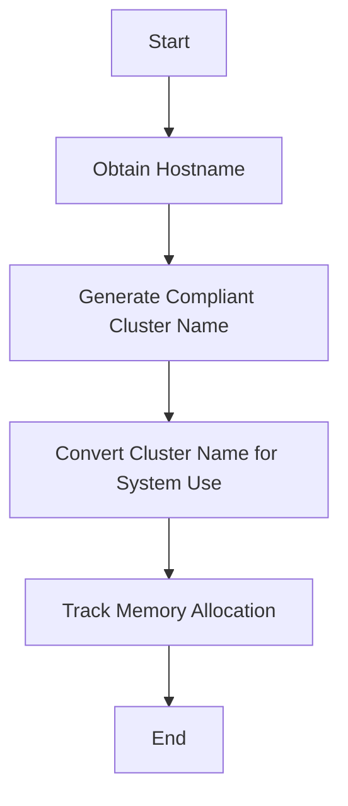

This document will cover the Cluster Name Retrieval Process, which includes:

1. Obtaining the hostname
2. Generating a compliant cluster name
3. Converting the cluster name for system use
4. Tracking memory allocation.

Technical document: <SwmLink doc-title="Cluster Name Retrieval Process">[Cluster Name Retrieval Process](/.swm/cluster-name-retrieval-process.dxpzgegm.sw.md)</SwmLink>

# [Obtaining the hostname](https://app.swimm.io/repos/Z2l0aHViJTNBJTNBZGF0YWRvZy1hZ2VudCUzQSUzQVN3aW1tLURlbW8=/docs/dxpzgegm#getclustername)

The process begins by obtaining the hostname of the system. This is a critical step as the hostname serves as the base identifier for generating the cluster name. The hostname is retrieved using a utility function that ensures it is accurate and up-to-date.

# [Generating a compliant cluster name](https://app.swimm.io/repos/Z2l0aHViJTNBJTNBZGF0YWRvZy1hZ2VudCUzQSUzQVN3aW1tLURlbW8=/docs/dxpzgegm#getclustername)

Once the hostname is obtained, it is used to generate a cluster name that complies with specific standards, such as RFC1123. This ensures that the cluster name is valid and can be used across different systems and platforms without issues.

# [Converting the cluster name for system use](https://app.swimm.io/repos/Z2l0aHViJTNBJTNBZGF0YWRvZy1hZ2VudCUzQSUzQVN3aW1tLURlbW8=/docs/dxpzgegm#trackedcstring)

After generating the compliant cluster name, it is converted into a format that can be used by other parts of the system. This involves converting the cluster name into a C string, which is a common format used in system-level programming for compatibility and efficiency.

# [Tracking memory allocation](https://app.swimm.io/repos/Z2l0aHViJTNBJTNBZGF0YWRvZy1hZ2VudCUzQSUzQVN3aW1tLURlbW8=/docs/dxpzgegm#memorytracker)

During the conversion process, memory allocation is tracked to ensure efficient resource management. This involves logging memory operations and updating various metrics related to memory usage. By tracking memory allocation, the system can prevent memory leaks and optimize performance.

&nbsp;

*This is an auto-generated document by Swimm AI 🌊 and has not yet been verified by a human*

<SwmMeta version="3.0.0" repo-id="Z2l0aHViJTNBJTNBZGF0YWRvZy1hZ2VudCUzQSUzQVN3aW1tLURlbW8=" repo-name="datadog-agent">Powered by [Swimm](/)</SwmMeta>
