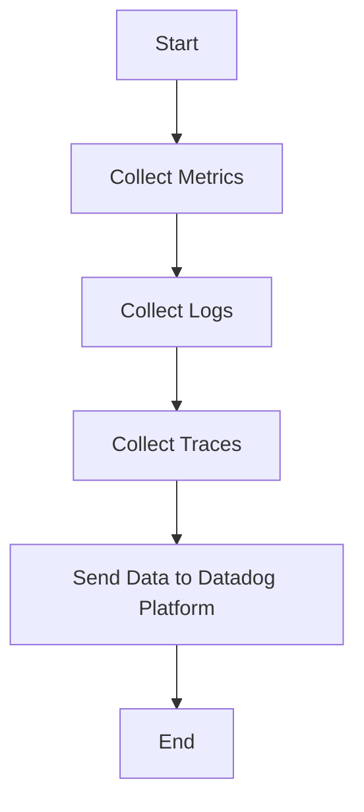

This document will cover the process of collecting and sending metrics, logs, and traces using the Datadog Agent. We'll cover:

1. Collecting Metrics
2. Collecting Logs
3. Collecting Traces
4. Sending Data to Datadog Platform

Technical document: <SwmLink doc-title="" repo-id="Z2l0aHViJTNBJTNBZGF0YWRvZy1hZ2VudCUzQSUzQVN3aW1tLURlbW8=" path="/.swm/.4javu850.sw.md"></SwmLink>

# [Collecting Metrics](https://app.swimm.io/repos/Z2l0aHViJTNBJTNBZGF0YWRvZy1hZ2VudCUzQSUzQVN3aW1tLURlbW8=/docs/4javu850#collecting-metrics)

The Datadog Agent collects metrics from various sources such as system performance counters, application performance metrics, and custom metrics defined by the user. This process involves gathering data points that represent the state and performance of different components within the system. The collected metrics provide insights into the health and performance of the system, enabling users to monitor and optimize their infrastructure and applications.

# [Collecting Logs](https://app.swimm.io/repos/Z2l0aHViJTNBJTNBZGF0YWRvZy1hZ2VudCUzQSUzQVN3aW1tLURlbW8=/docs/4javu850#collecting-logs)

Logs are collected by the Datadog Agent from various sources including application logs, system logs, and custom log files. The logs contain detailed information about events and activities within the system, which can be used for troubleshooting, auditing, and gaining insights into system behavior. The Agent processes these logs to ensure they are in a consistent format and can be easily analyzed.

# [Collecting Traces](https://app.swimm.io/repos/Z2l0aHViJTNBJTNBZGF0YWRvZy1hZ2VudCUzQSUzQVN3aW1tLURlbW8=/docs/4javu850#collecting-traces)

Traces are collected to monitor and analyze the flow of requests through distributed systems. The Datadog Agent captures trace data from various services and applications, providing a detailed view of the interactions and dependencies between different components. This helps in identifying performance bottlenecks, understanding service dependencies, and improving the overall performance and reliability of the system.

# [Sending Data to Datadog Platform](https://app.swimm.io/repos/Z2l0aHViJTNBJTNBZGF0YWRvZy1hZ2VudCUzQSUzQVN3aW1tLURlbW8=/docs/4javu850#sending-data-to-datadog-platform)

Once the metrics, logs, and traces are collected, the Datadog Agent sends this data to the Datadog platform. The platform provides a centralized location for storing, visualizing, and analyzing the data. Users can create dashboards, set up alerts, and perform advanced analytics to gain insights into their system's performance and health. This centralized approach enables users to make data-driven decisions and quickly respond to issues.

&nbsp;

*This is an auto-generated document by Swimm AI 🌊 and has not yet been verified by a human*

<SwmMeta version="3.0.0" repo-id="Z2l0aHViJTNBJTNBZGF0YWRvZy1hZ2VudCUzQSUzQVN3aW1tLURlbW8=" repo-name="datadog-agent">Powered by [Swimm](/)</SwmMeta>
