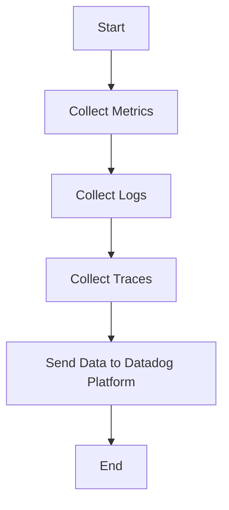

This document will cover the process of collecting and sending metrics, logs, and traces using the Datadog Agent. We'll cover:

1. Collecting Metrics
2. Collecting Logs
3. Collecting Traces
4. Sending Data to Datadog Platform

Technical document: <SwmLink doc-title="" repo-id="Z2l0aHViJTNBJTNBZGF0YWRvZy1hZ2VudCUzQSUzQVN3aW1tLURlbW8=" path="/.swm/.uayq21c6.sw.md"></SwmLink>

# [Collecting Metrics](https://app.swimm.io/repos/Z2l0aHViJTNBJTNBZGF0YWRvZy1hZ2VudCUzQSUzQVN3aW1tLURlbW8=/docs/uayq21c6#collecting-metrics)

The Datadog Agent collects metrics from various sources such as servers, databases, and applications. These metrics provide insights into the performance and health of the infrastructure. The agent gathers data points like CPU usage, memory consumption, disk I/O, and network traffic. This information helps users monitor their systems in real-time and identify potential issues before they become critical.

# [Collecting Logs](https://app.swimm.io/repos/Z2l0aHViJTNBJTNBZGF0YWRvZy1hZ2VudCUzQSUzQVN3aW1tLURlbW8=/docs/uayq21c6#collecting-logs)

Logs are collected by the Datadog Agent from different sources including application logs, system logs, and custom log files. These logs contain detailed information about events and errors occurring within the system. By aggregating and analyzing logs, users can troubleshoot problems, track application behavior, and ensure compliance with security policies.

# [Collecting Traces](https://app.swimm.io/repos/Z2l0aHViJTNBJTNBZGF0YWRvZy1hZ2VudCUzQSUzQVN3aW1tLURlbW8=/docs/uayq21c6#collecting-traces)

Traces are collected to monitor the flow of requests through distributed systems. The Datadog Agent captures trace data from applications to provide visibility into the performance of individual services and their interactions. This helps users understand latency issues, optimize performance, and improve the overall user experience by identifying bottlenecks and inefficiencies in the system.

# [Sending Data to Datadog Platform](https://app.swimm.io/repos/Z2l0aHViJTNBJTNBZGF0YWRvZy1hZ2VudCUzQSUzQVN3aW1tLURlbW8=/docs/uayq21c6#sending-data-to-datadog-platform)

Once the metrics, logs, and traces are collected, the Datadog Agent sends this data to the Datadog platform. The platform provides a centralized location for monitoring and analyzing the collected data. Users can create dashboards, set up alerts, and generate reports to gain insights into their infrastructure and applications. This centralized monitoring helps in proactive issue detection and resolution, ensuring optimal performance and reliability of the systems.

&nbsp;

*This is an auto-generated document by Swimm AI 🌊 and has not yet been verified by a human*

<SwmMeta version="3.0.0" repo-id="Z2l0aHViJTNBJTNBZGF0YWRvZy1hZ2VudCUzQSUzQVN3aW1tLURlbW8=" repo-name="datadog-agent">Powered by [Swimm](/)</SwmMeta>
