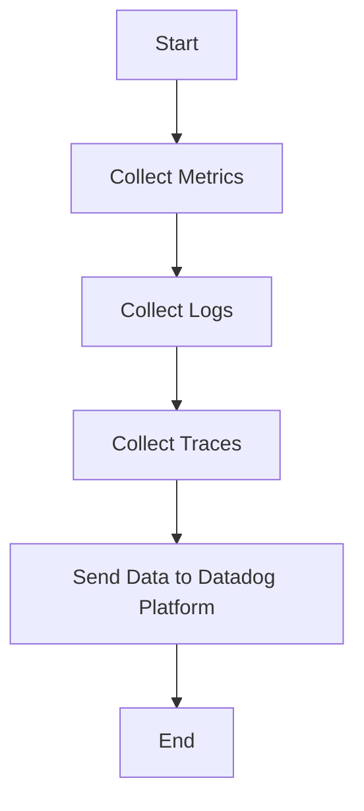

This document will cover the process of collecting and sending metrics, logs, and traces using the Datadog Agent. We'll cover:

1. Collecting Metrics
2. Collecting Logs
3. Collecting Traces
4. Sending Data to Datadog Platform

Technical document: <SwmLink doc-title="" repo-id="Z2l0aHViJTNBJTNBZGF0YWRvZy1hZ2VudCUzQSUzQVN3aW1tLURlbW8=" path="/.swm/.5xtqm8o4.sw.md"></SwmLink>

# [Collecting Metrics](https://app.swimm.io/repos/Z2l0aHViJTNBJTNBZGF0YWRvZy1hZ2VudCUzQSUzQVN3aW1tLURlbW8=/docs/5xtqm8o4#collecting-metrics)

The Datadog Agent collects metrics from various sources such as servers, databases, and applications. These metrics include CPU usage, memory usage, disk I/O, and network traffic. The purpose of collecting these metrics is to monitor the performance and health of the infrastructure and applications. By analyzing these metrics, users can identify performance bottlenecks, predict future resource needs, and ensure that their systems are running smoothly.

# [Collecting Logs](https://app.swimm.io/repos/Z2l0aHViJTNBJTNBZGF0YWRvZy1hZ2VudCUzQSUzQVN3aW1tLURlbW8=/docs/5xtqm8o4#collecting-logs)

The Datadog Agent collects logs from various sources such as application logs, server logs, and custom logs. Logs provide detailed information about the events happening within the system. By collecting and analyzing logs, users can troubleshoot issues, track user activities, and gain insights into the behavior of their applications. Logs are essential for identifying errors, security incidents, and other critical events.

# [Collecting Traces](https://app.swimm.io/repos/Z2l0aHViJTNBJTNBZGF0YWRvZy1hZ2VudCUzQSUzQVN3aW1tLURlbW8=/docs/5xtqm8o4#collecting-traces)

The Datadog Agent collects traces from distributed applications. Traces provide a detailed view of the execution path of requests as they travel through various services and components. By collecting traces, users can understand the performance and latency of their applications, identify bottlenecks, and optimize the performance of their services. Traces are crucial for monitoring the health and performance of microservices architectures.

# [Sending Data to Datadog Platform](https://app.swimm.io/repos/Z2l0aHViJTNBJTNBZGF0YWRvZy1hZ2VudCUzQSUzQVN3aW1tLURlbW8=/docs/5xtqm8o4#sending-data-to-datadog-platform)

Once the Datadog Agent has collected metrics, logs, and traces, it sends this data to the Datadog platform for further analysis and visualization. The Datadog platform provides a comprehensive suite of tools for monitoring, alerting, and analyzing the collected data. Users can create custom dashboards, set up alerts, and generate reports to gain insights into the performance and health of their systems. By sending data to the Datadog platform, users can leverage its powerful features to ensure the reliability and efficiency of their infrastructure and applications.

&nbsp;

*This is an auto-generated document by Swimm AI 🌊 and has not yet been verified by a human*

<SwmMeta version="3.0.0" repo-id="Z2l0aHViJTNBJTNBZGF0YWRvZy1hZ2VudCUzQSUzQVN3aW1tLURlbW8=" repo-name="datadog-agent">Powered by [Swimm](/)</SwmMeta>
