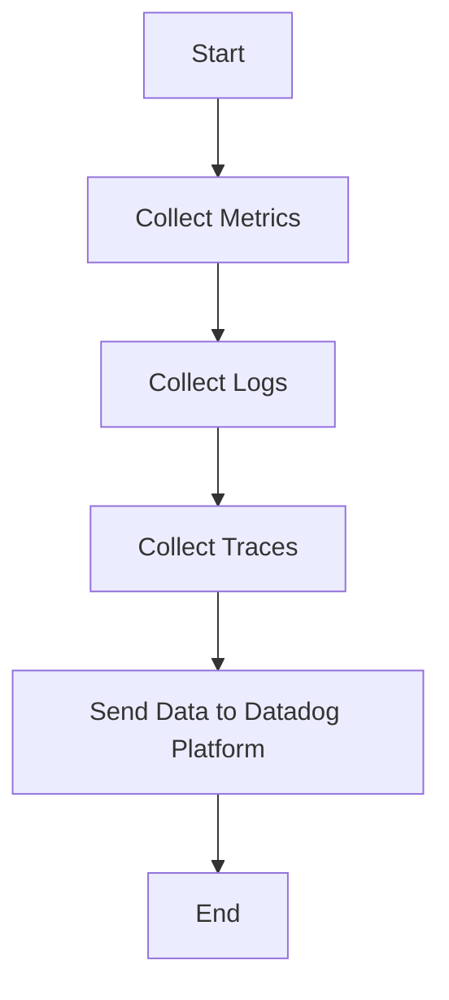

This document will cover the process of collecting and sending metrics, logs, and traces using the Datadog Agent. We'll cover:

1. Collecting Metrics
2. Collecting Logs
3. Collecting Traces
4. Sending Data to Datadog Platform

Technical document: <SwmLink doc-title="" repo-id="Z2l0aHViJTNBJTNBZGF0YWRvZy1hZ2VudCUzQSUzQVN3aW1tLURlbW8=" path="/.swm/.9qrnmljk.sw.md"></SwmLink>

# [Collecting Metrics](https://app.swimm.io/repos/Z2l0aHViJTNBJTNBZGF0YWRvZy1hZ2VudCUzQSUzQVN3aW1tLURlbW8=/docs/9qrnmljk#collecting-metrics)

The Datadog Agent collects metrics from various sources such as servers, containers, and cloud services. These metrics include CPU usage, memory usage, disk I/O, and network traffic. The purpose of collecting these metrics is to provide insights into the performance and health of the infrastructure. By monitoring these metrics, users can identify potential issues, optimize resource usage, and ensure the smooth operation of their systems.

# [Collecting Logs](https://app.swimm.io/repos/Z2l0aHViJTNBJTNBZGF0YWRvZy1hZ2VudCUzQSUzQVN3aW1tLURlbW8=/docs/9qrnmljk#collecting-logs)

Logs are collected from different applications and services running on the infrastructure. These logs contain valuable information about the behavior and state of the applications. By collecting logs, users can troubleshoot issues, track application performance, and gain visibility into the operations of their systems. The logs are parsed and enriched with metadata to make them more useful for analysis.

# [Collecting Traces](https://app.swimm.io/repos/Z2l0aHViJTNBJTNBZGF0YWRvZy1hZ2VudCUzQSUzQVN3aW1tLURlbW8=/docs/9qrnmljk#collecting-traces)

Traces are collected to monitor the flow of requests through various services in a distributed system. Each trace provides a detailed view of the request's path, including the time taken at each step. This helps users understand the performance of their applications, identify bottlenecks, and optimize the overall user experience. Tracing is particularly useful for microservices architectures where requests pass through multiple services.

# [Sending Data to Datadog Platform](https://app.swimm.io/repos/Z2l0aHViJTNBJTNBZGF0YWRvZy1hZ2VudCUzQSUzQVN3aW1tLURlbW8=/docs/9qrnmljk#sending-data-to-datadog-platform)

Once the metrics, logs, and traces are collected, the Datadog Agent sends this data to the Datadog platform. The data is transmitted securely and efficiently to ensure minimal impact on the performance of the monitored systems. On the Datadog platform, the data is aggregated, analyzed, and visualized to provide users with actionable insights. Users can create dashboards, set up alerts, and generate reports to monitor and manage their infrastructure effectively.

&nbsp;

*This is an auto-generated document by Swimm AI 🌊 and has not yet been verified by a human*

<SwmMeta version="3.0.0" repo-id="Z2l0aHViJTNBJTNBZGF0YWRvZy1hZ2VudCUzQSUzQVN3aW1tLURlbW8=" repo-name="datadog-agent">Powered by [Swimm](/)</SwmMeta>
