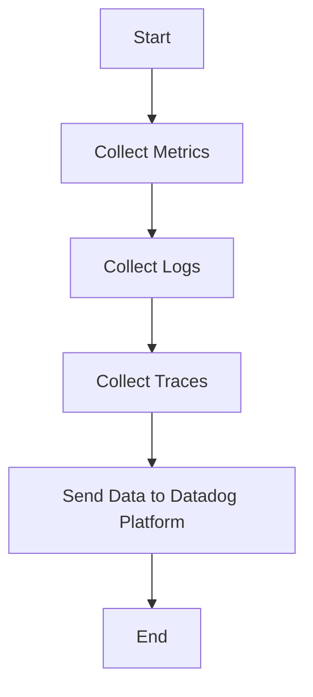

This document will cover the process of collecting and sending metrics, logs, and traces using the Datadog Agent. We'll cover:

1. Collecting Metrics
2. Collecting Logs
3. Collecting Traces
4. Sending Data to Datadog Platform

Technical document: <SwmLink doc-title="" repo-id="Z2l0aHViJTNBJTNBZGF0YWRvZy1hZ2VudCUzQSUzQVN3aW1tLURlbW8=" path="/.swm/.xr35s5pi.sw.md"></SwmLink>

# [Collecting Metrics](https://app.swimm.io/repos/Z2l0aHViJTNBJTNBZGF0YWRvZy1hZ2VudCUzQSUzQVN3aW1tLURlbW8=/docs/xr35s5pi#collecting-metrics)

The Datadog Agent collects metrics from various sources such as servers, databases, and applications. These metrics include CPU usage, memory usage, disk I/O, and network traffic. The purpose of collecting these metrics is to provide insights into the performance and health of the monitored systems. Users can configure the agent to collect specific metrics based on their monitoring needs.

# [Collecting Logs](https://app.swimm.io/repos/Z2l0aHViJTNBJTNBZGF0YWRvZy1hZ2VudCUzQSUzQVN3aW1tLURlbW8=/docs/xr35s5pi#collecting-logs)

The Datadog Agent collects logs from different sources like applications, services, and infrastructure components. Logs provide detailed information about events and errors that occur within the system. By collecting logs, users can troubleshoot issues, monitor application behavior, and ensure compliance with regulatory requirements. The agent can be configured to collect logs from specific files, directories, or log management systems.

# [Collecting Traces](https://app.swimm.io/repos/Z2l0aHViJTNBJTNBZGF0YWRvZy1hZ2VudCUzQSUzQVN3aW1tLURlbW8=/docs/xr35s5pi#collecting-traces)

The Datadog Agent collects traces from distributed applications to monitor the flow of requests across different services. Traces help in understanding the performance and latency of each service in the application. By collecting traces, users can identify bottlenecks, optimize performance, and improve the overall user experience. The agent can be configured to collect traces from specific applications and services.

# [Sending Data to Datadog Platform](https://app.swimm.io/repos/Z2l0aHViJTNBJTNBZGF0YWRvZy1hZ2VudCUzQSUzQVN3aW1tLURlbW8=/docs/xr35s5pi#sending-data-to-datadog-platform)

Once the Datadog Agent collects metrics, logs, and traces, it sends this data to the Datadog platform for monitoring and analysis. The platform provides a centralized location for users to visualize and analyze the collected data. Users can create dashboards, set up alerts, and generate reports based on the data. The agent ensures that the data is securely transmitted to the platform, maintaining data integrity and confidentiality.

&nbsp;

*This is an auto-generated document by Swimm AI 🌊 and has not yet been verified by a human*

<SwmMeta version="3.0.0" repo-id="Z2l0aHViJTNBJTNBZGF0YWRvZy1hZ2VudCUzQSUzQVN3aW1tLURlbW8=" repo-name="datadog-agent">Powered by [Swimm](/)</SwmMeta>
