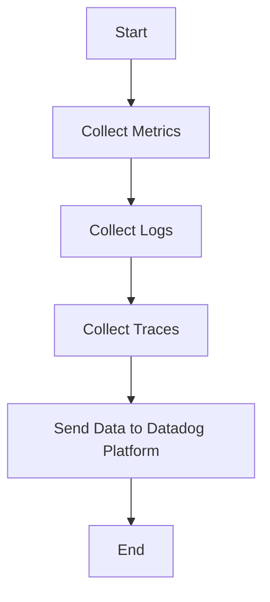

This document will cover the process of collecting and sending metrics, logs, and traces using the Datadog Agent. We'll cover:

1. Collecting Metrics
2. Collecting Logs
3. Collecting Traces
4. Sending Data to Datadog Platform

Technical document: <SwmLink doc-title="" repo-id="Z2l0aHViJTNBJTNBZGF0YWRvZy1hZ2VudCUzQSUzQVN3aW1tLURlbW8=" path="/.swm/.vv4j5py4.sw.md"></SwmLink>

# [Collecting Metrics](https://app.swimm.io/repos/Z2l0aHViJTNBJTNBZGF0YWRvZy1hZ2VudCUzQSUzQVN3aW1tLURlbW8=/docs/vv4j5py4#collecting-metrics)

The Datadog Agent collects metrics from various sources such as servers, databases, and applications. These metrics include CPU usage, memory usage, disk I/O, and network traffic. The purpose of collecting these metrics is to monitor the performance and health of the infrastructure and applications. This helps in identifying any potential issues or bottlenecks in the system.

# [Collecting Logs](https://app.swimm.io/repos/Z2l0aHViJTNBJTNBZGF0YWRvZy1hZ2VudCUzQSUzQVN3aW1tLURlbW8=/docs/vv4j5py4#collecting-logs)

The Datadog Agent collects logs from different sources like application logs, server logs, and custom logs. These logs provide detailed information about the events happening within the system. By collecting logs, users can troubleshoot issues, track application behavior, and gain insights into the system's operations.

# [Collecting Traces](https://app.swimm.io/repos/Z2l0aHViJTNBJTNBZGF0YWRvZy1hZ2VudCUzQSUzQVN3aW1tLURlbW8=/docs/vv4j5py4#collecting-traces)

The Datadog Agent collects traces from distributed applications. Traces provide a detailed view of the application's execution flow, including the time taken by each component to process a request. This helps in identifying performance bottlenecks and understanding the application's behavior in a distributed environment.

# [Sending Data to Datadog Platform](https://app.swimm.io/repos/Z2l0aHViJTNBJTNBZGF0YWRvZy1hZ2VudCUzQSUzQVN3aW1tLURlbW8=/docs/vv4j5py4#sending-data-to-datadog-platform)

Once the Datadog Agent collects metrics, logs, and traces, it sends this data to the Datadog platform. The platform aggregates and analyzes the data, providing users with real-time insights and visualizations. This helps in monitoring the system's performance, detecting anomalies, and making data-driven decisions.

&nbsp;

*This is an auto-generated document by Swimm AI 🌊 and has not yet been verified by a human*

<SwmMeta version="3.0.0" repo-id="Z2l0aHViJTNBJTNBZGF0YWRvZy1hZ2VudCUzQSUzQVN3aW1tLURlbW8=" repo-name="datadog-agent">Powered by [Swimm](/)</SwmMeta>
