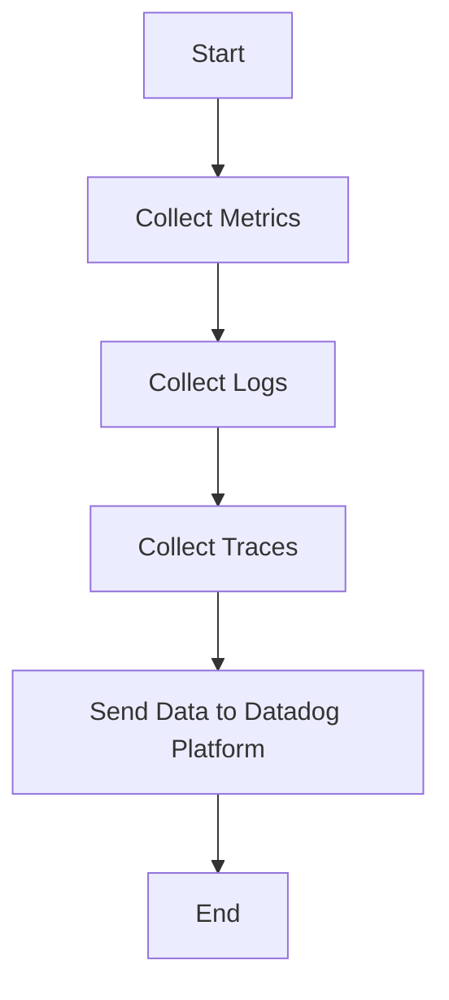

This document will cover the process of collecting and sending metrics, logs, and traces using the Datadog Agent. We'll cover:

1. Collecting Metrics
2. Collecting Logs
3. Collecting Traces
4. Sending Data to Datadog Platform

Technical document: <SwmLink doc-title="" repo-id="Z2l0aHViJTNBJTNBZGF0YWRvZy1hZ2VudCUzQSUzQVN3aW1tLURlbW8=" path="/.swm/.kj7idc1o.sw.md"></SwmLink>

# [Collecting Metrics](https://app.swimm.io/repos/Z2l0aHViJTNBJTNBZGF0YWRvZy1hZ2VudCUzQSUzQVN3aW1tLURlbW8=/docs/kj7idc1o#collecting-metrics)

The Datadog Agent collects metrics from various sources such as servers, containers, and cloud services. These metrics include CPU usage, memory usage, disk I/O, and network traffic. The agent gathers this data to provide insights into the performance and health of the infrastructure. For example, monitoring CPU usage helps in identifying performance bottlenecks and ensuring that the system is running efficiently.

# [Collecting Logs](https://app.swimm.io/repos/Z2l0aHViJTNBJTNBZGF0YWRvZy1hZ2VudCUzQSUzQVN3aW1tLURlbW8=/docs/kj7idc1o#collecting-logs)

The Datadog Agent collects logs from different sources like applications, services, and system logs. These logs provide detailed information about the events happening within the system. By analyzing logs, users can troubleshoot issues, track application behavior, and ensure compliance with security policies. For instance, application logs can help in identifying errors and debugging issues.

# [Collecting Traces](https://app.swimm.io/repos/Z2l0aHViJTNBJTNBZGF0YWRvZy1hZ2VudCUzQSUzQVN3aW1tLURlbW8=/docs/kj7idc1o#collecting-traces)

The Datadog Agent collects traces from distributed applications to monitor the flow of requests across various services. Traces help in understanding the performance of individual services and their interactions. This is crucial for identifying latency issues and optimizing the performance of microservices architectures. For example, tracing a request from the frontend to the backend can help in pinpointing where delays are occurring.

# [Sending Data to Datadog Platform](https://app.swimm.io/repos/Z2l0aHViJTNBJTNBZGF0YWRvZy1hZ2VudCUzQSUzQVN3aW1tLURlbW8=/docs/kj7idc1o#sending-data-to-datadog-platform)

Once the Datadog Agent has collected metrics, logs, and traces, it sends this data to the Datadog platform for monitoring and analysis. The platform provides a centralized location for visualizing and analyzing the data, setting up alerts, and generating reports. This helps users in making informed decisions, improving system performance, and ensuring reliability. For example, setting up alerts for high CPU usage can help in proactively addressing performance issues before they impact users.

&nbsp;

*This is an auto-generated document by Swimm AI 🌊 and has not yet been verified by a human*

<SwmMeta version="3.0.0" repo-id="Z2l0aHViJTNBJTNBZGF0YWRvZy1hZ2VudCUzQSUzQVN3aW1tLURlbW8=" repo-name="datadog-agent">Powered by [Swimm](/)</SwmMeta>
