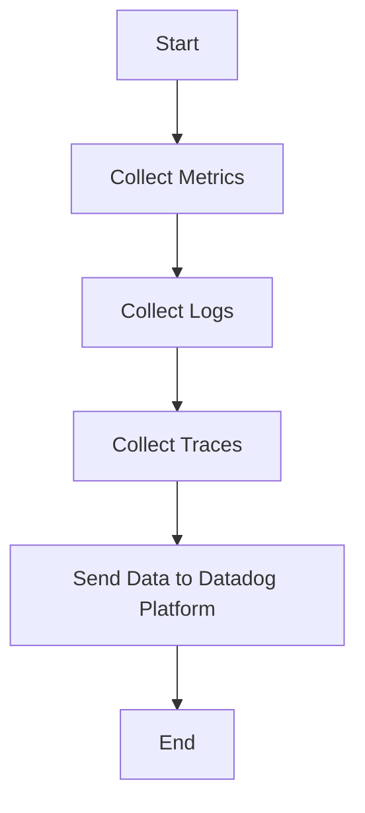

This document will cover the process of collecting and sending metrics, logs, and traces using the Datadog Agent. We'll cover:

1. Collecting Metrics
2. Collecting Logs
3. Collecting Traces
4. Sending Data to Datadog Platform

Technical document: <SwmLink doc-title="" repo-id="Z2l0aHViJTNBJTNBZGF0YWRvZy1hZ2VudCUzQSUzQVN3aW1tLURlbW8=" path="/.swm/.yo42549e.sw.md"></SwmLink>

# [Collecting Metrics](https://app.swimm.io/repos/Z2l0aHViJTNBJTNBZGF0YWRvZy1hZ2VudCUzQSUzQVN3aW1tLURlbW8=/docs/yo42549e#collecting-metrics)

The Datadog Agent collects metrics from various sources such as servers, databases, and applications. These metrics include CPU usage, memory usage, disk I/O, and network traffic. The purpose of collecting these metrics is to monitor the performance and health of the infrastructure and applications. By collecting metrics, users can identify performance bottlenecks, resource utilization trends, and potential issues before they impact end users.

# [Collecting Logs](https://app.swimm.io/repos/Z2l0aHViJTNBJTNBZGF0YWRvZy1hZ2VudCUzQSUzQVN3aW1tLURlbW8=/docs/yo42549e#collecting-logs)

Logs are collected from various sources such as application logs, server logs, and custom log files. The Datadog Agent aggregates these logs to provide a centralized view of all log data. This helps users to troubleshoot issues, track application behavior, and ensure compliance with regulatory requirements. By analyzing logs, users can gain insights into application errors, security incidents, and operational events.

# [Collecting Traces](https://app.swimm.io/repos/Z2l0aHViJTNBJTNBZGF0YWRvZy1hZ2VudCUzQSUzQVN3aW1tLURlbW8=/docs/yo42549e#collecting-traces)

Traces are collected to monitor the flow of requests through distributed systems. The Datadog Agent captures trace data from applications to provide visibility into the performance of individual services and their interactions. This helps users to identify latency issues, understand service dependencies, and optimize the performance of their applications. By collecting traces, users can pinpoint the root cause of performance problems and improve the overall user experience.

# [Sending Data to Datadog Platform](https://app.swimm.io/repos/Z2l0aHViJTNBJTNBZGF0YWRvZy1hZ2VudCUzQSUzQVN3aW1tLURlbW8=/docs/yo42549e#sending-data-to-datadog-platform)

Once metrics, logs, and traces are collected, the Datadog Agent sends this data to the Datadog platform for analysis and visualization. The data is transmitted securely and efficiently to ensure minimal impact on system performance. On the Datadog platform, users can create dashboards, set up alerts, and generate reports to monitor their infrastructure and applications in real-time. This enables proactive management and quick resolution of issues, ensuring a seamless experience for end users.

&nbsp;

*This is an auto-generated document by Swimm AI 🌊 and has not yet been verified by a human*

<SwmMeta version="3.0.0" repo-id="Z2l0aHViJTNBJTNBZGF0YWRvZy1hZ2VudCUzQSUzQVN3aW1tLURlbW8=" repo-name="datadog-agent">Powered by [Swimm](/)</SwmMeta>
