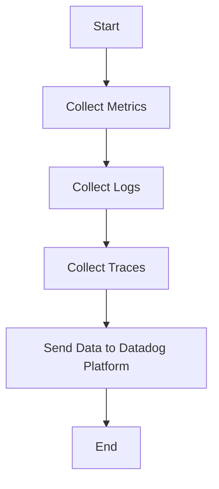

This document will cover the process of collecting and sending metrics, logs, and traces using the Datadog Agent. We'll cover:

1. Collecting Metrics
2. Collecting Logs
3. Collecting Traces
4. Sending Data to Datadog Platform

Technical document: <SwmLink doc-title="" repo-id="Z2l0aHViJTNBJTNBZGF0YWRvZy1hZ2VudCUzQSUzQVN3aW1tLURlbW8=" path="/.swm/.97pjnnha.sw.md"></SwmLink>

# [Collecting Metrics](https://app.swimm.io/repos/Z2l0aHViJTNBJTNBZGF0YWRvZy1hZ2VudCUzQSUzQVN3aW1tLURlbW8=/docs/97pjnnha#collecting-metrics)

The Datadog Agent collects metrics from various sources such as servers, databases, and applications. These metrics include CPU usage, memory usage, disk I/O, and network traffic. The purpose of collecting these metrics is to provide insights into the performance and health of the infrastructure and applications. This helps in identifying bottlenecks, predicting potential issues, and ensuring optimal performance.

# [Collecting Logs](https://app.swimm.io/repos/Z2l0aHViJTNBJTNBZGF0YWRvZy1hZ2VudCUzQSUzQVN3aW1tLURlbW8=/docs/97pjnnha#collecting-logs)

Logs are collected from different sources like application logs, server logs, and custom logs. These logs provide detailed information about the events happening within the system. By collecting logs, the Datadog Agent helps in monitoring and troubleshooting issues by providing a detailed view of the system's behavior over time. This is crucial for identifying errors, security incidents, and performance issues.

# [Collecting Traces](https://app.swimm.io/repos/Z2l0aHViJTNBJTNBZGF0YWRvZy1hZ2VudCUzQSUzQVN3aW1tLURlbW8=/docs/97pjnnha#collecting-traces)

Traces are collected to monitor the flow of requests through the system. This includes tracking the execution of requests across different services and components. By collecting traces, the Datadog Agent helps in understanding the performance and latency of distributed systems. This is essential for identifying slow services, optimizing performance, and ensuring a smooth user experience.

# [Sending Data to Datadog Platform](https://app.swimm.io/repos/Z2l0aHViJTNBJTNBZGF0YWRvZy1hZ2VudCUzQSUzQVN3aW1tLURlbW8=/docs/97pjnnha#sending-data-to-datadog-platform)

Once the metrics, logs, and traces are collected, the Datadog Agent sends this data to the Datadog platform. The platform provides a centralized location for monitoring and analyzing the data. This allows users to create dashboards, set up alerts, and gain insights into the performance and health of their systems. The data is sent securely and efficiently to ensure real-time monitoring and analysis.

&nbsp;

*This is an auto-generated document by Swimm AI 🌊 and has not yet been verified by a human*

<SwmMeta version="3.0.0" repo-id="Z2l0aHViJTNBJTNBZGF0YWRvZy1hZ2VudCUzQSUzQVN3aW1tLURlbW8=" repo-name="datadog-agent">Powered by [Swimm](/)</SwmMeta>
