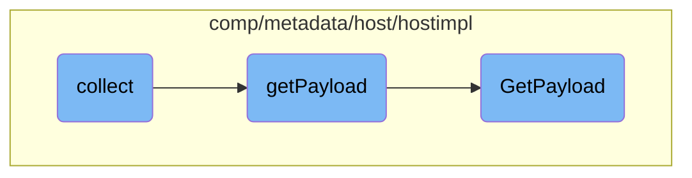

In this document, we will explain the process of collecting host metadata. The process involves gathering various pieces of metadata, constructing a payload, and sending this data to the serializer.

The flow starts with the <SwmToken path="comp/metadata/host/hostimpl/host.go" pos="123:9:9" line-data="func (h *host) collect(ctx context.Context) time.Duration {">`collect`</SwmToken> function, which gathers host metadata and sends it to the serializer. It calls the <SwmToken path="comp/metadata/host/hostimpl/host.go" pos="124:7:7" line-data="	payload := h.getPayload(ctx)">`getPayload`</SwmToken> function to retrieve the metadata payload. The <SwmToken path="comp/metadata/host/hostimpl/host.go" pos="124:7:7" line-data="	payload := h.getPayload(ctx)">`getPayload`</SwmToken> function constructs the complete metadata payload by combining common payload data, specific payload data, and optionally includes resource and gohai payloads if they are enabled in the configuration. Finally, the <SwmToken path="comp/metadata/host/hostimpl/host.go" pos="123:9:9" line-data="func (h *host) collect(ctx context.Context) time.Duration {">`collect`</SwmToken> function uses the serializer to send this data and logs any errors that occur during the sending process.

# Flow drill down



<SwmSnippet path="/comp/metadata/host/hostimpl/host.go" line="123">

---

## Collecting Host Metadata

The <SwmToken path="comp/metadata/host/hostimpl/host.go" pos="123:9:9" line-data="func (h *host) collect(ctx context.Context) time.Duration {">`collect`</SwmToken> function is responsible for gathering host metadata and sending it to the serializer. It calls <SwmToken path="comp/metadata/host/hostimpl/host.go" pos="124:7:7" line-data="	payload := h.getPayload(ctx)">`getPayload`</SwmToken> to retrieve the metadata payload and then uses the serializer to send this data. If there is an error during the sending process, it logs the error.

```go
func (h *host) collect(ctx context.Context) time.Duration {
	payload := h.getPayload(ctx)
	if err := h.serializer.SendHostMetadata(payload); err != nil {
		h.log.Errorf("unable to submit host metadata payload, %s", err)
	}
	return h.collectInterval
}
```

---

</SwmSnippet>

<SwmSnippet path="/comp/metadata/host/hostimpl/payload.go" line="44">

---

## Building the Metadata Payload

The <SwmToken path="comp/metadata/host/hostimpl/payload.go" pos="44:2:2" line-data="// getPayload returns the complete metadata payload as seen in Agent v5">`getPayload`</SwmToken> function constructs the complete metadata payload. It combines common payload data, specific payload data, and optionally includes resource and gohai payloads if they are enabled in the configuration.

```go
// getPayload returns the complete metadata payload as seen in Agent v5
func (h *host) getPayload(ctx context.Context) *Payload {
	p := &Payload{
		CommonPayload: *utils.GetCommonPayload(h.hostname, h.config),
		Payload:       *utils.GetPayload(ctx, h.config),
	}

	if r := h.resources.Get(); r != nil {
		p.ResourcesPayload = r["resources"]
	}

	if h.config.GetBool("enable_gohai") {
		gohaiPayload, err := gohai.GetPayloadAsString(pkgconfig.IsContainerized())
		if err != nil {
			h.log.Errorf("Could not serialize gohai payload: %s", err)
		} else {
			p.GohaiPayload = gohaiPayload
		}
	}
	return p
}
```

---

</SwmSnippet>

<SwmSnippet path="/comp/metadata/host/hostimpl/utils/host.go" line="169">

---

### Gathering Specific Payload Data

The <SwmToken path="comp/metadata/host/hostimpl/utils/host.go" pos="169:2:2" line-data="// GetPayload builds a metadata payload every time is called.">`GetPayload`</SwmToken> function gathers various pieces of metadata, such as hostname, system stats, and network metadata. It caches this data for future use and returns the constructed payload.

```go
// GetPayload builds a metadata payload every time is called.
// Some data is collected only once, some is cached, some is collected at every call.
func GetPayload(ctx context.Context, conf config.Reader) *Payload {
	hostnameData, err := hostname.GetWithProvider(ctx)
	if err != nil {
		log.Errorf("Error grabbing hostname for status: %v", err)
		hostnameData = hostname.Data{Hostname: "unknown", Provider: "unknown"}
	}

	meta := GetMeta(ctx, conf)
	meta.Hostname = hostnameData.Hostname

	p := &Payload{
		Os:            osName,
		AgentFlavor:   flavor.GetFlavor(),
		PythonVersion: python.GetPythonInfo(),
		SystemStats:   getSystemStats(),
		Meta:          meta,
		HostTags:      hosttags.Get(ctx, false, conf),
		ContainerMeta: containerMetadata.Get(1 * time.Second),
		NetworkMeta:   getNetworkMeta(ctx),
```

---

</SwmSnippet>

&nbsp;

*This is an auto-generated document by Swimm AI 🌊 and has not yet been verified by a human*

<SwmMeta version="3.0.0" repo-id="Z2l0aHViJTNBJTNBZGF0YWRvZy1hZ2VudCUzQSUzQVN3aW1tLURlbW8=" repo-name="datadog-agent"><sup>Powered by [Swimm](/)</sup></SwmMeta>
