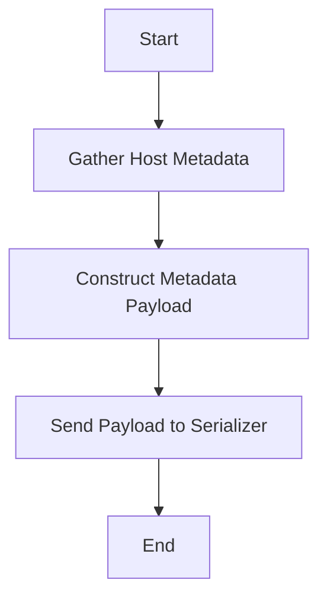

This document will cover the process of collecting host metadata, which includes:

1. Gathering host metadata
2. Constructing the metadata payload
3. Sending the metadata payload to the serializer.

Technical document: <SwmLink doc-title="Collecting Host Metadata">[Collecting Host Metadata](/.swm/collecting-host-metadata.992vckhp.sw.md)</SwmLink>

# [Gathering Host Metadata](https://app.swimm.io/repos/Z2l0aHViJTNBJTNBZGF0YWRvZy1hZ2VudCUzQSUzQVN3aW1tLURlbW8=/docs/992vckhp#collecting-host-metadata)

The process begins with gathering various pieces of metadata about the host. This includes information such as the hostname, system statistics, and network metadata. This data is essential for providing a comprehensive overview of the host's status and performance. The metadata is collected periodically to ensure that the information remains up-to-date.

# [Constructing the Metadata Payload](https://app.swimm.io/repos/Z2l0aHViJTNBJTNBZGF0YWRvZy1hZ2VudCUzQSUzQVN3aW1tLURlbW8=/docs/992vckhp#building-the-metadata-payload)

Once the host metadata is gathered, the next step is to construct a metadata payload. This payload is a structured collection of all the gathered data. It includes common payload data, specific payload data, and optionally, resource and gohai payloads if they are enabled in the configuration. The common payload data typically includes general information about the host, while the specific payload data includes more detailed and specific metrics. The resource payload contains information about the host's resources, and the gohai payload includes additional system information if enabled.

# [Sending the Metadata Payload to the Serializer](https://app.swimm.io/repos/Z2l0aHViJTNBJTNBZGF0YWRvZy1hZ2VudCUzQSUzQVN3aW1tLURlbW8=/docs/992vckhp#collecting-host-metadata)

After constructing the metadata payload, it is sent to the serializer. The serializer is responsible for formatting the payload and sending it to the Datadog platform. This step is crucial as it ensures that the collected metadata is transmitted accurately and efficiently. If there is an error during this process, it is logged for further investigation. This ensures that any issues can be identified and resolved promptly, maintaining the reliability of the data collection process.

&nbsp;

*This is an auto-generated document by Swimm AI 🌊 and has not yet been verified by a human*

<SwmMeta version="3.0.0" repo-id="Z2l0aHViJTNBJTNBZGF0YWRvZy1hZ2VudCUzQSUzQVN3aW1tLURlbW8=" repo-name="datadog-agent">Powered by [Swimm](/)</SwmMeta>
