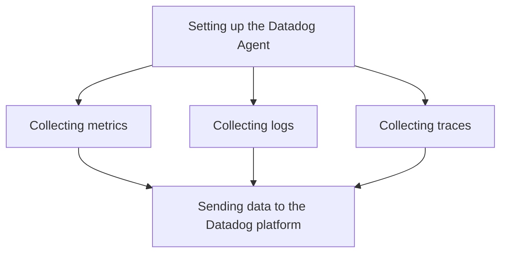

This document will cover the process of collecting metrics, logs, and traces using the Datadog Agent. We'll cover:

1. Setting up the Datadog Agent
2. Collecting metrics
3. Collecting logs
4. Collecting traces
5. Sending data to the Datadog platform

Technical document: <SwmLink doc-title="" repo-id="Z2l0aHViJTNBJTNBZGF0YWRvZy1hZ2VudCUzQSUzQVN3aW1tLURlbW8=" path="/.swm/.31kwb60l.sw.md"></SwmLink>

# [Setting up the Datadog Agent](https://app.swimm.io/repos/Z2l0aHViJTNBJTNBZGF0YWRvZy1hZ2VudCUzQSUzQVN3aW1tLURlbW8=/docs/31kwb60l#setting-up-the-datadog-agent)

The first step in using the Datadog Agent is setting it up. This involves installing the agent on the desired host machines. The setup process includes configuring the agent to connect to the Datadog platform using an API key. This ensures that the agent can securely send collected data to Datadog for monitoring and analysis.

# [Collecting metrics](https://app.swimm.io/repos/Z2l0aHViJTNBJTNBZGF0YWRvZy1hZ2VudCUzQSUzQVN3aW1tLURlbW8=/docs/31kwb60l#collecting-metrics)

Once the Datadog Agent is set up, it begins collecting metrics from various sources. Metrics are quantitative data points that provide insights into the performance and health of systems and applications. The agent collects metrics at regular intervals and aggregates them for analysis. Examples of metrics include CPU usage, memory usage, and network traffic.

# [Collecting logs](https://app.swimm.io/repos/Z2l0aHViJTNBJTNBZGF0YWRvZy1hZ2VudCUzQSUzQVN3aW1tLURlbW8=/docs/31kwb60l#collecting-logs)

In addition to metrics, the Datadog Agent also collects logs. Logs are textual records of events that occur within a system or application. They provide detailed information about the behavior and state of the system. The agent collects logs from various sources, such as application logs, system logs, and custom logs. These logs are then processed and sent to the Datadog platform for further analysis.

# [Collecting traces](https://app.swimm.io/repos/Z2l0aHViJTNBJTNBZGF0YWRvZy1hZ2VudCUzQSUzQVN3aW1tLURlbW8=/docs/31kwb60l#collecting-traces)

Traces are another type of data collected by the Datadog Agent. Traces represent the flow of requests through a distributed system. They provide visibility into the performance and latency of individual services and their interactions. The agent collects traces by instrumenting the code of applications and capturing the necessary data. This helps in identifying bottlenecks and optimizing the performance of the system.

# [Sending data to the Datadog platform](https://app.swimm.io/repos/Z2l0aHViJTNBJTNBZGF0YWRvZy1hZ2VudCUzQSUzQVN3aW1tLURlbW8=/docs/31kwb60l#sending-data-to-the-datadog-platform)

After collecting metrics, logs, and traces, the Datadog Agent sends this data to the Datadog platform. The data is transmitted securely using the configured API key. Once the data reaches the Datadog platform, it is processed, stored, and made available for visualization and analysis. Users can create dashboards, set up alerts, and gain insights into the performance and health of their systems and applications.

&nbsp;

*This is an auto-generated document by Swimm AI 🌊 and has not yet been verified by a human*

<SwmMeta version="3.0.0" repo-id="Z2l0aHViJTNBJTNBZGF0YWRvZy1hZ2VudCUzQSUzQVN3aW1tLURlbW8=" repo-name="datadog-agent">Powered by [Swimm](/)</SwmMeta>
