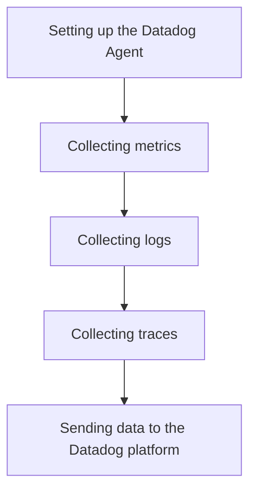

This document will cover the process of collecting metrics, logs, and traces using the Datadog Agent. We'll cover:

1. Setting up the Datadog Agent
2. Collecting metrics
3. Collecting logs
4. Collecting traces
5. Sending data to the Datadog platform

Technical document: <SwmLink doc-title="" repo-id="Z2l0aHViJTNBJTNBZGF0YWRvZy1hZ2VudCUzQSUzQVN3aW1tLURlbW8=" path="/.swm/.mg8npr9a.sw.md"></SwmLink>

# [Setting up the Datadog Agent](https://app.swimm.io/repos/Z2l0aHViJTNBJTNBZGF0YWRvZy1hZ2VudCUzQSUzQVN3aW1tLURlbW8=/docs/mg8npr9a#setting-up-the-datadog-agent)

To begin using the Datadog Agent, users need to install and configure it on their systems. This involves downloading the appropriate version of the agent, installing it, and configuring it with the necessary credentials and settings to connect to the Datadog platform. This setup ensures that the agent can start collecting data from various sources.

# [Collecting metrics](https://app.swimm.io/repos/Z2l0aHViJTNBJTNBZGF0YWRvZy1hZ2VudCUzQSUzQVN3aW1tLURlbW8=/docs/mg8npr9a#collecting-metrics)

Once the Datadog Agent is set up, it begins collecting metrics from the system. Metrics are quantitative data points that provide insights into the performance and health of the system. Examples include CPU usage, memory usage, disk I/O, and network traffic. The agent collects these metrics at regular intervals and prepares them for transmission to the Datadog platform.

# [Collecting logs](https://app.swimm.io/repos/Z2l0aHViJTNBJTNBZGF0YWRvZy1hZ2VudCUzQSUzQVN3aW1tLURlbW8=/docs/mg8npr9a#collecting-logs)

In addition to metrics, the Datadog Agent also collects logs from the system. Logs are textual records of events that occur within the system, such as error messages, user actions, and system events. The agent aggregates these logs, formats them appropriately, and prepares them for transmission to the Datadog platform. This helps in monitoring and troubleshooting system issues.

# [Collecting traces](https://app.swimm.io/repos/Z2l0aHViJTNBJTNBZGF0YWRvZy1hZ2VudCUzQSUzQVN3aW1tLURlbW8=/docs/mg8npr9a#collecting-traces)

Traces provide a detailed view of the execution path of requests within the system. The Datadog Agent collects traces to help understand the flow of requests and identify any bottlenecks or performance issues. Traces are particularly useful for monitoring distributed systems and microservices architectures. The agent collects these traces and prepares them for transmission to the Datadog platform.

# [Sending data to the Datadog platform](https://app.swimm.io/repos/Z2l0aHViJTNBJTNBZGF0YWRvZy1hZ2VudCUzQSUzQVN3aW1tLURlbW8=/docs/mg8npr9a#sending-data-to-the-datadog-platform)

After collecting metrics, logs, and traces, the Datadog Agent sends this data to the Datadog platform. The platform provides a centralized location for monitoring and analyzing the collected data. Users can create dashboards, set up alerts, and perform detailed analysis to gain insights into the performance and health of their systems. This step ensures that all collected data is available for real-time monitoring and historical analysis.

&nbsp;

*This is an auto-generated document by Swimm AI 🌊 and has not yet been verified by a human*

<SwmMeta version="3.0.0" repo-id="Z2l0aHViJTNBJTNBZGF0YWRvZy1hZ2VudCUzQSUzQVN3aW1tLURlbW8=" repo-name="datadog-agent">Powered by [Swimm](/)</SwmMeta>
