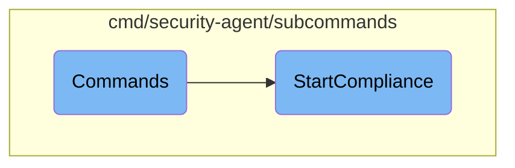

This document explains the commands used to initialize and start the Security Agent and its compliance <SwmToken path="cmd/security-agent/subcommands/compliance/compliance.go" pos="29:10:12" line-data="// StartCompliance runs the compliance sub-agent running compliance benchmarks">`sub-agent`</SwmToken>. It covers the setup of various parameters and dependencies required to run the agent, including logging, configuration, and component initialization.

The flow starts with setting up the start command for the Security Agent, which involves configuring parameters like logging and initializing components such as workloadmeta, tagger, and statsd. Once these are set up, the compliance <SwmToken path="cmd/security-agent/subcommands/compliance/compliance.go" pos="29:10:12" line-data="// StartCompliance runs the compliance sub-agent running compliance benchmarks">`sub-agent`</SwmToken> is initialized and started. This includes checking if compliance is enabled in the configuration, setting up log reporting, telemetry, and various resolver options. Finally, the compliance agent is started and runs periodically to send compliance metrics.

# Flow drill down



<SwmSnippet path="/cmd/security-agent/subcommands/start/command.go" line="79">

---

## Commands

The <SwmToken path="cmd/security-agent/subcommands/start/command.go" pos="79:2:2" line-data="// Commands returns the start commands">`Commands`</SwmToken> function sets up the start command for the Security Agent. It configures various parameters and dependencies required to run the agent. This includes setting up logging, configuration, and initializing components like <SwmToken path="cmd/security-agent/subcommands/compliance/compliance.go" pos="31:46:46" line-data="func StartCompliance(log log.Component, config config.Component, sysprobeconfig sysprobeconfig.Component, hostname string, stopper startstop.Stopper, statsdClient ddgostatsd.ClientInterface, wmeta workloadmeta.Component) (*compliance.Agent, error) {">`workloadmeta`</SwmToken>, <SwmToken path="cmd/security-agent/subcommands/start/command.go" pos="47:16:16" line-data="	&quot;github.com/DataDog/datadog-agent/comp/core/tagger&quot;">`tagger`</SwmToken>, and <SwmToken path="cmd/security-agent/subcommands/start/command.go" pos="24:16:16" line-data="	ddgostatsd &quot;github.com/DataDog/datadog-go/v5/statsd&quot;">`statsd`</SwmToken>. The function also ensures that the compliance agent is started by invoking <SwmToken path="cmd/security-agent/subcommands/compliance/compliance.go" pos="29:2:2" line-data="// StartCompliance runs the compliance sub-agent running compliance benchmarks">`StartCompliance`</SwmToken>.

```go
// Commands returns the start commands
func Commands(globalParams *command.GlobalParams) []*cobra.Command {
	params := &cliParams{
		GlobalParams: globalParams,
	}

	startCmd := &cobra.Command{
		Use:   "start",
		Short: "Start the Security Agent",
		Long:  `Runs Datadog Security agent in the foreground`,
		RunE: func(_ *cobra.Command, _ []string) error {
			// TODO: Similar to the agent itself, once the security agent is represented as a component, and not a function (start),
			// this will use `fxutil.Run` instead of `fxutil.OneShot`.

			// note that any changes to the arguments to OneShot need to be reflected into
			// the service initialization in ../../main_windows.go
			return fxutil.OneShot(start,
				fx.Supply(core.BundleParams{
					ConfigParams:         config.NewSecurityAgentParams(params.ConfigFilePaths),
					SysprobeConfigParams: sysprobeconfigimpl.NewParams(sysprobeconfigimpl.WithSysProbeConfFilePath(globalParams.SysProbeConfFilePath)),
					SecretParams:         secrets.NewEnabledParams(),
```

---

</SwmSnippet>

<SwmSnippet path="/cmd/security-agent/subcommands/compliance/compliance.go" line="29">

---

## <SwmToken path="cmd/security-agent/subcommands/compliance/compliance.go" pos="29:2:2" line-data="// StartCompliance runs the compliance sub-agent running compliance benchmarks">`StartCompliance`</SwmToken>

The <SwmToken path="cmd/security-agent/subcommands/compliance/compliance.go" pos="29:2:2" line-data="// StartCompliance runs the compliance sub-agent running compliance benchmarks">`StartCompliance`</SwmToken> function initializes and starts the compliance <SwmToken path="cmd/security-agent/subcommands/compliance/compliance.go" pos="29:10:12" line-data="// StartCompliance runs the compliance sub-agent running compliance benchmarks">`sub-agent`</SwmToken>. It checks if compliance is enabled in the configuration and sets up the necessary context and options for the compliance agent. This includes setting up log reporting, telemetry, and various resolver options. The function then starts the compliance agent and ensures it runs periodically by sending compliance metrics.

```go
// StartCompliance runs the compliance sub-agent running compliance benchmarks
// and checks.
func StartCompliance(log log.Component, config config.Component, sysprobeconfig sysprobeconfig.Component, hostname string, stopper startstop.Stopper, statsdClient ddgostatsd.ClientInterface, wmeta workloadmeta.Component) (*compliance.Agent, error) {
	enabled := config.GetBool("compliance_config.enabled")
	configDir := config.GetString("compliance_config.dir")
	metricsEnabled := config.GetBool("compliance_config.metrics.enabled")
	checkInterval := config.GetDuration("compliance_config.check_interval")

	if !enabled {
		return nil, nil
	}

	endpoints, context, err := common.NewLogContextCompliance()
	if err != nil {
		log.Error(err)
	}
	stopper.Add(context)

	resolverOptions := compliance.ResolverOptions{
		Hostname:           hostname,
		HostRoot:           os.Getenv("HOST_ROOT"),
```

---

</SwmSnippet>

&nbsp;

*This is an auto-generated document by Swimm AI 🌊 and has not yet been verified by a human*

<SwmMeta version="3.0.0" repo-id="Z2l0aHViJTNBJTNBZGF0YWRvZy1hZ2VudCUzQSUzQVN3aW1tLURlbW8=" repo-name="datadog-agent"><sup>Powered by [Swimm](/)</sup></SwmMeta>
