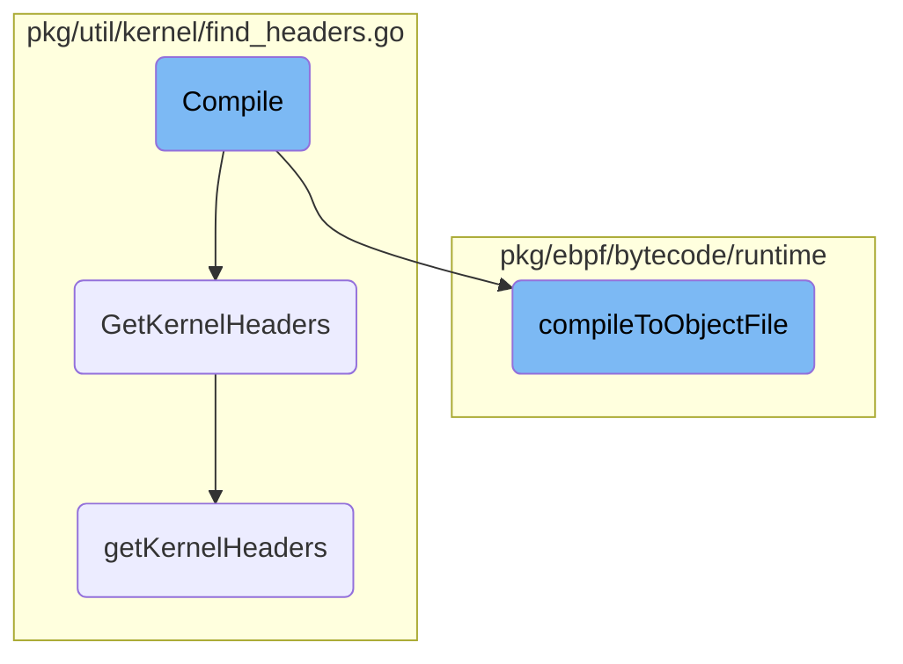

In this document, we will explain the process of compiling an asset to an object file. The process involves enabling compilation telemetry, fetching kernel headers, preparing the output directory, verifying the input file, and performing the actual compilation.

The flow starts by enabling telemetry for the compilation process. Next, it fetches the necessary kernel headers, which are essential for the compilation. If the headers are not found locally, it attempts to download them. After obtaining the headers, the process prepares the output directory and verifies the input file to ensure everything is in place. Finally, the actual compilation is performed, resulting in an object file that is written to the output directory.

# Flow drill down



<SwmSnippet path="/pkg/ebpf/bytecode/runtime/asset.go" line="40">

---

## Compile

The <SwmToken path="pkg/ebpf/bytecode/runtime/asset.go" pos="40:2:2" line-data="// Compile compiles the asset to an object file, writes it to the configured output directory, and">`Compile`</SwmToken> function is responsible for compiling the asset to an object file, writing it to the configured output directory, and then opening and returning the compiled output. It starts by enabling compilation telemetry and fetching kernel headers using <SwmToken path="pkg/util/kernel/find_headers.go" pos="108:2:2" line-data="// GetKernelHeaders fetches and returns kernel headers for the currently running kernel.">`GetKernelHeaders`</SwmToken>. If kernel headers are not found, it returns an error. The function then prepares the output directory and verifies the input file before calling <SwmToken path="pkg/ebpf/bytecode/runtime/runtime_compilation_helpers.go" pos="54:2:2" line-data="// compileToObjectFile compiles the input ebpf program &amp; returns the compiled output">`compileToObjectFile`</SwmToken> to perform the actual compilation.

```go
// Compile compiles the asset to an object file, writes it to the configured output directory, and
// then opens and returns the compiled output
func (a *asset) Compile(config *ebpf.Config, additionalFlags []string, client statsd.ClientInterface) (CompiledOutput, error) {
	log.Debugf("starting runtime compilation of %s", a.filename)

	start := time.Now()
	a.tm.compilationEnabled = true
	defer func() {
		a.tm.compilationDuration = time.Since(start)
		if client != nil {
			a.tm.SubmitTelemetry(a.filename, client)
		}
	}()

	opts := kernel.HeaderOptions{
		DownloadEnabled: config.EnableKernelHeaderDownload,
		Dirs:            config.KernelHeadersDirs,
		DownloadDir:     config.KernelHeadersDownloadDir,
		AptConfigDir:    config.AptConfigDir,
		YumReposDir:     config.YumReposDir,
		ZypperReposDir:  config.ZypperReposDir,
```

---

</SwmSnippet>

<SwmSnippet path="/pkg/util/kernel/find_headers.go" line="108">

---

## <SwmToken path="pkg/util/kernel/find_headers.go" pos="108:2:2" line-data="// GetKernelHeaders fetches and returns kernel headers for the currently running kernel.">`GetKernelHeaders`</SwmToken>

The <SwmToken path="pkg/util/kernel/find_headers.go" pos="108:2:2" line-data="// GetKernelHeaders fetches and returns kernel headers for the currently running kernel.">`GetKernelHeaders`</SwmToken> function fetches and returns kernel headers for the currently running kernel. It ensures that kernel headers are only fetched once to avoid resource-intensive operations. If headers are not found locally, it attempts to download them.

```go
// GetKernelHeaders fetches and returns kernel headers for the currently running kernel.
//
// The first time GetKernelHeaders is called, it will search the host for kernel headers, and if they
// cannot be found it will attempt to download headers to the configured header download directory.
//
// Any subsequent calls to GetKernelHeaders will return the result of the first call. This is because
// kernel header downloading can be a resource intensive process, so we don't want to retry it an unlimited
// number of times.
func GetKernelHeaders(opts HeaderOptions, client statsd.ClientInterface) []string {
	providerMu.Lock()
	defer providerMu.Unlock()

	if HeaderProvider == nil {
		initProvider(opts)
	}

	if HeaderProvider.result != notAttempted {
		log.Debugf("kernel headers requested: returning result of previous search")
		return HeaderProvider.kernelHeaders
	}

```

---

</SwmSnippet>

<SwmSnippet path="/pkg/ebpf/bytecode/runtime/runtime_compilation_helpers.go" line="54">

---

## <SwmToken path="pkg/ebpf/bytecode/runtime/runtime_compilation_helpers.go" pos="54:2:2" line-data="// compileToObjectFile compiles the input ebpf program &amp; returns the compiled output">`compileToObjectFile`</SwmToken>

The <SwmToken path="pkg/ebpf/bytecode/runtime/runtime_compilation_helpers.go" pos="54:2:2" line-data="// compileToObjectFile compiles the input ebpf program &amp; returns the compiled output">`compileToObjectFile`</SwmToken> function compiles the input <SwmToken path="pkg/ebpf/bytecode/runtime/runtime_compilation_helpers.go" pos="54:10:10" line-data="// compileToObjectFile compiles the input ebpf program &amp; returns the compiled output">`ebpf`</SwmToken> program and returns the compiled output. It computes necessary flags, checks for existing compiled files, and if not found, compiles the program using the provided kernel headers. It also verifies the permissions of the compiled output file.

```go
// compileToObjectFile compiles the input ebpf program & returns the compiled output
func compileToObjectFile(inFile, outputDir, filename, inHash string, additionalFlags, kernelHeaders []string) (CompiledOutput, CompilationResult, error) {
	flags, flagHash := computeFlagsAndHash(additionalFlags)

	outputFile, err := getOutputFilePath(outputDir, filename, inHash, flagHash)
	if err != nil {
		return nil, outputFileErr, fmt.Errorf("unable to get output file path: %w", err)
	}

	var result CompilationResult
	if _, err := os.Stat(outputFile); err != nil {
		if !os.IsNotExist(err) {
			return nil, outputFileErr, fmt.Errorf("error stat-ing output file %s: %w", outputFile, err)
		}

		kv, err := kernel.HostVersion()
		if err != nil {
			return nil, kernelVersionErr, fmt.Errorf("unable to get kernel version: %w", err)
		}
		family, err := kernel.Family()
		if err != nil {
```

---

</SwmSnippet>

<SwmSnippet path="/pkg/util/kernel/find_headers.go" line="162">

---

## <SwmToken path="pkg/util/kernel/find_headers.go" pos="162:9:9" line-data="func (h *headerProvider) getKernelHeaders(hv Version) ([]string, headerFetchResult, error) {">`getKernelHeaders`</SwmToken>

The <SwmToken path="pkg/util/kernel/find_headers.go" pos="162:9:9" line-data="func (h *headerProvider) getKernelHeaders(hv Version) ([]string, headerFetchResult, error) {">`getKernelHeaders`</SwmToken> function is part of the kernel header provider and is responsible for searching and validating kernel headers. It checks configured directories, default directories, and system directories, and if headers are not found, it attempts to download them if enabled.

```go
func (h *headerProvider) getKernelHeaders(hv Version) ([]string, headerFetchResult, error) {
	log.Debugf("beginning search for kernel headers")

	if len(h.headerDirs) > 0 {
		if dirs := validateHeaderDirs(hv, h.headerDirs, true); len(dirs) > 0 {
			return h.headerDirs, customHeadersFound, nil
		}
		log.Debugf("unable to find configured kernel headers: no valid headers found")
	} else {
		if dirs := validateHeaderDirs(hv, getDefaultHeaderDirs(), true); len(dirs) > 0 {
			return dirs, defaultHeadersFound, nil
		}
		log.Debugf("unable to find default kernel headers: no valid headers found")

		// If no valid directories are found, attempt a fallback to extracting from `/sys/kernel/kheaders.tar.xz`
		// which is enabled via the `kheaders` kernel module and the `CONFIG_KHEADERS` kernel config option.
		// The `kheaders` module will be automatically added and removed if present and needed.
		var err error
		var dirs []string
		if dirs, err = getSysfsHeaderDirs(hv); err == nil {
			return dirs, sysfsHeadersFound, nil
```

---

</SwmSnippet>

&nbsp;

*This is an auto-generated document by Swimm AI 🌊 and has not yet been verified by a human*

<SwmMeta version="3.0.0" repo-id="Z2l0aHViJTNBJTNBZGF0YWRvZy1hZ2VudCUzQSUzQVN3aW1tLURlbW8=" repo-name="datadog-agent"><sup>Powered by [Swimm](/)</sup></SwmMeta>
