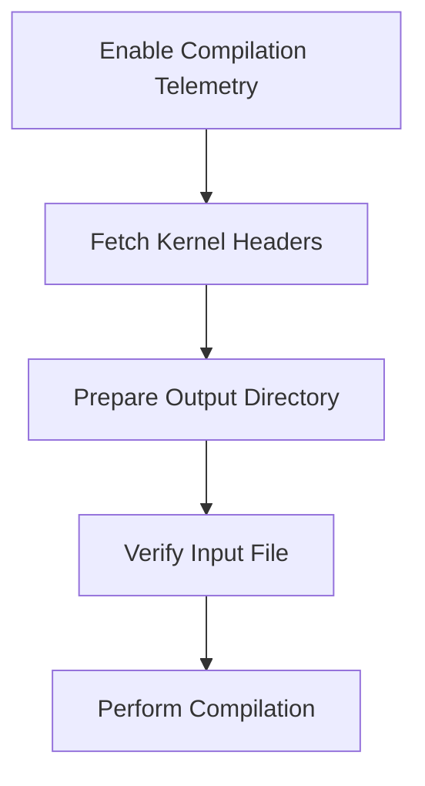

This document will cover the Compilation Process Overview, which includes:

1. Enabling compilation telemetry
2. Fetching kernel headers
3. Preparing the output directory
4. Verifying the input file
5. Performing the actual compilation.

Technical document: <SwmLink doc-title="Compilation Process Overview">[Compilation Process Overview](/.swm/compilation-process-overview.glb9a5bh.sw.md)</SwmLink>

# [Enabling Compilation Telemetry](https://app.swimm.io/repos/Z2l0aHViJTNBJTNBZGF0YWRvZy1hZ2VudCUzQSUzQVN3aW1tLURlbW8=/docs/glb9a5bh#compile)

The first step in the compilation process is to enable telemetry. This means that the system starts tracking various metrics related to the compilation process, such as the duration and success rate. This data is crucial for monitoring and optimizing the compilation process over time. For the end user, this ensures that any issues during compilation can be quickly identified and addressed, leading to a more reliable and efficient system.

# [Fetching Kernel Headers](https://app.swimm.io/repos/Z2l0aHViJTNBJTNBZGF0YWRvZy1hZ2VudCUzQSUzQVN3aW1tLURlbW8=/docs/glb9a5bh#getkernelheaders)

Kernel headers are essential files that provide information about the kernel's structure and functions. The system first checks if these headers are available locally. If not, it attempts to download them. This step ensures that the compilation process has all the necessary information to proceed. For the end user, this means that the system can adapt to different environments and kernel versions, ensuring compatibility and reducing the likelihood of errors.

# [Preparing the Output Directory](https://app.swimm.io/repos/Z2l0aHViJTNBJTNBZGF0YWRvZy1hZ2VudCUzQSUzQVN3aW1tLURlbW8=/docs/glb9a5bh#compile)

Before the actual compilation can begin, the system prepares the output directory where the compiled object file will be stored. This involves creating the directory if it doesn't exist and ensuring that it has the necessary permissions. For the end user, this step ensures that the compiled files are organized and easily accessible, which is important for subsequent operations and debugging.

# [Verifying the Input File](https://app.swimm.io/repos/Z2l0aHViJTNBJTNBZGF0YWRvZy1hZ2VudCUzQSUzQVN3aW1tLURlbW8=/docs/glb9a5bh#compile)

The system then verifies the input file to ensure that it is valid and ready for compilation. This involves checking the file's format, size, and other attributes. For the end user, this step ensures that only valid files are processed, reducing the likelihood of errors and ensuring a smooth compilation process.

# [Performing the Actual Compilation](https://app.swimm.io/repos/Z2l0aHViJTNBJTNBZGF0YWRvZy1hZ2VudCUzQSUzQVN3aW1tLURlbW8=/docs/glb9a5bh#compiletoobjectfile)

Finally, the system performs the actual compilation, converting the input file into an object file. This involves several sub-steps, such as computing necessary flags, checking for existing compiled files, and using the kernel headers to compile the program. For the end user, this step is the culmination of the entire process, resulting in a compiled object file that can be used for various purposes, such as running eBPF programs.

&nbsp;

*This is an auto-generated document by Swimm AI 🌊 and has not yet been verified by a human*

<SwmMeta version="3.0.0" repo-id="Z2l0aHViJTNBJTNBZGF0YWRvZy1hZ2VudCUzQSUzQVN3aW1tLURlbW8=" repo-name="datadog-agent">Powered by [Swimm](/)</SwmMeta>
