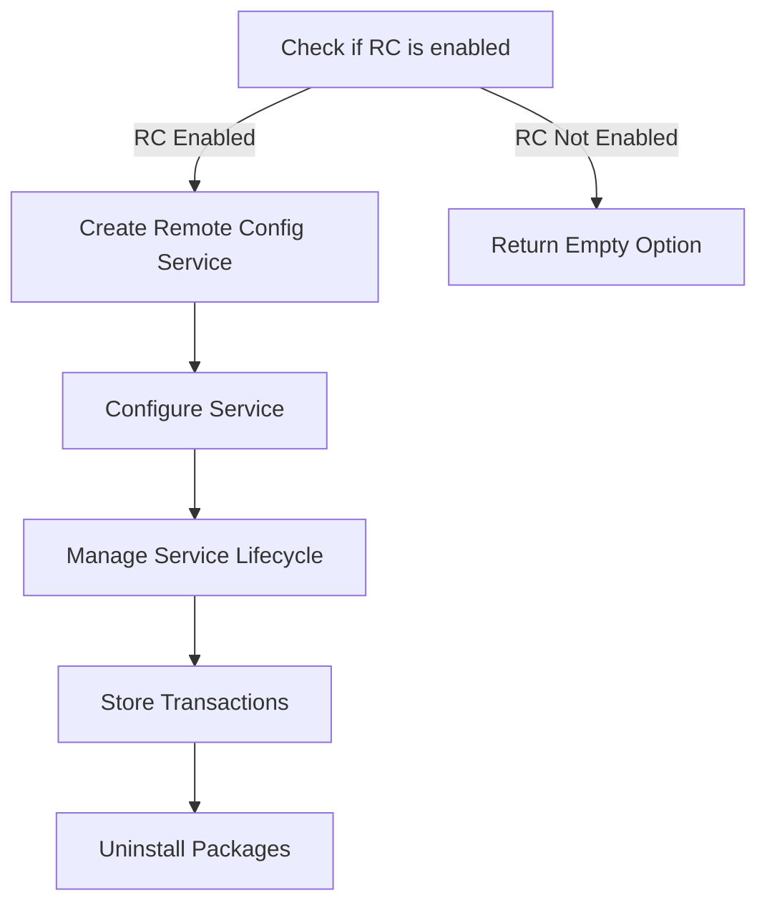

This document will cover the Conditional Remote Config Service Creation feature, which includes:

1. Checking if Remote Configuration (RC) is enabled
2. Creating and configuring the Remote Config Service
3. Managing the service lifecycle
4. Storing transactions
5. Uninstalling packages

Technical document: <SwmLink doc-title="Conditional Remote Config Service Creation">[Conditional Remote Config Service Creation](/.swm/conditional-remote-config-service-creation.jdgtauod.sw.md)</SwmLink>

# [Checking if Remote Configuration (RC) is enabled](https://app.swimm.io/repos/Z2l0aHViJTNBJTNBZGF0YWRvZy1hZ2VudCUzQSUzQVN3aW1tLURlbW8=/docs/jdgtauod#newremoteconfigserviceoptional)

The process begins by checking if Remote Configuration (RC) is enabled. This is a crucial step because the subsequent actions depend on whether RC is active. If RC is not enabled, the system will return an empty option, meaning no further actions will be taken regarding the remote config service.

# [Creating and configuring the Remote Config Service](https://app.swimm.io/repos/Z2l0aHViJTNBJTNBZGF0YWRvZy1hZ2VudCUzQSUzQVN3aW1tLURlbW8=/docs/jdgtauod#newremoteconfigservice)

If RC is enabled, the system proceeds to create a new Remote Config Service. This involves setting up various options such as the API key, endpoints, and refresh intervals. These configurations ensure that the service can communicate effectively with the Datadog platform and perform its intended functions.

# [Managing the service lifecycle](https://app.swimm.io/repos/Z2l0aHViJTNBJTNBZGF0YWRvZy1hZ2VudCUzQSUzQVN3aW1tLURlbW8=/docs/jdgtauod#start)

Once the Remote Config Service is created and configured, its lifecycle needs to be managed. This includes registering start and stop hooks to control when the service is active. The forwarder is then started, which initializes and runs the forwarder, logs the endpoints configuration, and starts the health checker. This ensures that the service remains operational and can handle incoming data efficiently.

# [Storing transactions](https://app.swimm.io/repos/Z2l0aHViJTNBJTNBZGF0YWRvZy1hZ2VudCUzQSUzQVN3aW1tLURlbW8=/docs/jdgtauod#store)

Transactions are stored to the file system to ensure data persistence. This involves serializing the transactions and writing the serialized data to a temporary file. The system also makes room for new data if necessary by removing old files. This step is crucial for maintaining data integrity and ensuring that the system can handle new transactions without running out of storage space.

# [Uninstalling packages](https://app.swimm.io/repos/Z2l0aHViJTNBJTNBZGF0YWRvZy1hZ2VudCUzQSUzQVN3aW1tLURlbW8=/docs/jdgtauod#remove)

The process also includes uninstalling packages by removing them from the repositories and database. This involves locking the installer, calling the appropriate service removal function for each package type, and handling errors at each step. This ensures that outdated or unnecessary packages are removed from the system, freeing up resources and maintaining system efficiency.

&nbsp;

*This is an auto-generated document by Swimm AI 🌊 and has not yet been verified by a human*

<SwmMeta version="3.0.0" repo-id="Z2l0aHViJTNBJTNBZGF0YWRvZy1hZ2VudCUzQSUzQVN3aW1tLURlbW8=" repo-name="datadog-agent">Powered by [Swimm](/)</SwmMeta>
