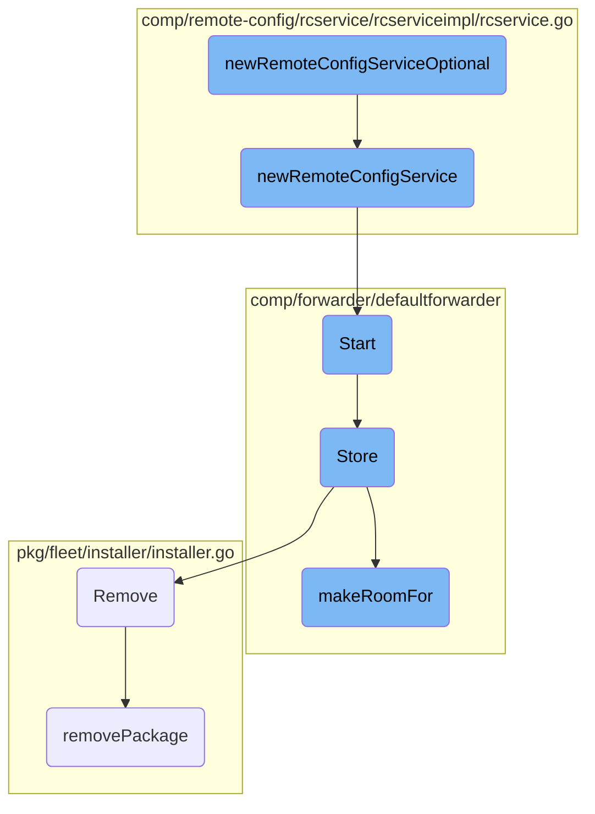

This document explains the process of conditionally creating and configuring a new remote config service. The process involves checking if remote configuration (RC) is enabled, creating the service if it is, and handling the service lifecycle.

The flow starts by checking if remote configuration (RC) is enabled. If RC is not enabled, the function returns an empty option. If RC is enabled, it creates a new remote config service and returns it. The service is then initialized and configured with various options like API key, endpoints, and refresh intervals. The service lifecycle is managed by registering start and stop hooks. The forwarder is then started, which initializes and runs the forwarder, logs the endpoints configuration, and starts the health checker. Transactions are stored to the file system, making room for new data if necessary. The process also includes uninstalling packages by removing them from the repositories and database.

# Flow drill down



<SwmSnippet path="/comp/remote-config/rcservice/rcserviceimpl/rcservice.go" line="48">

---

## <SwmToken path="comp/remote-config/rcservice/rcserviceimpl/rcservice.go" pos="48:2:2" line-data="// newRemoteConfigServiceOptional conditionally creates and configures a new remote config service, based on whether RC is enabled.">`newRemoteConfigServiceOptional`</SwmToken>

The function <SwmToken path="comp/remote-config/rcservice/rcserviceimpl/rcservice.go" pos="48:2:2" line-data="// newRemoteConfigServiceOptional conditionally creates and configures a new remote config service, based on whether RC is enabled.">`newRemoteConfigServiceOptional`</SwmToken> conditionally creates and configures a new remote config service based on whether remote configuration (RC) is enabled. If RC is not enabled, it returns an empty option. If RC is enabled, it calls <SwmToken path="comp/remote-config/rcservice/rcserviceimpl/rcservice.go" pos="55:8:8" line-data="	configService, err := newRemoteConfigService(deps)">`newRemoteConfigService`</SwmToken> to create the service and returns it.

```go
// newRemoteConfigServiceOptional conditionally creates and configures a new remote config service, based on whether RC is enabled.
func newRemoteConfigServiceOptional(deps dependencies) optional.Option[rcservice.Component] {
	none := optional.NewNoneOption[rcservice.Component]()
	if !config.IsRemoteConfigEnabled(deps.Cfg) {
		return none
	}

	configService, err := newRemoteConfigService(deps)
	if err != nil {
		deps.Logger.Errorf("remote config service not initialized or started: %s", err)
		return none
	}

	return optional.NewOption[rcservice.Component](configService)
}
```

---

</SwmSnippet>

<SwmSnippet path="/comp/remote-config/rcservice/rcserviceimpl/rcservice.go" line="64">

---

## <SwmToken path="comp/remote-config/rcservice/rcserviceimpl/rcservice.go" pos="65:2:2" line-data="func newRemoteConfigService(deps dependencies) (rcservice.Component, error) {">`newRemoteConfigService`</SwmToken>

The function <SwmToken path="comp/remote-config/rcservice/rcserviceimpl/rcservice.go" pos="65:2:2" line-data="func newRemoteConfigService(deps dependencies) (rcservice.Component, error) {">`newRemoteConfigService`</SwmToken> creates and configures a new remote config service. It sets up various options such as API key, endpoints, and refresh intervals. It then initializes the service and registers start and stop hooks to manage the service lifecycle.

```go
// newRemoteConfigServiceOptional creates and configures a new remote config service
func newRemoteConfigService(deps dependencies) (rcservice.Component, error) {
	apiKey := deps.Cfg.GetString("api_key")
	if deps.Cfg.IsSet("remote_configuration.api_key") {
		apiKey = deps.Cfg.GetString("remote_configuration.api_key")
	}
	apiKey = configUtils.SanitizeAPIKey(apiKey)
	baseRawURL := configUtils.GetMainEndpoint(deps.Cfg, "https://config.", "remote_configuration.rc_dd_url")
	traceAgentEnv := configUtils.GetTraceAgentDefaultEnv(deps.Cfg)
	configuredTags := configUtils.GetConfiguredTags(deps.Cfg, false)

	options := []remoteconfig.Option{
		remoteconfig.WithAPIKey(apiKey),
		remoteconfig.WithTraceAgentEnv(traceAgentEnv),
		remoteconfig.WithConfigRootOverride(deps.Cfg.GetString("site"), deps.Cfg.GetString("remote_configuration.config_root")),
		remoteconfig.WithDirectorRootOverride(deps.Cfg.GetString("site"), deps.Cfg.GetString("remote_configuration.director_root")),
		remoteconfig.WithRcKey(deps.Cfg.GetString("remote_configuration.key")),
	}
	if deps.Params != nil {
		options = append(options, deps.Params.Options...)
	}
```

---

</SwmSnippet>

<SwmSnippet path="/comp/forwarder/defaultforwarder/default_forwarder.go" line="374">

---

## Start

The <SwmToken path="comp/forwarder/defaultforwarder/default_forwarder.go" pos="374:2:2" line-data="// Start initialize and runs the forwarder.">`Start`</SwmToken> method initializes and runs the forwarder. It locks the forwarder to prevent stopping it while starting, checks if it is already started, and then starts each domain forwarder. It logs the endpoints configuration and starts the health checker.

```go
// Start initialize and runs the forwarder.
func (f *DefaultForwarder) Start() error {
	// Lock so we can't stop a Forwarder while is starting
	f.m.Lock()
	defer f.m.Unlock()

	if f.internalState.Load() == Started {
		return fmt.Errorf("the forwarder is already started")
	}

	for _, df := range f.domainForwarders {
		_ = df.Start()
	}

	// log endpoints configuration
	endpointLogs := make([]string, 0, len(f.domainResolvers))
	for domain, dr := range f.domainResolvers {
		endpointLogs = append(endpointLogs, fmt.Sprintf("\"%s\" (%v api key(s))",
			domain, len(dr.GetAPIKeys())))
	}
	f.log.Infof("Forwarder started, sending to %v endpoint(s) with %v worker(s) each: %s",
```

---

</SwmSnippet>

<SwmSnippet path="/comp/forwarder/defaultforwarder/internal/retry/on_disk_retry_queue.go" line="67">

---

## Store

The <SwmToken path="comp/forwarder/defaultforwarder/internal/retry/on_disk_retry_queue.go" pos="67:2:2" line-data="// Store stores transactions to the file system.">`Store`</SwmToken> method stores transactions to the file system. It serializes the transactions, makes room for the new data if necessary, and writes the serialized data to a temporary file. It updates the current disk usage and telemetry data.

```go
// Store stores transactions to the file system.
func (s *onDiskRetryQueue) Store(transactions []transaction.Transaction) error {
	s.telemetry.addSerializeCount()

	// Reset the serializer in case some transactions were serialized
	// but `GetBytesAndReset` was not called because of an error.
	_, _ = s.serializer.GetBytesAndReset()

	for _, t := range transactions {
		if err := t.SerializeTo(s.log, s.serializer); err != nil {
			return err
		}
	}

	bytes, err := s.serializer.GetBytesAndReset()
	if err != nil {
		return err
	}
	bufferSize := int64(len(bytes))

	if err := s.makeRoomFor(bufferSize); err != nil {
```

---

</SwmSnippet>

<SwmSnippet path="/pkg/fleet/installer/installer.go" line="297">

---

## Remove

The <SwmToken path="pkg/fleet/installer/installer.go" pos="297:2:2" line-data="// Remove uninstalls a package.">`Remove`</SwmToken> method uninstalls a package. It locks the installer, calls <SwmToken path="pkg/fleet/installer/installer.go" pos="301:7:7" line-data="	err := i.removePackage(ctx, pkg)">`removePackage`</SwmToken> to remove the package, and then deletes the package from the repositories and database. It handles errors at each step and returns an error if any step fails.

```go
// Remove uninstalls a package.
func (i *installerImpl) Remove(ctx context.Context, pkg string) error {
	i.m.Lock()
	defer i.m.Unlock()
	err := i.removePackage(ctx, pkg)
	if err != nil {
		return fmt.Errorf("could not remove package: %w", err)
	}
	err = i.repositories.Delete(ctx, pkg)
	if err != nil {
		return fmt.Errorf("could not delete repository: %w", err)
	}
	err = i.db.DeletePackage(pkg)
	if err != nil {
		return fmt.Errorf("could not remove package installation in db: %w", err)
	}
	return nil
}
```

---

</SwmSnippet>

<SwmSnippet path="/comp/forwarder/defaultforwarder/internal/retry/on_disk_retry_queue.go" line="154">

---

## <SwmToken path="comp/forwarder/defaultforwarder/internal/retry/on_disk_retry_queue.go" pos="154:9:9" line-data="func (s *onDiskRetryQueue) makeRoomFor(bufferSize int64) error {">`makeRoomFor`</SwmToken>

The <SwmToken path="comp/forwarder/defaultforwarder/internal/retry/on_disk_retry_queue.go" pos="154:9:9" line-data="func (s *onDiskRetryQueue) makeRoomFor(bufferSize int64) error {">`makeRoomFor`</SwmToken> method ensures there is enough disk space for new data by removing old files if necessary. It calculates the available space and removes files until there is enough room for the new data. It updates telemetry data for removed files.

```go
func (s *onDiskRetryQueue) makeRoomFor(bufferSize int64) error {
	maxSizeInBytes := s.diskUsageLimit.getMaxSizeInBytes()
	if bufferSize > maxSizeInBytes {
		return fmt.Errorf("The payload is too big. Current:%v Maximum:%v", bufferSize, maxSizeInBytes)
	}

	maxStorageInBytes, err := s.diskUsageLimit.computeAvailableSpace(s.currentSizeInBytes)
	if err != nil {
		return err
	}
	for len(s.filenames) > 0 && s.currentSizeInBytes+bufferSize > maxStorageInBytes {
		index := 0
		filename := s.filenames[index]
		s.log.Errorf("Maximum disk space for retry transactions is reached. Removing %s", filename)

		bytes, err := os.ReadFile(filename)
		if err != nil {
			s.log.Errorf("Cannot read the file %v: %v", filename, err)
		} else if transactions, _, errDeserialize := s.serializer.Deserialize(bytes); errDeserialize == nil {
			pointDroppedCount := 0
			for _, tr := range transactions {
```

---

</SwmSnippet>

<SwmSnippet path="/pkg/fleet/installer/installer.go" line="410">

---

## <SwmToken path="pkg/fleet/installer/installer.go" pos="410:9:9" line-data="func (i *installerImpl) removePackage(ctx context.Context, pkg string) error {">`removePackage`</SwmToken>

The <SwmToken path="pkg/fleet/installer/installer.go" pos="410:9:9" line-data="func (i *installerImpl) removePackage(ctx context.Context, pkg string) error {">`removePackage`</SwmToken> method removes a specific package based on its type. It calls the appropriate service removal function for each package type and returns nil for unknown package types.

```go
func (i *installerImpl) removePackage(ctx context.Context, pkg string) error {
	switch pkg {
	case packageDatadogAgent:
		return service.RemoveAgent(ctx)
	case packageAPMInjector:
		return service.RemoveAPMInjector(ctx)
	case packageDatadogInstaller:
		return service.RemoveInstaller(ctx)
	default:
		return nil
	}
}
```

---

</SwmSnippet>

&nbsp;

*This is an auto-generated document by Swimm AI 🌊 and has not yet been verified by a human*

<SwmMeta version="3.0.0" repo-id="Z2l0aHViJTNBJTNBZGF0YWRvZy1hZ2VudCUzQSUzQVN3aW1tLURlbW8=" repo-name="datadog-agent"><sup>Powered by [Swimm](/)</sup></SwmMeta>
