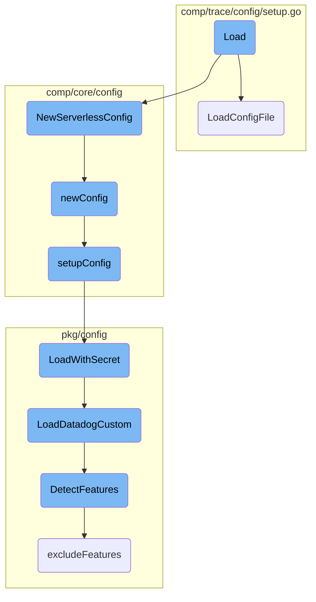
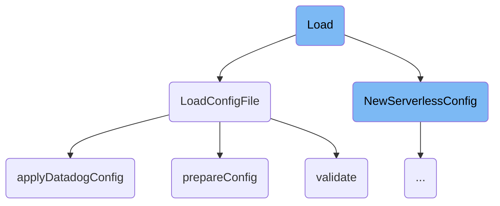
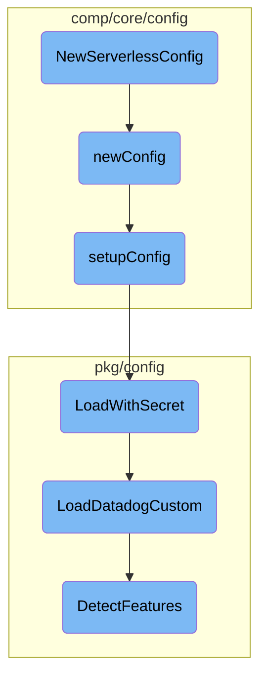
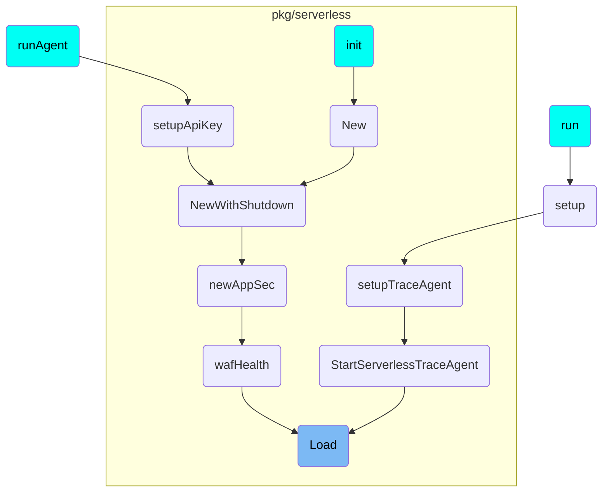

This document explains the 'Load' process, which is responsible for loading configuration settings from a specified file path. The process involves creating a new serverless configuration, loading the configuration file, applying Datadog-specific settings, and validating the configuration.

The 'Load' process starts by creating a new serverless configuration. It then loads the configuration file from the specified path. After loading the file, it applies various Datadog-specific settings such as API keys and hostnames. Finally, it validates the configuration to ensure all necessary settings are correctly applied.

Here is a high level diagram of the flow, showing only the most important functions:



# Flow drill down

First, we'll zoom into this section of the flow:



<SwmSnippet path="/pkg/serverless/trace/trace.go" line="83">

---

## Load

The <SwmToken path="pkg/serverless/trace/trace.go" pos="83:2:2" line-data="// Load loads the config from a file path">`Load`</SwmToken> function is responsible for loading the configuration from a specified file path. It first creates a new serverless configuration using <SwmToken path="pkg/serverless/trace/trace.go" pos="85:10:10" line-data="	c, err := compcorecfg.NewServerlessConfig(l.Path)">`NewServerlessConfig`</SwmToken>. If successful, it then calls <SwmToken path="pkg/serverless/trace/trace.go" pos="89:5:5" line-data="	return comptracecfg.LoadConfigFile(l.Path, c)">`LoadConfigFile`</SwmToken> to load the configuration file.

```go
// Load loads the config from a file path
func (l *LoadConfig) Load() (*config.AgentConfig, error) {
	c, err := compcorecfg.NewServerlessConfig(l.Path)
	if err != nil {
		return nil, err
	}
	return comptracecfg.LoadConfigFile(l.Path, c)
}
```

---

</SwmSnippet>

<SwmSnippet path="/comp/trace/config/setup.go" line="59">

---

## <SwmToken path="comp/trace/config/setup.go" pos="59:2:2" line-data="// LoadConfigFile returns a new configuration based on the given path. The path must not necessarily exist">`LoadConfigFile`</SwmToken>

The <SwmToken path="comp/trace/config/setup.go" pos="59:2:2" line-data="// LoadConfigFile returns a new configuration based on the given path. The path must not necessarily exist">`LoadConfigFile`</SwmToken> function returns a new configuration based on the given path. It uses <SwmToken path="comp/trace/config/setup.go" pos="63:8:8" line-data="	cfg, err := prepareConfig(c)">`prepareConfig`</SwmToken> to set up the initial configuration and then applies Datadog-specific settings using <SwmToken path="comp/trace/config/setup.go" pos="73:7:7" line-data="	if err := applyDatadogConfig(cfg, c); err != nil {">`applyDatadogConfig`</SwmToken>. Finally, it validates the configuration using the <SwmToken path="comp/trace/config/setup.go" pos="77:6:6" line-data="	return cfg, validate(cfg, c)">`validate`</SwmToken> function.

```go
// LoadConfigFile returns a new configuration based on the given path. The path must not necessarily exist
// and a valid configuration can be returned based on defaults and environment variables. If a
// valid configuration can not be obtained, an error is returned.
func LoadConfigFile(path string, c corecompcfg.Component) (*config.AgentConfig, error) {
	cfg, err := prepareConfig(c)
	if err != nil {
		if !os.IsNotExist(err) {
			return nil, err
		}
	} else {
		cfg.ConfigPath = path
		log.Infof("Loaded configuration: %s", cfg.ConfigPath)
	}

	if err := applyDatadogConfig(cfg, c); err != nil {
		log.Error(err)
	}

	return cfg, validate(cfg, c)
```

---

</SwmSnippet>

<SwmSnippet path="/comp/trace/config/setup.go" line="145">

---

### <SwmToken path="comp/trace/config/setup.go" pos="145:2:2" line-data="func applyDatadogConfig(c *config.AgentConfig, core corecompcfg.Component) error {">`applyDatadogConfig`</SwmToken>

The <SwmToken path="comp/trace/config/setup.go" pos="145:2:2" line-data="func applyDatadogConfig(c *config.AgentConfig, core corecompcfg.Component) error {">`applyDatadogConfig`</SwmToken> function applies various Datadog-specific settings to the configuration. This includes setting API keys, hostnames, proxy settings, and other APM-related configurations. It ensures that all necessary settings are correctly applied to the configuration object.

```go
func applyDatadogConfig(c *config.AgentConfig, core corecompcfg.Component) error {
	if len(c.Endpoints) == 0 {
		c.Endpoints = []*config.Endpoint{{}}
	}
	if core.IsSet("api_key") {
		c.Endpoints[0].APIKey = utils.SanitizeAPIKey(coreconfig.Datadog().GetString("api_key"))
	}
	if core.IsSet("hostname") {
		c.Hostname = core.GetString("hostname")
	}
	if core.IsSet("dogstatsd_port") {
		c.StatsdPort = core.GetInt("dogstatsd_port")
	}

	obsPipelineEnabled, prefix := isObsPipelineEnabled(core)
	if obsPipelineEnabled {
		if host := core.GetString(fmt.Sprintf("%s.traces.url", prefix)); host == "" {
			log.Errorf("%s.traces.enabled but %s.traces.url is empty.", prefix, prefix)
		} else {
			c.Endpoints[0].Host = host
		}
```

---

</SwmSnippet>

<SwmSnippet path="/comp/trace/config/setup.go" line="80">

---

### <SwmToken path="comp/trace/config/setup.go" pos="80:2:2" line-data="func prepareConfig(c corecompcfg.Component) (*config.AgentConfig, error) {">`prepareConfig`</SwmToken>

The <SwmToken path="comp/trace/config/setup.go" pos="80:2:2" line-data="func prepareConfig(c corecompcfg.Component) (*config.AgentConfig, error) {">`prepareConfig`</SwmToken> function initializes a new configuration object with default values and settings. It also sets up logging, proxy settings, and remote configuration management if enabled.

```go
func prepareConfig(c corecompcfg.Component) (*config.AgentConfig, error) {
	cfg := config.New()
	cfg.DDAgentBin = defaultDDAgentBin
	cfg.AgentVersion = version.AgentVersion
	cfg.GitCommit = version.Commit
	cfg.ReceiverSocket = defaultReceiverSocket

	// the core config can be assumed to already be set-up as it has been
	// injected as a component dependency
	// TODO: do not interface directly with pkg/config anywhere
	coreConfigObject := c.Object()
	if coreConfigObject == nil {
		return nil, errors.New("no core config found! Bailing out")
	}

	if !coreConfigObject.GetBool("disable_file_logging") {
		cfg.LogFilePath = DefaultLogFilePath
	}

	ipcAddress, err := coreconfig.GetIPCAddress()
	if err != nil {
```

---

</SwmSnippet>

<SwmSnippet path="/comp/trace/config/setup.go" line="803">

---

### validate

The <SwmToken path="comp/trace/config/setup.go" pos="803:2:2" line-data="// validate validates if the current configuration is good for the agent to start with.">`validate`</SwmToken> function checks if the current configuration is valid for the agent to start. It ensures that essential settings like API keys and agent binary paths are set and attempts to resolve the hostname if not provided.

```go
// validate validates if the current configuration is good for the agent to start with.
func validate(c *config.AgentConfig, core corecompcfg.Component) error {
	if len(c.Endpoints) == 0 || c.Endpoints[0].APIKey == "" {
		return config.ErrMissingAPIKey
	}
	if c.DDAgentBin == "" {
		return errors.New("agent binary path not set")
	}

	if c.Hostname == "" && !core.GetBool("serverless.enabled") {
		if err := hostname(c); err != nil {
			return err
		}
	}
	return nil
}
```

---

</SwmSnippet>

Now, lets zoom into this section of the flow:



<SwmSnippet path="/comp/core/config/config.go" line="64">

---

## <SwmToken path="comp/core/config/config.go" pos="64:2:2" line-data="// NewServerlessConfig initializes a config component from the given config file">`NewServerlessConfig`</SwmToken> Initialization

The <SwmToken path="comp/core/config/config.go" pos="64:2:2" line-data="// NewServerlessConfig initializes a config component from the given config file">`NewServerlessConfig`</SwmToken> function initializes a serverless configuration component. It first sets up configuration options, checks if the provided path exists, and adjusts the options accordingly. Finally, it creates a new <SwmToken path="comp/core/config/config.go" pos="77:5:5" line-data="	d := dependencies{Params: NewParams(path, options...)}">`dependencies`</SwmToken> object and calls <SwmToken path="comp/core/config/config.go" pos="78:3:3" line-data="	return newConfig(d)">`newConfig`</SwmToken> to proceed with the configuration setup.

```go
// NewServerlessConfig initializes a config component from the given config file
// TODO: serverless must be eventually migrated to fx, this workaround will then become obsolete - ts should not be created directly in this fashion.
func NewServerlessConfig(path string) (Component, error) {
	options := []func(*Params){WithConfigName("serverless")}

	_, err := os.Stat(path)
	if os.IsNotExist(err) &&
		(strings.HasSuffix(path, ".yaml") || strings.HasSuffix(path, ".yml")) {
		options = append(options, WithConfigMissingOK(true))
	} else if !os.IsNotExist(err) {
		options = append(options, WithConfFilePath(path))
	}

	d := dependencies{Params: NewParams(path, options...)}
	return newConfig(d)
```

---

</SwmSnippet>

<SwmSnippet path="/comp/core/config/config.go" line="89">

---

## Configuration Setup with <SwmToken path="comp/core/config/config.go" pos="89:2:2" line-data="func newConfig(deps dependencies) (*cfg, error) {">`newConfig`</SwmToken>

The <SwmToken path="comp/core/config/config.go" pos="89:2:2" line-data="func newConfig(deps dependencies) (*cfg, error) {">`newConfig`</SwmToken> function is responsible for setting up the configuration using the provided dependencies. It initializes the Datadog configuration, calls <SwmToken path="comp/core/config/config.go" pos="91:8:8" line-data="	warnings, err := setupConfig(config, deps)">`setupConfig`</SwmToken> to load the configuration, and handles any warnings or errors that occur during the process. If security agent configuration is required, it merges the necessary settings.

```go
func newConfig(deps dependencies) (*cfg, error) {
	config := pkgconfigsetup.Datadog()
	warnings, err := setupConfig(config, deps)
	returnErrFct := func(e error) (*cfg, error) {
		if e != nil && deps.Params.ignoreErrors {
			if warnings == nil {
				warnings = &pkgconfigmodel.Warnings{}
			}
			warnings.Err = e
			e = nil
		}
		return &cfg{Config: config, warnings: warnings}, e
	}

	if err != nil {
		return returnErrFct(err)
	}

	if deps.Params.configLoadSecurityAgent {
		if err := pkgconfigsetup.Merge(deps.Params.securityAgentConfigFilePaths, config); err != nil {
			return returnErrFct(err)
```

---

</SwmSnippet>

<SwmSnippet path="/comp/core/config/setup.go" line="21">

---

### Detailed Configuration Setup

The <SwmToken path="comp/core/config/setup.go" pos="21:2:2" line-data="// setupConfig is copied from cmd/agent/common/helpers.go.">`setupConfig`</SwmToken> function performs the detailed setup of the configuration. It sets the configuration file paths, loads extra configuration paths, and handles the loading of the configuration with or without secrets. It also manages errors related to missing or inaccessible configuration files.

```go
// setupConfig is copied from cmd/agent/common/helpers.go.
func setupConfig(config pkgconfigmodel.Config, deps configDependencies) (*pkgconfigmodel.Warnings, error) {
	p := deps.getParams()

	confFilePath := p.ConfFilePath
	configName := p.configName
	failOnMissingFile := !p.configMissingOK
	defaultConfPath := p.defaultConfPath

	if configName != "" {
		config.SetConfigName(configName)
	}

	// set the paths where a config file is expected
	if len(confFilePath) != 0 {
		// if the configuration file path was supplied on the command line,
		// add that first so it's first in line
		config.AddConfigPath(confFilePath)
		// If they set a config file directly, let's try to honor that
		if strings.HasSuffix(confFilePath, ".yaml") || strings.HasSuffix(confFilePath, ".yml") {
			config.SetConfigFile(confFilePath)
```

---

</SwmSnippet>

<SwmSnippet path="/pkg/config/setup/config.go" line="1655">

---

## Loading Configuration with Secrets

The <SwmToken path="pkg/config/setup/config.go" pos="1655:2:2" line-data="// LoadWithSecret reads config files and initializes config with decrypted secrets">`LoadWithSecret`</SwmToken> function reads the configuration files and initializes the configuration with decrypted secrets. It delegates the actual loading to <SwmToken path="pkg/config/setup/config.go" pos="1657:3:3" line-data="	return LoadDatadogCustom(config, &quot;datadog.yaml&quot;, optional.NewOption[secrets.Component](secretResolver), additionalEnvVars)">`LoadDatadogCustom`</SwmToken>.

```go
// LoadWithSecret reads config files and initializes config with decrypted secrets
func LoadWithSecret(config pkgconfigmodel.Config, secretResolver secrets.Component, additionalEnvVars []string) (*pkgconfigmodel.Warnings, error) {
	return LoadDatadogCustom(config, "datadog.yaml", optional.NewOption[secrets.Component](secretResolver), additionalEnvVars)
```

---

</SwmSnippet>

<SwmSnippet path="/pkg/config/setup/config.go" line="1837">

---

## Custom Configuration Loading

The <SwmToken path="pkg/config/setup/config.go" pos="1837:2:2" line-data="// LoadDatadogCustom loads the datadog config in the given config">`LoadDatadogCustom`</SwmToken> function loads the Datadog configuration and performs various setup tasks, including feature detection, proxy settings, secret resolution, and conflict checks. It ensures that the configuration is properly initialized and ready for use.

```go
// LoadDatadogCustom loads the datadog config in the given config
func LoadDatadogCustom(config pkgconfigmodel.Config, origin string, secretResolver optional.Option[secrets.Component], additionalKnownEnvVars []string) (*pkgconfigmodel.Warnings, error) {
	// Feature detection running in a defer func as it always  need to run (whether config load has been successful or not)
	// Because some Agents (e.g. trace-agent) will run even if config file does not exist
	defer func() {
		// Environment feature detection needs to run before applying override funcs
		// as it may provide such overrides
		pkgconfigenv.DetectFeatures(config)
		pkgconfigmodel.ApplyOverrideFuncs(config)
	}()

	warnings := &pkgconfigmodel.Warnings{}
	err := LoadCustom(config, additionalKnownEnvVars)
	if err != nil {
		if errors.Is(err, os.ErrPermission) {
			log.Warnf("Error loading config: %v (check config file permissions for dd-agent user)", err)
		} else {
			log.Warnf("Error loading config: %v", err)
		}
		return warnings, err
	}
```

---

</SwmSnippet>

<SwmSnippet path="/pkg/config/env/environment_detection.go" line="96">

---

## Feature Detection

The <SwmToken path="pkg/config/env/environment_detection.go" pos="96:2:2" line-data="// DetectFeatures runs the feature detection.">`DetectFeatures`</SwmToken> function runs the feature detection process. It ensures that the Datadog configuration is fully loaded before detecting features based on the environment. It updates the detected features and logs the results.

```go
// DetectFeatures runs the feature detection.
// We guarantee that Datadog configuration is entirely loaded (env + YAML)
// before this function is called
func DetectFeatures(cfg model.Reader) {
	featureLock.Lock()
	defer featureLock.Unlock()

	// Detection should not run in unit tests to avoid overriding features based on runner environment
	if detectionAlwaysDisabledInTests {
		return
	}

	newFeatures := make(FeatureMap)
	if IsAutoconfigEnabled(cfg) {
		detectContainerFeatures(newFeatures, cfg)
		excludedFeatures := cfg.GetStringSlice("autoconfig_exclude_features")
		excludeFeatures(newFeatures, excludedFeatures)

		includedFeatures := cfg.GetStringSlice("autoconfig_include_features")
		for _, f := range includedFeatures {
			f = strings.ToLower(f)
```

---

</SwmSnippet>

# Where is this flow used?

This flow is used multiple times in the codebase as represented in the following diagram:



&nbsp;

*This is an auto-generated document by Swimm AI 🌊 and has not yet been verified by a human*

<SwmMeta version="3.0.0" repo-id="Z2l0aHViJTNBJTNBZGF0YWRvZy1hZ2VudCUzQSUzQVN3aW1tLURlbW8=" repo-name="datadog-agent"><sup>Powered by [Swimm](/)</sup></SwmMeta>
