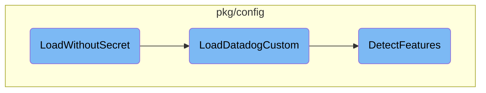

This document explains the <SwmToken path="pkg/config/setup/config.go" pos="1650:2:2" line-data="// LoadWithoutSecret reads configs files, initializes the config module without decrypting any secrets">`LoadWithoutSecret`</SwmToken> function, which is responsible for reading configuration files and initializing the configuration module without decrypting any secrets. It also covers the related functions <SwmToken path="pkg/config/setup/config.go" pos="1652:3:3" line-data="	return LoadDatadogCustom(config, &quot;datadog.yaml&quot;, optional.NewNoneOption[secrets.Component](), additionalEnvVars)">`LoadDatadogCustom`</SwmToken> and <SwmToken path="pkg/config/setup/config.go" pos="1844:3:3" line-data="		pkgconfigenv.DetectFeatures(config)">`DetectFeatures`</SwmToken> that play a crucial role in the configuration loading process.

The <SwmToken path="pkg/config/setup/config.go" pos="1650:2:2" line-data="// LoadWithoutSecret reads configs files, initializes the config module without decrypting any secrets">`LoadWithoutSecret`</SwmToken> function starts by reading the configuration files and initializing the configuration module without decrypting any secrets. It then calls the <SwmToken path="pkg/config/setup/config.go" pos="1652:3:3" line-data="	return LoadDatadogCustom(config, &quot;datadog.yaml&quot;, optional.NewNoneOption[secrets.Component](), additionalEnvVars)">`LoadDatadogCustom`</SwmToken> function, which handles various tasks such as loading custom configurations, resolving proxy settings, handling secrets, and checking for conflicting options. Additionally, <SwmToken path="pkg/config/setup/config.go" pos="1652:3:3" line-data="	return LoadDatadogCustom(config, &quot;datadog.yaml&quot;, optional.NewNoneOption[secrets.Component](), additionalEnvVars)">`LoadDatadogCustom`</SwmToken> ensures that feature detection runs regardless of whether the configuration load is successful. The <SwmToken path="pkg/config/setup/config.go" pos="1844:3:3" line-data="		pkgconfigenv.DetectFeatures(config)">`DetectFeatures`</SwmToken> function is then called to run feature detection, which involves checking if autoconfiguration is enabled, detecting container features, and managing included and excluded features based on the configuration.

# Flow drill down



<SwmSnippet path="/pkg/config/setup/config.go" line="1650">

---

## <SwmToken path="pkg/config/setup/config.go" pos="1650:2:2" line-data="// LoadWithoutSecret reads configs files, initializes the config module without decrypting any secrets">`LoadWithoutSecret`</SwmToken>

The <SwmToken path="pkg/config/setup/config.go" pos="1650:2:2" line-data="// LoadWithoutSecret reads configs files, initializes the config module without decrypting any secrets">`LoadWithoutSecret`</SwmToken> function reads configuration files and initializes the configuration module without decrypting any secrets. It calls the <SwmToken path="pkg/config/setup/config.go" pos="1652:3:3" line-data="	return LoadDatadogCustom(config, &quot;datadog.yaml&quot;, optional.NewNoneOption[secrets.Component](), additionalEnvVars)">`LoadDatadogCustom`</SwmToken> function with the provided configuration, the default <SwmPath>[pkg/util/scrubber/test/datadog.yaml](pkg/util/scrubber/test/datadog.yaml)</SwmPath> file, and any additional environment variables.

```go
// LoadWithoutSecret reads configs files, initializes the config module without decrypting any secrets
func LoadWithoutSecret(config pkgconfigmodel.Config, additionalEnvVars []string) (*pkgconfigmodel.Warnings, error) {
	return LoadDatadogCustom(config, "datadog.yaml", optional.NewNoneOption[secrets.Component](), additionalEnvVars)
}
```

---

</SwmSnippet>

<SwmSnippet path="/pkg/config/setup/config.go" line="1837">

---

## <SwmToken path="pkg/config/setup/config.go" pos="1837:2:2" line-data="// LoadDatadogCustom loads the datadog config in the given config">`LoadDatadogCustom`</SwmToken>

The <SwmToken path="pkg/config/setup/config.go" pos="1837:2:2" line-data="// LoadDatadogCustom loads the datadog config in the given config">`LoadDatadogCustom`</SwmToken> function is responsible for loading the Datadog configuration. It ensures that feature detection runs regardless of whether the configuration load is successful. It handles various tasks such as loading custom configurations, resolving proxy settings, handling secrets, and checking for conflicting options. Additionally, it sanitizes API key configurations and sets up FIPS endpoints if necessary.

```go
// LoadDatadogCustom loads the datadog config in the given config
func LoadDatadogCustom(config pkgconfigmodel.Config, origin string, secretResolver optional.Option[secrets.Component], additionalKnownEnvVars []string) (*pkgconfigmodel.Warnings, error) {
	// Feature detection running in a defer func as it always  need to run (whether config load has been successful or not)
	// Because some Agents (e.g. trace-agent) will run even if config file does not exist
	defer func() {
		// Environment feature detection needs to run before applying override funcs
		// as it may provide such overrides
		pkgconfigenv.DetectFeatures(config)
		pkgconfigmodel.ApplyOverrideFuncs(config)
	}()

	warnings := &pkgconfigmodel.Warnings{}
	err := LoadCustom(config, additionalKnownEnvVars)
	if err != nil {
		if errors.Is(err, os.ErrPermission) {
			log.Warnf("Error loading config: %v (check config file permissions for dd-agent user)", err)
		} else {
			log.Warnf("Error loading config: %v", err)
		}
		return warnings, err
	}
```

---

</SwmSnippet>

<SwmSnippet path="/pkg/config/env/environment_detection.go" line="96">

---

### <SwmToken path="pkg/config/env/environment_detection.go" pos="96:2:2" line-data="// DetectFeatures runs the feature detection.">`DetectFeatures`</SwmToken>

The <SwmToken path="pkg/config/env/environment_detection.go" pos="96:2:2" line-data="// DetectFeatures runs the feature detection.">`DetectFeatures`</SwmToken> function runs feature detection after the Datadog configuration is fully loaded. It locks the feature detection process to prevent concurrent modifications and checks if autoconfiguration is enabled. If enabled, it detects container features and manages included and excluded features based on the configuration. The detected features are then logged and stored.

```go
// DetectFeatures runs the feature detection.
// We guarantee that Datadog configuration is entirely loaded (env + YAML)
// before this function is called
func DetectFeatures(cfg model.Reader) {
	featureLock.Lock()
	defer featureLock.Unlock()

	// Detection should not run in unit tests to avoid overriding features based on runner environment
	if detectionAlwaysDisabledInTests {
		return
	}

	newFeatures := make(FeatureMap)
	if IsAutoconfigEnabled(cfg) {
		detectContainerFeatures(newFeatures, cfg)
		excludedFeatures := cfg.GetStringSlice("autoconfig_exclude_features")
		excludeFeatures(newFeatures, excludedFeatures)

		includedFeatures := cfg.GetStringSlice("autoconfig_include_features")
		for _, f := range includedFeatures {
			f = strings.ToLower(f)
```

---

</SwmSnippet>

&nbsp;

*This is an auto-generated document by Swimm AI 🌊 and has not yet been verified by a human*

<SwmMeta version="3.0.0" repo-id="Z2l0aHViJTNBJTNBZGF0YWRvZy1hZ2VudCUzQSUzQVN3aW1tLURlbW8=" repo-name="datadog-agent"><sup>Powered by [Swimm](/)</sup></SwmMeta>
