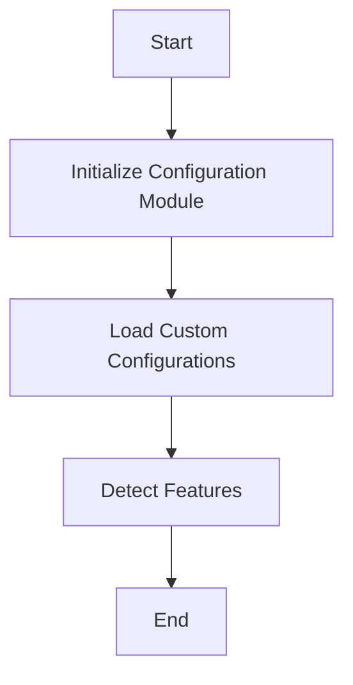

This document will cover the process of Configuration Loading Without Secrets, which includes:

1. Initializing the configuration module
2. Loading custom configurations
3. Detecting features.

Technical document: <SwmLink doc-title="Configuration Loading Without Secrets">[Configuration Loading Without Secrets](/.swm/configuration-loading-without-secrets.hod62821.sw.md)</SwmLink>

# [Initializing the Configuration Module](https://app.swimm.io/repos/Z2l0aHViJTNBJTNBZGF0YWRvZy1hZ2VudCUzQSUzQVN3aW1tLURlbW8=/docs/hod62821#loadwithoutsecret)

The process begins by reading the configuration files and initializing the configuration module. This step ensures that the configuration is set up without decrypting any secrets, which is essential for maintaining security and privacy. The configuration module is responsible for managing all the settings and parameters required for the Datadog Agent to function correctly.

# [Loading Custom Configurations](https://app.swimm.io/repos/Z2l0aHViJTNBJTNBZGF0YWRvZy1hZ2VudCUzQSUzQVN3aW1tLURlbW8=/docs/hod62821#loaddatadogcustom)

Next, the system loads custom configurations. This involves several tasks:

1. **Resolving Proxy Settings**: Ensures that the agent can communicate through any specified proxies.
2. **Handling Secrets**: Although secrets are not decrypted at this stage, the system prepares to manage them securely.
3. **Checking for Conflicting Options**: Ensures that there are no conflicting settings that could cause issues during operation.
4. **Sanitizing API Key Configurations**: Ensures that API keys are correctly formatted and secure.
5. **Setting Up FIPS Endpoints**: If necessary, configures endpoints to comply with Federal Information Processing Standards (FIPS).

# [Detecting Features](https://app.swimm.io/repos/Z2l0aHViJTNBJTNBZGF0YWRvZy1hZ2VudCUzQSUzQVN3aW1tLURlbW8=/docs/hod62821#detectfeatures)

Finally, the system runs feature detection. This step involves:

1. **Checking if Autoconfiguration is Enabled**: Determines if the system should automatically configure itself based on the environment.
2. **Detecting Container Features**: Identifies any container-specific features that need to be managed.
3. **Managing Included and Excluded Features**: Based on the configuration, the system includes or excludes certain features to optimize performance and functionality. The detected features are then logged and stored for future reference.

&nbsp;

*This is an auto-generated document by Swimm AI 🌊 and has not yet been verified by a human*

<SwmMeta version="3.0.0" repo-id="Z2l0aHViJTNBJTNBZGF0YWRvZy1hZ2VudCUzQSUzQVN3aW1tLURlbW8=" repo-name="datadog-agent">Powered by [Swimm](/)</SwmMeta>
