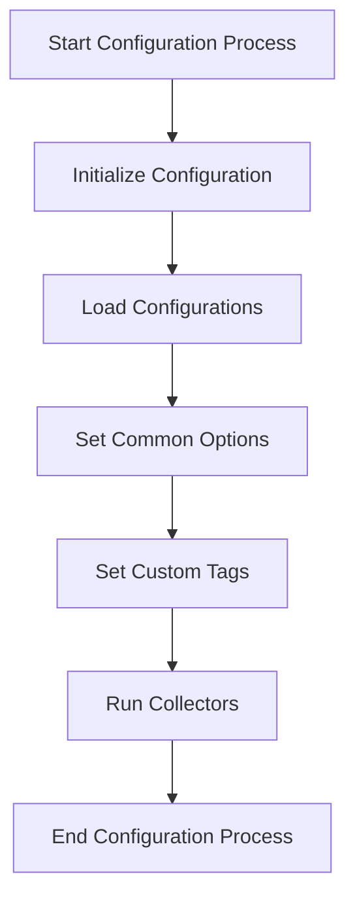

This document will cover the Configuration Process Overview for the Datadog Agent, which includes:

1. Initializing the Configuration
2. Loading Configurations
3. Setting Common Options
4. Setting Custom Tags
5. Running Collectors

Technical document: <SwmLink doc-title="Configuration Process Overview">[Configuration Process Overview](/.swm/configuration-process-overview.wbg86bl8.sw.md)</SwmLink>

# [Initializing the Configuration](https://app.swimm.io/repos/Z2l0aHViJTNBJTNBZGF0YWRvZy1hZ2VudCUzQSUzQVN3aW1tLURlbW8=/docs/wbg86bl8#initialization)

The configuration process begins with initializing the necessary components for the Datadog Agent. This includes setting up the API client and the collector bundle. The goal is to ensure that the orchestrator check is properly configured and ready to run. This step is crucial as it lays the foundation for the subsequent configuration steps.

# [Loading Configurations](https://app.swimm.io/repos/Z2l0aHViJTNBJTNBZGF0YWRvZy1hZ2VudCUzQSUzQVN3aW1tLURlbW8=/docs/wbg86bl8#loading)

In this step, the system dynamically loads the configurations based on the provided settings. It retrieves the appropriate check from the catalog and configures it. This ensures that the checks are loaded correctly and are ready to be executed. This step is important for adapting to different configurations dynamically.

# [Setting Common Options](https://app.swimm.io/repos/Z2l0aHViJTNBJTNBZGF0YWRvZy1hZ2VudCUzQSUzQVN3aW1tLURlbW8=/docs/wbg86bl8#common-configuration)

This step involves setting up common options for the checks, such as run intervals and custom tags. These options ensure that the checks operate consistently across different configurations. Setting common options helps in maintaining uniformity and reliability in the checks' behavior.

# [Setting Custom Tags](https://app.swimm.io/repos/Z2l0aHViJTNBJTNBZGF0YWRvZy1hZ2VudCUzQSUzQVN3aW1tLURlbW8=/docs/wbg86bl8#setting-custom-tags)

During the configuration process, custom tags specified in the configuration are applied to the checks. These tags help in categorizing and identifying the checks based on specific criteria. Setting custom tags allows for better organization and filtering of the checks' data.

# [Running Collectors](https://app.swimm.io/repos/Z2l0aHViJTNBJTNBZGF0YWRvZy1hZ2VudCUzQSUzQVN3aW1tLURlbW8=/docs/wbg86bl8#running-collectors)

In the final step, the system sequentially runs all the collectors in the bundle. It handles the collection of manifests and processes the results from each collector. This step ensures that the collected data is processed and sent to the Datadog platform for monitoring and analysis. Running collectors is essential for gathering and processing data efficiently.

&nbsp;

*This is an auto-generated document by Swimm AI 🌊 and has not yet been verified by a human*

<SwmMeta version="3.0.0" repo-id="Z2l0aHViJTNBJTNBZGF0YWRvZy1hZ2VudCUzQSUzQVN3aW1tLURlbW8=" repo-name="datadog-agent">Powered by [Swimm](/)</SwmMeta>
