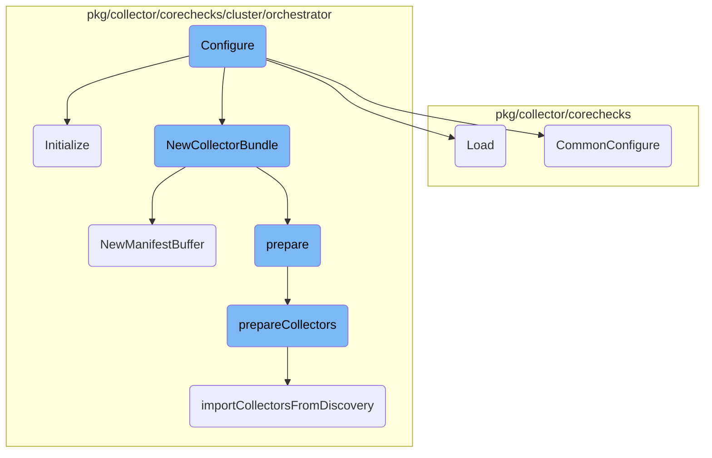
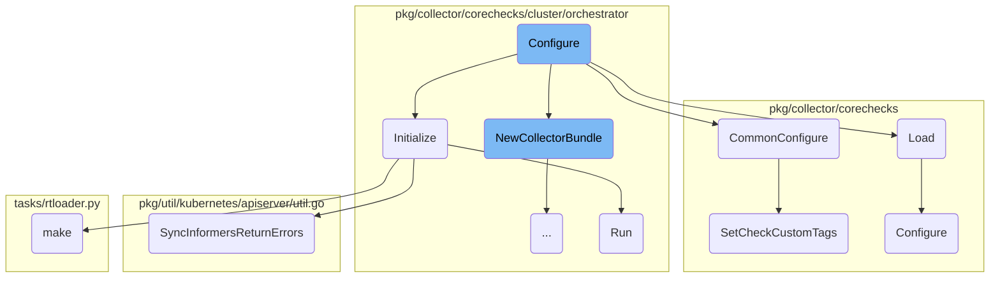
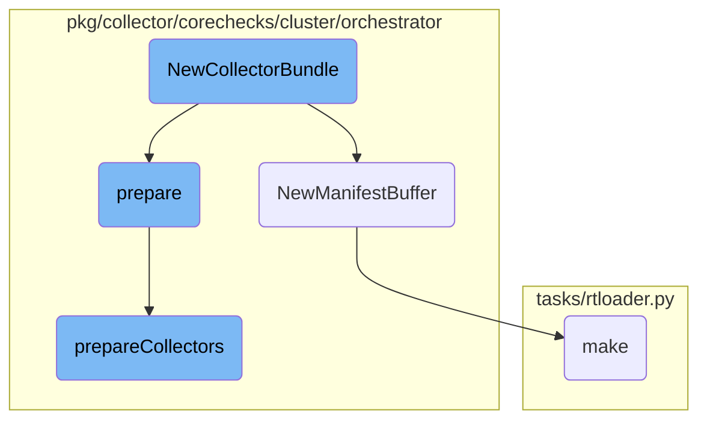

This document provides an overview of the configuration process for the Datadog Agent. It explains how the <SwmToken path="pkg/collector/corechecks/cluster/orchestrator/orchestrator.go" pos="113:2:2" line-data="// Configure configures the orchestrator check">`Configure`</SwmToken> function sets up various components, ensuring that checks are properly initialized and ready to run. The document also covers the loading of checks, common configuration settings, and the initialization of specific components like the collector bundle and manifest buffer.

The configuration process starts with the <SwmToken path="pkg/collector/corechecks/cluster/orchestrator/orchestrator.go" pos="113:2:2" line-data="// Configure configures the orchestrator check">`Configure`</SwmToken> function, which sets up the necessary components for the Datadog Agent to run checks. This includes initializing the API client, loading configurations, and setting custom tags. The process ensures that all checks are properly configured and ready to run. Additionally, the configuration process involves loading checks dynamically based on the provided configuration, setting common options like run intervals, and initializing specific components such as the collector bundle and manifest buffer. These steps ensure that the Datadog Agent can efficiently collect and process data from various sources.

Here is a high level diagram of the flow, showing only the most important functions:



# Flow drill down

First, we'll zoom into this section of the flow:



<SwmSnippet path="/pkg/collector/corechecks/cluster/orchestrator/orchestrator.go" line="113">

---

## Initialization

The <SwmToken path="pkg/collector/corechecks/cluster/orchestrator/orchestrator.go" pos="113:2:2" line-data="// Configure configures the orchestrator check">`Configure`</SwmToken> function in <SwmPath>[pkg/collector/corechecks/cluster/orchestrator/orchestrator.go](pkg/collector/corechecks/cluster/orchestrator/orchestrator.go)</SwmPath> is responsible for setting up the orchestrator check. It initializes various components, including the API client and the collector bundle. This function ensures that the orchestrator check is properly configured and ready to run.

```go
// Configure configures the orchestrator check
func (o *OrchestratorCheck) Configure(senderManager sender.SenderManager, integrationConfigDigest uint64, config, initConfig integration.Data, source string) error {
	o.BuildID(integrationConfigDigest, config, initConfig)

	err := o.CommonConfigure(senderManager, initConfig, config, source)
	if err != nil {
		return err
	}

	err = o.orchestratorConfig.Load()
	if err != nil {
		return err
	}

	if !o.orchestratorConfig.OrchestrationCollectionEnabled {
		return errors.New("orchestrator check is configured but the feature is disabled")
	}
	if o.orchestratorConfig.KubeClusterName == "" {
		return errors.New("orchestrator check is configured but the cluster name is empty")
	}

```

---

</SwmSnippet>

<SwmSnippet path="/pkg/collector/corechecks/loader.go" line="57">

---

## Loading

The <SwmToken path="pkg/collector/corechecks/loader.go" pos="57:2:2" line-data="// Load returns a Go check">`Load`</SwmToken> function in <SwmPath>[pkg/collector/corechecks/loader.go](pkg/collector/corechecks/loader.go)</SwmPath> is used to load a Go check. It retrieves the appropriate check from the catalog and configures it using the <SwmToken path="pkg/collector/corechecks/loader.go" pos="68:9:9" line-data="	if err := c.Configure(senderManger, config.FastDigest(), instance, config.InitConfig, config.Source); err != nil {">`Configure`</SwmToken> method. This function is crucial for dynamically loading and configuring checks based on the provided configuration.

```go
// Load returns a Go check
func (gl *GoCheckLoader) Load(senderManger sender.SenderManager, config integration.Config, instance integration.Data) (check.Check, error) {
	var c check.Check

	factory, found := catalog[config.Name]
	if !found {
		msg := fmt.Sprintf("Check %s not found in Catalog", config.Name)
		return c, fmt.Errorf(msg)
	}

	c = factory()
	if err := c.Configure(senderManger, config.FastDigest(), instance, config.InitConfig, config.Source); err != nil {
		if errors.Is(err, check.ErrSkipCheckInstance) {
			return c, err
		}
		log.Errorf("core.loader: could not configure check %s: %s", c, err)
		msg := fmt.Sprintf("Could not configure check %s: %s", c, err)
		return c, fmt.Errorf(msg)
	}

	return c, nil
```

---

</SwmSnippet>

<SwmSnippet path="/pkg/collector/corechecks/checkbase.go" line="97">

---

## Common Configuration

The <SwmToken path="pkg/collector/corechecks/checkbase.go" pos="97:2:2" line-data="// CommonConfigure is called when checks implement their own Configure method,">`CommonConfigure`</SwmToken> function in <SwmPath>[pkg/collector/corechecks/checkbase.go](pkg/collector/corechecks/checkbase.go)</SwmPath> sets up common options for checks, such as run intervals and custom tags. It is called by individual checks' <SwmToken path="pkg/collector/corechecks/checkbase.go" pos="97:18:18" line-data="// CommonConfigure is called when checks implement their own Configure method,">`Configure`</SwmToken> methods to ensure consistent configuration across different checks.

```go
// CommonConfigure is called when checks implement their own Configure method,
// in order to setup common options (run interval, empty hostname)
func (c *CheckBase) CommonConfigure(senderManager sender.SenderManager, initConfig, instanceConfig integration.Data, source string) error {
	c.senderManager = senderManager
	handleConf := func(conf integration.Data, c *CheckBase) error {
		commonOptions := integration.CommonInstanceConfig{}
		err := yaml.Unmarshal(conf, &commonOptions)
		if err != nil {
			log.Errorf("invalid configuration section for check %s: %s", string(c.ID()), err)
			return err
		}

		// See if a collection interval was specified
		if commonOptions.MinCollectionInterval > 0 {
			c.checkInterval = time.Duration(commonOptions.MinCollectionInterval) * time.Second
		}

		// Disable default hostname if specified
		if commonOptions.EmptyDefaultHostname {
			s, err := c.GetSender()
			if err != nil {
```

---

</SwmSnippet>

<SwmSnippet path="/pkg/collector/corechecks/safesender.go" line="92">

---

## Setting Custom Tags

The <SwmToken path="pkg/collector/corechecks/safesender.go" pos="92:2:2" line-data="// SetCheckCustomTags implements sender.Sender#SetCheckCustomTags.">`SetCheckCustomTags`</SwmToken> function in <SwmPath>[pkg/collector/corechecks/safesender.go](pkg/collector/corechecks/safesender.go)</SwmPath> sets custom tags for a check. This function is called during the configuration process to apply any custom tags specified in the configuration.

```go
// SetCheckCustomTags implements sender.Sender#SetCheckCustomTags.
func (ss *safeSender) SetCheckCustomTags(tags []string) {
	ss.Sender.SetCheckCustomTags(cloneTags(tags))
}
```

---

</SwmSnippet>

<SwmSnippet path="/pkg/collector/corechecks/cluster/orchestrator/collector_bundle.go" line="321">

---

## Running Collectors

The <SwmToken path="pkg/collector/corechecks/cluster/orchestrator/collector_bundle.go" pos="321:2:2" line-data="// Run is used to sequentially run all collectors in the bundle.">`Run`</SwmToken> function in <SwmPath>[pkg/collector/corechecks/cluster/orchestrator/collector_bundle.go](pkg/collector/corechecks/cluster/orchestrator/collector_bundle.go)</SwmPath> sequentially runs all collectors in the bundle. It handles manifest collection and processes the results from each collector, sending metadata and manifest messages as needed.

```go
// Run is used to sequentially run all collectors in the bundle.
func (cb *CollectorBundle) Run(sender sender.Sender) {

	// Start a thread to buffer manifests and kill it when the check is finished.
	if cb.runCfg.Config.IsManifestCollectionEnabled && cb.manifestBuffer.Cfg.BufferedManifestEnabled {
		cb.manifestBuffer.Start(sender)
		defer cb.manifestBuffer.Stop()
	}

	for _, collector := range cb.collectors {
		if collector.Metadata().IsSkipped {
			_ = cb.check.Warnf("Collector %s is skipped: %s", collector.Metadata().FullName(), collector.Metadata().SkippedReason)
			continue
		}

		runStartTime := time.Now()

		result, err := collector.Run(cb.runCfg)
		if err != nil {
			_ = cb.check.Warnf("Collector %s failed to run: %s", collector.Metadata().FullName(), err.Error())
			continue
```

---

</SwmSnippet>

<SwmSnippet path="/pkg/util/kubernetes/apiserver/util.go" line="59">

---

## Synchronizing Informers

The <SwmToken path="pkg/util/kubernetes/apiserver/util.go" pos="59:2:2" line-data="// SyncInformersReturnErrors does the same thing as SyncInformers except it returns a map of InformerName and error">`SyncInformersReturnErrors`</SwmToken> function in <SwmPath>[pkg/util/kubernetes/apiserver/util.go](pkg/util/kubernetes/apiserver/util.go)</SwmPath> synchronizes Kubernetes informers and returns any errors encountered during the process. This function ensures that the informers are properly synced before proceeding with further operations.

```go
// SyncInformersReturnErrors does the same thing as SyncInformers except it returns a map of InformerName and error
func SyncInformersReturnErrors(informers map[InformerName]cache.SharedInformer, extraWait time.Duration) map[InformerName]error {
	resultChan := make(chan syncInformerResult)
	errors := make(map[InformerName]error, len(informers))
	timeoutConfig := config.Datadog().GetDuration("kube_cache_sync_timeout_seconds") * time.Second
	// syncTimeout can be used to wait for the kubernetes client-go cache to sync.
	// It cannot be retrieved at the package-level due to the package being imported before configs are loaded.
	syncTimeout := timeoutConfig + extraWait
	for name := range informers {
		name := name // https://golang.org/doc/faq#closures_and_goroutines
		go (func() {
			ctx, cancel := context.WithTimeout(context.Background(), syncTimeout)
			defer cancel()
			start := time.Now()
			if !cache.WaitForCacheSync(ctx.Done(), informers[name].HasSynced) {
				end := time.Now()
				cacheSyncTimeouts.Inc()
				log.Warnf("couldn't sync informer %s in %v (kube_cache_sync_timeout_seconds: %v)", name, end.Sub(start), timeoutConfig)
				resultChan <- syncInformerResult{
					informerName: name,
					err:          fmt.Errorf("couldn't sync informer %s in %v", name, end.Sub(start)),
```

---

</SwmSnippet>

<SwmSnippet path="/tasks/rtloader.py" line="60">

---

## Building rtloader

The <SwmToken path="tasks/rtloader.py" pos="60:2:2" line-data="def make(ctx, install_prefix=None, python_runtimes=&#39;3&#39;, cmake_options=&#39;&#39;):">`make`</SwmToken> function in <SwmPath>[tasks/rtloader.py](tasks/rtloader.py)</SwmPath> builds the rtloader component. It sets up the necessary <SwmToken path="tasks/rtloader.py" pos="40:1:1" line-data="    CMake is not regenerated when we change an option. This function detect the">`CMake`</SwmToken> options and performs an out-of-source build. This function is essential for compiling the rtloader with the specified configurations.

```python
def make(ctx, install_prefix=None, python_runtimes='3', cmake_options=''):
    dev_path = get_dev_path()

    if cmake_options.find("-G") == -1:
        cmake_options += " -G \"Unix Makefiles\""

    cmake_args = cmake_options + f" -DBUILD_DEMO:BOOL=OFF -DCMAKE_INSTALL_PREFIX:PATH={install_prefix or dev_path}"

    python_runtimes = python_runtimes.split(',')

    settings = {
        "DISABLE_PYTHON2:BOOL": "OFF",
        "DISABLE_PYTHON3:BOOL": "OFF",
    }
    if '2' not in python_runtimes:
        settings["DISABLE_PYTHON2:BOOL"] = "ON"
    if '3' not in python_runtimes:
        settings["DISABLE_PYTHON3:BOOL"] = "ON"

    rtloader_build_path = get_rtloader_build_path()

```

---

</SwmSnippet>

Now, lets zoom into this section of the flow:



<SwmSnippet path="/pkg/collector/corechecks/cluster/orchestrator/collector_bundle.go" line="55">

---

## <SwmToken path="pkg/collector/corechecks/cluster/orchestrator/collector_bundle.go" pos="55:2:2" line-data="// NewCollectorBundle creates a new bundle from the check configuration.">`NewCollectorBundle`</SwmToken> Initialization

The <SwmToken path="pkg/collector/corechecks/cluster/orchestrator/collector_bundle.go" pos="55:2:2" line-data="// NewCollectorBundle creates a new bundle from the check configuration.">`NewCollectorBundle`</SwmToken> function is responsible for creating a new <SwmToken path="pkg/collector/corechecks/cluster/orchestrator/collector_bundle.go" pos="65:11:11" line-data="func NewCollectorBundle(chk *OrchestratorCheck) *CollectorBundle {">`CollectorBundle`</SwmToken> from the check configuration. It initializes various components such as <SwmToken path="pkg/collector/corechecks/cluster/orchestrator/collector_bundle.go" pos="67:1:1" line-data="		discoverCollectors: chk.orchestratorConfig.CollectorDiscoveryEnabled,">`discoverCollectors`</SwmToken>, <SwmToken path="pkg/collector/corechecks/cluster/orchestrator/collector_bundle.go" pos="69:1:1" line-data="		inventory:          inventory.NewCollectorInventory(),">`inventory`</SwmToken>, <SwmToken path="pkg/collector/corechecks/cluster/orchestrator/collector_bundle.go" pos="70:1:1" line-data="		runCfg: &amp;collectors.CollectorRunConfig{">`runCfg`</SwmToken>, and <SwmToken path="pkg/collector/corechecks/cluster/orchestrator/collector_bundle.go" pos="325:15:15" line-data="	if cb.runCfg.Config.IsManifestCollectionEnabled &amp;&amp; cb.manifestBuffer.Cfg.BufferedManifestEnabled {">`manifestBuffer`</SwmToken>. This setup is crucial for the subsequent preparation steps.

```go
// NewCollectorBundle creates a new bundle from the check configuration.
//
// If collectors are declared in the check instance configuration then it'll
// only select those. This needs to match what is found in
// https://github.com/kubernetes/kube-state-metrics/blob/09539977815728349522b58154d800e4b517ec9c/internal/store/builder.go#L176-L206
// in order to share/split easily the collector configuration with the KSM core
// check.
//
// If that's not the case then it'll select all available collectors that are
// marked as stable.
func NewCollectorBundle(chk *OrchestratorCheck) *CollectorBundle {
	bundle := &CollectorBundle{
		discoverCollectors: chk.orchestratorConfig.CollectorDiscoveryEnabled,
		check:              chk,
		inventory:          inventory.NewCollectorInventory(),
		runCfg: &collectors.CollectorRunConfig{
			K8sCollectorRunConfig: collectors.K8sCollectorRunConfig{
				APIClient:                   chk.apiClient,
				OrchestratorInformerFactory: chk.orchestratorInformerFactory,
			},
			ClusterID:   chk.clusterID,
```

---

</SwmSnippet>

<SwmSnippet path="/pkg/collector/corechecks/cluster/orchestrator/manifest_buffer.go" line="68">

---

## <SwmToken path="pkg/collector/corechecks/cluster/orchestrator/manifest_buffer.go" pos="68:2:2" line-data="// NewManifestBuffer returns a new ManifestBuffer">`NewManifestBuffer`</SwmToken> Initialization

The <SwmToken path="pkg/collector/corechecks/cluster/orchestrator/manifest_buffer.go" pos="68:2:2" line-data="// NewManifestBuffer returns a new ManifestBuffer">`NewManifestBuffer`</SwmToken> function initializes a new <SwmToken path="pkg/collector/corechecks/cluster/orchestrator/manifest_buffer.go" pos="68:10:10" line-data="// NewManifestBuffer returns a new ManifestBuffer">`ManifestBuffer`</SwmToken> with configuration parameters from the <SwmToken path="pkg/collector/corechecks/cluster/orchestrator/manifest_buffer.go" pos="69:7:7" line-data="func NewManifestBuffer(chk *OrchestratorCheck) *ManifestBuffer {">`OrchestratorCheck`</SwmToken>. This buffer is used to manage and store manifests efficiently, ensuring they are processed correctly.

```go
// NewManifestBuffer returns a new ManifestBuffer
func NewManifestBuffer(chk *OrchestratorCheck) *ManifestBuffer {
	manifestBuffer := &ManifestBuffer{
		Cfg: &ManifestBufferConfig{
			ClusterID:                   chk.clusterID,
			KubeClusterName:             chk.orchestratorConfig.KubeClusterName,
			MsgGroupRef:                 chk.groupID,
			MaxPerMessage:               chk.orchestratorConfig.MaxPerMessage,
			MaxWeightPerMessageBytes:    chk.orchestratorConfig.MaxWeightPerMessageBytes,
			BufferedManifestEnabled:     chk.orchestratorConfig.BufferedManifestEnabled,
			MaxBufferedManifests:        chk.orchestratorConfig.MaxPerMessage,
			ManifestBufferFlushInterval: chk.orchestratorConfig.ManifestBufferFlushInterval,
			ExtraTags:                   chk.orchestratorConfig.ExtraTags,
		},
		ManifestChan: make(chan interface{}),
		stopCh:       make(chan struct{}),
	}
	manifestBuffer.bufferedManifests = make([]interface{}, 0, manifestBuffer.Cfg.MaxBufferedManifests)

	return manifestBuffer
}
```

---

</SwmSnippet>

<SwmSnippet path="/pkg/collector/corechecks/cluster/orchestrator/collector_bundle.go" line="89">

---

## Preparing the Collector Bundle

The <SwmToken path="pkg/collector/corechecks/cluster/orchestrator/collector_bundle.go" pos="89:2:2" line-data="// prepare initializes the collector bundle internals before it can be used.">`prepare`</SwmToken> method initializes the internal components of the <SwmToken path="pkg/collector/corechecks/cluster/orchestrator/collector_bundle.go" pos="90:6:6" line-data="func (cb *CollectorBundle) prepare() {">`CollectorBundle`</SwmToken>. It calls <SwmToken path="pkg/collector/corechecks/cluster/orchestrator/collector_bundle.go" pos="91:3:3" line-data="	cb.prepareCollectors()">`prepareCollectors`</SwmToken> to set up the list of collectors and <SwmToken path="pkg/collector/corechecks/cluster/orchestrator/collector_bundle.go" pos="92:3:3" line-data="	cb.prepareExtraSyncTimeout()">`prepareExtraSyncTimeout`</SwmToken> for additional synchronization settings.

```go
// prepare initializes the collector bundle internals before it can be used.
func (cb *CollectorBundle) prepare() {
	cb.prepareCollectors()
	cb.prepareExtraSyncTimeout()
}
```

---

</SwmSnippet>

<SwmSnippet path="/pkg/collector/corechecks/cluster/orchestrator/collector_bundle.go" line="95">

---

### Initializing Collectors

The <SwmToken path="pkg/collector/corechecks/cluster/orchestrator/collector_bundle.go" pos="95:2:2" line-data="// prepareCollectors initializes the bundle collector list.">`prepareCollectors`</SwmToken> method sets up the list of collectors for the bundle. It first attempts to import CRD collectors from the check configuration. If that fails, it tries to import collectors from the discovery service or the inventory. This ensures that the bundle has a comprehensive list of collectors ready for use.

```go
// prepareCollectors initializes the bundle collector list.
func (cb *CollectorBundle) prepareCollectors() {
	// we still need to collect non crd resources except if otherwise configured
	if ok := cb.importCRDCollectorsFromCheckConfig(); ok {
		if cb.skipImportingDefaultCollectors() {
			return
		}
	}

	if ok := cb.importCollectorsFromCheckConfig(); ok {
		return
	}
	if ok := cb.importCollectorsFromDiscovery(); ok {
		return
	}

	cb.importCollectorsFromInventory()
}
```

---

</SwmSnippet>

&nbsp;

*This is an auto-generated document by Swimm AI 🌊 and has not yet been verified by a human*

<SwmMeta version="3.0.0" repo-id="Z2l0aHViJTNBJTNBZGF0YWRvZy1hZ2VudCUzQSUzQVN3aW1tLURlbW8=" repo-name="datadog-agent"><sup>Powered by [Swimm](/)</sup></SwmMeta>
