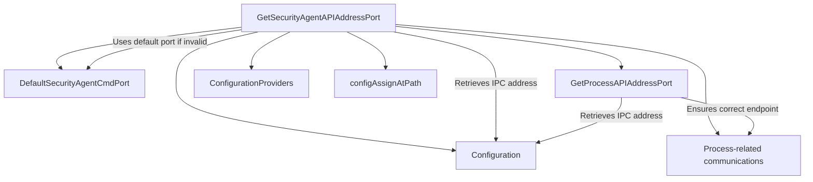

# Overview

The configuration setup for the Datadog Agent is essential for ensuring that the agent operates correctly across various platforms. This document provides an in-depth look at the configuration setup, including platform-specific configurations, initialization functions, environment variables, and main functions.

# Platform-Specific Configurations

The setup package contains files for different operating systems, such as <SwmPath>[cmd/security-agent/config/config_windows.go](cmd/security-agent/config/config_windows.go)</SwmPath>, <SwmPath>[cmd/system-probe/config/config_darwin.go](cmd/system-probe/config/config_darwin.go)</SwmPath>, and <SwmPath>[pkg/config/setup/config_nix.go](pkg/config/setup/config_nix.go)</SwmPath>, ensuring that the agent can be configured correctly on each platform. For example, the <SwmPath>[pkg/config/setup/config_nix.go](pkg/config/setup/config_nix.go)</SwmPath> file contains default paths and settings for Unix-like systems.

<SwmSnippet path="/pkg/config/setup/config_nix.go" line="6">

---

This code snippet shows the default install path and run path for Unix-like systems, ensuring the agent is configured correctly on these platforms.

```go
//go:build linux || freebsd || netbsd || openbsd || solaris || dragonfly || aix

package setup

import "path/filepath"

// Variables to initialize at build time
var (
	// InstallPath is the default install path for the agent
	// It might be overridden at build time
	InstallPath = "/opt/datadog-agent"

	// defaultRunPath is the default run path
	// It is set in osinit to take into account InstallPath overrides
	defaultRunPath = ""
)

var (
	// defaultSystemProbeAddress is the default unix socket path to be used for connecting to the system probe
	defaultSystemProbeAddress = filepath.Join(InstallPath, "run/sysprobe.sock")
	// defaultEventMonitorAddress is the default unix socket path to be used for connecting to the event monitor
```

---

</SwmSnippet>

# Initialization Function

The <SwmToken path="pkg/config/setup/config_init.go" pos="10:2:2" line-data="func initConfig() {">`initConfig`</SwmToken> function initializes the configuration settings required for the agent to run. This function is defined differently for serverless and non-serverless environments.

<SwmSnippet path="/pkg/config/setup/config_init.go" line="10">

---

The <SwmToken path="pkg/config/setup/config_init.go" pos="10:2:2" line-data="func initConfig() {">`initConfig`</SwmToken> function initializes the configuration settings required for the agent to run.

```go
func initConfig() {
	InitConfig(Datadog())
	InitSystemProbeConfig(SystemProbe)
}
```

---

</SwmSnippet>

# Environment Variables

The <SwmToken path="pkg/config/setup/otlp.go" pos="55:2:2" line-data="// setupOTLPEnvironmentVariables sets up the environment variables associated with different OTLP ingest settings:">`setupOTLPEnvironmentVariables`</SwmToken> function sets up the environment variables associated with different OTLP ingest settings, ensuring they are correctly applied.

<SwmSnippet path="/pkg/config/setup/otlp.go" line="55">

---

This code snippet shows how the <SwmToken path="pkg/config/setup/otlp.go" pos="55:2:2" line-data="// setupOTLPEnvironmentVariables sets up the environment variables associated with different OTLP ingest settings:">`setupOTLPEnvironmentVariables`</SwmToken> function sets up the environment variables associated with different OTLP ingest settings.

```go
// setupOTLPEnvironmentVariables sets up the environment variables associated with different OTLP ingest settings:
// If there are changes in the OTLP receiver configuration, they should be reflected here.
//
// We don't need to set the default value: it is dealt with at the unmarshaling level
// since we get the configuration through GetStringMap
//
// We are missing TLS settings: since some of them need more work to work right they are not included here.
func setupOTLPEnvironmentVariables(config pkgconfigmodel.Setup) {
	// gRPC settings
	config.BindEnv(OTLPSection + ".receiver.protocols.grpc.endpoint")
	config.BindEnv(OTLPSection + ".receiver.protocols.grpc.transport")
	config.BindEnv(OTLPSection + ".receiver.protocols.grpc.max_recv_msg_size_mib")
	config.BindEnv(OTLPSection + ".receiver.protocols.grpc.max_concurrent_streams")
	config.BindEnv(OTLPSection + ".receiver.protocols.grpc.read_buffer_size")
	config.BindEnv(OTLPSection + ".receiver.protocols.grpc.write_buffer_size")
	config.BindEnv(OTLPSection + ".receiver.protocols.grpc.include_metadata")

	// Traces settings
	config.BindEnvAndSetDefault("otlp_config.traces.span_name_remappings", map[string]string{})
	config.BindEnv("otlp_config.traces.span_name_as_resource_name")
	config.BindEnvAndSetDefault("otlp_config.traces.probabilistic_sampler.sampling_percentage", 100.,
```

---

</SwmSnippet>

# Main Functions

There are several main functions in this folder. Some of them are <SwmToken path="pkg/config/setup/config_init.go" pos="10:2:2" line-data="func initConfig() {">`initConfig`</SwmToken>, <SwmToken path="pkg/config/setup/process.go" pos="110:2:2" line-data="func setupProcesses(config pkgconfigmodel.Config) {">`setupProcesses`</SwmToken>, and <SwmToken path="pkg/config/setup/otlp.go" pos="55:2:2" line-data="// setupOTLPEnvironmentVariables sets up the environment variables associated with different OTLP ingest settings:">`setupOTLPEnvironmentVariables`</SwmToken>. We will dive a little into <SwmToken path="pkg/config/setup/config_init.go" pos="10:2:2" line-data="func initConfig() {">`initConfig`</SwmToken> and <SwmToken path="pkg/config/setup/process.go" pos="110:2:2" line-data="func setupProcesses(config pkgconfigmodel.Config) {">`setupProcesses`</SwmToken>.

## <SwmToken path="pkg/config/setup/config_init.go" pos="10:2:2" line-data="func initConfig() {">`initConfig`</SwmToken>

The <SwmToken path="pkg/config/setup/config_init.go" pos="10:2:2" line-data="func initConfig() {">`initConfig`</SwmToken> function initializes the configuration defaults used by all agents. It sets various default values and binds environment variables to configuration keys. This function ensures that the configuration is properly initialized with sensible defaults and environment-specific overrides.

<SwmSnippet path="/pkg/config/setup/config.go" line="256">

---

The <SwmToken path="pkg/config/setup/config.go" pos="256:2:2" line-data="// InitConfig initializes the config defaults on a config used by all agents">`InitConfig`</SwmToken> function initializes the configuration defaults used by all agents.

```go
// InitConfig initializes the config defaults on a config used by all agents
// (in particular more than just the serverless agent).
func InitConfig(config pkgconfigmodel.Config) {
	initCommonWithServerless(config)

	// Auto exit configuration
	config.BindEnvAndSetDefault("auto_exit.validation_period", 60)
	config.BindEnvAndSetDefault("auto_exit.noprocess.enabled", false)
	config.BindEnvAndSetDefault("auto_exit.noprocess.excluded_processes", []string{})

	// The number of commits before expiring a context. The value is 2 to handle
	// the case where a check miss to send a metric.
	config.BindEnvAndSetDefault("check_sampler_bucket_commits_count_expiry", 2)
	// The number of seconds before removing stateful metric data after expiring a
	// context. Default is 25h, to minimise problems for checks that emit metircs
	// only occasionally.
	config.BindEnvAndSetDefault("check_sampler_stateful_metric_expiration_time", 25*time.Hour)
	config.BindEnvAndSetDefault("check_sampler_expire_metrics", true)
	config.BindEnvAndSetDefault("check_sampler_context_metrics", false)
	config.BindEnvAndSetDefault("host_aliases", []string{})
```

---

</SwmSnippet>

## <SwmToken path="pkg/config/setup/process.go" pos="110:2:2" line-data="func setupProcesses(config pkgconfigmodel.Config) {">`setupProcesses`</SwmToken>

The <SwmToken path="pkg/config/setup/process.go" pos="110:2:2" line-data="func setupProcesses(config pkgconfigmodel.Config) {">`setupProcesses`</SwmToken> function configures the <SwmToken path="pkg/config/setup/config_nix.go" pos="40:11:13" line-data="	// DefaultProcessAgentLogFile is the default process-agent log file">`process-agent`</SwmToken> settings. It binds environment variables to configuration keys and sets default values for various process-agent-related settings. This function is essential for ensuring that the <SwmToken path="pkg/config/setup/config_nix.go" pos="40:11:13" line-data="	// DefaultProcessAgentLogFile is the default process-agent log file">`process-agent`</SwmToken> is configured correctly and can operate with the appropriate settings.

<SwmSnippet path="/pkg/config/setup/process.go" line="110">

---

The <SwmToken path="pkg/config/setup/process.go" pos="110:2:2" line-data="func setupProcesses(config pkgconfigmodel.Config) {">`setupProcesses`</SwmToken> function configures the <SwmToken path="pkg/config/setup/config_nix.go" pos="40:11:13" line-data="	// DefaultProcessAgentLogFile is the default process-agent log file">`process-agent`</SwmToken> settings.

```go
func setupProcesses(config pkgconfigmodel.Config) {
	// "process_config.enabled" is deprecated. We must still be able to detect if it is present, to know if we should use it
	// or container_collection.enabled and process_collection.enabled.
	procBindEnv(config, "process_config.enabled")
	config.SetEnvKeyTransformer("process_config.enabled", func(val string) interface{} {
		// DD_PROCESS_AGENT_ENABLED: true - Process + Container checks enabled
		//                           false - No checks enabled
		//                           (unset) - Defaults are used, only container check is enabled
		if enabled, _ := strconv.ParseBool(val); enabled {
			return "true"
		}
		return "disabled"
	})
	procBindEnvAndSetDefault(config, "process_config.container_collection.enabled", true)
	procBindEnvAndSetDefault(config, "process_config.process_collection.enabled", false)

	// This allows for the process check to run in the core agent but is for linux only
	procBindEnvAndSetDefault(config, "process_config.run_in_core_agent.enabled", false)

	config.BindEnv("process_config.process_dd_url",
		"DD_PROCESS_CONFIG_PROCESS_DD_URL",
```

---

</SwmSnippet>

# Setup Endpoints

Setup Endpoints

## <SwmToken path="pkg/config/setup/security_agent.go" pos="20:2:2" line-data="func GetSecurityAgentAPIAddressPort(config pkgconfigmodel.Reader) (string, error) {">`GetSecurityAgentAPIAddressPort`</SwmToken>

The <SwmToken path="pkg/config/setup/security_agent.go" pos="20:2:2" line-data="func GetSecurityAgentAPIAddressPort(config pkgconfigmodel.Reader) (string, error) {">`GetSecurityAgentAPIAddressPort`</SwmToken> function returns the API endpoint of the security agent. It retrieves the IPC address and port from the configuration, using a default port if the configured port is invalid.

<SwmSnippet path="/pkg/config/setup/security_agent.go" line="20">

---

The <SwmToken path="pkg/config/setup/security_agent.go" pos="20:2:2" line-data="func GetSecurityAgentAPIAddressPort(config pkgconfigmodel.Reader) (string, error) {">`GetSecurityAgentAPIAddressPort`</SwmToken> function returns the API endpoint of the security agent.

```go
func GetSecurityAgentAPIAddressPort(config pkgconfigmodel.Reader) (string, error) {
	address, err := GetIPCAddress(config)
	if err != nil {
		return "", err
	}

	port := config.GetInt("security_agent.cmd_port")
	if port <= 0 {
		log.Warnf("Invalid security.cmd_port -- %d, using default port %d", port, DefaultSecurityAgentCmdPort)
		port = DefaultProcessCmdPort
	}

	addrPort := net.JoinHostPort(address, strconv.Itoa(port))
	return addrPort, nil
}
```

---

</SwmSnippet>

## <SwmToken path="pkg/config/setup/process.go" pos="238:2:2" line-data="func GetProcessAPIAddressPort(config pkgconfigmodel.Reader) (string, error) {">`GetProcessAPIAddressPort`</SwmToken>

The <SwmToken path="pkg/config/setup/process.go" pos="238:2:2" line-data="func GetProcessAPIAddressPort(config pkgconfigmodel.Reader) (string, error) {">`GetProcessAPIAddressPort`</SwmToken> function returns the API endpoint of the process agent. It retrieves the IPC address and port from the configuration, ensuring the correct endpoint is used for process-related communications.

<SwmSnippet path="/pkg/config/setup/process.go" line="238">

---

The <SwmToken path="pkg/config/setup/process.go" pos="238:2:2" line-data="func GetProcessAPIAddressPort(config pkgconfigmodel.Reader) (string, error) {">`GetProcessAPIAddressPort`</SwmToken> function returns the API endpoint of the process agent.

```go
func GetProcessAPIAddressPort(config pkgconfigmodel.Reader) (string, error) {
	address, err := GetIPCAddress(config)
	if err != nil {
		return "", err
	}

	port := config.GetInt("process_config.cmd_port")
	if port <= 0 {
		log.Warnf("Invalid process_config.cmd_port -- %d, using default port %d", port, DefaultProcessCmdPort)
		port = DefaultProcessCmdPort
	}

	addrPort := net.JoinHostPort(address, strconv.Itoa(port))
	return addrPort, nil
}
```

---

</SwmSnippet>

&nbsp;

*This is an auto-generated document by Swimm AI 🌊 and has not yet been verified by a human*

<SwmMeta version="3.0.0" repo-id="Z2l0aHViJTNBJTNBZGF0YWRvZy1hZ2VudCUzQSUzQVN3aW1tLURlbW8=" repo-name="datadog-agent"><sup>Powered by [Swimm](/)</sup></SwmMeta>
