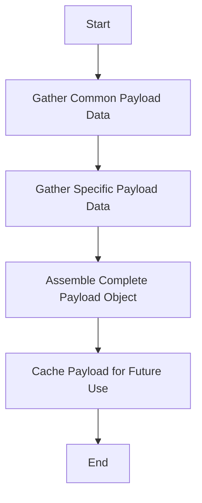

This document will cover the process of constructing the Metadata Payload, which includes:

1. Gathering common payload data
2. Gathering specific payload data
3. Assembling the complete payload object.

Technical document: <SwmLink doc-title="Constructing the Metadata Payload">[Constructing the Metadata Payload](/.swm/constructing-the-metadata-payload.x5s22xsz.sw.md)</SwmLink>

# [Gathering Common Payload Data](https://app.swimm.io/repos/Z2l0aHViJTNBJTNBZGF0YWRvZy1hZ2VudCUzQSUzQVN3aW1tLURlbW8=/docs/x5s22xsz#getpayload)

The process begins by gathering common payload data. This includes basic information such as the hostname and configuration settings. This data is essential as it forms the foundation of the metadata payload, ensuring that the payload has a consistent and identifiable structure.

# [Gathering Specific Payload Data](https://app.swimm.io/repos/Z2l0aHViJTNBJTNBZGF0YWRvZy1hZ2VudCUzQSUzQVN3aW1tLURlbW8=/docs/x5s22xsz#getpayload)

Next, specific payload data is collected. This includes detailed information such as system statistics, network metadata, and container metadata. For example, system statistics might include CPU usage, memory usage, and disk space, while network metadata could include details about network interfaces and their statuses. This step ensures that the payload contains comprehensive and detailed information about the system's current state.

# [Assembling the Complete Payload Object](https://app.swimm.io/repos/Z2l0aHViJTNBJTNBZGF0YWRvZy1hZ2VudCUzQSUzQVN3aW1tLURlbW8=/docs/x5s22xsz#getpayload)

Once both common and specific payload data are gathered, they are assembled into a complete payload object. This object is structured in a way that it can be easily processed and analyzed by the Datadog platform. The assembly process ensures that all relevant data points are included and properly formatted, providing a holistic view of the system's metadata.

# [Caching the Payload for Future Use](https://app.swimm.io/repos/Z2l0aHViJTNBJTNBZGF0YWRvZy1hZ2VudCUzQSUzQVN3aW1tLURlbW8=/docs/x5s22xsz#getpayload)

Finally, the complete payload object is cached for future use. Caching improves performance by reducing the need to repeatedly gather and assemble the same data. This step ensures that the metadata payload is readily available when needed, enhancing the efficiency of data retrieval and processing.

&nbsp;

*This is an auto-generated document by Swimm AI 🌊 and has not yet been verified by a human*

<SwmMeta version="3.0.0" repo-id="Z2l0aHViJTNBJTNBZGF0YWRvZy1hZ2VudCUzQSUzQVN3aW1tLURlbW8=" repo-name="datadog-agent">Powered by [Swimm](/)</SwmMeta>
