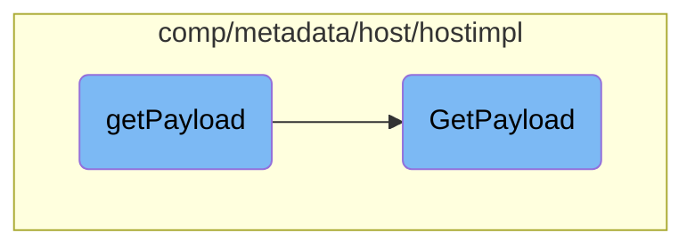

This document explains the process of constructing the complete metadata payload. The process involves combining common payload data and specific payload data to form a comprehensive payload object.

The flow starts by calling the <SwmToken path="comp/metadata/host/hostimpl/payload_no_gohai.go" pos="31:2:2" line-data="// getPayload returns the complete metadata payload as seen in Agent v5. Note: gohai can&#39;t be used on the platforms">`getPayload`</SwmToken> function, which constructs the complete metadata payload. It does this by first gathering common payload data and then specific payload data. These pieces of data include information like hostname, system stats, and network metadata. Once collected, they are assembled into a <SwmToken path="comp/metadata/host/hostimpl/payload_no_gohai.go" pos="31:12:12" line-data="// getPayload returns the complete metadata payload as seen in Agent v5. Note: gohai can&#39;t be used on the platforms">`payload`</SwmToken> object, which is then cached for future use.

# Flow drill down



<SwmSnippet path="/comp/metadata/host/hostimpl/payload_no_gohai.go" line="31">

---

## <SwmToken path="comp/metadata/host/hostimpl/payload_no_gohai.go" pos="31:2:2" line-data="// getPayload returns the complete metadata payload as seen in Agent v5. Note: gohai can&#39;t be used on the platforms">`getPayload`</SwmToken>

The <SwmToken path="comp/metadata/host/hostimpl/payload_no_gohai.go" pos="31:2:2" line-data="// getPayload returns the complete metadata payload as seen in Agent v5. Note: gohai can&#39;t be used on the platforms">`getPayload`</SwmToken> function constructs the complete metadata payload. It combines common payload data and specific payload data by calling <SwmToken path="comp/metadata/host/hostimpl/payload_no_gohai.go" pos="35:5:7" line-data="		CommonPayload: *utils.GetCommonPayload(h.hostname, h.config),">`utils.GetCommonPayload`</SwmToken> and <SwmToken path="comp/metadata/host/hostimpl/payload_no_gohai.go" pos="36:5:7" line-data="		Payload:       *utils.GetPayload(ctx, h.config),">`utils.GetPayload`</SwmToken> respectively.

```go
// getPayload returns the complete metadata payload as seen in Agent v5. Note: gohai can't be used on the platforms
// this module builds for
func (h *host) getPayload(hostname string) *Payload {
	return &Payload{
		CommonPayload: *utils.GetCommonPayload(h.hostname, h.config),
		Payload:       *utils.GetPayload(ctx, h.config),
	}
}
```

---

</SwmSnippet>

<SwmSnippet path="/comp/metadata/host/hostimpl/utils/host.go" line="169">

---

## <SwmToken path="comp/metadata/host/hostimpl/utils/host.go" pos="169:2:2" line-data="// GetPayload builds a metadata payload every time is called.">`GetPayload`</SwmToken>

The <SwmToken path="comp/metadata/host/hostimpl/utils/host.go" pos="169:2:2" line-data="// GetPayload builds a metadata payload every time is called.">`GetPayload`</SwmToken> function is responsible for building the metadata payload. It collects various pieces of data such as hostname, system stats, and network metadata. This data is then assembled into a <SwmToken path="comp/metadata/host/hostimpl/utils/host.go" pos="169:10:10" line-data="// GetPayload builds a metadata payload every time is called.">`payload`</SwmToken> object, which is cached for future use.

```go
// GetPayload builds a metadata payload every time is called.
// Some data is collected only once, some is cached, some is collected at every call.
func GetPayload(ctx context.Context, conf config.Reader) *Payload {
	hostnameData, err := hostname.GetWithProvider(ctx)
	if err != nil {
		log.Errorf("Error grabbing hostname for status: %v", err)
		hostnameData = hostname.Data{Hostname: "unknown", Provider: "unknown"}
	}

	meta := GetMeta(ctx, conf)
	meta.Hostname = hostnameData.Hostname

	p := &Payload{
		Os:            osName,
		AgentFlavor:   flavor.GetFlavor(),
		PythonVersion: python.GetPythonInfo(),
		SystemStats:   getSystemStats(),
		Meta:          meta,
		HostTags:      hosttags.Get(ctx, false, conf),
		ContainerMeta: containerMetadata.Get(1 * time.Second),
		NetworkMeta:   getNetworkMeta(ctx),
```

---

</SwmSnippet>

&nbsp;

*This is an auto-generated document by Swimm AI 🌊 and has not yet been verified by a human*

<SwmMeta version="3.0.0" repo-id="Z2l0aHViJTNBJTNBZGF0YWRvZy1hZ2VudCUzQSUzQVN3aW1tLURlbW8=" repo-name="datadog-agent"><sup>Powered by [Swimm](/)</sup></SwmMeta>
