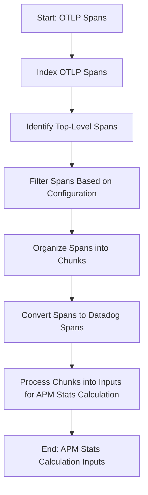

This document will cover the process of converting OTLP spans for APM stats. We'll cover:

1. Indexing OTLP spans
2. Identifying top-level spans
3. Filtering spans based on configuration
4. Organizing spans into chunks
5. Converting spans to Datadog spans
6. Processing chunks into inputs for APM stats calculation.

Technical document: <SwmLink doc-title="Converting OTLP Spans for APM Stats">[Converting OTLP Spans for APM Stats](/.swm/converting-otlp-spans-for-apm-stats.g3qti1fg.sw.md)</SwmLink>

# [Indexing OTLP Spans](https://app.swimm.io/repos/Z2l0aHViJTNBJTNBZGF0YWRvZy1hZ2VudCUzQSUzQVN3aW1tLURlbW8=/docs/g3qti1fg#converting-otlp-spans-to-concentrator-inputs)

The process begins by indexing the OTLP spans. Indexing involves organizing the spans based on their unique identifiers, such as trace ID and span ID. This step ensures that each span can be easily accessed and processed in subsequent steps.

# [Identifying Top-Level Spans](https://app.swimm.io/repos/Z2l0aHViJTNBJTNBZGF0YWRvZy1hZ2VudCUzQSUzQVN3aW1tLURlbW8=/docs/g3qti1fg#converting-otlp-spans-to-concentrator-inputs)

Next, we identify which spans are top-level spans. Top-level spans are those that represent the root of a trace or a significant operation within a trace. Identifying these spans is crucial for accurate APM stats calculation, as they provide a high-level overview of the trace's structure and performance.

# [Filtering Spans Based on Configuration](https://app.swimm.io/repos/Z2l0aHViJTNBJTNBZGF0YWRvZy1hZ2VudCUzQSUzQVN3aW1tLURlbW8=/docs/g3qti1fg#converting-otlp-spans-to-concentrator-inputs)

After identifying the top-level spans, we filter out any spans that should be ignored based on the configuration settings. This step ensures that only relevant spans are processed, improving the efficiency and accuracy of the APM stats calculation. For example, spans related to specific resources or services that are not of interest can be excluded.

# [Organizing Spans into Chunks](https://app.swimm.io/repos/Z2l0aHViJTNBJTNBZGF0YWRvZy1hZ2VudCUzQSUzQVN3aW1tLURlbW8=/docs/g3qti1fg#converting-otlp-spans-to-concentrator-inputs)

The remaining spans are then organized into chunks based on various attributes such as trace ID, environment, version, hostname, and container ID. This organization helps in grouping related spans together, making it easier to process them in bulk. Each chunk represents a collection of spans that share common attributes.

# [Converting Spans to Datadog Spans](https://app.swimm.io/repos/Z2l0aHViJTNBJTNBZGF0YWRvZy1hZ2VudCUzQSUzQVN3aW1tLURlbW8=/docs/g3qti1fg#transforming-otel-spans-to-dd-spans)

Each span within a chunk is then converted into a Datadog span. This conversion involves extracting essential fields such as service, name, resource, trace ID, span ID, parent ID, start time, and duration. Additionally, metadata and metrics are set based on span attributes and status. This step ensures that the spans are in a format suitable for Datadog's APM stats calculation.

# [Processing Chunks into Inputs for APM Stats Calculation](https://app.swimm.io/repos/Z2l0aHViJTNBJTNBZGF0YWRvZy1hZ2VudCUzQSUzQVN3aW1tLURlbW8=/docs/g3qti1fg#converting-otlp-spans-to-concentrator-inputs)

Finally, the chunks are processed into input structures that can be used for APM stats calculation. Each input structure contains the processed trace information, including the trace chunk, root span, environment, version, hostname, and container tags. These inputs are then returned for further use in the APM stats calculation process.

&nbsp;

*This is an auto-generated document by Swimm AI 🌊 and has not yet been verified by a human*

<SwmMeta version="3.0.0" repo-id="Z2l0aHViJTNBJTNBZGF0YWRvZy1hZ2VudCUzQSUzQVN3aW1tLURlbW8=" repo-name="datadog-agent">Powered by [Swimm](/)</SwmMeta>
