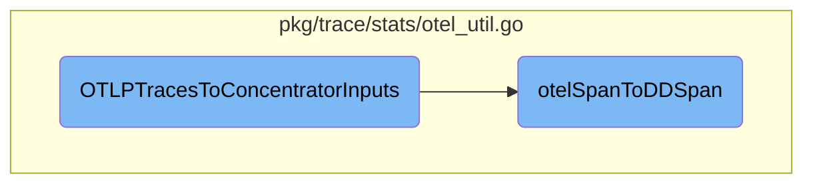

In this document, we will explain the process of converting OTLP spans into a format suitable for APM stats calculation. This involves indexing the spans, identifying top-level spans, filtering based on configuration, organizing spans into chunks, and finally processing these chunks into inputs for further use.

The flow starts by taking OTLP spans and indexing them. It then identifies which spans are top-level and filters out any spans that should be ignored based on the configuration. Next, it organizes the remaining spans into chunks based on various attributes like trace ID and environment. Each span is then converted into a Datadog span and added to the appropriate chunk. Finally, these chunks are processed into input structures that can be used for APM stats calculation.

# Flow drill down



<SwmSnippet path="/pkg/trace/stats/otel_util.go" line="29">

---

## Converting OTLP spans to Concentrator inputs

The function <SwmToken path="pkg/trace/stats/otel_util.go" pos="29:2:2" line-data="// OTLPTracesToConcentratorInputs converts eligible OTLP spans to Concentrator.Input.">`OTLPTracesToConcentratorInputs`</SwmToken> converts OTLP spans into a format suitable for APM stats calculation. It indexes the spans, identifies top-level spans, and filters out spans based on configuration settings.

```go
// OTLPTracesToConcentratorInputs converts eligible OTLP spans to Concentrator.Input.
// The converted Inputs only have the minimal number of fields for APM stats calculation and are only meant
// to be used in Concentrator.Add(). Do not use them for other purposes.
func OTLPTracesToConcentratorInputs(
	traces ptrace.Traces,
	conf *config.AgentConfig,
	containerTagKeys []string,
) []Input {
	spanByID, resByID, scopeByID := traceutil.IndexOTelSpans(traces)
	topLevelByKind := conf.HasFeature("enable_otlp_compute_top_level_by_span_kind")
	topLevelSpans := traceutil.GetTopLevelOTelSpans(spanByID, resByID, topLevelByKind)
	ignoreResNames := make(map[string]struct{})
	for _, resName := range conf.Ignore["resource"] {
		ignoreResNames[resName] = struct{}{}
	}
	chunks := make(map[chunkKey]*pb.TraceChunk)
	containerTagsByID := make(map[string][]string)
	for spanID, otelspan := range spanByID {
		otelres := resByID[spanID]
		if _, exists := ignoreResNames[traceutil.GetOTelResource(otelspan, otelres)]; exists {
			continue
```

---

</SwmSnippet>

<SwmSnippet path="/pkg/trace/stats/otel_util.go" line="66">

---

The function continues by organizing spans into chunks based on trace ID, environment, version, hostname, and container ID. It then converts each span using <SwmToken path="pkg/trace/stats/otel_util.go" pos="79:14:14" line-data="		chunk.Spans = append(chunk.Spans, otelSpanToDDSpan(otelspan, otelres, scopeByID[spanID], isTop, topLevelByKind, conf))">`otelSpanToDDSpan`</SwmToken> and appends it to the appropriate chunk.

```go
		ckey := chunkKey{
			traceIDUInt64: traceutil.OTelTraceIDToUint64(otelspan.TraceID()),
			env:           env,
			version:       version,
			hostname:      hostname,
			cid:           cid,
		}
		chunk, ok := chunks[ckey]
		if !ok {
			chunk = &pb.TraceChunk{}
			chunks[ckey] = chunk
		}
		_, isTop := topLevelSpans[spanID]
		chunk.Spans = append(chunk.Spans, otelSpanToDDSpan(otelspan, otelres, scopeByID[spanID], isTop, topLevelByKind, conf))
	}
```

---

</SwmSnippet>

<SwmSnippet path="/pkg/trace/stats/otel_util.go" line="82">

---

Finally, the function processes the chunks into <SwmToken path="pkg/trace/stats/otel_util.go" pos="82:9:9" line-data="	inputs := make([]Input, 0, len(chunks))">`Input`</SwmToken> structures, which are then returned for further use in APM stats calculation.

```go
	inputs := make([]Input, 0, len(chunks))
	for ckey, chunk := range chunks {
		pt := traceutil.ProcessedTrace{
			TraceChunk:     chunk,
			Root:           traceutil.GetRoot(chunk.Spans),
			TracerEnv:      ckey.env,
			AppVersion:     ckey.version,
			TracerHostname: ckey.hostname,
		}
		inputs = append(inputs, Input{
			Traces:        []traceutil.ProcessedTrace{pt},
			ContainerID:   ckey.cid,
			ContainerTags: containerTagsByID[ckey.cid],
		})
	}
	return inputs
```

---

</SwmSnippet>

<SwmSnippet path="/pkg/trace/stats/otel_util.go" line="100">

---

## Transforming <SwmToken path="pkg/trace/stats/otel_util.go" pos="100:8:8" line-data="// otelSpanToDDSpan converts an OTel span to a DD span.">`OTel`</SwmToken> spans to DD spans

The function <SwmToken path="pkg/trace/stats/otel_util.go" pos="100:2:2" line-data="// otelSpanToDDSpan converts an OTel span to a DD span.">`otelSpanToDDSpan`</SwmToken> converts an <SwmToken path="pkg/trace/stats/otel_util.go" pos="100:8:8" line-data="// otelSpanToDDSpan converts an OTel span to a DD span.">`OTel`</SwmToken> span into a Datadog (DD) span. It extracts essential fields such as service, name, resource, trace ID, span ID, parent ID, start time, and duration.

```go
// otelSpanToDDSpan converts an OTel span to a DD span.
// The converted DD span only has the minimal number of fields for APM stats calculation and is only meant
// to be used in OTLPTracesToConcentratorInputs. Do not use them for other purposes.
// TODO(OTEL-1726): use the same function here and in pkg/trace/api/otlp.go
func otelSpanToDDSpan(
	otelspan ptrace.Span,
	otelres pcommon.Resource,
	lib pcommon.InstrumentationScope,
	isTopLevel, topLevelByKind bool,
	conf *config.AgentConfig,
) *pb.Span {
	ddspan := &pb.Span{
		Service:  traceutil.GetOTelService(otelspan, otelres, true),
		Name:     traceutil.GetOTelOperationName(otelspan, otelres, lib, conf.OTLPReceiver.SpanNameAsResourceName, conf.OTLPReceiver.SpanNameRemappings, true),
		Resource: traceutil.GetOTelResource(otelspan, otelres),
		TraceID:  traceutil.OTelTraceIDToUint64(otelspan.TraceID()),
		SpanID:   traceutil.OTelSpanIDToUint64(otelspan.SpanID()),
		ParentID: traceutil.OTelSpanIDToUint64(otelspan.ParentSpanID()),
		Start:    int64(otelspan.StartTimestamp()),
		Duration: int64(otelspan.EndTimestamp()) - int64(otelspan.StartTimestamp()),
		Type:     traceutil.GetOTelSpanType(otelspan, otelres),
```

---

</SwmSnippet>

<SwmSnippet path="/pkg/trace/stats/otel_util.go" line="122">

---

The function also sets metadata and metrics based on span attributes and status. It marks spans as top-level or measured based on configuration and span kind, and adds peer tags if enabled in the configuration.

```go
	spanKind := otelspan.Kind()
	traceutil.SetMeta(ddspan, "span.kind", traceutil.OTelSpanKindName(spanKind))
	code := traceutil.GetOTelStatusCode(otelspan)
	if code != 0 {
		traceutil.SetMetric(ddspan, tagStatusCode, float64(code))
	}
	if otelspan.Status().Code() == ptrace.StatusCodeError {
		ddspan.Error = 1
	}
	if isTopLevel {
		traceutil.SetTopLevel(ddspan, true)
	}
	if isMeasured := traceutil.GetOTelAttrVal(otelspan.Attributes(), false, "_dd.measured"); isMeasured == "1" {
		traceutil.SetMeasured(ddspan, true)
	} else if topLevelByKind && (spanKind == ptrace.SpanKindClient || spanKind == ptrace.SpanKindProducer) {
		// When enable_otlp_compute_top_level_by_span_kind is true, compute stats for client-side spans
		traceutil.SetMeasured(ddspan, true)
	}
	if conf.PeerTagsAggregation {
		peerTagKeys := preparePeerTags(append(defaultPeerTags, conf.PeerTags...)...)
		for _, peerTagKey := range peerTagKeys {
```

---

</SwmSnippet>

&nbsp;

*This is an auto-generated document by Swimm AI 🌊 and has not yet been verified by a human*

<SwmMeta version="3.0.0" repo-id="Z2l0aHViJTNBJTNBZGF0YWRvZy1hZ2VudCUzQSUzQVN3aW1tLURlbW8=" repo-name="datadog-agent"><sup>Powered by [Swimm](/)</sup></SwmMeta>
