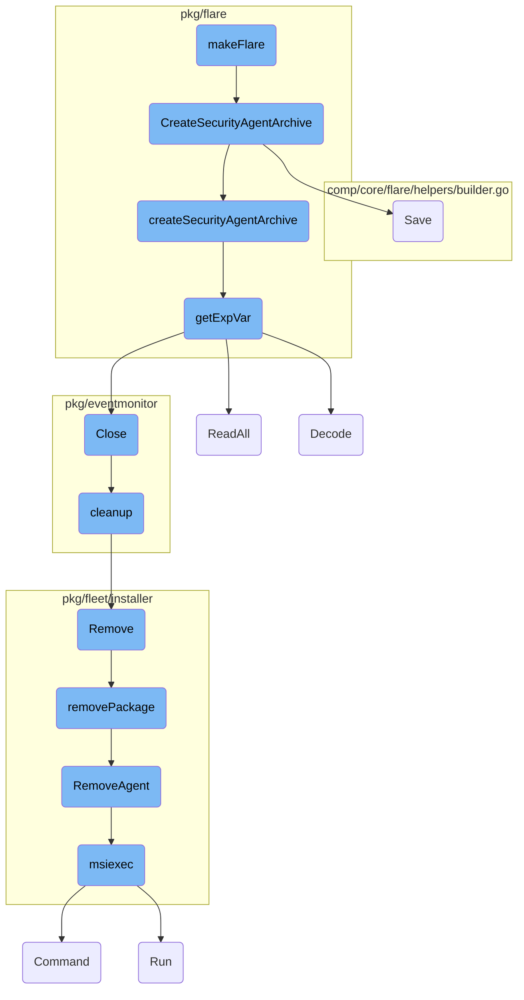
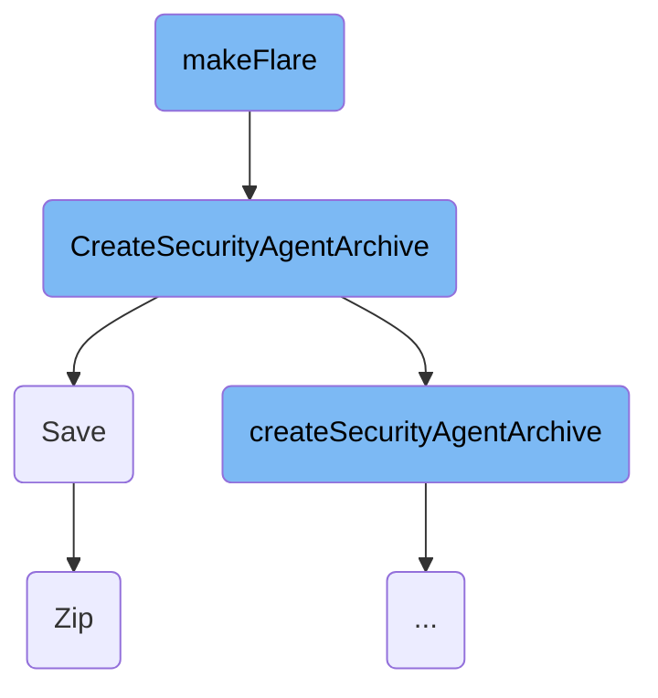
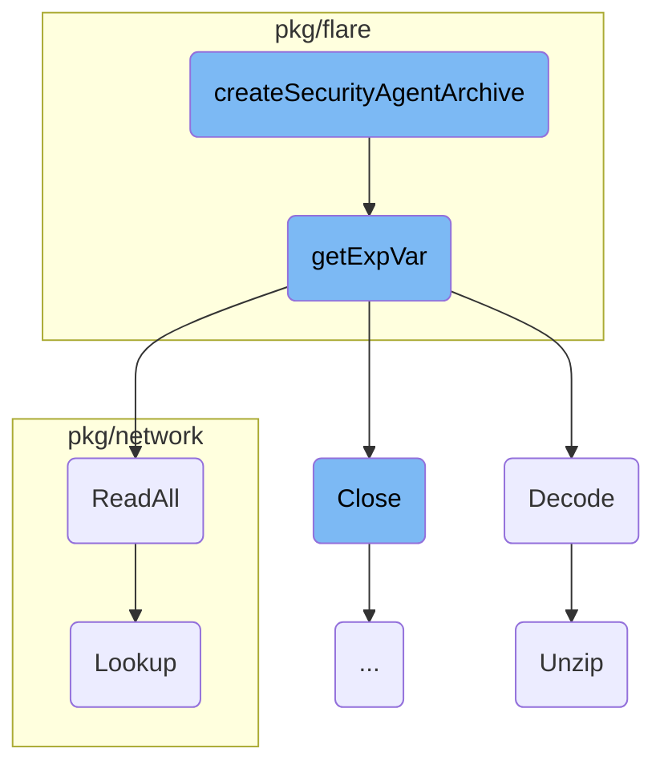
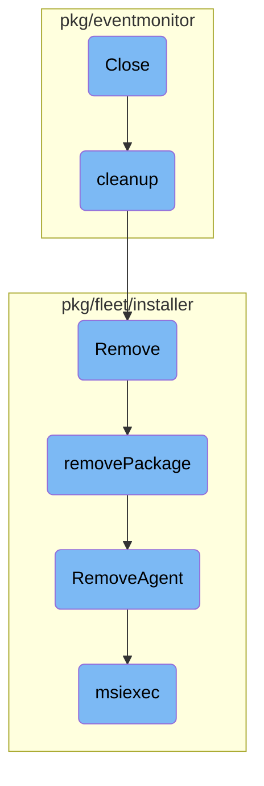

In this document, we will explain the process of creating a flare. The process involves several steps, including initializing the flare creation, packaging necessary files, and saving the archive.

The flow starts with initiating the flare creation process. This involves setting up the response header and logging the process. Next, the system packages the necessary files and logs related to the security agent. Finally, the archive is saved, and the file path is returned. If any errors occur during this process, they are logged, and an appropriate error response is sent.

Here is a high level diagram of the flow, showing only the most important functions:



# Flow drill down

First, we'll zoom into this section of the flow:



<SwmSnippet path="/cmd/security-agent/api/agent/agent.go" line="140">

---

## <SwmToken path="cmd/security-agent/api/agent/agent.go" pos="140:9:9" line-data="func (a *Agent) makeFlare(w http.ResponseWriter, _ *http.Request) {">`makeFlare`</SwmToken>

The <SwmToken path="cmd/security-agent/api/agent/agent.go" pos="140:9:9" line-data="func (a *Agent) makeFlare(w http.ResponseWriter, _ *http.Request) {">`makeFlare`</SwmToken> function initiates the process of creating a flare by calling <SwmToken path="cmd/security-agent/api/agent/agent.go" pos="145:10:10" line-data="	filePath, err := flare.CreateSecurityAgentArchive(false, logFile, a.statusComponent)">`CreateSecurityAgentArchive`</SwmToken>. It sets the response header to JSON and logs the process. If the archive creation fails, it logs an error and sends a 500 HTTP response.

```go
func (a *Agent) makeFlare(w http.ResponseWriter, _ *http.Request) {
	log.Infof("Making a flare")
	w.Header().Set("Content-Type", "application/json")
	logFile := config.Datadog().GetString("security_agent.log_file")

	filePath, err := flare.CreateSecurityAgentArchive(false, logFile, a.statusComponent)
	if err != nil || filePath == "" {
		if err != nil {
			log.Errorf("The flare failed to be created: %s", err)
		} else {
			log.Warnf("The flare failed to be created")
		}
		http.Error(w, err.Error(), 500)
	}
	w.Write([]byte(filePath))
}
```

---

</SwmSnippet>

<SwmSnippet path="/pkg/flare/archive_security.go" line="21">

---

## <SwmToken path="pkg/flare/archive_security.go" pos="21:2:2" line-data="// CreateSecurityAgentArchive packages up the files">`CreateSecurityAgentArchive`</SwmToken>

The <SwmToken path="pkg/flare/archive_security.go" pos="21:2:2" line-data="// CreateSecurityAgentArchive packages up the files">`CreateSecurityAgentArchive`</SwmToken> function initializes a new flare builder and calls <SwmToken path="pkg/flare/archive_security.go" pos="21:2:2" line-data="// CreateSecurityAgentArchive packages up the files">`CreateSecurityAgentArchive`</SwmToken> to package the necessary files. It then calls the <SwmToken path="pkg/flare/archive_security.go" pos="29:5:5" line-data="	return fb.Save()">`Save`</SwmToken> method to save the archive and returns the file path.

```go
// CreateSecurityAgentArchive packages up the files
func CreateSecurityAgentArchive(local bool, logFilePath string, statusComponent status.Component) (string, error) {
	fb, err := flarehelpers.NewFlareBuilder(local)
	if err != nil {
		return "", err
	}
	createSecurityAgentArchive(fb, logFilePath, statusComponent)

	return fb.Save()
```

---

</SwmSnippet>

<SwmSnippet path="/comp/core/flare/helpers/builder.go" line="137">

---

### Save

The <SwmToken path="comp/core/flare/helpers/builder.go" pos="137:9:9" line-data="func (fb *builder) Save() (string, error) {">`Save`</SwmToken> method in the flare builder is responsible for finalizing the archive. It adds necessary files, creates the archive in a temporary directory, restricts permissions, and then moves it to the system's temporary directory.

```go
func (fb *builder) Save() (string, error) {
	defer fb.clean()

	_ = fb.AddFileFromFunc("permissions.log", fb.permsInfos.commit)
	_ = fb.logFile.Close()

	archiveName := getArchiveName()
	archiveTmpPath := filepath.Join(fb.tmpDir, archiveName)
	archiveFinalPath := filepath.Join(os.TempDir(), archiveName)

	// We first create the archive in our fb.tmpDir directory which is only readable by the current user (and
	// SYSTEM/ADMIN on Windows). Then we retrict the archive permissions before moving it to the system temporary
	// directory. This prevents other users from being able to read local flares.
	err := archive.Zip([]string{fb.flareDir}, archiveTmpPath)
	if err != nil {
		return "", err
	}

	fperm, err := filesystem.NewPermission()
	if err != nil {
		return "", err
```

---

</SwmSnippet>

<SwmSnippet path="/pkg/util/archive/zip.go" line="39">

---

### Zip

The <SwmToken path="pkg/util/archive/zip.go" pos="39:2:2" line-data="// Zip is an adapted implementation of (*Zip).Archive from">`Zip`</SwmToken> function creates a zip archive from the specified sources. It ensures the destination has a .zip extension, creates the necessary directories, and writes the files into the zip archive.

```go
// Zip is an adapted implementation of (*Zip).Archive from
// https://github.com/mholt/archiver/blob/v3.5.1/zip.go#L140
// Copyright (c) 2016 Matthew Holt
func Zip(sources []string, destination string) error {
	if !strings.HasSuffix(destination, ".zip") {
		return fmt.Errorf("%s must have a .zip extension", destination)
	}
	if fileExists(destination) {
		return fmt.Errorf("file already exists: %s", destination)
	}
	dir := filepath.Dir(destination)
	if !fileExists(dir) {
		err := os.MkdirAll(dir, 0755)
		if err != nil {
			return fmt.Errorf("error making directory %s: %w", dir, err)
		}
	}

	outputFile, err := os.Create(destination)
	if err != nil {
		return fmt.Errorf("error creating %s: %w", destination, err)
```

---

</SwmSnippet>

Now, lets zoom into this section of the flow:



<SwmSnippet path="/pkg/flare/archive_security.go" line="32">

---

## <SwmToken path="pkg/flare/archive_security.go" pos="32:2:2" line-data="// createSecurityAgentArchive packages up the files">`createSecurityAgentArchive`</SwmToken>

The function <SwmToken path="pkg/flare/archive_security.go" pos="32:2:2" line-data="// createSecurityAgentArchive packages up the files">`createSecurityAgentArchive`</SwmToken> packages up the files and logs related to the security agent. It first checks if the request is local and adds a placeholder file if true. If not, it attempts to get the status of the security agent and adds it to the archive. It then collects various log files, configuration files, compliance files, runtime files, and other relevant data, adding each to the archive.

```go
// createSecurityAgentArchive packages up the files
func createSecurityAgentArchive(fb flaretypes.FlareBuilder, logFilePath string, statusComponent status.Component) {
	// If the request against the API does not go through we don't collect the status log.
	if fb.IsLocal() {
		fb.AddFile("local", []byte("")) //nolint:errcheck
	} else {
		// The Status will be unavailable unless the agent is running.
		// Only zip it up if the agent is running
		err := fb.AddFileFromFunc("security-agent-status.log", func() ([]byte, error) {
			return statusComponent.GetStatus("text", false)
		})
		if err != nil {
			log.Infof("Error getting the status of the Security Agent, %q", err)
			return
		}
	}

	getLogFiles(fb, logFilePath)
	getConfigFiles(fb, searchPaths{})
	getComplianceFiles(fb)                        //nolint:errcheck
	getRuntimeFiles(fb)                           //nolint:errcheck
```

---

</SwmSnippet>

<SwmSnippet path="/pkg/flare/archive.go" line="132">

---

## <SwmToken path="pkg/flare/archive.go" pos="132:2:2" line-data="func getExpVar(fb flaretypes.FlareBuilder) error {">`getExpVar`</SwmToken>

The function <SwmToken path="pkg/flare/archive.go" pos="132:2:2" line-data="func getExpVar(fb flaretypes.FlareBuilder) error {">`getExpVar`</SwmToken> collects and marshals expvar variables into YAML format and adds them to the archive. It also retrieves and decodes the trace-agent's debug variables, adding them to the archive as well.

```go
func getExpVar(fb flaretypes.FlareBuilder) error {
	variables := make(map[string]interface{})
	expvar.Do(func(kv expvar.KeyValue) {
		variable := make(map[string]interface{})
		json.Unmarshal([]byte(kv.Value.String()), &variable) //nolint:errcheck
		variables[kv.Key] = variable
	})

	// The callback above cannot return an error.
	// In order to properly ensure error checking,
	// it needs to be done in its own loop
	for key, value := range variables {
		yamlValue, err := yaml.Marshal(value)
		if err != nil {
			return err
		}

		err = fb.AddFile(filepath.Join("expvar", key), yamlValue)
		if err != nil {
			return err
		}
```

---

</SwmSnippet>

<SwmSnippet path="/pkg/network/protocols/events/batch_reader.go" line="58">

---

## <SwmToken path="pkg/network/protocols/events/batch_reader.go" pos="58:2:2" line-data="// ReadAll batches from eBPF (concurrently) and execute the given">`ReadAll`</SwmToken>

The method <SwmToken path="pkg/network/protocols/events/batch_reader.go" pos="58:2:2" line-data="// ReadAll batches from eBPF (concurrently) and execute the given">`ReadAll`</SwmToken> batches data from <SwmToken path="pkg/network/protocols/events/batch_reader.go" pos="58:8:8" line-data="// ReadAll batches from eBPF (concurrently) and execute the given">`eBPF`</SwmToken> and executes a callback function for each batch. It ensures synchronization during the job enqueuing process and processes each batch concurrently.

```go
// ReadAll batches from eBPF (concurrently) and execute the given
// callback function for each batch
func (r *batchReader) ReadAll(f func(cpu int, b *batch)) {
	// This lock is used only for the purposes of synchronizing termination
	// and it's only held while *enqueing* the jobs.
	r.Lock()
	if r.stopped {
		r.Unlock()
		return
	}

	var wg sync.WaitGroup
	wg.Add(r.numCPUs)

	for i := 0; i < r.numCPUs; i++ {
		cpu := i // required to properly capture this variable in the function closure
		r.workerPool.Do(func() {
			defer wg.Done()
			batchID, key := r.generateBatchKey(cpu)

			b := batchPool.Get()
```

---

</SwmSnippet>

<SwmSnippet path="/pkg/security/security_profile/dump/activity_dump.go" line="752">

---

## Decode

The method <SwmToken path="pkg/security/security_profile/dump/activity_dump.go" pos="752:2:2" line-data="// Decode decodes an activity dump from a file">`Decode`</SwmToken> decodes an activity dump from a file. It handles different file extensions, unzips compressed files if necessary, and reads the file content to decode it into the appropriate format.

```go
// Decode decodes an activity dump from a file
func (ad *ActivityDump) Decode(inputFile string) error {
	var err error
	ext := filepath.Ext(inputFile)

	if ext == ".gz" {
		inputFile, err = ad.Unzip(inputFile, ext)
		if err != nil {
			return err
		}
		ext = filepath.Ext(inputFile)
	}

	format, err := config.ParseStorageFormat(ext)
	if err != nil {
		return err
	}

	f, err := os.Open(inputFile)
	if err != nil {
		return fmt.Errorf("couldn't open activity dump file: %w", err)
```

---

</SwmSnippet>

<SwmSnippet path="/pkg/security/security_profile/dump/activity_dump.go" line="718">

---

## Unzip

The method <SwmToken path="pkg/security/security_profile/dump/activity_dump.go" pos="718:2:2" line-data="// Unzip decompresses a compressed input file">`Unzip`</SwmToken> decompresses a compressed input file. It opens the file, creates a gzip reader, and writes the decompressed content to a new file.

```go
// Unzip decompresses a compressed input file
func (ad *ActivityDump) Unzip(inputFile string, ext string) (string, error) {
	// uncompress the file first
	f, err := os.Open(inputFile)
	if err != nil {
		return "", fmt.Errorf("couldn't open input file: %w", err)
	}
	defer f.Close()

	seclog.Infof("unzipping %s", inputFile)
	gzipReader, err := gzip.NewReader(f)
	if err != nil {
		return "", fmt.Errorf("couldn't create gzip reader: %w", err)
	}
	defer gzipReader.Close()

	outputFile, err := os.Create(strings.TrimSuffix(inputFile, ext))
	if err != nil {
		return "", fmt.Errorf("couldn't create gzip output file: %w", err)
	}
	defer outputFile.Close()
```

---

</SwmSnippet>

<SwmSnippet path="/pkg/network/gateway_lookup_linux.go" line="114">

---

## Lookup

The method <SwmToken path="pkg/network/gateway_lookup_linux.go" pos="114:2:2" line-data="// Lookup performs a gateway lookup for connection stats">`Lookup`</SwmToken> performs a gateway lookup for connection stats. It determines the destination IP address and performs the lookup using the source and destination <SwmToken path="tasks/kernel_matrix_testing/ci.py" pos="126:1:1" line-data="        ips: set[str] = set()">`ips`</SwmToken> along with the network namespace.

```go
// Lookup performs a gateway lookup for connection stats
func (g *gatewayLookup) Lookup(cs *ConnectionStats) *Via {
	dest := cs.Dest
	if cs.IPTranslation != nil {
		dest = cs.IPTranslation.ReplSrcIP
	}

	return g.LookupWithIPs(cs.Source, dest, cs.NetNS)
}
```

---

</SwmSnippet>

Now, lets zoom into this section of the flow:



<SwmSnippet path="/pkg/eventmonitor/eventmonitor.go" line="161">

---

## Closing the Event Monitor

The <SwmToken path="pkg/eventmonitor/eventmonitor.go" pos="161:9:9" line-data="func (m *EventMonitor) Close() {">`Close`</SwmToken> function in the Event Monitor is responsible for stopping the probe and event consumers, shutting down the <SwmToken path="pkg/eventmonitor/eventmonitor.go" pos="20:8:8" line-data="	&quot;google.golang.org/grpc&quot;">`grpc`</SwmToken> server and network listener, and performing cleanup operations. This ensures that all resources are properly released and no events are processed after the monitor is closed.

```go
func (m *EventMonitor) Close() {
	// stop so that consumers won't receive events anymore
	m.Probe.Stop()

	// stop event consumers
	for _, em := range m.eventConsumers {
		em.Stop()
	}

	if m.GRPCServer != nil {
		m.GRPCServer.Stop()
	}

	if m.netListener != nil {
		m.netListener.Close()
	}

	m.cleanup()

	m.cancelFnc()
	m.wg.Wait()
```

---

</SwmSnippet>

<SwmSnippet path="/pkg/eventmonitor/eventmonitor_linux.go" line="33">

---

## Cleaning Up

The <SwmToken path="pkg/eventmonitor/eventmonitor_linux.go" pos="33:9:9" line-data="func (m *EventMonitor) cleanup() {">`cleanup`</SwmToken> function removes the socket file specified in the configuration. This is a crucial step to ensure that no stale socket files are left behind, which could cause issues when restarting the Event Monitor.

```go
func (m *EventMonitor) cleanup() {
	os.Remove(m.Config.SocketPath)
}
```

---

</SwmSnippet>

<SwmSnippet path="/pkg/fleet/installer/installer.go" line="297">

---

## Removing the Package

The <SwmToken path="pkg/fleet/installer/installer.go" pos="297:2:2" line-data="// Remove uninstalls a package.">`Remove`</SwmToken> function uninstalls a package by calling <SwmToken path="pkg/fleet/installer/installer.go" pos="301:7:7" line-data="	err := i.removePackage(ctx, pkg)">`removePackage`</SwmToken>, deleting the repository, and removing the package installation from the database. This ensures that the package is completely removed from the system.

```go
// Remove uninstalls a package.
func (i *installerImpl) Remove(ctx context.Context, pkg string) error {
	i.m.Lock()
	defer i.m.Unlock()
	err := i.removePackage(ctx, pkg)
	if err != nil {
		return fmt.Errorf("could not remove package: %w", err)
	}
	err = i.repositories.Delete(ctx, pkg)
	if err != nil {
		return fmt.Errorf("could not delete repository: %w", err)
	}
	err = i.db.DeletePackage(pkg)
	if err != nil {
		return fmt.Errorf("could not remove package installation in db: %w", err)
	}
	return nil
```

---

</SwmSnippet>

<SwmSnippet path="/pkg/fleet/installer/installer.go" line="410">

---

### Removing the Package Internally

The <SwmToken path="pkg/fleet/installer/installer.go" pos="410:9:9" line-data="func (i *installerImpl) removePackage(ctx context.Context, pkg string) error {">`removePackage`</SwmToken> function handles the internal logic for removing different types of packages by calling the appropriate service removal functions. This modular approach allows for easy extension and maintenance.

```go
func (i *installerImpl) removePackage(ctx context.Context, pkg string) error {
	switch pkg {
	case packageDatadogAgent:
		return service.RemoveAgent(ctx)
	case packageAPMInjector:
		return service.RemoveAPMInjector(ctx)
	case packageDatadogInstaller:
		return service.RemoveInstaller(ctx)
	default:
		return nil
	}
}
```

---

</SwmSnippet>

<SwmSnippet path="/pkg/fleet/installer/service/datadog_agent_windows.go" line="93">

---

## Removing the Agent

The <SwmToken path="pkg/fleet/installer/service/datadog_agent_windows.go" pos="93:2:2" line-data="func RemoveAgent(ctx context.Context) (err error) {">`RemoveAgent`</SwmToken> function stops and removes the Datadog Agent by calling the <SwmToken path="pkg/fleet/installer/service/datadog_agent_windows.go" pos="101:3:3" line-data="	return msiexec(&quot;stable&quot;, &quot;/x&quot;, nil)">`msiexec`</SwmToken> function with the appropriate parameters. This ensures that the agent is properly uninstalled from the system.

```go
func RemoveAgent(ctx context.Context) (err error) {
	span, _ := tracer.StartSpanFromContext(ctx, "remove_agent")
	defer func() {
		if err != nil {
			log.Errorf("Failed to remove agent: %s", err)
		}
		span.Finish(tracer.WithError(err))
	}()
	return msiexec("stable", "/x", nil)
}
```

---

</SwmSnippet>

<SwmSnippet path="/pkg/fleet/installer/service/datadog_agent_windows.go" line="22">

---

### Executing msiexec

The <SwmToken path="pkg/fleet/installer/service/datadog_agent_windows.go" pos="22:2:2" line-data="func msiexec(target, operation string, args []string) (err error) {">`msiexec`</SwmToken> function constructs and executes the <SwmToken path="pkg/fleet/installer/service/datadog_agent_windows.go" pos="22:2:2" line-data="func msiexec(target, operation string, args []string) (err error) {">`msiexec`</SwmToken> command to uninstall the Datadog Agent. It handles finding the correct MSI file, creating a temporary directory for logs, and running the command with the necessary arguments.

```go
func msiexec(target, operation string, args []string) (err error) {
	updaterPath := filepath.Join(paths.PackagesPath, "datadog-agent", target)
	msis, err := filepath.Glob(filepath.Join(updaterPath, "datadog-agent-*-1-x86_64.msi"))
	if err != nil {
		return err
	}
	if len(msis) > 1 {
		return fmt.Errorf("too many MSIs in package")
	} else if len(msis) == 0 {
		return fmt.Errorf("no MSIs in package")
	}

	tmpDir, err := os.MkdirTemp(paths.TmpDirPath, fmt.Sprintf("install-%s-*", filepath.Base(msis[0])))
	if err != nil {
		return fmt.Errorf("could not create temporary directory: %w", err)
	}

	logPath := filepath.Join(tmpDir, "install.log")
	cmd := exec.Command("msiexec", append([]string{operation, msis[0], "/qn", "/l", logPath, "MSIFASTINSTALL=7"}, args...)...)
	return cmd.Run()
}
```

---

</SwmSnippet>

&nbsp;

*This is an auto-generated document by Swimm AI 🌊 and has not yet been verified by a human*

<SwmMeta version="3.0.0" repo-id="Z2l0aHViJTNBJTNBZGF0YWRvZy1hZ2VudCUzQSUzQVN3aW1tLURlbW8=" repo-name="datadog-agent"><sup>Powered by [Swimm](/)</sup></SwmMeta>
