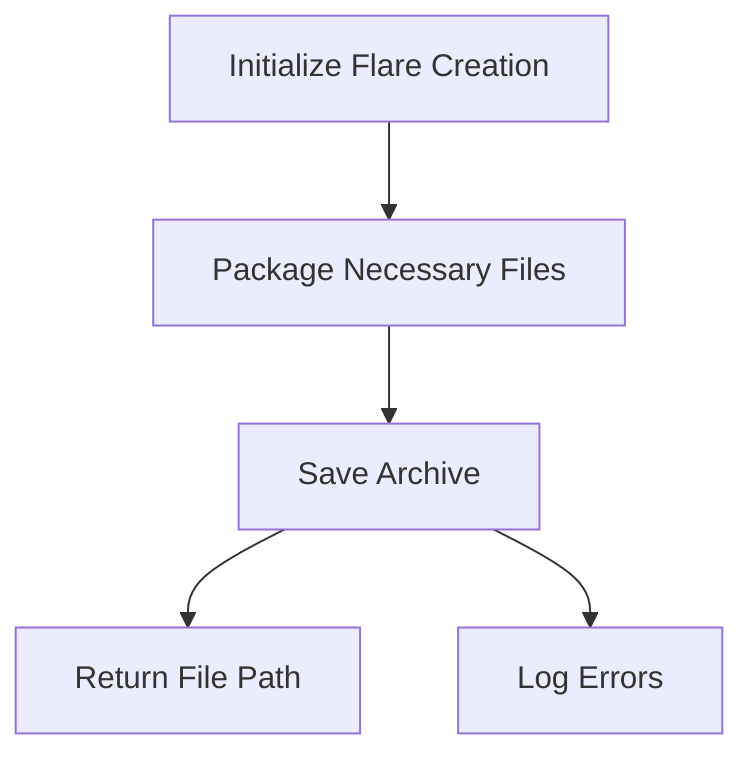

This document will cover the process of creating a flare, which includes:

1. Initializing the flare creation
2. Packaging necessary files
3. Saving the archive.

Technical document: <SwmLink doc-title="Creating a Flare">[Creating a Flare](/.swm/creating-a-flare.k94ab5cc.sw.md)</SwmLink>

# [Initializing the flare creation](https://app.swimm.io/repos/Z2l0aHViJTNBJTNBZGF0YWRvZy1hZ2VudCUzQSUzQVN3aW1tLURlbW8=/docs/k94ab5cc#makeflare)

The flare creation process begins with initializing the flare. This involves setting up the response header to indicate that the response will be in JSON format. Additionally, the process is logged for tracking purposes. If the initialization fails, an error is logged, and a 500 HTTP response is sent to indicate the failure.

# [Packaging necessary files](https://app.swimm.io/repos/Z2l0aHViJTNBJTNBZGF0YWRvZy1hZ2VudCUzQSUzQVN3aW1tLURlbW8=/docs/k94ab5cc#createsecurityagentarchive)

Once the flare creation is initialized, the next step is to package the necessary files. This involves creating a new flare builder and calling a function to gather all relevant files and logs related to the security agent. These files include log files, configuration files, compliance files, runtime files, and other relevant data. If the request is local, a placeholder file is added instead of the actual status log.

# [Saving the archive](https://app.swimm.io/repos/Z2l0aHViJTNBJTNBZGF0YWRvZy1hZ2VudCUzQSUzQVN3aW1tLURlbW8=/docs/k94ab5cc#save)

After packaging the necessary files, the archive is saved. This involves creating the archive in a temporary directory with restricted permissions to ensure security. The archive is then moved to the system's temporary directory. If any errors occur during this process, they are logged, and the appropriate error response is sent.

# [Returning the file path](https://app.swimm.io/repos/Z2l0aHViJTNBJTNBZGF0YWRvZy1hZ2VudCUzQSUzQVN3aW1tLURlbW8=/docs/k94ab5cc#makeflare)

Once the archive is successfully saved, the file path of the archive is returned. This allows the user to access the flare archive for further analysis or troubleshooting.

# [Logging errors](https://app.swimm.io/repos/Z2l0aHViJTNBJTNBZGF0YWRvZy1hZ2VudCUzQSUzQVN3aW1tLURlbW8=/docs/k94ab5cc#makeflare)

Throughout the flare creation process, any errors that occur are logged. This ensures that any issues can be tracked and addressed promptly. If an error occurs at any step, an appropriate error response is sent to the user.

&nbsp;

*This is an auto-generated document by Swimm AI 🌊 and has not yet been verified by a human*

<SwmMeta version="3.0.0" repo-id="Z2l0aHViJTNBJTNBZGF0YWRvZy1hZ2VudCUzQSUzQVN3aW1tLURlbW8=" repo-name="datadog-agent">Powered by [Swimm](/)</SwmMeta>
